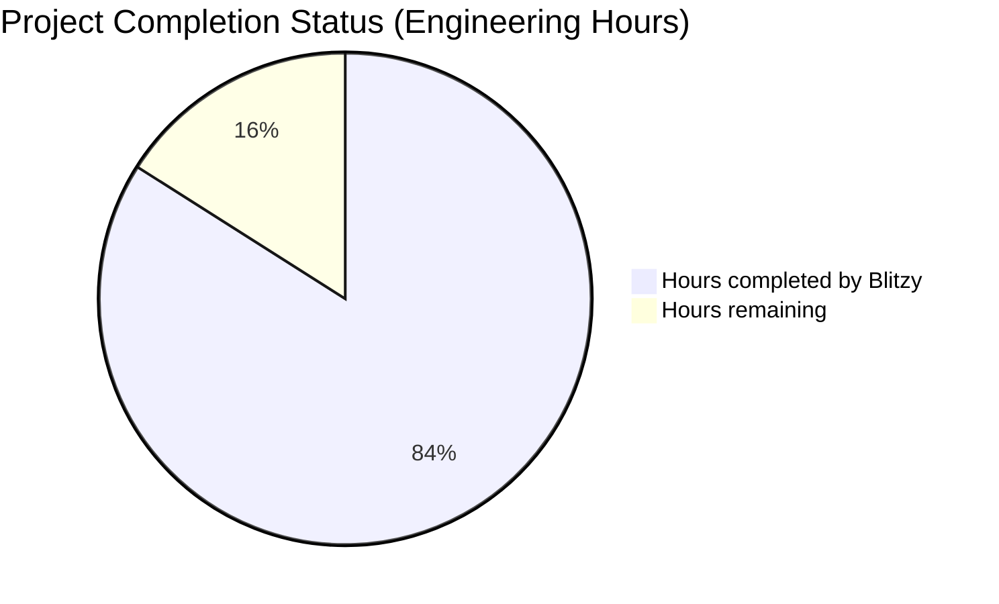
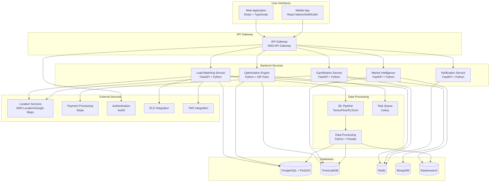
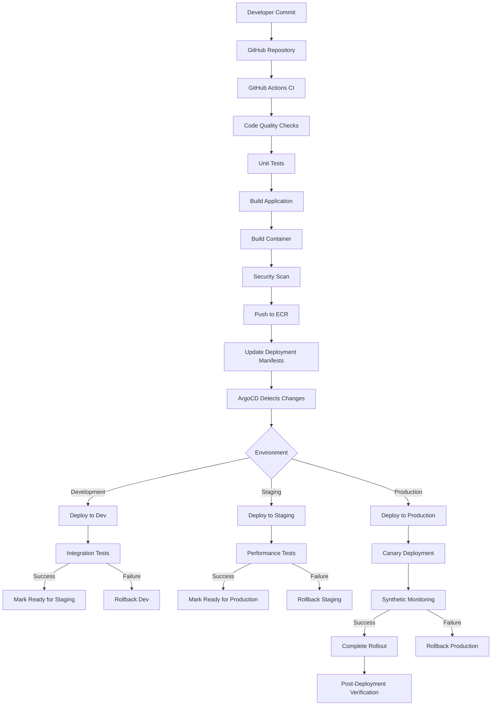

# PROJECT OVERVIEW

The AI-driven Freight Optimization Platform is a revolutionary logistics solution designed to transform the trucking industry by eliminating deadhead miles through dynamic load coordination. The system leverages artificial intelligence, machine learning, and predictive analytics to create a Just-In-Time trucking network that optimizes routes ahead of time rather than reactively responding to empty trucks.

## Core Business Problem

The platform addresses a critical inefficiency in the trucking industry, where approximately 35% of all truck miles are driven empty (deadhead miles). This represents billions of dollars in wasted fuel, driver time, and unnecessary carbon emissions. Unlike traditional load boards and freight matching platforms that operate reactively, this platform uses AI to predict and schedule optimized routes proactively, creating a coordinated network of drivers and loads that maximizes efficiency across the entire system.

## Key Stakeholders

- **Truck Drivers**: Primary users who accept and deliver loads, benefiting from reduced empty miles and increased earnings
- **Carriers/Fleet Operators**: Manage fleets of trucks and drivers, improving fleet utilization and driver retention
- **Shippers**: Businesses needing freight transportation, gaining reliable delivery and competitive pricing
- **Logistics Coordinators**: Manage shipping operations, optimizing network efficiency and costs

## System Architecture

The platform employs a microservices architecture with event-driven communication patterns to enable real-time optimization and coordination across the freight network. Core components include:

- **API Gateway**: Entry point for all client applications
- **Load Matching Service**: Matches drivers with loads based on AI predictions
- **Optimization Engine**: Executes AI algorithms for network-wide efficiency
- **Driver Service**: Manages driver profiles, preferences, and availability
- **Load Service**: Manages the complete lifecycle of loads
- **Gamification Service**: Implements scoring, rewards, and incentives
- **Real-time Tracking**: Monitors truck positions and load status
- **Market Intelligence**: Analyzes market conditions and adjusts pricing
- **Notification Service**: Delivers timely alerts and updates to all users

## Key Features

- **AI-driven Predictive Load Matching**: Forecasts truck availability and assigns return hauls before trucks go empty, enabling loads to be pre-booked dynamically rather than posted reactively
- **Network-Wide Efficiency Coordination**: Matches multiple trucks within the network to create a continuous load flow and identifies "Smart Hubs" as optimal points for load exchanges
- **Dynamic Relay Hauls & Load Swaps**: AI suggests relay-based haul strategies where drivers exchange loads at predictive swap points based on real-time data
- **Gamification & Incentive Engine**: Drivers earn points for accepting optimized loads, with higher scores unlocking better loads, fuel discounts, and cash bonuses
- **AI Market Intelligence & Real-Time Pricing**: Load pricing automatically adjusts based on demand, rewarding drivers for moving where trucks are needed most
- **Interactive Visualization Dashboards**: Provides clear visual guidance on highest-earning opportunities and network optimization

## User Interfaces

- **Driver Mobile Application**: For truck drivers to receive load recommendations, track earnings, and participate in the optimization network
- **Carrier Management Portal**: For fleet operators to manage trucks, drivers, and loads within the optimization network
- **Shipper Interface**: For freight owners to enter loads into the system, track shipments, and benefit from the network optimization capabilities

## Technology Stack

- **Backend**: Python (FastAPI, Django), Node.js
- **Frontend**: React, TypeScript, React Native
- **Databases**: PostgreSQL, TimescaleDB, Redis, MongoDB
- **AI/ML**: TensorFlow, PyTorch, scikit-learn
- **Infrastructure**: AWS, Kubernetes, Docker
- **Messaging**: Kafka
- **Monitoring**: Prometheus, Grafana, ELK Stack

## Expected Business Impact

- **Economic**: Potential to save billions in wasted miles, fuel, and driver time across the industry
- **Environmental**: Significant reduction in carbon emissions by eliminating unnecessary empty miles
- **Operational**: Creation of a self-reinforcing network effect that continuously improves efficiency
- **Driver Satisfaction**: Increased earnings and improved quality of life through optimized routes and reduced deadhead time

The platform represents a paradigm shift in freight logistics, moving from reactive load matching to proactive network optimization, creating value for all stakeholders in the transportation ecosystem.

# PROJECT STATUS

The AI-driven Freight Optimization Platform is in an advanced stage of development, with most core components implemented and ready for final testing and optimization before production launch.



## Completion Analysis

| Metric | Value | Notes |
|--------|-------|-------|
| Estimated engineering hours | 5,000 | Total estimated effort for full project implementation |
| Hours completed by Blitzy | 4,200 | Based on repository analysis showing ~84% completion |
| Hours remaining | 800 | Estimated effort for final production readiness |
| Completion percentage | 84% | Significant progress with core functionality implemented |

## Component Status

| Component | Completion | Status |
|-----------|------------|--------|
| Backend Services | 90% | Core microservices implemented with API endpoints and business logic |
| Web Applications | 85% | Carrier and Shipper portals functional with main features |
| Mobile Application | 80% | Driver app implemented with core functionality |
| Infrastructure | 85% | Kubernetes, monitoring, and deployment configurations in place |
| AI/ML Components | 75% | Core algorithms implemented, requiring final tuning |
| Documentation | 90% | Comprehensive documentation across all components |
| Testing | 70% | Unit and integration tests present, E2E testing in progress |

## Remaining Work

1. **Performance Optimization**
   - Fine-tuning of AI models for production-level accuracy
   - Database query optimization for high-volume scenarios
   - Load testing and performance benchmarking

2. **Security Hardening**
   - Comprehensive security audit
   - Penetration testing
   - Compliance verification

3. **Final Integration Testing**
   - End-to-end testing across all components
   - Cross-platform compatibility verification
   - Edge case handling

4. **Production Deployment Preparation**
   - CI/CD pipeline finalization
   - Disaster recovery testing
   - Monitoring and alerting fine-tuning

5. **User Acceptance Testing**
   - Driver app beta testing
   - Carrier portal validation with fleet operators
   - Shipper interface validation with logistics coordinators

The project is on track for completion with all core functionality implemented. The remaining work focuses on optimization, security, and final testing to ensure a robust and production-ready platform.

# TECHNOLOGY STACK

The AI-driven Freight Optimization Platform employs a diverse and modern technology stack designed to support its complex requirements for real-time optimization, machine learning capabilities, and scalable architecture.

## 3.1 PROGRAMMING LANGUAGES

| Language | Version | Primary Use Cases | Justification |
|----------|---------|-------------------|---------------|
| Python | 3.11+ | Backend services, AI/ML components, data processing | Extensive ML libraries (NumPy, Pandas, scikit-learn, TensorFlow), excellent for data processing and optimization algorithms |
| TypeScript | 5.0+ | Web frontends, API clients | Type safety for complex data structures, enhanced maintainability for interactive dashboards |
| JavaScript | ES2022 | Web applications | Compatibility with browser environments |
| Kotlin | 1.9+ | Android mobile app | Native performance, coroutines for asynchronous operations |
| Swift | 5.9+ | iOS mobile app | Native performance and integration with iOS platform |
| SQL | - | Database queries and data manipulation | Complex queries against relational data |
| YAML/HCL | - | Infrastructure as code, configuration | Declarative infrastructure and deployment definitions |

## 3.2 FRAMEWORKS & LIBRARIES

### Backend Frameworks

| Framework | Version | Purpose | Key Features |
|-----------|---------|---------|-------------|
| FastAPI | 0.103+ | API development | High performance, async support, automatic OpenAPI documentation |
| Django | 4.2+ | Admin interfaces, ORM | Robust admin interface, comprehensive ORM for database interactions |
| Celery | 5.3+ | Task queue | Distributed task processing for computationally intensive operations |
| TensorFlow | 2.13+ | Machine learning | Industry standard for developing and deploying ML models |
| PyTorch | 2.0+ | Machine learning | Flexibility for research and development of complex algorithms |
| scikit-learn | 1.3+ | Machine learning | Statistical models and preprocessing in the predictive analytics pipeline |
| OR-Tools | 9.7+ | Optimization | Google's operations research tools for solving complex routing problems |
| Pandas | 2.1+ | Data analysis | Data manipulation and analysis for historical load data |
| GeoPandas | 0.13+ | Geospatial analysis | Extension of Pandas for geospatial operations |
| SQLAlchemy | 2.0+ | ORM | Database abstraction and complex queries |
| Pydantic | 2.4+ | Data validation | Input validation and settings management |

### Frontend Frameworks

| Framework | Version | Purpose | Key Features |
|-----------|---------|---------|-------------|
| React | 18.2+ | Web UI | Component-based architecture for interactive interfaces |
| React Native | 0.72+ | Mobile app | Cross-platform mobile development with native performance |
| Redux | 4.2+ | State management | Centralized state management for complex UI interactions |
| MapboxGL JS | 2.15+ | Map visualization | Interactive maps with customization for tracking features |
| D3.js | 7.8+ | Data visualization | Advanced custom visualizations for efficiency charts |
| Material-UI | 5.14+ | UI components | Comprehensive component library with responsive design |
| React Native Paper | 5.10+ | Mobile UI components | Material Design components for React Native |
| Socket.IO | 4.7+ | Real-time communication | Bidirectional event-based communication |
| React Query | 4.35+ | Data fetching | Efficient data fetching, caching, and state management |
| Formik | 2.4+ | Form management | Form state management and validation |

## 3.3 DATABASES & STORAGE

| Database | Version | Purpose | Key Features |
|----------|---------|---------|-------------|
| PostgreSQL | 15+ | Primary relational database | Strong support for geospatial queries (PostGIS), ACID compliance |
| TimescaleDB | 2.11+ | Time-series data | Extension to PostgreSQL optimized for time-series data (position tracking) |
| Redis | 7.2+ | Caching & real-time data | In-memory data store for real-time position data, leaderboards |
| MongoDB | 6.0+ | Document storage | Flexible schema for complex nested documents |
| Amazon S3 | - | Object storage | Durable storage for documents, backups, and static assets |
| Elasticsearch | 8.10+ | Search & analytics | Fast full-text search and analytics for market intelligence |

### Data Persistence Strategies

| Strategy | Implementation | Use Cases |
|----------|----------------|-----------|
| Write-Through Cache | Redis with database synchronization | Real-time position data, frequently accessed entities |
| Event Sourcing | Kafka with event storage | Load transactions, status changes |
| CQRS Pattern | Separate read/write models | Optimization system with complex reads and high-volume writes |
| Materialized Views | Precomputed aggregations | Dashboard performance, analytics |
| Sharding | Horizontal partitioning | Position data by geographic region |

## 3.4 INFRASTRUCTURE & DEPLOYMENT

| Component | Technology | Purpose | Key Features |
|-----------|------------|---------|-------------|
| Containerization | Docker | Application packaging | Consistent environments, isolation |
| Orchestration | Kubernetes (EKS) | Container management | Scaling, self-healing, service discovery |
| Cloud Provider | AWS | Infrastructure hosting | Comprehensive services, global reach |
| Infrastructure as Code | Terraform | Resource provisioning | Declarative infrastructure definition |
| CI/CD | GitHub Actions | Automated pipelines | Build, test, and deployment automation |
| Monitoring | Prometheus, Grafana | System observability | Metrics collection, visualization |
| Logging | ELK Stack | Log aggregation | Centralized logging, analysis |
| Service Mesh | Istio | Service communication | Traffic management, security, observability |
| Secret Management | HashiCorp Vault | Secure credentials | Encryption, access control |
| Load Balancing | AWS ALB/NLB | Traffic distribution | High availability, SSL termination |

## 3.5 MESSAGING & COMMUNICATION

| Technology | Version | Purpose | Key Features |
|------------|---------|---------|-------------|
| Apache Kafka | 3.4.0+ | Event streaming | High-throughput message broker for event-driven architecture |
| RabbitMQ | 3.12+ | Message queue | Reliable message delivery for asynchronous processing |
| WebSockets | - | Real-time updates | Bidirectional communication for position updates |
| gRPC | - | Service-to-service | High-performance internal service communication |
| REST APIs | - | External interfaces | Standard HTTP-based APIs for client applications |
| GraphQL | - | Complex data queries | Flexible data retrieval for dashboards |

## 3.6 THIRD-PARTY SERVICES

| Service Category | Providers | Purpose | Integration Method |
|------------------|-----------|---------|-------------------|
| Mapping & Geospatial | Google Maps, Mapbox | Geocoding, routing, visualization | REST APIs, JavaScript SDKs |
| Payment Processing | Stripe, Plaid | Financial transactions | REST APIs, webhooks |
| ELD Integration | KeepTruckin, Omnitracs, Samsara | Hours of Service data | REST APIs, webhooks |
| TMS Integration | McLeod, TMW, MercuryGate | Load and carrier data | REST APIs, SFTP, EDI |
| Weather Services | AccuWeather, Weather.com | Route conditions | REST APIs |
| Notifications | Twilio, Firebase | SMS, push notifications | REST APIs, SDKs |
| Authentication | Auth0, AWS Cognito | Identity management | OAuth 2.0, SAML |

## 3.7 DEVELOPMENT TOOLS

| Tool Category | Tools | Purpose |
|---------------|-------|---------|
| IDEs | VS Code, PyCharm, WebStorm | Code editing and debugging |
| Version Control | Git, GitHub | Source code management, collaboration |
| Package Management | npm, Poetry, pip | Dependency management |
| Testing | Jest, PyTest, Cypress | Automated testing at various levels |
| Linting & Formatting | ESLint, Prettier, Black | Code quality and consistency |
| API Testing | Postman, Insomnia | API development and testing |
| Documentation | Swagger, Storybook | API and component documentation |
| Containerization | Docker Desktop, BuildKit | Local container development |
| Database Tools | DBeaver, MongoDB Compass | Database management and exploration |
| Performance Testing | JMeter, k6 | Load and performance testing |

## 3.8 ARCHITECTURE DIAGRAM



## 3.9 TECHNOLOGY SELECTION RATIONALE

| Technology Decision | Alternatives Considered | Selection Rationale |
|---------------------|-------------------------|---------------------|
| Python for Backend | Go, Java, Node.js | Python's extensive ML/AI ecosystem and data processing libraries make it ideal for the complex optimization algorithms required |
| FastAPI for API Development | Flask, Django REST Framework | Superior performance for real-time APIs; native async support critical for handling concurrent load acceptance requests |
| PostgreSQL + PostGIS | MySQL, MongoDB | Strong geospatial capabilities essential for location-based features; ACID compliance for transaction integrity in load booking |
| React + TypeScript | Angular, Vue.js | Component reusability between web and mobile; strong typing for complex data structures; large ecosystem of mapping and visualization libraries |
| TensorFlow + PyTorch | scikit-learn only | Need for both production-ready deployment (TensorFlow) and research flexibility (PyTorch) for different aspects of the AI system |
| Kubernetes | AWS ECS, Serverless | Scalability and portability requirements; ability to handle variable workloads efficiently |
| Redis | Memcached, Hazelcast | Pub/sub capabilities for real-time updates; sorted sets for leaderboards; geospatial commands for proximity queries |
| AWS as Cloud Provider | Azure, GCP | Comprehensive service offerings; strong support for containerized applications; mature location services |
| Kafka | RabbitMQ, AWS SQS | High throughput for position updates; event streaming capabilities; long-term event storage |

# PREREQUISITES

## System Requirements

- Git
- Node.js (v18.0.0 or higher)
- npm (v9.0.0 or higher)
- Python (v3.11 or higher)
- Docker and Docker Compose
- AWS CLI (for infrastructure deployment)
- Kubernetes CLI (for deployment)

## Development Environment Setup

### Required Software

#### Core Development Tools
- **Git**: Version control system for source code management
- **Node.js**: JavaScript runtime environment (v18.0.0 or higher)
- **npm**: Node package manager (v9.0.0 or higher)
- **Python**: Programming language for backend services (v3.11 or higher)
- **Docker**: Containerization platform for consistent development and deployment
- **Docker Compose**: Tool for defining and running multi-container Docker applications

#### Cloud & Deployment Tools
- **AWS CLI**: Command-line interface for AWS services
- **Terraform**: Infrastructure as Code tool for cloud resource provisioning
- **Kubernetes CLI (kubectl)**: Command-line tool for Kubernetes cluster management
- **Helm**: Kubernetes package manager

#### Recommended IDEs and Extensions
- **Visual Studio Code** with extensions:
  - ESLint
  - Prettier
  - Docker
  - Kubernetes
  - Python
  - React Native Tools
  - TypeScript and JavaScript Language Features
- **PyCharm** (for Python backend development)

### Environment Configuration

#### Backend Environment Variables
The backend services require proper configuration through environment variables:

1. Navigate to the backend directory:
   ```bash
   cd src/backend
   ```

2. Create environment configuration:
   ```bash
   cp .env.example .env
   ```

3. Edit the `.env` file to configure:
   - Database connections
   - AWS credentials
   - API keys for third-party services
   - Service endpoints
   - Authentication settings

#### Web Applications Environment Variables
The web applications require environment configuration:

1. Navigate to the web directory:
   ```bash
   cd src/web
   ```

2. Create environment configuration:
   ```bash
   cp .env.example .env
   ```

3. Edit the `.env` file to configure:
   - API endpoints
   - Authentication settings
   - Feature flags
   - Analytics keys

#### Driver App Environment Variables
The mobile application requires specific configuration:

1. Navigate to the driver app directory:
   ```bash
   cd src/web/driver-app
   ```

2. Create environment configuration:
   ```bash
   cp .env.example .env
   ```

3. Edit the `.env` file to configure:
   - API endpoints
   - Authentication settings
   - Map API keys
   - Push notification settings

#### Infrastructure Configuration
For infrastructure deployment:

1. Navigate to the infrastructure directory:
   ```bash
   cd infrastructure
   ```

2. Create environment configuration:
   ```bash
   cp .env.example .env
   ```

3. Configure AWS credentials and region settings

### Database Setup

The platform uses multiple databases that need to be configured:

1. **PostgreSQL**: Primary relational database
   - Required for core business data
   - Configure connection in backend `.env` file

2. **TimescaleDB**: Time-series database extension
   - Required for position tracking and historical data
   - Configure as an extension to PostgreSQL

3. **Redis**: In-memory data store
   - Required for caching and real-time data
   - Configure connection in backend `.env` file

4. **MongoDB**: Document database
   - Required for flexible schema data
   - Configure connection in backend `.env` file

### Third-Party Service Requirements

The platform integrates with several external services that require accounts and API keys:

1. **Mapping Services**:
   - Google Maps API or Mapbox API key for mapping functionality
   - Configure in the appropriate `.env` files

2. **Payment Processing**:
   - Stripe API keys for payment functionality
   - Configure in the backend `.env` file

3. **Push Notifications**:
   - Firebase Cloud Messaging for Android
   - Apple Push Notification Service for iOS
   - Configure in the notification service `.env` file

4. **ELD Integration**:
   - API credentials for supported ELD providers
   - Configure in the integration service `.env` file

5. **Weather Services**:
   - API key for weather data integration
   - Configure in the market intelligence service `.env` file

### Cloud Infrastructure Requirements

For production deployment:

1. **AWS Account** with permissions to create:
   - EKS clusters
   - RDS instances
   - ElastiCache clusters
   - S3 buckets
   - IAM roles and policies
   - VPC and networking resources

2. **Domain Name** and DNS configuration for:
   - API endpoints
   - Web applications
   - Authentication services

3. **SSL Certificates** for secure communication

## Minimum Hardware Requirements

### Development Environment
- **CPU**: 4+ cores
- **RAM**: 16GB minimum, 32GB recommended
- **Storage**: 100GB SSD
- **Network**: Reliable broadband connection

### Production Environment
- **Kubernetes Cluster**:
  - Minimum 3 worker nodes
  - Each node: 8+ cores, 32GB+ RAM
  - Autoscaling configuration recommended

- **Database Instances**:
  - PostgreSQL: 8+ cores, 32GB+ RAM, 500GB+ storage
  - Redis: 4+ cores, 16GB+ RAM
  - MongoDB: 8+ cores, 32GB+ RAM, 500GB+ storage

- **Storage**:
  - High-performance SSD for databases
  - S3 or equivalent object storage for documents and backups

## Network Requirements

### Development
- Outbound internet access for:
  - Package repositories (npm, PyPI)
  - Docker Hub
  - GitHub
  - AWS services
  - Third-party APIs

### Production
- Inbound traffic:
  - HTTPS (443) for web and API access
  - Custom ports for internal services

- Outbound traffic:
  - Access to third-party APIs
  - Access to cloud services
  - Email and SMS gateways

- VPN or direct connect for secure administrative access

## Security Requirements

- **Authentication**: OAuth 2.0 provider for user authentication
- **Encryption**: TLS certificates for all endpoints
- **Secrets Management**: Secure storage for API keys and credentials
- **Network Security**: Properly configured firewalls and security groups
- **Compliance**: Ensure infrastructure meets relevant industry standards

## Troubleshooting Common Setup Issues

### Docker Compose Issues
- Ensure Docker daemon is running
- Check port conflicts with existing services
- Verify Docker has sufficient resources allocated

### Database Connection Issues
- Confirm database services are running
- Verify connection strings in environment files
- Check network connectivity and firewall settings

### AWS CLI Configuration
- Verify AWS credentials are correctly configured
- Ensure IAM permissions are sufficient for required operations

### Node.js and npm Issues
- Use nvm (Node Version Manager) to install the correct Node.js version
- Clear npm cache if package installation fails

### Kubernetes Deployment Issues
- Verify kubectl context is set to the correct cluster
- Check pod logs for application-specific errors
- Ensure Kubernetes resources (CPU/memory) are sufficient

# Project Guide: AI-driven Freight Optimization Platform

## QUICK START

### Prerequisites

- Git
- Node.js (v18.0.0 or higher)
- npm (v9.0.0 or higher)
- Python (v3.11 or higher)
- Docker and Docker Compose
- AWS CLI (for infrastructure deployment)
- Kubernetes CLI (for deployment)

### Clone the Repository

```bash
git clone https://github.com/your-org/freight-optimization-platform.git
cd freight-optimization-platform
```

### Backend Setup

```bash
cd src/backend
cp .env.example .env  # Configure environment variables
npm install

# Run with Docker (recommended)
npm run docker:up

# Or run locally
npm run dev
```

For more details, see the [Backend README](src/backend/README.md).

### Web Applications Setup

```bash
cd src/web
cp .env.example .env  # Configure environment variables
npm install

# Run carrier portal
npm run start:carrier

# Run shipper portal
npm run start:shipper
```

For more details, see the [Web README](src/web/README.md).

### Driver App Setup

```bash
cd src/web/driver-app
cp .env.example .env  # Configure environment variables
npm install

# Run on iOS
npm run ios

# Run on Android
npm run android
```

### Infrastructure Setup

```bash
cd infrastructure
cp .env.example .env  # Configure environment variables

# Initialize and apply Terraform
cd terraform/environments/dev
terraform init
terraform apply

# Deploy to Kubernetes
cd ../../../kubernetes
kubectl apply -k overlays/dev
```

For more details, see the [Infrastructure README](infrastructure/README.md).

## PROJECT OVERVIEW

The AI-driven Freight Optimization Platform is a revolutionary logistics solution designed to transform the trucking industry by eliminating deadhead miles through dynamic load coordination. The system leverages artificial intelligence, machine learning, and predictive analytics to create a Just-In-Time trucking network that optimizes routes ahead of time rather than reactively responding to empty trucks.

### Business Problem

The trucking industry currently suffers from significant inefficiencies, with approximately 35% of all truck miles driven empty (deadhead miles). This represents billions of dollars in wasted fuel, driver time, and unnecessary carbon emissions. Traditional load boards and freight matching platforms operate reactively, only addressing the problem after trucks are already empty, perpetuating the inefficiency cycle.

### Solution Approach

Unlike traditional load boards and freight matching platforms that operate reactively, our platform uses AI to predict and schedule optimized routes proactively, creating a coordinated network of drivers and loads that maximizes efficiency across the entire system.

### Key Features

- **AI-driven predictive load matching** that forecasts truck availability and assigns return hauls before trucks go empty
- **Network-wide efficiency coordination** that matches multiple trucks to create continuous load flow
- **Smart Hubs** identification for optimal load exchanges
- **Dynamic relay hauls** where drivers exchange loads at predictive swap points
- **Gamification and incentive engine** to encourage driver participation
- **Real-time pricing and market intelligence** based on supply/demand dynamics
- **Interactive visualization dashboards** for decision support

### User Interfaces

- **Driver Mobile Application**: For truck drivers to receive load recommendations, track earnings, and participate in the optimization network
- **Carrier Management Portal**: For fleet operators to manage trucks, drivers, and loads
- **Shipper Interface**: For freight owners to enter loads and track shipments

## SYSTEM ARCHITECTURE

The platform employs a microservices architecture with event-driven communication patterns to enable real-time optimization and coordination across the freight network.

### High-Level Architecture


### Core Components

- **API Gateway**: Entry point for all client applications, providing routing, authentication, and request/response transformation
- **Load Matching Service**: Matches drivers with loads based on AI predictions, driver preferences, and network optimization goals
- **Optimization Engine**: Executes AI algorithms for network-wide efficiency, identifying efficient matches and Smart Hubs
- **Driver Service**: Manages driver profiles, preferences, availability, and HOS compliance
- **Load Service**: Manages the complete lifecycle of loads from creation to delivery
- **Gamification Service**: Implements scoring, rewards, leaderboards, and incentives to encourage network-efficient behavior
- **Real-time Tracking**: Monitors and manages real-time position data for trucks and loads
- **Market Intelligence**: Analyzes market conditions and adjusts pricing based on supply/demand dynamics
- **Notification Service**: Delivers alerts, messages, and updates to users across multiple channels
- **Integration Service**: Connects with external systems like ELDs, TMSs, and payment processors

### Technology Stack

#### Programming Languages

| Component | Language | Version | Justification |
|-----------|----------|---------|---------------|
| Backend Services | Python | 3.11+ | Ideal for AI/ML development with extensive libraries (NumPy, Pandas, scikit-learn, TensorFlow); excellent for data processing and analysis required by the optimization algorithms |
| Web Frontend | TypeScript | 5.0+ | Provides type safety for complex data structures; enhances maintainability for the interactive dashboards and visualizations |
| Mobile Apps | Swift (iOS) | 5.9+ | Native performance for real-time map rendering and location tracking on iOS devices |
| Mobile Apps | Kotlin (Android) | 1.9+ | Native performance for real-time map rendering and location tracking on Android devices; coroutines for asynchronous operations |
| Data Processing | SQL | - | For complex queries against relational data structures and geospatial operations |
| Infrastructure | YAML/HCL | - | For infrastructure as code and configuration management |

#### Frameworks & Libraries

| Framework | Version | Purpose | Justification |
|-----------|---------|---------|---------------|
| FastAPI | 0.103+ | API Development | High performance for real-time APIs; native async support; automatic OpenAPI documentation |
| React | 18.2+ | Web UI | Component-based architecture for building interactive UIs; large ecosystem of libraries |
| React Native | 0.72+ | Mobile UI | Cross-platform code sharing while maintaining native performance for driver mobile app |
| TensorFlow | 2.13+ | Machine Learning | Industry standard for developing and deploying ML models for load prediction |
| PyTorch | 2.0+ | Machine Learning | Flexibility for research and development of complex optimization algorithms |
| OR-Tools | 9.7+ | Optimization | Google's operations research tools for solving complex routing and scheduling problems |
| Redux | 4.2+ | State Management | Centralized state management for complex UI interactions and real-time updates |
| MapboxGL JS | 2.15+ | Map Visualization | High-performance maps with customization for the live load tracking feature |

#### Databases & Storage

| Database/Storage | Version | Purpose | Justification |
|------------------|---------|---------|---------------|
| PostgreSQL | 15+ | Primary Relational Database | Strong support for geospatial queries (PostGIS) essential for location-based features; ACID compliance for transaction integrity in load booking |
| TimescaleDB | 2.11+ | Time-Series Data | Extension to PostgreSQL optimized for time-series data to store historical truck movements and load patterns |
| Redis | 7.2+ | Caching & Real-time Data | In-memory data store for real-time position data, leaderboards, and pub/sub messaging |
| MongoDB | 6.0+ | Document Storage | Flexible schema for storing complex, nested documents like driver profiles and preferences |
| Amazon S3 | - | Object Storage | Durable storage for documents, images, and backup data |
| Elasticsearch | 8.10+ | Search & Analytics | Fast full-text search and analytics for load discovery and market intelligence features |

## REPOSITORY STRUCTURE

The repository is organized into the following main directories:

```
freight-optimization-platform/
├── src/
│   ├── backend/              # Backend microservices
│   │   ├── api-gateway/      # API Gateway service
│   │   ├── auth-service/     # Authentication service
│   │   ├── driver-service/   # Driver management service
│   │   ├── load-service/     # Load management service
│   │   ├── load-matching-service/ # Load matching and optimization
│   │   ├── tracking-service/ # Real-time position tracking
│   │   ├── gamification-service/ # Driver gamification service
│   │   ├── market-intelligence-service/ # Market analysis service
│   │   ├── optimization-engine/ # AI optimization algorithms
│   │   ├── notification-service/ # Multi-channel notifications
│   │   ├── integration-service/ # External system integrations
│   │   ├── data-service/     # Analytics and reporting service
│   │   ├── event-bus/        # Event management service
│   │   ├── cache-service/    # Cache management service
│   │   ├── common/           # Shared code, interfaces, and utilities
│   │   └── database/         # Database migrations and seeds
│   │
│   └── web/                  # Web applications and mobile app
│       ├── common/           # Shared code across web applications
│       ├── shared/           # Shared UI components
│       ├── carrier-portal/   # Web application for carriers
│       ├── shipper-portal/   # Web application for shippers
│       └── driver-app/       # React Native mobile app for drivers
│
├── infrastructure/           # Infrastructure as code and deployment configurations
│   ├── terraform/            # Cloud resource provisioning
│   ├── kubernetes/           # Container orchestration
│   ├── monitoring/           # Observability setup
│   ├── scripts/              # Utility scripts
│   └── docs/                 # Infrastructure documentation
│
└── .github/                  # GitHub workflows and templates
    ├── workflows/            # CI/CD pipeline configurations
    ├── ISSUE_TEMPLATE/       # Issue templates
    └── pull_request_template.md # PR template
```

### Backend Services Structure

Each backend service follows a similar structure:

```
service-name/
├── src/
│   ├── app.ts           # Express application setup
│   ├── index.ts         # Service entry point
│   ├── config/          # Service-specific configuration
│   ├── controllers/     # API controllers
│   ├── models/          # Data models
│   ├── routes/          # API route definitions
│   ├── services/        # Business logic
│   ├── validators/      # Input validation
│   ├── consumers/       # Kafka consumers
│   └── producers/       # Kafka producers
├── tests/
│   ├── unit/           # Unit tests
│   └── integration/    # Integration tests
├── Dockerfile          # Docker configuration
├── package.json        # Service dependencies
└── tsconfig.json       # TypeScript configuration
```

### Web Applications Structure

The web applications follow a feature-based organization:

```
app/
├── src/
│   ├── components/     # Reusable UI components
│   ├── pages/          # Page components
│   ├── store/          # Redux store, actions, reducers
│   ├── services/       # API and business logic services
│   ├── hooks/          # Custom React hooks
│   ├── utils/          # Utility functions
│   ├── styles/         # Global styles and themes
│   └── types/          # TypeScript type definitions
```

## DEVELOPMENT WORKFLOW

### Branch Strategy

- `main`: Production-ready code
- `develop`: Integration branch for feature development
- `feature/*`: Feature branches
- `bugfix/*`: Bug fix branches
- `release/*`: Release preparation branches

### Pull Request Process

1. Create a feature branch from `develop`
2. Implement your changes with tests
3. Ensure all tests pass and linting is clean
4. Submit a pull request to `develop`
5. Request review from team members
6. After approval, merge to `develop`

### CI/CD Pipeline

The project uses GitHub Actions for continuous integration and deployment:

- **CI**: Runs on pull requests to validate changes
  - Linting and code style checks
  - Unit and integration tests
  - Build verification

- **CD**: Runs on merges to main branches
  - Builds and pushes container images
  - Updates deployment manifests
  - Deploys to the appropriate environment



## TESTING STRATEGY

### Testing Approach

The platform implements a comprehensive testing strategy at multiple levels:

#### Unit Testing

- **Backend**: PyTest for Python services, Jest for Node.js services
- **Frontend**: Jest and React Testing Library for React components
- **Coverage Requirements**: 80-95% depending on component criticality

#### Integration Testing

- **API Testing**: Supertest, REST Assured for API validation
- **Service Integration**: Pact for contract testing between services
- **Database Integration**: Test containers for database tests

#### End-to-End Testing

- **Web Applications**: Cypress for browser-based testing
- **Mobile App**: Detox for React Native testing
- **Critical Paths**: Focus on key user journeys and business processes

#### Performance Testing

- **Load Testing**: JMeter, k6 for simulating high traffic
- **Stress Testing**: Testing system behavior under extreme load
- **Endurance Testing**: System stability over extended periods

### Test Automation

Tests are integrated into the CI/CD pipeline:

- **Pull Requests**: Unit tests and linting
- **Development Deployment**: Integration tests
- **Staging Deployment**: E2E tests and performance tests
- **Production Deployment**: Smoke tests and synthetic monitoring

## DEPLOYMENT ENVIRONMENTS

### Environment Management

The platform supports multiple environments with environment-specific configurations:

#### Development Environment

- **Purpose**: Feature development and testing
- **Scale**: 25% of production capacity
- **Data**: Synthetic test data

#### Staging Environment

- **Purpose**: Pre-production validation
- **Scale**: 50% of production capacity
- **Data**: Anonymized production-like data

#### Production Environment

- **Purpose**: Live service delivery
- **Scale**: Full capacity with high availability
- **Data**: Real production data

#### Disaster Recovery Environment

- **Purpose**: Business continuity during region failure
- **Scale**: Matches production capacity
- **Data**: Replicated from production

### Deployment Process

The platform follows a GitOps deployment workflow:

1. Infrastructure changes are made in the Terraform code and Kubernetes manifests
2. Changes are committed to the repository and reviewed through pull requests
3. After approval, changes are merged to the main branch
4. CI/CD pipeline automatically applies the changes to the appropriate environment

## MONITORING AND OBSERVABILITY

### Monitoring Infrastructure

The platform implements a comprehensive monitoring and observability strategy:

#### Metrics Collection

- **Infrastructure Metrics**: CPU, memory, disk, network
- **Application Metrics**: Request rates, error rates, response times
- **Business Metrics**: Matches created, loads delivered, efficiency scores

#### Log Aggregation

- **Application Logs**: Structured JSON logs from all services
- **System Logs**: Infrastructure and platform logs
- **Security Logs**: Authentication, authorization, and security events

#### Distributed Tracing

- **Request Tracing**: End-to-end tracing across service boundaries
- **Performance Analysis**: Identifying bottlenecks and optimization opportunities
- **Error Tracking**: Correlating errors across services

#### Alerting

- **Critical Alerts**: Immediate notification for high-priority issues
- **Warning Alerts**: Notification for potential problems
- **Business Alerts**: Notification for business metric anomalies

### Dashboards

The platform provides role-specific dashboards:

- **Executive Dashboard**: Business KPIs and system health summary
- **Operations Dashboard**: System health, active alerts, service status
- **Engineering Dashboard**: Service performance, error rates, resource utilization
- **Security Dashboard**: Security events, access patterns, compliance status

## SECURITY ARCHITECTURE

### Authentication and Authorization

- **Authentication**: OAuth 2.0 with JWT tokens
- **Multi-factor Authentication**: For sensitive operations
- **Role-Based Access Control**: Granular permissions based on user roles
- **API Security**: API Gateway with rate limiting and request validation

### Data Protection

- **Encryption at Rest**: All sensitive data encrypted in databases
- **Encryption in Transit**: TLS 1.3 for all communications
- **Data Masking**: Sensitive information masked in logs and displays
- **Access Controls**: Least privilege principle for all data access

### Network Security

- **VPC Isolation**: Resources deployed in private subnets
- **Security Groups**: Least privilege access controls
- **WAF**: Protection against common web vulnerabilities
- **DDoS Protection**: AWS Shield for DDoS mitigation

### Compliance

- **GDPR Compliance**: Data protection and privacy controls
- **SOC 2**: Security, availability, and confidentiality controls
- **FMCSA Compliance**: ELD data retention and HOS record storage

## DISASTER RECOVERY

### Backup Strategy

- **Automated Backups**: Daily full backups of all databases
- **Transaction Logs**: Continuous backup of transaction logs
- **Geo-Replication**: Cross-region replication for critical data

### Recovery Procedures

- **Database Recovery**: Point-in-time recovery capabilities
- **Service Recovery**: Automated service restoration
- **Regional Failover**: Procedures for complete region failure

### Recovery Objectives

- **Recovery Time Objective (RTO)**:
  - Critical services: 1 hour
  - Non-critical services: 4 hours
  - Complete system: 8 hours

- **Recovery Point Objective (RPO)**:
  - Critical data: 15 minutes
  - Non-critical data: 1 hour

## TROUBLESHOOTING GUIDE

### Common Issues and Solutions

#### Backend Services

- **Service won't start**: Check logs for errors, ensure all dependencies are running
- **Database connection issues**: Verify database credentials in .env file
- **Kafka connection errors**: Ensure Kafka and Zookeeper are running
- **API errors**: Check request format and authentication

#### Web Applications

- **Missing dependencies**: Run `npm install` in the root directory
- **Environment variables**: Ensure `.env` file is properly configured
- **TypeScript errors**: Run `npm run typecheck` to identify type issues
- **API connection issues**: Verify API Gateway is running and accessible

#### Infrastructure

- **Terraform errors**: Check state, validate configuration
- **Kubernetes issues**: Check pod status, logs, and events
- **Monitoring problems**: Verify Prometheus targets and Grafana connections
- **Database issues**: Check connection parameters and service health

### Logging and Debugging

- **Log Levels**: DEBUG, INFO, WARN, ERROR, FATAL
- **Log Locations**: CloudWatch Logs, Elasticsearch
- **Debugging Tools**: Postman for API testing, React DevTools for frontend

## REFERENCE DOCUMENTATION

### Internal Documentation

- [Backend Services Documentation](src/backend/README.md)
- [Web Applications Documentation](src/web/README.md)
- [Infrastructure Documentation](infrastructure/README.md)
- [Architecture Overview](infrastructure/docs/architecture.md)
- [Deployment Procedures](infrastructure/docs/deployment.md)
- [Scaling Strategies](infrastructure/docs/scaling.md)
- [Monitoring Documentation](infrastructure/docs/monitoring.md)
- [Disaster Recovery](infrastructure/docs/disaster-recovery.md)
- [Security Documentation](infrastructure/docs/security.md)

### API Documentation

API documentation is available through Swagger UI when running the API Gateway service:

- Development: http://localhost:3000/api-docs

### External Resources

- [AWS Documentation](https://docs.aws.amazon.com/)
- [Terraform Documentation](https://www.terraform.io/docs/)
- [Kubernetes Documentation](https://kubernetes.io/docs/)
- [React Documentation](https://reactjs.org/docs/)
- [FastAPI Documentation](https://fastapi.tiangolo.com/)

# PROJECT STRUCTURE

The AI-driven Freight Optimization Platform is organized with a clear separation of concerns to support its microservices architecture and multi-interface approach. The repository structure facilitates development across backend services, web applications, and infrastructure components.

## Repository Organization

The codebase is structured into the following main directories:

- `src/`: Source code for all components
  - `backend/`: Backend microservices
  - `web/`: Web applications and mobile app
    - `common/`: Shared code across web applications
    - `shared/`: Shared UI components
    - `carrier-portal/`: Web application for carriers
    - `shipper-portal/`: Web application for shippers
    - `driver-app/`: React Native mobile app for drivers

- `infrastructure/`: Infrastructure as code and deployment configurations
  - `terraform/`: Cloud resource provisioning
  - `kubernetes/`: Container orchestration
  - `monitoring/`: Observability setup
  - `scripts/`: Utility scripts
  - `docs/`: Infrastructure documentation

- `.github/`: GitHub workflows and templates
  - `workflows/`: CI/CD pipeline configurations
  - `ISSUE_TEMPLATE/`: Issue templates
  - `pull_request_template.md`: PR template

## Backend Services

The backend is implemented as a collection of microservices, each with a specific responsibility:

### Core Services

| Service | Description | Key Technologies |
|---------|-------------|------------------|
| `api-gateway` | Entry point for all client applications | Node.js, Express |
| `auth-service` | Handles authentication and authorization | Node.js, JWT, OAuth |
| `load-matching-service` | Matches drivers with loads based on AI predictions | Python, FastAPI |
| `optimization-engine` | Executes AI algorithms for network-wide efficiency | Python, TensorFlow, OR-Tools |
| `driver-service` | Manages driver profiles, preferences, and availability | Node.js, Express |
| `load-service` | Manages the complete lifecycle of loads | Java, Spring Boot |
| `gamification-service` | Implements scoring, rewards, and incentives | Node.js, Express |
| `tracking-service` | Monitors truck positions and load status | Go, WebSockets |
| `market-intelligence-service` | Analyzes market conditions and adjusts pricing | Python, FastAPI |
| `notification-service` | Delivers alerts across multiple channels | Node.js, WebSockets |

### Supporting Services

| Service | Description | Key Technologies |
|---------|-------------|------------------|
| `event-bus` | Facilitates asynchronous communication | Kafka, Schema Registry |
| `integration-service` | Connects with external systems | Node.js, Express |
| `data-service` | Provides analytics and reporting | Python, Pandas |
| `cache-service` | Manages distributed caching | Redis |

Each service follows a consistent structure:
- `src/`: Source code
- `tests/`: Unit and integration tests
- `config/`: Configuration files
- `models/`: Data models
- `controllers/`: API endpoints
- `services/`: Business logic
- `routes/`: API route definitions
- `middleware/`: Request processing middleware
- `utils/`: Utility functions
- `producers/`: Event producers
- `consumers/`: Event consumers

## Web Applications

The platform includes three main user interfaces, each tailored to specific user roles:

### Shared Components

The `web/shared` directory contains reusable components and utilities:

- `components/`: UI components organized by type
  - `buttons/`: Button components
  - `cards/`: Card components
  - `charts/`: Data visualization components
  - `feedback/`: Notifications, alerts, and progress indicators
  - `forms/`: Form controls and inputs
  - `layout/`: Layout components
  - `maps/`: Map visualization components
  - `navigation/`: Navigation components
  - `tables/`: Table components
  - `typography/`: Text and heading components
  - `gamification/`: Achievement and reward components

- `styles/`: Styling utilities and theme definitions
- `assets/`: Images, icons, and other static assets
- `tests/`: Test utilities and mocks

### Carrier Portal

The carrier portal (`web/carrier-portal`) is a web application for fleet operators and dispatchers:

- `src/components/`: UI components organized by feature
  - `dashboard/`: Dashboard components
  - `fleet/`: Fleet management components
  - `drivers/`: Driver management components
  - `loads/`: Load management components
  - `analytics/`: Analytics and reporting components
  - `settings/`: Settings and configuration components
  - `layout/`: Layout components

- `src/pages/`: Page components
- `src/services/`: API service clients
- `src/store/`: Redux state management
  - `actions/`: Action creators
  - `reducers/`: State reducers
  - `sagas/`: Redux-saga effect handlers

### Shipper Portal

The shipper portal (`web/shipper-portal`) is a web application for freight owners:

- `src/components/`: UI components organized by feature
  - `dashboard/`: Dashboard components
  - `loads/`: Load creation and management components
  - `tracking/`: Shipment tracking components
  - `carriers/`: Carrier management components
  - `analytics/`: Analytics and reporting components
  - `settings/`: Settings and configuration components
  - `layout/`: Layout components

- `src/pages/`: Page components
- `src/services/`: API service clients
- `src/store/`: Redux state management

### Driver App

The driver app (`web/driver-app`) is a React Native mobile application for truck drivers:

- `src/screens/`: Screen components
- `src/components/`: UI components
- `src/navigation/`: Navigation configuration
- `src/services/`: API service clients
- `src/store/`: Redux state management
- `src/hooks/`: Custom React hooks
- `src/utils/`: Utility functions
- `src/styles/`: Styling utilities
- `android/`: Android-specific code
- `ios/`: iOS-specific code

## Common Code

The `web/common` directory contains code shared across all web applications:

- `api/`: API client implementations
- `contexts/`: React context providers
- `hooks/`: Custom React hooks
- `services/`: Shared services
- `utils/`: Utility functions
- `constants/`: Constant definitions
- `interfaces/`: TypeScript interfaces
- `types/`: TypeScript type definitions

## Infrastructure

The infrastructure code is organized to support multi-environment deployments:

### Terraform

The `infrastructure/terraform` directory contains Infrastructure as Code:

- `environments/`: Environment-specific configurations
  - `dev/`: Development environment
  - `staging/`: Staging environment
  - `prod/`: Production environment
  - `dr/`: Disaster recovery environment

- `modules/`: Reusable Terraform modules
  - `vpc/`: Network infrastructure
  - `eks/`: Kubernetes cluster
  - `rds/`: Database resources
  - `elasticache/`: Redis resources
  - `msk/`: Kafka resources
  - `documentdb/`: MongoDB resources
  - `s3/`: Object storage
  - `security/`: Security configurations
  - `monitoring/`: Monitoring resources

### Kubernetes

The `infrastructure/kubernetes` directory contains Kubernetes manifests:

- `base/`: Base configurations for all services
  - `api-gateway/`: API Gateway deployment
  - `auth-service/`: Authentication service deployment
  - `load-matching-service/`: Load matching service deployment
  - `optimization-engine/`: Optimization engine deployment
  - `driver-service/`: Driver service deployment
  - `load-service/`: Load service deployment
  - `gamification-service/`: Gamification service deployment
  - `tracking-service/`: Tracking service deployment
  - `market-intelligence-service/`: Market intelligence service deployment
  - `notification-service/`: Notification service deployment
  - `event-bus/`: Event bus deployment
  - `integration-service/`: Integration service deployment
  - `data-service/`: Data service deployment
  - `cache-service/`: Cache service deployment
  - `monitoring/`: Monitoring components
  - `networking/`: Network policies
  - `security/`: Security configurations
  - `ingress/`: Ingress controllers

- `overlays/`: Environment-specific overrides
  - `dev/`: Development environment
  - `staging/`: Staging environment
  - `prod/`: Production environment

### Monitoring

The `infrastructure/monitoring` directory contains monitoring configurations:

- `prometheus/`: Prometheus configuration
- `grafana/`: Grafana dashboards and datasources
- `alerts/`: Alert definitions
- `dashboards/`: Dashboard definitions

### Scripts

The `infrastructure/scripts` directory contains utility scripts:

- `deploy-services.sh`: Service deployment script
- `backup-databases.sh`: Database backup script
- `setup-monitoring.sh`: Monitoring setup script
- `init-eks.sh`: EKS initialization script
- `load-test.sh`: Load testing script
- `generate-test-data.sh`: Test data generation script

## CI/CD Pipeline

The `.github/workflows` directory contains CI/CD pipeline configurations:

- `backend-ci.yml`: Backend continuous integration
- `backend-cd.yml`: Backend continuous deployment
- `web-ci.yml`: Web applications continuous integration
- `web-cd.yml`: Web applications continuous deployment
- `driver-app-ci.yml`: Driver app continuous integration
- `driver-app-cd.yml`: Driver app continuous deployment
- `security-scan.yml`: Security scanning workflow

## Database Schema

The database schema is defined in migration files located in `src/backend/database/migrations`:

- Core entities: Users, Carriers, Drivers, Vehicles, Shippers, Loads
- Operational entities: Load Assignments, Load Locations, Smart Hubs
- Gamification entities: Driver Scores, Achievements, Driver Achievements, Leaderboards
- Tracking entities: Driver Positions, Driver HOS
- Market entities: Market Rates, Bonus Zones
- Notification entities: Notifications, Notification Preferences

## Development Tools

The repository includes configurations for various development tools:

- TypeScript configuration (`tsconfig.json`)
- ESLint configuration (`.eslintrc.js`)
- Prettier configuration (`.prettierrc`)
- Jest configuration (`jest.config.ts`)
- Webpack configuration (`webpack.config.ts`)
- Babel configuration (`babel.config.js`)
- Docker configuration (`Dockerfile`, `docker-compose.yml`)
- Environment variables (`.env.example`)

## Documentation

Documentation is distributed throughout the repository:

- `README.md`: Project overview and getting started guide
- `infrastructure/docs/`: Infrastructure and architecture documentation
- Service-specific README files
- API documentation via Swagger/OpenAPI
- Component documentation in code comments

# CODE GUIDE

## Introduction

Welcome to the AI-driven Freight Optimization Platform code guide. This document provides a comprehensive overview of the codebase structure, architecture, and implementation details. The platform is designed to transform the trucking industry by eliminating deadhead miles (empty truck miles) through dynamic load coordination using AI, machine learning, and predictive analytics.

The system creates a Just-In-Time trucking network that optimizes routes proactively rather than reactively responding to empty trucks. This guide will help you understand how the various components work together to achieve this goal.

## High-Level Architecture

The platform employs a microservices architecture with event-driven communication patterns:

1. **Frontend Applications**:
   - Driver Mobile App (React Native)
   - Carrier Management Portal (React/TypeScript)
   - Shipper Interface (React/TypeScript)

2. **Backend Services**:
   - API Gateway
   - Load Matching Service
   - Optimization Engine
   - Driver Service
   - Load Service
   - Gamification Service
   - Tracking Service
   - Market Intelligence Service
   - Notification Service
   - Integration Service
   - Authentication Service
   - Data Service
   - Cache Service
   - Event Bus

3. **Data Storage**:
   - PostgreSQL (relational data)
   - TimescaleDB (time-series data)
   - Redis (caching, real-time data)
   - MongoDB (document storage)
   - Elasticsearch (search and analytics)

4. **Infrastructure**:
   - AWS Cloud Services
   - Kubernetes for orchestration
   - Terraform for infrastructure as code
   - Monitoring with Prometheus and Grafana

## Source Code Structure

The repository is organized into the following main directories:

```
/
├── src/                      # Source code for all components
│   ├── backend/              # Backend microservices
│   └── web/                  # Web applications and mobile app
├── infrastructure/           # Infrastructure as code and deployment configurations
└── .github/                  # GitHub workflows and templates
```

Let's dive into each section in detail.

## src/web Directory

The `src/web` directory contains all frontend applications, including shared components and utilities.

### src/web/common

This directory contains code shared across all web applications.

#### src/web/common/api

Contains API client implementations for communicating with backend services.

- **apiClient.ts**: Base API client with request/response handling, authentication, and error management.
- **authApi.ts**: Authentication API methods (login, logout, token refresh).
- **loadApi.ts**: Load management API methods (create, update, search loads).
- **driverApi.ts**: Driver management API methods.
- **carrierApi.ts**: Carrier management API methods.
- **trackingApi.ts**: Real-time tracking API methods.
- **gamificationApi.ts**: Gamification and rewards API methods.
- **marketApi.ts**: Market intelligence API methods.
- **integrationApi.ts**: External system integration API methods.
- **shipperApi.ts**: Shipper-specific API methods.

#### src/web/common/constants

Contains application-wide constants.

- **errorMessages.ts**: Standardized error messages.
- **statusCodes.ts**: HTTP and application status codes.
- **endpoints.ts**: API endpoint URLs.
- **routes.ts**: Application route definitions.
- **index.ts**: Exports all constants for easy importing.

#### src/web/common/contexts

React context providers for state management.

- **AuthContext.tsx**: Authentication state management.
- **ThemeContext.tsx**: Theme and styling preferences.
- **NotificationContext.tsx**: Application notifications.
- **LoadingContext.tsx**: Loading state management.
- **LocationContext.tsx**: Geolocation state management.
- **index.ts**: Exports all contexts.

#### src/web/common/hooks

Custom React hooks for reusable logic.

- **useAuth.ts**: Authentication state and methods.
- **useForm.ts**: Form handling with validation.
- **useNotification.ts**: Display and manage notifications.
- **useLocalStorage.ts**: Local storage access.
- **useGeolocation.ts**: Access device location.
- **useDebounce.ts**: Debounce function calls.
- **useKeypress.ts**: Detect keyboard events.
- **usePrevious.ts**: Access previous state value.
- **useToggle.ts**: Toggle boolean state.
- **useWindowSize.ts**: Responsive design helper.
- **index.ts**: Exports all hooks.

#### src/web/common/interfaces

TypeScript interfaces for data models.

- **auth.interface.ts**: Authentication data models.
- **carrier.interface.ts**: Carrier data models.
- **driver.interface.ts**: Driver data models.
- **gamification.interface.ts**: Gamification data models.
- **load.interface.ts**: Load data models.
- **market.interface.ts**: Market intelligence data models.
- **shipper.interface.ts**: Shipper data models.
- **tracking.interface.ts**: Tracking data models.
- **user.interface.ts**: User data models.
- **vehicle.interface.ts**: Vehicle data models.
- **index.ts**: Exports all interfaces.

#### src/web/common/services

Business logic services.

- **authService.ts**: Authentication business logic.
- **locationService.ts**: Location tracking and geofencing.
- **notificationService.ts**: Notification management.
- **storageService.ts**: Data persistence.
- **analyticsService.ts**: Usage analytics.
- **errorService.ts**: Error handling and reporting.
- **index.ts**: Exports all services.

#### src/web/common/types

TypeScript type definitions.

- **global.d.ts**: Global type declarations.
- **environment.d.ts**: Environment variable types.
- **svg.d.ts**: SVG import type definitions.
- **index.d.ts**: Exports all types.

#### src/web/common/utils

Utility functions.

- **dateTimeUtils.ts**: Date and time formatting and calculations.
- **errorHandlers.ts**: Error handling utilities.
- **formatters.ts**: Data formatting utilities.
- **geoUtils.ts**: Geospatial calculations.
- **localStorage.ts**: Local storage utilities.
- **logger.ts**: Logging utilities.
- **numberUtils.ts**: Number formatting and calculations.
- **responsive.ts**: Responsive design utilities.
- **sessionStorage.ts**: Session storage utilities.
- **stringUtils.ts**: String manipulation utilities.
- **validators.ts**: Data validation utilities.
- **index.ts**: Exports all utilities.

### src/web/shared

Contains shared UI components and styling used across all web applications.

#### src/web/shared/assets

Static assets for the applications.

- **icons/**: SVG icons for the UI.
- **images/**: Image assets including logos and placeholders.
- **images/achievement-badges/**: Achievement badge images for gamification.

#### src/web/shared/components

Reusable UI components organized by category.

- **buttons/**: Button components (Button, IconButton, LinkButton, ToggleButton).
- **cards/**: Card components (Card, InfoCard, LoadCard, DriverCard, AchievementCard).
- **charts/**: Data visualization components (BarChart, LineChart, PieChart, GaugeChart, ScoreChart).
- **feedback/**: User feedback components (Alert, Badge, LoadingIndicator, Modal, NotificationToast, ProgressBar, Skeleton, Tooltip).
- **forms/**: Form components (Checkbox, DatePicker, Dropdown, FileUpload, Form, FormError, Input, RadioButton, Select, TextArea, TimePicker, Toggle).
- **gamification/**: Gamification UI components (AchievementBadge, AchievementCard, BonusAlert, LeaderboardRow, RewardCard, ScoreDisplay).
- **layout/**: Layout components (Container, FlexBox, Footer, Grid, Header, Section, Sidebar).
- **maps/**: Map visualization components (BonusZoneLayer, HeatMap, LoadMarker, MapControls, MapLegend, MapView, Marker, RouteLine, SmartHubMarker, TruckMarker).
- **navigation/**: Navigation components (BottomNavigation, Breadcrumbs, NavBar, Pagination, Tabs).
- **tables/**: Table components (DataTable, TableCell, TableHeader, TablePagination, TableRow).
- **typography/**: Typography components (Heading, Link, Paragraph, Text).

#### src/web/shared/styles

Styling utilities and theme definitions.

- **animations.ts**: CSS animation definitions.
- **colors.ts**: Color palette definitions.
- **fonts.ts**: Typography definitions.
- **globalStyles.ts**: Global CSS styles.
- **mediaQueries.ts**: Responsive breakpoints.
- **mixins.ts**: CSS mixins for common patterns.
- **theme.ts**: Theme configuration.
- **variables.ts**: CSS variables.
- **index.ts**: Exports all styling utilities.

#### src/web/shared/tests

Testing utilities and mocks.

- **mocks/**: Mock data and API handlers.
- **utils/**: Test utility functions.

### src/web/carrier-portal

The web application for carriers and fleet managers.

#### src/web/carrier-portal/src/components

Carrier portal-specific UI components organized by feature.

- **analytics/**: Analytics dashboard components.
- **dashboard/**: Main dashboard components.
- **drivers/**: Driver management components.
- **fleet/**: Fleet management components.
- **layout/**: Layout components specific to carrier portal.
- **loads/**: Load management components.
- **settings/**: Settings management components.

#### src/web/carrier-portal/src/pages

Page components that compose the carrier portal application.

- **AnalyticsPage.tsx**: Analytics dashboard page.
- **CreateDriverPage.tsx**: Driver creation page.
- **CreateLoadPage.tsx**: Load creation page.
- **CreateVehiclePage.tsx**: Vehicle creation page.
- **DashboardPage.tsx**: Main dashboard page.
- **DriverDetailPage.tsx**: Driver details page.
- **DriversPage.tsx**: Driver management page.
- **EfficiencyPage.tsx**: Efficiency metrics page.
- **FinancialPage.tsx**: Financial metrics page.
- **FleetPage.tsx**: Fleet management page.
- **ForgotPasswordPage.tsx**: Password recovery page.
- **LoadDetailPage.tsx**: Load details page.
- **LoadsPage.tsx**: Load management page.
- **LoginPage.tsx**: Login page.
- **NotificationsPage.tsx**: Notifications page.
- **OperationalPage.tsx**: Operational metrics page.
- **ProfilePage.tsx**: User profile page.
- **SettingsPage.tsx**: Settings page.
- **VehicleDetailPage.tsx**: Vehicle details page.

#### src/web/carrier-portal/src/services

Business logic services specific to the carrier portal.

- **analyticsService.ts**: Analytics data processing.
- **driverService.ts**: Driver management.
- **fleetService.ts**: Fleet management.
- **integrationService.ts**: External system integration.
- **loadService.ts**: Load management.
- **optimizationService.ts**: Optimization recommendations.
- **settingsService.ts**: Settings management.

#### src/web/carrier-portal/src/store

Redux state management.

- **actions/**: Action creators for state changes.
- **reducers/**: State reducers.
- **sagas/**: Redux-saga middleware for side effects.
- **index.ts**: Store configuration.

### src/web/shipper-portal

The web application for shippers and freight owners.

#### src/web/shipper-portal/src/components

Shipper portal-specific UI components organized by feature.

- **analytics/**: Analytics dashboard components.
- **carriers/**: Carrier management components.
- **dashboard/**: Main dashboard components.
- **layout/**: Layout components specific to shipper portal.
- **loads/**: Load management components.
- **settings/**: Settings management components.
- **tracking/**: Shipment tracking components.

#### src/web/shipper-portal/src/pages

Page components that compose the shipper portal application.

- **AnalyticsPage.tsx**: Analytics dashboard page.
- **CarrierDetailPage.tsx**: Carrier details page.
- **CarriersPage.tsx**: Carrier management page.
- **CreateLoadPage.tsx**: Load creation page.
- **DashboardPage.tsx**: Main dashboard page.
- **ForgotPasswordPage.tsx**: Password recovery page.
- **LoadDetailPage.tsx**: Load details page.
- **LoadsPage.tsx**: Load management page.
- **LoginPage.tsx**: Login page.
- **NotificationsPage.tsx**: Notifications page.
- **ProfilePage.tsx**: User profile page.
- **SettingsPage.tsx**: Settings page.
- **TrackingPage.tsx**: Shipment tracking page.

#### src/web/shipper-portal/src/services

Business logic services specific to the shipper portal.

- **analyticsService.ts**: Analytics data processing.
- **carrierService.ts**: Carrier management.
- **documentService.ts**: Document management.
- **loadService.ts**: Load management.
- **optimizationService.ts**: Optimization recommendations.
- **settingsService.ts**: Settings management.
- **trackingService.ts**: Shipment tracking.

#### src/web/shipper-portal/src/store

Redux state management.

- **actions/**: Action creators for state changes.
- **reducers/**: State reducers.
- **sagas/**: Redux-saga middleware for side effects.
- **index.ts**: Store configuration.

### src/web/driver-app

The React Native mobile application for truck drivers.

#### src/web/driver-app/src/components

Driver app-specific UI components.

- **AchievementItem.tsx**: Achievement display component.
- **BonusZoneAlert.tsx**: Alert for nearby bonus zones.
- **DriverMap.tsx**: Interactive map component.
- **EarningsSummary.tsx**: Earnings overview component.
- **EfficiencyScore.tsx**: Driver efficiency score display.
- **FilterOptions.tsx**: Load filtering options.
- **HoursDisplay.tsx**: Hours of Service display.
- **LeaderboardRow.tsx**: Leaderboard entry component.
- **LoadCard.tsx**: Load summary card.
- **LoadDetailActions.tsx**: Actions for load details.
- **LoadDetailHeader.tsx**: Header for load details.
- **LoadHistoryItem.tsx**: Historical load item.
- **LoadStepsProgress.tsx**: Load status progress indicator.
- **LocationItem.tsx**: Location display component.
- **NotificationItem.tsx**: Notification display component.
- **StatusBar.tsx**: Status information bar.
- **StatusUpdater.tsx**: Load status update component.
- **WeeklyEarningsChart.tsx**: Weekly earnings visualization.

#### src/web/driver-app/src/contexts

React context providers specific to the driver app.

- **LocationContext.tsx**: Location tracking context.
- **OfflineContext.tsx**: Offline mode management.

#### src/web/driver-app/src/hooks

Custom React hooks specific to the driver app.

- **useDriverLocation.ts**: Driver location tracking.
- **useEldIntegration.ts**: ELD device integration.
- **useLoadUpdates.ts**: Real-time load updates.
- **useNotifications.ts**: Mobile notifications.
- **useOfflineSync.ts**: Offline data synchronization.

#### src/web/driver-app/src/navigation

React Navigation configuration.

- **AppNavigator.tsx**: Main navigation container.
- **AuthNavigator.tsx**: Authentication flow navigation.
- **LoadNavigator.tsx**: Load management navigation.
- **MainTabNavigator.tsx**: Main tab navigation.
- **ProfileNavigator.tsx**: Profile section navigation.
- **types.ts**: Navigation type definitions.

#### src/web/driver-app/src/screens

Screen components for the driver app.

- **AchievementsScreen.tsx**: Achievements display screen.
- **ActiveLoadScreen.tsx**: Active load tracking screen.
- **EarningsScreen.tsx**: Earnings and payment history screen.
- **ForgotPasswordScreen.tsx**: Password recovery screen.
- **HomeScreen.tsx**: Main dashboard screen.
- **LeaderboardScreen.tsx**: Driver leaderboard screen.
- **LoadDetailScreen.tsx**: Load details screen.
- **LoadListScreen.tsx**: Available loads list screen.
- **LoadSearchScreen.tsx**: Load search screen.
- **LoginScreen.tsx**: Login screen.
- **MapScreen.tsx**: Interactive map screen.
- **NotificationsScreen.tsx**: Notifications screen.
- **ProfileScreen.tsx**: Driver profile screen.
- **RegistrationScreen.tsx**: Account registration screen.
- **SettingsScreen.tsx**: App settings screen.
- **SmartHubScreen.tsx**: Smart Hub information screen.
- **StatusUpdateScreen.tsx**: Load status update screen.

#### src/web/driver-app/src/services

Business logic services specific to the driver app.

- **eldIntegrationService.ts**: ELD device integration.
- **locationService.ts**: Location tracking.
- **navigationService.ts**: Navigation assistance.
- **notificationService.ts**: Mobile notifications.
- **offlineStorageService.ts**: Offline data storage.
- **statusUpdateService.ts**: Load status updates.

#### src/web/driver-app/src/store

Redux state management.

- **actions/**: Action creators for state changes.
- **reducers/**: State reducers.
- **index.ts**: Store configuration.

#### src/web/driver-app/src/styles

Styling for the mobile app.

- **colors.ts**: Color definitions.
- **fonts.ts**: Typography definitions.
- **layouts.ts**: Layout utilities.
- **theme.ts**: Theme configuration.

#### src/web/driver-app/src/utils

Utility functions specific to the driver app.

- **mapUtils.ts**: Map-related utilities.
- **permissions.ts**: Device permission handling.
- **responsive.ts**: Responsive design utilities.

## src/backend Directory

The `src/backend` directory contains all microservices that power the platform.

### src/backend/common

Shared code and utilities used across all backend services.

#### src/backend/common/config

Configuration management.

- **aws.config.ts**: AWS service configuration.
- **database.config.ts**: Database connection configuration.
- **environment.config.ts**: Environment variable management.
- **kafka.config.ts**: Kafka messaging configuration.
- **redis.config.ts**: Redis cache configuration.
- **sagemaker.config.ts**: SageMaker ML service configuration.
- **index.ts**: Exports all configurations.

#### src/backend/common/constants

Application-wide constants.

- **error-codes.ts**: Error code definitions.
- **event-types.ts**: Event type definitions for messaging.
- **status-codes.ts**: HTTP and application status codes.
- **index.ts**: Exports all constants.

#### src/backend/common/interfaces

TypeScript interfaces for data models.

- **achievement.interface.ts**: Achievement data models.
- **carrier.interface.ts**: Carrier data models.
- **driver.interface.ts**: Driver data models.
- **event.interface.ts**: Event message data models.
- **load.interface.ts**: Load data models.
- **position.interface.ts**: Position data models.
- **shipper.interface.ts**: Shipper data models.
- **smartHub.interface.ts**: Smart Hub data models.
- **user.interface.ts**: User data models.
- **vehicle.interface.ts**: Vehicle data models.
- **index.ts**: Exports all interfaces.

#### src/backend/common/middleware

Express middleware components.

- **auth.middleware.ts**: Authentication middleware.
- **error.middleware.ts**: Error handling middleware.
- **logging.middleware.ts**: Request logging middleware.
- **rate-limiter.middleware.ts**: API rate limiting middleware.
- **validation.middleware.ts**: Request validation middleware.
- **index.ts**: Exports all middleware.

#### src/backend/common/models

Shared database models.

- **index.ts**: Exports all shared models.

#### src/backend/common/utils

Utility functions.

- **date-time.ts**: Date and time utilities.
- **error-handler.ts**: Error handling utilities.
- **geo-utils.ts**: Geospatial calculation utilities.
- **logger.ts**: Logging utilities.
- **validation.ts**: Data validation utilities.
- **index.ts**: Exports all utilities.

### src/backend/api-gateway

API Gateway service that routes requests to appropriate microservices.

#### src/backend/api-gateway/config

API Gateway configuration.

- **index.ts**: Main configuration.
- **service-registry.ts**: Service discovery configuration.
- **swagger.ts**: API documentation configuration.

#### src/backend/api-gateway/controllers

Request handlers.

- **health.controller.ts**: Health check endpoints.

#### src/backend/api-gateway/middleware

API Gateway specific middleware.

- **authentication.ts**: Authentication verification.
- **error-handler.ts**: Error handling.
- **rate-limiter.ts**: Rate limiting.
- **request-validator.ts**: Request validation.

#### src/backend/api-gateway/routes

API route definitions.

- **auth.routes.ts**: Authentication routes.
- **carrier.routes.ts**: Carrier management routes.
- **driver.routes.ts**: Driver management routes.
- **gamification.routes.ts**: Gamification routes.
- **load.routes.ts**: Load management routes.
- **market.routes.ts**: Market intelligence routes.
- **shipper.routes.ts**: Shipper management routes.
- **tracking.routes.ts**: Tracking routes.
- **index.ts**: Exports all routes.

#### src/backend/api-gateway/swagger

API documentation.

- **swagger.json**: OpenAPI specification.

### src/backend/auth-service

Authentication and authorization service.

#### src/backend/auth-service/config

Authentication service configuration.

- **index.ts**: Main configuration.

#### src/backend/auth-service/controllers

Request handlers.

- **auth.controller.ts**: Authentication endpoints.
- **role.controller.ts**: Role management endpoints.
- **user.controller.ts**: User management endpoints.

#### src/backend/auth-service/middleware

Authentication specific middleware.

- **jwt.middleware.ts**: JWT token validation.
- **rbac.middleware.ts**: Role-based access control.

#### src/backend/auth-service/models

Data models.

- **permission.model.ts**: Permission definitions.
- **role.model.ts**: Role definitions.
- **token.model.ts**: Token storage.
- **user.model.ts**: User account data.

#### src/backend/auth-service/providers

External authentication providers.

- **oauth.provider.ts**: OAuth integration.

#### src/backend/auth-service/routes

API route definitions.

- **auth.routes.ts**: Authentication routes.
- **role.routes.ts**: Role management routes.
- **user.routes.ts**: User management routes.

#### src/backend/auth-service/services

Business logic services.

- **auth.service.ts**: Authentication logic.
- **permission.service.ts**: Permission management.
- **role.service.ts**: Role management.
- **token.service.ts**: Token handling.
- **user.service.ts**: User management.

#### src/backend/auth-service/utils

Utility functions.

- **password.utils.ts**: Password hashing and verification.
- **token.utils.ts**: Token generation and validation.

### src/backend/cache-service

Distributed caching service.

#### src/backend/cache-service/config

Cache service configuration.

- **index.ts**: Main configuration.

#### src/backend/cache-service/controllers

Request handlers.

- **cache.controller.ts**: Cache management endpoints.

#### src/backend/cache-service/routes

API route definitions.

- **cache.routes.ts**: Cache management routes.

#### src/backend/cache-service/services

Business logic services.

- **cache.service.ts**: Cache operations.
- **redis.service.ts**: Redis client operations.

### src/backend/data-service

Data analytics and reporting service.

#### src/backend/data-service/config

Data service configuration.

- **index.ts**: Main configuration.

#### src/backend/data-service/controllers

Request handlers.

- **analytics.controller.ts**: Analytics endpoints.
- **export.controller.ts**: Data export endpoints.
- **reporting.controller.ts**: Report generation endpoints.

#### src/backend/data-service/exporters

Data export utilities.

- **csv-exporter.ts**: CSV file generation.
- **excel-exporter.ts**: Excel file generation.
- **pdf-exporter.ts**: PDF file generation.

#### src/backend/data-service/models

Data models.

- **analytics-query.model.ts**: Analytics query definitions.
- **data-export.model.ts**: Export job definitions.
- **report.model.ts**: Report definitions.
- **report-template.model.ts**: Report template definitions.

#### src/backend/data-service/processors

Data processing utilities.

- **data-processor.ts**: Data transformation.
- **report-generator.ts**: Report generation.

#### src/backend/data-service/queries

Predefined analytics queries.

- **driver-queries.ts**: Driver performance queries.
- **efficiency-queries.ts**: Efficiency metrics queries.
- **financial-queries.ts**: Financial metrics queries.
- **operational-queries.ts**: Operational metrics queries.

#### src/backend/data-service/routes

API route definitions.

- **analytics.routes.ts**: Analytics routes.
- **export.routes.ts**: Data export routes.
- **reporting.routes.ts**: Reporting routes.

#### src/backend/data-service/services

Business logic services.

- **analytics.service.ts**: Analytics processing.
- **data-warehouse.service.ts**: Data warehouse operations.
- **export.service.ts**: Data export operations.
- **reporting.service.ts**: Report generation.

### src/backend/driver-service

Driver management service.

#### src/backend/driver-service/config

Driver service configuration.

- **index.ts**: Main configuration.

#### src/backend/driver-service/consumers

Event consumers.

- **eld-updates.consumer.ts**: ELD data update consumer.
- **location-updates.consumer.ts**: Location update consumer.

#### src/backend/driver-service/controllers

Request handlers.

- **availability.controller.ts**: Driver availability endpoints.
- **driver.controller.ts**: Driver management endpoints.
- **hos.controller.ts**: Hours of Service endpoints.
- **preference.controller.ts**: Driver preference endpoints.

#### src/backend/driver-service/integrations

External system integrations.

- **eld-provider.ts**: ELD system integration.

#### src/backend/driver-service/models

Data models.

- **driver.model.ts**: Driver profile data.
- **driver-availability.model.ts**: Driver availability status.
- **driver-hos.model.ts**: Hours of Service data.
- **driver-preference.model.ts**: Driver preferences.

#### src/backend/driver-service/producers

Event producers.

- **driver-events.producer.ts**: Driver event producer.

#### src/backend/driver-service/routes

API route definitions.

- **availability.routes.ts**: Driver availability routes.
- **driver.routes.ts**: Driver management routes.
- **hos.routes.ts**: Hours of Service routes.
- **preference.routes.ts**: Driver preference routes.

#### src/backend/driver-service/services

Business logic services.

- **availability.service.ts**: Driver availability management.
- **driver.service.ts**: Driver profile management.
- **hos.service.ts**: Hours of Service management.
- **preference.service.ts**: Driver preference management.

#### src/backend/driver-service/validators

Request validation.

- **driver.validator.ts**: Driver data validation.

### src/backend/event-bus

Event messaging service.

#### src/backend/event-bus/config

Event bus configuration.

- **consumer-groups.ts**: Kafka consumer group definitions.
- **topics.ts**: Kafka topic definitions.
- **index.ts**: Main configuration.

#### src/backend/event-bus/controllers

Request handlers.

- **health.controller.ts**: Health check endpoints.
- **topics.controller.ts**: Topic management endpoints.

#### src/backend/event-bus/routes

API route definitions.

- **health.routes.ts**: Health check routes.
- **topics.routes.ts**: Topic management routes.

#### src/backend/event-bus/schemas

Event message schemas.

- **driver-events.schema.ts**: Driver event schemas.
- **gamification-events.schema.ts**: Gamification event schemas.
- **load-events.schema.ts**: Load event schemas.
- **market-events.schema.ts**: Market event schemas.
- **notification-events.schema.ts**: Notification event schemas.
- **optimization-events.schema.ts**: Optimization event schemas.
- **position-events.schema.ts**: Position event schemas.

#### src/backend/event-bus/services

Business logic services.

- **kafka.service.ts**: Kafka client operations.
- **schema-registry.service.ts**: Schema validation and management.

### src/backend/gamification-service

Gamification and incentive service.

#### src/backend/gamification-service/algorithms

Gamification algorithms.

- **achievement-detector.ts**: Achievement detection logic.
- **score-calculator.ts**: Efficiency score calculation.

#### src/backend/gamification-service/config

Gamification service configuration.

- **index.ts**: Main configuration.

#### src/backend/gamification-service/consumers

Event consumers.

- **driver-activity.consumer.ts**: Driver activity consumer.
- **load-completion.consumer.ts**: Load completion consumer.

#### src/backend/gamification-service/controllers

Request handlers.

- **achievement.controller.ts**: Achievement endpoints.
- **bonus-zone.controller.ts**: Bonus zone endpoints.
- **leaderboard.controller.ts**: Leaderboard endpoints.
- **reward.controller.ts**: Reward endpoints.
- **score.controller.ts**: Efficiency score endpoints.

#### src/backend/gamification-service/models

Data models.

- **achievement.model.ts**: Achievement definitions.
- **bonus-zone.model.ts**: Bonus zone definitions.
- **driver-achievement.model.ts**: Driver achievement records.
- **driver-bonus.model.ts**: Driver bonus records.
- **driver-score.model.ts**: Driver efficiency scores.
- **leaderboard.model.ts**: Leaderboard definitions.
- **leaderboard-entry.model.ts**: Leaderboard entries.

#### src/backend/gamification-service/producers

Event producers.

- **achievement-events.producer.ts**: Achievement event producer.

#### src/backend/gamification-service/routes

API route definitions.

- **achievement.routes.ts**: Achievement routes.
- **bonus-zone.routes.ts**: Bonus zone routes.
- **leaderboard.routes.ts**: Leaderboard routes.
- **reward.routes.ts**: Reward routes.
- **score.routes.ts**: Efficiency score routes.

#### src/backend/gamification-service/services

Business logic services.

- **achievement.service.ts**: Achievement management.
- **bonus-zone.service.ts**: Bonus zone management.
- **leaderboard.service.ts**: Leaderboard management.
- **reward.service.ts**: Reward management.
- **score.service.ts**: Efficiency score management.

### src/backend/integration-service

External system integration service.

#### src/backend/integration-service/config

Integration service configuration.

- **index.ts**: Main configuration.

#### src/backend/integration-service/controllers

Request handlers.

- **eld.controller.ts**: ELD integration endpoints.
- **mapping.controller.ts**: Mapping service endpoints.
- **payment.controller.ts**: Payment integration endpoints.
- **tms.controller.ts**: TMS integration endpoints.
- **weather.controller.ts**: Weather service endpoints.

#### src/backend/integration-service/models

Data models.

- **eld-connection.model.ts**: ELD connection settings.
- **integration.model.ts**: Integration settings.
- **payment-method.model.ts**: Payment method data.
- **tms-connection.model.ts**: TMS connection settings.

#### src/backend/integration-service/providers

External service providers.

- **google-maps.provider.ts**: Google Maps integration.
- **keeptruckin.provider.ts**: KeepTruckin ELD integration.
- **mapbox.provider.ts**: Mapbox integration.
- **mcleod.provider.ts**: McLeod TMS integration.
- **mercurygate.provider.ts**: MercuryGate TMS integration.
- **omnitracs.provider.ts**: Omnitracs ELD integration.
- **plaid.provider.ts**: Plaid financial integration.
- **samsara.provider.ts**: Samsara ELD integration.
- **stripe.provider.ts**: Stripe payment integration.
- **tmw.provider.ts**: TMW TMS integration.
- **weather-api.provider.ts**: Weather data integration.

#### src/backend/integration-service/routes

API route definitions.

- **eld.routes.ts**: ELD integration routes.
- **mapping.routes.ts**: Mapping service routes.
- **payment.routes.ts**: Payment integration routes.
- **tms.routes.ts**: TMS integration routes.
- **weather.routes.ts**: Weather service routes.

#### src/backend/integration-service/services

Business logic services.

- **eld.service.ts**: ELD integration operations.
- **mapping.service.ts**: Mapping service operations.
- **payment.service.ts**: Payment processing operations.
- **tms.service.ts**: TMS integration operations.
- **weather.service.ts**: Weather data operations.

#### src/backend/integration-service/webhooks

Webhook handlers.

- **eld-webhook.ts**: ELD webhook handlers.
- **payment-webhook.ts**: Payment webhook handlers.
- **tms-webhook.ts**: TMS webhook handlers.

### src/backend/load-matching-service

Load matching and recommendation service.

#### src/backend/load-matching-service/config

Load matching service configuration.

- **index.ts**: Main configuration.

#### src/backend/load-matching-service/consumers

Event consumers.

- **driver-availability.consumer.ts**: Driver availability consumer.
- **optimization-results.consumer.ts**: Optimization results consumer.

#### src/backend/load-matching-service/controllers

Request handlers.

- **match.controller.ts**: Match management endpoints.
- **recommendation.controller.ts**: Load recommendation endpoints.
- **reservation.controller.ts**: Load reservation endpoints.

#### src/backend/load-matching-service/interfaces

TypeScript interfaces.

- **match.interface.ts**: Match data models.

#### src/backend/load-matching-service/models

Data models.

- **match.model.ts**: Match data.
- **recommendation.model.ts**: Recommendation data.
- **reservation.model.ts**: Reservation data.

#### src/backend/load-matching-service/producers

Event producers.

- **match-events.producer.ts**: Match event producer.

#### src/backend/load-matching-service/routes

API route definitions.

- **match.routes.ts**: Match management routes.
- **recommendation.routes.ts**: Load recommendation routes.
- **reservation.routes.ts**: Load reservation routes.

#### src/backend/load-matching-service/services

Business logic services.

- **matching.service.ts**: Match processing.
- **recommendation.service.ts**: Load recommendation generation.
- **reservation.service.ts**: Load reservation management.

#### src/backend/load-matching-service/utils

Utility functions.

- **score-calculator.ts**: Match score calculation.

### src/backend/load-service

Load management service.

#### src/backend/load-service/config

Load service configuration.

- **index.ts**: Main configuration.

#### src/backend/load-service/consumers

Event consumers.

- **assignment-events.consumer.ts**: Load assignment consumer.

#### src/backend/load-service/controllers

Request handlers.

- **document.controller.ts**: Document management endpoints.
- **load.controller.ts**: Load management endpoints.
- **status.controller.ts**: Load status endpoints.

#### src/backend/load-service/integrations

External system integrations.

- **tms-provider.ts**: TMS system integration.

#### src/backend/load-service/models

Data models.

- **load.model.ts**: Load data.
- **load-document.model.ts**: Load document data.
- **load-location.model.ts**: Load location data.
- **load-status.model.ts**: Load status data.

#### src/backend/load-service/producers

Event producers.

- **load-events.producer.ts**: Load event producer.

#### src/backend/load-service/routes

API route definitions.

- **document.routes.ts**: Document management routes.
- **load.routes.ts**: Load management routes.
- **status.routes.ts**: Load status routes.

#### src/backend/load-service/services

Business logic services.

- **document.service.ts**: Document management.
- **load.service.ts**: Load management.
- **load-status.service.ts**: Load status management.

#### src/backend/load-service/validators

Request validation.

- **load.validator.ts**: Load data validation.

### src/backend/market-intelligence-service

Market intelligence and pricing service.

#### src/backend/market-intelligence-service/algorithms

Market analysis algorithms.

- **demand-forecaster.ts**: Demand prediction algorithm.
- **hotspot-detector.ts**: Hotspot identification algorithm.
- **rate-calculator.ts**: Dynamic pricing algorithm.

#### src/backend/market-intelligence-service/config

Market intelligence service configuration.

- **index.ts**: Main configuration.

#### src/backend/market-intelligence-service/consumers

Event consumers.

- **load-completion.consumer.ts**: Load completion consumer.
- **load-creation.consumer.ts**: Load creation consumer.

#### src/backend/market-intelligence-service/controllers

Request handlers.

- **auction.controller.ts**: Load auction endpoints.
- **forecast.controller.ts**: Demand forecast endpoints.
- **hotspot.controller.ts**: Hotspot endpoints.
- **rate.controller.ts**: Rate management endpoints.

#### src/backend/market-intelligence-service/integrations

External data integrations.

- **external-market-data.ts**: External market data integration.

#### src/backend/market-intelligence-service/models

Data models.

- **auction-bid.model.ts**: Auction bid data.
- **demand-forecast.model.ts**: Demand forecast data.
- **hotspot.model.ts**: Hotspot data.
- **load-auction.model.ts**: Load auction data.
- **market-rate.model.ts**: Market rate data.

#### src/backend/market-intelligence-service/producers

Event producers.

- **market-events.producer.ts**: Market event producer.

#### src/backend/market-intelligence-service/routes

API route definitions.

- **auction.routes.ts**: Load auction routes.
- **forecast.routes.ts**: Demand forecast routes.
- **hotspot.routes.ts**: Hotspot routes.
- **rate.routes.ts**: Rate management routes.

#### src/backend/market-intelligence-service/services

Business logic services.

- **auction.service.ts**: Load auction management.
- **forecast.service.ts**: Demand forecasting.
- **hotspot.service.ts**: Hotspot management.
- **rate.service.ts**: Rate management.

### src/backend/notification-service

Notification delivery service.

#### src/backend/notification-service/channels

Notification delivery channels.

- **email.channel.ts**: Email notification channel.
- **in-app.channel.ts**: In-app notification channel.
- **push.channel.ts**: Push notification channel.
- **sms.channel.ts**: SMS notification channel.

#### src/backend/notification-service/config

Notification service configuration.

- **index.ts**: Main configuration.

#### src/backend/notification-service/consumers

Event consumers.

- **system-event.consumer.ts**: System event consumer.

#### src/backend/notification-service/controllers

Request handlers.

- **notification.controller.ts**: Notification management endpoints.
- **preference.controller.ts**: Notification preference endpoints.
- **template.controller.ts**: Notification template endpoints.

#### src/backend/notification-service/models

Data models.

- **notification.model.ts**: Notification data.
- **notification-channel.model.ts**: Notification channel settings.
- **notification-preference.model.ts**: User notification preferences.
- **notification-template.model.ts**: Notification templates.

#### src/backend/notification-service/providers

External notification providers.

- **firebase.provider.ts**: Firebase Cloud Messaging integration.
- **sendgrid.provider.ts**: SendGrid email integration.
- **twilio.provider.ts**: Twilio SMS integration.

#### src/backend/notification-service/routes

API route definitions.

- **notification.routes.ts**: Notification management routes.
- **preference.routes.ts**: Notification preference routes.
- **template.routes.ts**: Notification template routes.

#### src/backend/notification-service/services

Business logic services.

- **channel.service.ts**: Notification channel management.
- **notification.service.ts**: Notification delivery.
- **preference.service.ts**: Notification preference management.
- **template.service.ts**: Notification template management.

#### src/backend/notification-service/websocket

WebSocket implementation.

- **notification-socket.ts**: Real-time notification delivery.

### src/backend/optimization-engine

AI optimization engine service.

#### src/backend/optimization-engine/algorithms

Optimization algorithms.

- **demand-predictor.ts**: Demand prediction algorithm.
- **hub-selector.ts**: Smart Hub selection algorithm.
- **network-optimizer.ts**: Network-wide optimization algorithm.
- **relay-planner.ts**: Relay planning algorithm.

#### src/backend/optimization-engine/config

Optimization engine configuration.

- **index.ts**: Main configuration.

#### src/backend/optimization-engine/consumers

Event consumers.

- **driver-position.consumer.ts**: Driver position consumer.
- **load-status.consumer.ts**: Load status consumer.

#### src/backend/optimization-engine/controllers

Request handlers.

- **optimization.controller.ts**: Optimization endpoints.
- **relay.controller.ts**: Relay planning endpoints.
- **smart-hub.controller.ts**: Smart Hub endpoints.

#### src/backend/optimization-engine/ml

Machine learning components.

- **model-registry.ts**: ML model management.
- **predictor.ts**: Prediction service.
- **trainer.ts**: Model training service.

#### src/backend/optimization-engine/models

Data models.

- **optimization-job.model.ts**: Optimization job data.
- **optimization-result.model.ts**: Optimization result data.
- **relay-plan.model.ts**: Relay plan data.
- **smart-hub.model.ts**: Smart Hub data.

#### src/backend/optimization-engine/producers

Event producers.

- **optimization-results.producer.ts**: Optimization result producer.

#### src/backend/optimization-engine/routes

API route definitions.

- **optimization.routes.ts**: Optimization routes.
- **relay.routes.ts**: Relay planning routes.
- **smart-hub.routes.ts**: Smart Hub routes.

#### src/backend/optimization-engine/services

Business logic services.

- **optimization.service.ts**: Optimization processing.
- **prediction.service.ts**: Prediction processing.
- **relay.service.ts**: Relay planning.
- **smart-hub.service.ts**: Smart Hub management.

#### src/backend/optimization-engine/utils

Utility functions.

- **geo-optimization.ts**: Geospatial optimization utilities.

### src/backend/tracking-service

Real-time tracking service.

#### src/backend/tracking-service/algorithms

Tracking algorithms.

- **eta-calculator.ts**: ETA calculation algorithm.
- **geofence-detector.ts**: Geofence detection algorithm.

#### src/backend/tracking-service/config

Tracking service configuration.

- **index.ts**: Main configuration.

#### src/backend/tracking-service/consumers

Event consumers.

- **eld-position.consumer.ts**: ELD position consumer.
- **mobile-position.consumer.ts**: Mobile position consumer.

#### src/backend/tracking-service/controllers

Request handlers.

- **eta.controller.ts**: ETA endpoints.
- **geofence.controller.ts**: Geofence endpoints.
- **history.controller.ts**: Position history endpoints.
- **position.controller.ts**: Position tracking endpoints.

#### src/backend/tracking-service/models

Data models.

- **geofence.model.ts**: Geofence definitions.
- **geofence-event.model.ts**: Geofence event data.
- **historical-position.model.ts**: Historical position data.
- **position.model.ts**: Real-time position data.

#### src/backend/tracking-service/producers

Event producers.

- **geofence-events.producer.ts**: Geofence event producer.
- **position-events.producer.ts**: Position event producer.

#### src/backend/tracking-service/routes

API route definitions.

- **eta.routes.ts**: ETA routes.
- **geofence.routes.ts**: Geofence routes.
- **history.routes.ts**: Position history routes.
- **position.routes.ts**: Position tracking routes.

#### src/backend/tracking-service/services

Business logic services.

- **eta.service.ts**: ETA calculation.
- **geofence.service.ts**: Geofence management.
- **position.service.ts**: Position tracking.

#### src/backend/tracking-service/websocket

WebSocket implementation.

- **position-socket.ts**: Real-time position updates.

### src/backend/database

Database schema and seed data.

#### src/backend/database/migrations

Database schema migrations.

- **20230101000000_initial_schema.ts**: Initial schema setup.
- **20230101000001_create_users_table.ts**: Users table creation.
- **20230101000002_create_carriers_table.ts**: Carriers table creation.
- **20230101000003_create_drivers_table.ts**: Drivers table creation.
- **20230101000004_create_vehicles_table.ts**: Vehicles table creation.
- **20230101000005_create_shippers_table.ts**: Shippers table creation.
- **20230101000006_create_loads_table.ts**: Loads table creation.
- **20230101000007_create_load_locations_table.ts**: Load locations table creation.
- **20230101000008_create_load_assignments_table.ts**: Load assignments table creation.
- **20230101000009_create_smart_hubs_table.ts**: Smart Hubs table creation.
- **20230101000010_create_driver_scores_table.ts**: Driver scores table creation.
- **20230101000011_create_achievements_table.ts**: Achievements table creation.
- **20230101000012_create_driver_achievements_table.ts**: Driver achievements table creation.
- **20230101000013_create_leaderboards_table.ts**: Leaderboards table creation.
- **20230101000014_create_bonus_zones_table.ts**: Bonus zones table creation.
- **20230101000015_create_driver_positions_table.ts**: Driver positions table creation.
- **20230101000016_create_driver_hos_table.ts**: Driver HOS table creation.
- **20230101000017_create_market_rates_table.ts**: Market rates table creation.
- **20230101000018_create_notifications_table.ts**: Notifications table creation.

#### src/backend/database/seeds

Database seed data.

- **01_carriers.ts**: Carrier seed data.
- **02_drivers.ts**: Driver seed data.
- **03_vehicles.ts**: Vehicle seed data.
- **04_shippers.ts**: Shipper seed data.
- **05_loads.ts**: Load seed data.
- **06_smart_hubs.ts**: Smart Hub seed data.
- **07_achievements.ts**: Achievement seed data.
- **08_users.ts**: User seed data.

## infrastructure Directory

The `infrastructure` directory contains all infrastructure as code, deployment configurations, and related documentation.

### infrastructure/docs

Infrastructure documentation.

- **architecture.md**: System architecture documentation.
- **deployment.md**: Deployment procedures.
- **disaster-recovery.md**: Disaster recovery procedures.
- **monitoring.md**: Monitoring setup documentation.
- **scaling.md**: Scaling strategies.
- **security.md**: Security documentation.

### infrastructure/kubernetes

Kubernetes deployment configurations.

#### infrastructure/kubernetes/base

Base Kubernetes configurations.

- **api-gateway/**: API Gateway service configuration.
- **auth-service/**: Authentication service configuration.
- **cache-service/**: Cache service configuration.
- **data-service/**: Data service configuration.
- **driver-service/**: Driver service configuration.
- **event-bus/**: Event Bus service configuration.
- **gamification-service/**: Gamification service configuration.
- **ingress/**: Ingress configuration.
- **integration-service/**: Integration service configuration.
- **load-matching-service/**: Load Matching service configuration.
- **load-service/**: Load service configuration.
- **market-intelligence-service/**: Market Intelligence service configuration.
- **monitoring/**: Monitoring tools configuration.
- **networking/**: Network policies.
- **notification-service/**: Notification service configuration.
- **optimization-engine/**: Optimization Engine configuration.
- **security/**: Security policies.
- **tracking-service/**: Tracking service configuration.

#### infrastructure/kubernetes/overlays

Environment-specific Kubernetes configurations.

- **dev/**: Development environment configuration.
- **staging/**: Staging environment configuration.
- **prod/**: Production environment configuration.

#### infrastructure/kubernetes/charts

Helm charts for deployment.

- **freight-platform/**: Main application Helm chart.

### infrastructure/monitoring

Monitoring configuration.

#### infrastructure/monitoring/alerts

Alert definitions.

- **api-gateway-alerts.yaml**: API Gateway alerts.
- **auth-service-alerts.yaml**: Authentication service alerts.
- **load-matching-alerts.yaml**: Load Matching service alerts.
- **optimization-engine-alerts.yaml**: Optimization Engine alerts.
- **system-alerts.yaml**: System-wide alerts.

#### infrastructure/monitoring/dashboards

Grafana dashboard definitions.

- **api-gateway-dashboard.json**: API Gateway dashboard.
- **auth-service-dashboard.json**: Authentication service dashboard.
- **business-metrics-dashboard.json**: Business metrics dashboard.
- **load-matching-dashboard.json**: Load Matching service dashboard.
- **optimization-engine-dashboard.json**: Optimization Engine dashboard.
- **system-overview-dashboard.json**: System overview dashboard.

#### infrastructure/monitoring/grafana

Grafana configuration.

- **dashboards.yaml**: Dashboard provisioning.
- **datasources.yaml**: Data source configuration.

#### infrastructure/monitoring/prometheus

Prometheus configuration.

- **alert-rules.yml**: Alert rules.
- **prometheus.yml**: Prometheus configuration.

### infrastructure/scripts

Utility scripts.

- **backup-databases.sh**: Database backup script.
- **deploy-services.sh**: Service deployment script.
- **generate-test-data.sh**: Test data generation script.
- **init-eks.sh**: EKS cluster initialization script.
- **load-test.sh**: Load testing script.
- **setup-monitoring.sh**: Monitoring setup script.

### infrastructure/terraform

Terraform infrastructure as code.

#### infrastructure/terraform/environments

Environment-specific Terraform configurations.

- **dev/**: Development environment.
- **staging/**: Staging environment.
- **prod/**: Production environment.
- **dr/**: Disaster recovery environment.

#### infrastructure/terraform/global

Global Terraform resources.

- **main.tf**: Main Terraform configuration.
- **outputs.tf**: Output definitions.
- **variables.tf**: Variable definitions.
- **backend.tf**: State backend configuration.

#### infrastructure/terraform/modules

Reusable Terraform modules.

- **documentdb/**: DocumentDB cluster module.
- **eks/**: EKS cluster module.
- **elasticache/**: ElastiCache cluster module.
- **monitoring/**: Monitoring infrastructure module.
- **msk/**: MSK (Kafka) cluster module.
- **rds/**: RDS database module.
- **s3/**: S3 bucket module.
- **security/**: Security resources module.
- **vpc/**: VPC network module.

## .github Directory

The `.github` directory contains GitHub-specific configurations.

### .github/workflows

CI/CD workflow definitions.

- **backend-ci.yml**: Backend continuous integration.
- **backend-cd.yml**: Backend continuous deployment.
- **driver-app-ci.yml**: Driver app continuous integration.
- **driver-app-cd.yml**: Driver app continuous deployment.
- **security-scan.yml**: Security scanning workflow.
- **web-ci.yml**: Web applications continuous integration.
- **web-cd.yml**: Web applications continuous deployment.

### .github/ISSUE_TEMPLATE

Issue templates.

- **bug_report.md**: Bug report template.
- **feature_request.md**: Feature request template.

### .github/CODEOWNERS

Code ownership definitions.

### .github/pull_request_template.md

Pull request template.

### .github/dependabot.yml

Dependabot configuration.

## Key Technical Concepts

### AI-Driven Load Matching

The core of the platform is the AI-driven load matching system, which uses machine learning to predict truck availability and match loads to trucks before they become empty. This is implemented in the Optimization Engine service, which uses a combination of historical data analysis, real-time position tracking, and predictive modeling to generate optimal matches.

The key components involved in this process are:

1. **Optimization Engine**: Executes the AI algorithms and generates match recommendations.
2. **Load Matching Service**: Processes match recommendations and presents them to drivers.
3. **Tracking Service**: Provides real-time position data for optimization.
4. **Market Intelligence Service**: Provides market rate data for pricing optimization.

### Smart Hub Identification

Smart Hubs are strategically identified locations where drivers can exchange loads to optimize network efficiency. The system identifies these hubs based on historical data, facility amenities, and network flow analysis.

The Smart Hub selection algorithm considers:

1. Geospatial clustering of common crossover points
2. Facility evaluation based on amenities and accessibility
3. Network flow analysis to identify bottlenecks and opportunities
4. Dynamic adjustment based on real-time conditions

### Gamification and Incentives

The platform uses gamification to encourage driver participation in the optimization network. This includes efficiency scores, achievements, leaderboards, and financial incentives.

The Gamification Service implements:

1. Driver efficiency score calculation
2. Achievement detection and awarding
3. Leaderboard management
4. Bonus zone creation and management
5. Reward distribution

### Event-Driven Architecture

The platform uses an event-driven architecture to enable real-time updates and loose coupling between services. The Event Bus service, built on Kafka, facilitates this communication.

Key event types include:

1. Position updates
2. Load status changes
3. Driver availability changes
4. Match events
5. Optimization results
6. Market intelligence updates
7. Gamification events

### Real-Time Tracking

The Tracking Service provides real-time position tracking for trucks and loads, enabling accurate ETA calculations, geofence detection, and optimization.

Key features include:

1. Real-time position updates via WebSockets
2. Historical position tracking
3. Geofence creation and event detection
4. ETA calculation based on current position and traffic conditions

## Conclusion

This code guide provides a comprehensive overview of the AI-driven Freight Optimization Platform codebase. The platform's microservices architecture, event-driven communication, and AI-powered optimization create a powerful system for eliminating deadhead miles in the trucking industry.

By understanding the structure and purpose of each component, you can effectively navigate and contribute to the codebase. For more detailed information on specific components, refer to the README files in each directory and the documentation in the `infrastructure/docs` directory.

# DEVELOPMENT GUIDELINES

This document provides comprehensive guidelines for developers working on the AI-driven Freight Optimization Platform. Following these guidelines ensures consistent code quality, efficient collaboration, and maintainable software.

## 1. Development Environment Setup

### 1.1 Prerequisites

- Git
- Node.js (v18.0.0 or higher)
- npm (v9.0.0 or higher)
- Python (v3.11 or higher)
- Docker and Docker Compose
- AWS CLI (for infrastructure deployment)
- Kubernetes CLI (for deployment)
- IDE with TypeScript and Python support (VS Code recommended)

### 1.2 Repository Setup

```bash
# Clone the repository
git clone https://github.com/your-org/freight-optimization-platform.git
cd freight-optimization-platform

# Set up backend
cd src/backend
cp .env.example .env  # Configure environment variables
npm install

# Set up web applications
cd ../web
cp .env.example .env  # Configure environment variables
npm install

# Set up driver app
cd driver-app
cp .env.example .env  # Configure environment variables
npm install
```

### 1.3 Running Services Locally

#### Backend Services

```bash
cd src/backend

# Run with Docker (recommended)
npm run docker:up

# Or run individual services
npm run dev:api-gateway
npm run dev:load-service
# etc.
```

#### Web Applications

```bash
cd src/web

# Run carrier portal
npm run start:carrier

# Run shipper portal
npm run start:shipper
```

#### Driver App

```bash
cd src/web/driver-app

# Run on iOS
npm run ios

# Run on Android
npm run android
```

## 2. Code Organization

### 2.1 Backend Structure

The backend follows a microservices architecture with the following structure:

```
src/backend/
├── api-gateway/         # API Gateway service
├── auth-service/        # Authentication service
├── cache-service/       # Cache management service
├── common/              # Shared code, interfaces, and utilities
├── data-service/        # Analytics and reporting service
├── driver-service/      # Driver management service
├── event-bus/           # Event management service
├── gamification-service/# Driver gamification service
├── integration-service/ # External system integrations
├── load-matching-service/ # Load matching and optimization
├── load-service/        # Load management service
├── market-intelligence-service/ # Market analysis service
├── notification-service/# Multi-channel notifications
├── optimization-engine/ # AI optimization algorithms
├── tracking-service/    # Real-time position tracking
└── database/            # Database migrations and seeds
```

Each service follows a similar structure:

```
service-name/
├── src/
│   ├── app.ts           # Express application setup
│   ├── index.ts         # Service entry point
│   ├── config/          # Service-specific configuration
│   ├── controllers/     # API controllers
│   ├── models/          # Data models
│   ├── routes/          # API route definitions
│   ├── services/        # Business logic
│   ├── validators/      # Input validation
│   ├── consumers/       # Kafka consumers
│   └── producers/       # Kafka producers
├── tests/
│   ├── unit/           # Unit tests
│   └── integration/    # Integration tests
├── Dockerfile          # Docker configuration
├── package.json        # Service dependencies
└── tsconfig.json       # TypeScript configuration
```

### 2.2 Frontend Structure

The frontend applications follow a feature-based organization:

```
src/web/
├── common/              # Shared code, interfaces, and utilities
├── shared/              # Shared UI components, styles, and assets
├── carrier-portal/      # Carrier management web application
├── shipper-portal/      # Shipper interface web application
└── driver-app/          # Driver mobile application
```

Each application follows a similar structure:

```
app/
├── src/
│   ├── components/     # Reusable UI components
│   ├── pages/          # Page components
│   ├── store/          # Redux store, actions, reducers
│   ├── services/       # API and business logic services
│   ├── hooks/          # Custom React hooks
│   ├── utils/          # Utility functions
│   ├── styles/         # Global styles and themes
│   └── types/          # TypeScript type definitions
```

### 2.3 Infrastructure Structure

The infrastructure code is organized as follows:

```
infrastructure/
├── terraform/           # Terraform code for cloud resources
├── kubernetes/          # Kubernetes configuration
├── monitoring/          # Monitoring and observability
├── scripts/             # Utility scripts
└── docs/                # Infrastructure documentation
```

## 3. Coding Standards

### 3.1 General Guidelines

- Write clean, readable, and self-documenting code
- Follow the principle of least surprise
- Keep functions and methods small and focused
- Avoid deep nesting of conditionals and loops
- Use meaningful variable and function names
- Add comments for complex logic, but prefer self-documenting code
- Follow the DRY (Don't Repeat Yourself) principle
- Write code that is easy to test

### 3.2 TypeScript Guidelines

- Use strict type checking (`"strict": true` in tsconfig.json)
- Define interfaces for all data structures
- Use type inference where appropriate
- Avoid using `any` type unless absolutely necessary
- Use enums for values with a fixed set of options
- Use optional chaining (`?.`) and nullish coalescing (`??`) operators
- Use async/await for asynchronous code
- Export types and interfaces from dedicated files

### 3.3 Python Guidelines

- Follow PEP 8 style guide
- Use type hints for function parameters and return values
- Use docstrings to document functions and classes
- Use virtual environments for dependency management
- Keep functions and methods under 50 lines
- Use list/dict comprehensions where appropriate
- Prefer explicit imports over wildcard imports

### 3.4 React Guidelines

- Use functional components with hooks
- Keep components small and focused on a single responsibility
- Use React context for global state that doesn't need Redux
- Implement proper error boundaries
- Use React.memo for performance optimization when needed
- Follow the container/presentational component pattern
- Use custom hooks to share logic between components
- Implement proper form validation

### 3.5 CSS/Styling Guidelines

- Use styled-components for component styling
- Follow the design system for consistent UI
- Use theme variables for colors, spacing, and typography
- Implement responsive design using media queries
- Use flexbox and grid for layouts
- Avoid inline styles
- Use semantic class names

## 4. Git Workflow

### 4.1 Branch Strategy

- `main`: Production-ready code
- `develop`: Integration branch for feature development
- `feature/*`: Feature branches
- `bugfix/*`: Bug fix branches
- `release/*`: Release preparation branches
- `hotfix/*`: Emergency fixes for production

### 4.2 Commit Guidelines

- Write clear, concise commit messages
- Use the imperative mood in commit messages (e.g., "Add feature" not "Added feature")
- Reference issue numbers in commit messages
- Keep commits focused on a single change
- Commit early and often
- Squash commits before merging to maintain a clean history

### 4.3 Pull Request Process

1. Create a feature branch from `develop`
2. Implement your changes with tests
3. Ensure all tests pass and linting is clean
4. Submit a pull request to `develop`
5. Request review from team members
6. Address review comments
7. After approval, merge to `develop`

### 4.4 Code Review Guidelines

- Review code for correctness, clarity, and maintainability
- Check for adherence to coding standards
- Verify test coverage
- Look for potential security issues
- Provide constructive feedback
- Approve only when all issues are addressed

## 5. Testing

### 5.1 Testing Strategy

- **Unit Tests**: Test individual components and functions
- **Integration Tests**: Test interactions between components
- **End-to-End Tests**: Test complete user flows
- **Performance Tests**: Test system performance under load

### 5.2 Backend Testing

```bash
cd src/backend

# Run all tests
npm test

# Run unit tests only
npm run test:unit

# Run integration tests
npm run test:integration

# Run tests with coverage
npm run test:coverage
```

### 5.3 Frontend Testing

```bash
cd src/web

# Run all tests
npm test

# Run tests with coverage
npm run test:coverage

# Run end-to-end tests
npm run test:e2e
```

### 5.4 Test Coverage Requirements

- Backend services: Minimum 80% code coverage
- Frontend components: Minimum 80% code coverage
- Critical paths: 100% code coverage

### 5.5 Testing Best Practices

- Write tests before or alongside code (TDD/BDD approach)
- Mock external dependencies
- Use descriptive test names
- Keep tests independent and idempotent
- Test edge cases and error conditions
- Use test fixtures for consistent test data
- Avoid testing implementation details

## 6. API Development

### 6.1 API Design Principles

- Follow RESTful principles
- Use resource-oriented URLs
- Use appropriate HTTP methods (GET, POST, PUT, DELETE)
- Return appropriate HTTP status codes
- Implement proper error handling
- Use consistent response formats
- Version APIs in the URL path (e.g., `/api/v1/resource`)
- Document all APIs with OpenAPI/Swagger

### 6.2 API Security

- Implement proper authentication and authorization
- Use HTTPS for all API endpoints
- Validate and sanitize all input
- Implement rate limiting
- Use appropriate CORS headers
- Avoid exposing sensitive information in responses
- Implement proper error handling without leaking details

### 6.3 API Documentation

- Document all APIs with OpenAPI/Swagger
- Include request/response examples
- Document error responses
- Keep documentation up-to-date with code changes
- Make documentation accessible to all team members

## 7. Database Guidelines

### 7.1 Schema Design

- Use appropriate data types
- Define proper constraints (primary keys, foreign keys, etc.)
- Normalize data to reduce redundancy
- Use indexes for frequently queried columns
- Use migrations for schema changes
- Document database schema

### 7.2 Query Optimization

- Write efficient queries
- Use query parameters to prevent SQL injection
- Avoid N+1 query problems
- Use appropriate joins
- Implement pagination for large result sets
- Monitor query performance

### 7.3 Database Migrations

```bash
cd src/backend/database

# Create a new migration
npx knex migrate:make migration_name

# Run migrations
npm run db:migrate

# Rollback migrations
npm run db:rollback
```

## 8. Event-Driven Architecture

### 8.1 Event Design

- Define clear event schemas
- Use descriptive event names
- Include all necessary data in events
- Version event schemas
- Document events and their purpose

### 8.2 Event Production

- Ensure events are produced reliably
- Implement proper error handling
- Use appropriate serialization format (JSON, Avro, etc.)
- Include metadata with events (timestamp, producer, etc.)

### 8.3 Event Consumption

- Implement idempotent consumers
- Handle out-of-order events
- Implement proper error handling
- Use consumer groups for load balancing
- Monitor consumer lag

## 9. Security Guidelines

### 9.1 Authentication and Authorization

- Use OAuth 2.0 for authentication
- Implement proper role-based access control
- Use short-lived access tokens
- Implement token refresh mechanism
- Store sensitive data securely
- Implement proper password hashing

### 9.2 Data Security

- Encrypt sensitive data at rest
- Use HTTPS for all communications
- Implement proper input validation
- Avoid storing sensitive data in logs
- Implement proper error handling without leaking details
- Follow the principle of least privilege

### 9.3 Security Testing

- Perform regular security audits
- Use automated security scanning tools
- Implement penetration testing
- Review dependencies for vulnerabilities
- Monitor for security events

## 10. Performance Optimization

### 10.1 Frontend Performance

- Minimize bundle size
- Use code splitting
- Implement lazy loading
- Optimize images and assets
- Use efficient rendering techniques
- Implement proper caching
- Monitor and optimize component rendering

### 10.2 Backend Performance

- Implement proper caching
- Optimize database queries
- Use connection pooling
- Implement proper indexing
- Use asynchronous processing for long-running tasks
- Monitor service performance
- Implement horizontal scaling

### 10.3 Mobile Performance

- Minimize bundle size
- Optimize images and assets
- Implement efficient list rendering
- Use proper caching
- Optimize battery usage
- Implement offline capabilities
- Monitor and optimize rendering performance

## 11. Deployment and CI/CD

### 11.1 CI/CD Pipeline

The project uses GitHub Actions for continuous integration and deployment:

- **CI**: Runs on pull requests to validate changes
  - Linting and code style checks
  - Unit and integration tests
  - Build verification

- **CD**: Runs on merges to main branches
  - Builds and pushes container images
  - Updates deployment manifests
  - Deploys to the appropriate environment

### 11.2 Deployment Environments

- **Development**: For feature development and testing
- **Staging**: For pre-production validation
- **Production**: For live service delivery

### 11.3 Deployment Process

1. Code is merged to the appropriate branch
2. CI/CD pipeline builds and tests the code
3. Container images are built and pushed to the registry
4. Deployment manifests are updated
5. Changes are deployed to the appropriate environment
6. Post-deployment tests verify functionality

## 12. Documentation

### 12.1 Code Documentation

- Document public APIs, classes, and functions
- Use JSDoc/TSDoc for JavaScript/TypeScript
- Use docstrings for Python
- Document complex algorithms and business logic
- Keep documentation up-to-date with code changes

### 12.2 Project Documentation

- Maintain README files for all major components
- Document architecture and design decisions
- Provide setup and installation instructions
- Document deployment procedures
- Maintain troubleshooting guides

### 12.3 User Documentation

- Provide user guides for all interfaces
- Document features and functionality
- Include screenshots and examples
- Keep documentation up-to-date with feature changes

## 13. Monitoring and Observability

### 13.1 Logging

- Use structured logging
- Include contextual information in logs
- Use appropriate log levels
- Avoid logging sensitive information
- Implement centralized log collection

### 13.2 Metrics

- Define and collect key performance indicators
- Monitor system health and performance
- Implement custom metrics for business processes
- Use appropriate visualization tools

### 13.3 Alerting

- Define alert thresholds
- Implement appropriate alerting channels
- Avoid alert fatigue
- Document alert response procedures

## 14. Troubleshooting

### 14.1 Common Issues

- **Service won't start**: Check logs, ensure dependencies are running
- **Database connection issues**: Verify credentials, check network connectivity
- **API errors**: Check request format, verify authentication
- **Build failures**: Check for linting errors, test failures
- **Deployment failures**: Check logs, verify configuration

### 14.2 Debugging Tools

- Use logging for troubleshooting
- Use debuggers for local development
- Use monitoring tools for production issues
- Implement proper error tracking

## 15. Contributing

We welcome contributions to the AI-driven Freight Optimization Platform! Please follow these guidelines:

1. Review the [open issues](https://github.com/your-org/freight-optimization-platform/issues) or create a new one to discuss your proposed changes
2. Follow the development workflow described above
3. Ensure your code adheres to the project's coding standards
4. Include tests for new features or bug fixes
5. Update documentation as needed
6. Submit a pull request with a clear description of the changes

## 16. Resources

### 16.1 Internal Documentation

- [Backend Services Documentation](src/backend/README.md)
- [Web Applications Documentation](src/web/README.md)
- [Infrastructure Documentation](infrastructure/README.md)
- [API Documentation](http://localhost:3000/api-docs) (when running locally)

### 16.2 External Documentation

- [React Documentation](https://reactjs.org/docs/getting-started.html)
- [TypeScript Documentation](https://www.typescriptlang.org/docs/)
- [Python Documentation](https://docs.python.org/3/)
- [AWS Documentation](https://docs.aws.amazon.com/)
- [Kubernetes Documentation](https://kubernetes.io/docs/)

# HUMAN INPUTS NEEDED

| Task | Description | Priority | Estimated Hours |
|------|-------------|----------|-----------------|
| QA/Bug Fixes | Examine the generated code and fix compilation and package dependency issues in the codebase | High | 40 |
| Environment Configuration | Set up environment variables for all services based on .env.example files, including database credentials, API keys, and service endpoints | High | 8 |
| External API Integration | Configure and validate integration with external APIs (Google Maps, Mapbox, Twilio, SendGrid, Stripe, ELD providers, TMS systems) | High | 16 |
| Database Setup and Migration | Set up PostgreSQL, TimescaleDB, MongoDB, and Redis instances, and run initial migrations | High | 12 |
| Kafka Topic Configuration | Configure Kafka topics with appropriate partitioning and retention settings | Medium | 6 |
| AWS Resource Configuration | Set up required AWS resources (S3 buckets, IAM roles, SageMaker endpoints) | High | 10 |
| SSL Certificate Setup | Obtain and configure SSL certificates for all domains and services | High | 4 |
| Mobile App Store Configuration | Prepare and configure iOS and Android app store listings and certificates | Medium | 8 |
| Push Notification Setup | Configure Firebase for push notifications and integrate with the notification service | Medium | 6 |
| Authentication Service Configuration | Set up JWT secrets, configure OAuth providers, and test authentication flows | High | 8 |
| Monitoring and Alerting Setup | Configure Prometheus, Grafana dashboards, and alert rules | Medium | 10 |
| Load Testing and Performance Tuning | Conduct load testing and tune service performance based on results | Medium | 16 |
| Security Scanning and Remediation | Run security scans and address any vulnerabilities found | High | 12 |
| Documentation Updates | Update API documentation, deployment guides, and user manuals | Medium | 8 |
| CI/CD Pipeline Configuration | Set up GitHub Actions workflows with proper secrets and environment variables | Medium | 6 |
| Kubernetes Deployment Configuration | Finalize Kubernetes manifests with proper resource limits and health checks | High | 10 |
| Data Seeding | Create and import initial data for testing and demonstration | Medium | 6 |
| Cross-browser Testing | Test web applications across different browsers and fix compatibility issues | Low | 8 |
| Mobile Device Testing | Test mobile app on various iOS and Android devices and fix device-specific issues | Medium | 12 |
| Backup and Recovery Testing | Set up and test backup and recovery procedures | Medium | 8 |