# Technical Specifications

## 1. INTRODUCTION

### 1.1 EXECUTIVE SUMMARY

#### Brief Overview of the Project
The AI-driven Freight Optimization Platform is a revolutionary logistics solution designed to transform the trucking industry by eliminating deadhead miles through dynamic load coordination. The system leverages artificial intelligence, machine learning, and predictive analytics to create a Just-In-Time trucking network that optimizes routes ahead of time rather than reactively responding to empty trucks.

#### Core Business Problem Being Solved
The trucking industry currently suffers from significant inefficiencies, with approximately 35% of all truck miles driven empty (deadhead miles). This represents billions of dollars in wasted fuel, driver time, and unnecessary carbon emissions. Traditional load boards and freight matching platforms operate reactively, only addressing the problem after trucks are already empty, perpetuating the inefficiency cycle.

#### Key Stakeholders and Users

| Stakeholder Group | Role | Primary Interests |
|-------------------|------|-------------------|
| Truck Drivers | Primary users who accept and deliver loads | Maximizing earnings, reducing empty miles, optimizing time |
| Carriers/Fleet Operators | Manage fleets of trucks and drivers | Fleet utilization, cost reduction, driver retention |
| Shippers | Businesses needing freight transportation | Reliable delivery, competitive pricing, visibility |
| Logistics Coordinators | Manage shipping operations | Network efficiency, load tracking, cost optimization |

#### Expected Business Impact and Value Proposition

| Impact Area | Value Proposition |
|-------------|-------------------|
| Economic | Potential to save billions in wasted miles, fuel, and driver time across the industry |
| Environmental | Significant reduction in carbon emissions by eliminating unnecessary empty miles |
| Operational | Creation of a self-reinforcing network effect that continuously improves efficiency |
| Driver Satisfaction | Increased earnings and improved quality of life through optimized routes and reduced deadhead time |

### 1.2 SYSTEM OVERVIEW

#### Project Context

##### Business Context and Market Positioning
The platform positions itself as a next-generation freight optimization solution that goes beyond traditional load boards (like DAT or Truckstop.com) and digital freight marketplaces (like Uber Freight or Convoy). While existing solutions focus on matching available trucks with available loads, our platform predicts and schedules optimized routes proactively, creating a coordinated network of drivers and loads.

##### Current System Limitations
Current freight matching systems:
- React to empty trucks rather than preventing them
- Operate in isolation without network-wide optimization
- Lack predictive capabilities for future load availability
- Don't incentivize drivers to make decisions benefiting the entire network
- Focus on individual transactions rather than continuous flow optimization

##### Integration with Existing Enterprise Landscape
The platform will integrate with:
- Transportation Management Systems (TMS)
- Electronic Logging Devices (ELDs)
- GPS tracking systems
- Warehouse Management Systems (WMS)
- Existing load boards and freight marketplaces
- Fuel card systems and discount programs

#### High-Level Description

##### Primary System Capabilities
- AI-driven predictive load matching and optimization
- Network-wide efficiency coordination through Smart Hubs
- Dynamic relay hauls and load swaps
- Gamification and driver incentive engine
- Real-time pricing and market intelligence
- Interactive visualization dashboards
- Persistent data storage for continuous AI learning

##### Key Architectural Decisions

| Component | Architectural Approach |
|-----------|------------------------|
| Frontend | Responsive web application and native mobile apps for drivers |
| Backend | Microservices architecture for scalability and resilience |
| AI/ML | Hybrid approach combining predictive models with optimization algorithms |
| Data Storage | Distributed database system with real-time and historical components |

##### Major System Components
- Driver mobile application
- Carrier/fleet management portal
- Shipper interface
- AI optimization engine
- Gamification and incentive system
- Real-time analytics and visualization
- API integration layer
- Data storage and processing infrastructure

##### Core Technical Approach
The system employs a combination of machine learning for prediction, operations research for optimization, and real-time data processing to create a dynamic, self-improving freight network. The platform continuously learns from historical data while adapting to real-time conditions to maximize efficiency.

#### Success Criteria

##### Measurable Objectives

| Objective | Target Metric |
|-----------|---------------|
| Reduction in empty miles | 50% decrease for participating drivers within 6 months |
| Driver earnings increase | 15-25% improvement through efficiency gains |
| Network growth | 10,000 active drivers within first year |
| Load fulfillment rate | 95% of loads matched within optimal time windows |

##### Critical Success Factors
- Achieving critical mass of drivers and loads to create network effects
- Developing accurate predictive models for load and truck availability
- Creating an intuitive user experience that encourages adoption
- Implementing effective gamification that drives desired behaviors
- Ensuring real-time performance at scale

##### Key Performance Indicators (KPIs)

| KPI Category | Specific Metrics |
|--------------|------------------|
| Efficiency | Empty miles percentage, fuel consumption, CO2 emissions |
| Financial | Driver earnings, platform revenue, cost per mile |
| Operational | Load acceptance rate, on-time delivery percentage, average load transit time |
| Engagement | Daily active users, time spent in app, gamification participation |

### 1.3 SCOPE

#### In-Scope

##### Core Features and Functionalities
- AI-driven predictive load matching system
- Network-wide optimization algorithms
- Driver gamification and incentive engine
- Real-time pricing and market intelligence
- Interactive load visualization and dashboards
- Smart Hub identification and coordination
- Dynamic relay and load swap capabilities
- Driver scoring and leaderboard system
- Fuel and emission reduction incentives

##### Implementation Boundaries

| Boundary Type | Coverage |
|---------------|----------|
| User Groups | Truck drivers, carriers/fleets, shippers, logistics coordinators |
| Geographic Coverage | Initial launch in continental United States with phased expansion |
| Vehicle Types | Class 8 trucks (semi-trucks/tractor-trailers) initially, with expansion to other commercial vehicles |
| Load Types | Dry van, refrigerated, and flatbed freight in initial phase |

#### Out-of-Scope

- Last-mile delivery optimization
- Parcel and small package delivery
- International cross-border logistics (future phase)
- Autonomous vehicle integration (future consideration)
- Warehouse operations management
- Driver recruitment and onboarding services
- Insurance and financing services
- Maintenance and repair management
- Custom hardware development
- Non-commercial vehicle routing

## 2. PRODUCT REQUIREMENTS

### 2.1 FEATURE CATALOG

#### AI-Driven Predictive Load Matching

| Metadata | Details |
|----------|---------|
| ID | F-001 |
| Feature Name | Preemptive AI Optimization |
| Feature Category | Load Matching |
| Priority Level | Critical |
| Status | Proposed |

**Description:**
- **Overview:** AI system that forecasts truck availability and assigns return hauls before trucks go empty, enabling loads to be pre-booked dynamically rather than posted reactively.
- **Business Value:** Significantly reduces deadhead miles, saving fuel costs and increasing revenue opportunities.
- **User Benefits:** Drivers secure loads before completing current hauls, eliminating wait time and uncertainty.
- **Technical Context:** Requires predictive analytics models trained on historical load and truck movement data.

**Dependencies:**
- **Prerequisite Features:** Real-time location tracking, load database
- **System Dependencies:** Machine learning infrastructure, data processing pipeline
- **External Dependencies:** GPS data providers, ELD integration
- **Integration Requirements:** TMS systems, load boards for supplementary data

| Metadata | Details |
|----------|---------|
| ID | F-002 |
| Feature Name | Network-Wide Efficiency Coordination |
| Feature Category | Load Matching |
| Priority Level | Critical |
| Status | Proposed |

**Description:**
- **Overview:** System that matches multiple trucks within the network to create a continuous load flow and identifies "Smart Hubs" as optimal points for load exchanges.
- **Business Value:** Creates a self-reinforcing network effect that continuously improves efficiency across the entire system.
- **User Benefits:** Carriers achieve higher fleet utilization; drivers experience reduced empty miles.
- **Technical Context:** Requires complex optimization algorithms considering multiple variables simultaneously.

**Dependencies:**
- **Prerequisite Features:** Preemptive AI Optimization (F-001), Smart Hub identification
- **System Dependencies:** Real-time optimization engine, geospatial database
- **External Dependencies:** Rest stop/truck stop location data, traffic data
- **Integration Requirements:** Warehouse management systems, facility scheduling systems

| Metadata | Details |
|----------|---------|
| ID | F-003 |
| Feature Name | Dynamic Relay Hauls & Load Swaps |
| Feature Category | Load Matching |
| Priority Level | High |
| Status | Proposed |

**Description:**
- **Overview:** AI suggests relay-based haul strategies where drivers exchange loads at predictive swap points based on real-time data.
- **Business Value:** Maximizes driver home time while maintaining continuous freight movement.
- **User Benefits:** Drivers can work regionally while loads move nationally, improving work-life balance.
- **Technical Context:** Requires coordination of multiple drivers and precise timing predictions.

**Dependencies:**
- **Prerequisite Features:** Network-Wide Efficiency Coordination (F-002), Smart Hub identification
- **System Dependencies:** Real-time communication system, scheduling engine
- **External Dependencies:** Facility access permissions, driver availability data
- **Integration Requirements:** Driver mobile app, facility check-in systems

#### Gamification & Incentive Engine

| Metadata | Details |
|----------|---------|
| ID | F-004 |
| Feature Name | Driver Score System |
| Feature Category | Gamification |
| Priority Level | High |
| Status | Proposed |

**Description:**
- **Overview:** System where drivers earn points for accepting optimized loads, with higher scores unlocking better loads, fuel discounts, and cash bonuses.
- **Business Value:** Encourages driver behaviors that benefit the entire network.
- **User Benefits:** Drivers receive tangible rewards for making efficiency-oriented decisions.
- **Technical Context:** Requires scoring algorithm that balances individual driver needs with network optimization.

**Dependencies:**
- **Prerequisite Features:** AI-Driven Predictive Load Matching (F-001, F-002)
- **System Dependencies:** User profile database, rewards management system
- **External Dependencies:** Fuel card providers, payment processors
- **Integration Requirements:** Mobile app notifications, rewards redemption system

| Metadata | Details |
|----------|---------|
| ID | F-005 |
| Feature Name | Leaderboards & AI-Powered Rewards |
| Feature Category | Gamification |
| Priority Level | Medium |
| Status | Proposed |

**Description:**
- **Overview:** Weekly and monthly cash bonuses for top efficiency drivers with gamified badges (Platinum Driver, Optimization Master, etc.).
- **Business Value:** Creates healthy competition and community recognition for efficient driving.
- **User Benefits:** Provides social recognition and additional income opportunities.
- **Technical Context:** Requires fair ranking algorithms that account for different route types and load characteristics.

**Dependencies:**
- **Prerequisite Features:** Driver Score System (F-004)
- **System Dependencies:** Leaderboard database, notification system
- **External Dependencies:** Payment processing services
- **Integration Requirements:** Social sharing capabilities, driver community features

| Metadata | Details |
|----------|---------|
| ID | F-006 |
| Feature Name | Dynamic Bonus Zones |
| Feature Category | Gamification |
| Priority Level | Medium |
| Status | Proposed |

**Description:**
- **Overview:** System where drivers earn extra money for hauling loads to specific zones where AI predicts another driver needs them, visualized through real-time heat maps.
- **Business Value:** Incentivizes drivers to move to areas with predicted load imbalances.
- **User Benefits:** Provides clear visual guidance on highest-earning opportunities.
- **Technical Context:** Requires predictive demand modeling and dynamic pricing algorithms.

**Dependencies:**
- **Prerequisite Features:** AI-Driven Predictive Load Matching (F-001, F-002)
- **System Dependencies:** Geospatial visualization engine, pricing algorithm
- **External Dependencies:** Market rate data
- **Integration Requirements:** Mobile app map interface, payment processing

| Metadata | Details |
|----------|---------|
| ID | F-007 |
| Feature Name | Fuel & Emission Reduction Incentives |
| Feature Category | Gamification |
| Priority Level | Medium |
| Status | Proposed |

**Description:**
- **Overview:** Drivers who opt for AI-recommended backhauls get fuel card discounts, supported by corporate partnerships with fueling stations.
- **Business Value:** Reduces environmental impact while creating additional value for drivers.
- **User Benefits:** Lower operational costs through fuel savings.
- **Technical Context:** Requires integration with fuel card systems and emissions calculation algorithms.

**Dependencies:**
- **Prerequisite Features:** AI-Driven Predictive Load Matching (F-001, F-002)
- **System Dependencies:** Fuel savings calculator, rewards management system
- **External Dependencies:** Fuel card providers, fueling station partners
- **Integration Requirements:** Fuel card systems, emissions tracking

#### AI Market Intelligence & Real-Time Pricing

| Metadata | Details |
|----------|---------|
| ID | F-008 |
| Feature Name | Live Freight Market Adjustments |
| Feature Category | Market Intelligence |
| Priority Level | High |
| Status | Proposed |

**Description:**
- **Overview:** Load pricing automatically adjusts based on demand, rewarding drivers for moving where trucks are needed most.
- **Business Value:** Creates a self-balancing market that responds to supply and demand fluctuations.
- **User Benefits:** Drivers receive higher compensation for taking loads that help balance the network.
- **Technical Context:** Requires real-time pricing algorithms with machine learning components.

**Dependencies:**
- **Prerequisite Features:** AI-Driven Predictive Load Matching (F-001, F-002)
- **System Dependencies:** Pricing engine, market analysis system
- **External Dependencies:** Market rate data feeds
- **Integration Requirements:** Payment systems, load posting interfaces

| Metadata | Details |
|----------|---------|
| ID | F-009 |
| Feature Name | AI Load Auctions |
| Feature Category | Market Intelligence |
| Priority Level | Medium |
| Status | Proposed |

**Description:**
- **Overview:** System where drivers bid on return hauls, but the AI prioritizes network-wide efficiency, not just the highest bid.
- **Business Value:** Balances market dynamics with system-wide optimization goals.
- **User Benefits:** Creates fair competition while maintaining network efficiency.
- **Technical Context:** Requires auction algorithms that incorporate both price and efficiency factors.

**Dependencies:**
- **Prerequisite Features:** Live Freight Market Adjustments (F-008)
- **System Dependencies:** Bidding engine, optimization algorithm
- **External Dependencies:** Payment processing
- **Integration Requirements:** Mobile bidding interface, notification system

| Metadata | Details |
|----------|---------|
| ID | F-010 |
| Feature Name | Predictive Load Surge Alerts |
| Feature Category | Market Intelligence |
| Priority Level | Medium |
| Status | Proposed |

**Description:**
- **Overview:** AI notifies drivers about high-demand zones before loads even appear.
- **Business Value:** Positions trucks ahead of demand, reducing response time.
- **User Benefits:** Drivers can strategically position themselves for high-paying loads.
- **Technical Context:** Requires predictive demand modeling based on historical and seasonal patterns.

**Dependencies:**
- **Prerequisite Features:** AI-Driven Predictive Load Matching (F-001, F-002)
- **System Dependencies:** Notification system, predictive analytics engine
- **External Dependencies:** Market trend data
- **Integration Requirements:** Mobile alerts, map visualization

| Metadata | Details |
|----------|---------|
| ID | F-011 |
| Feature Name | Carrier Network Recommendations |
| Feature Category | Market Intelligence |
| Priority Level | Medium |
| Status | Proposed |

**Description:**
- **Overview:** Shippers get suggested fleets and drivers with the highest network optimization scores.
- **Business Value:** Encourages shippers to work with carriers that contribute to network efficiency.
- **User Benefits:** High-performing carriers receive more load opportunities.
- **Technical Context:** Requires carrier scoring algorithms based on historical performance data.

**Dependencies:**
- **Prerequisite Features:** Driver Score System (F-004)
- **System Dependencies:** Carrier database, recommendation engine
- **External Dependencies:** Carrier performance data
- **Integration Requirements:** Shipper portal, carrier profile system

#### AI Load Visualization & Dashboards

| Metadata | Details |
|----------|---------|
| ID | F-012 |
| Feature Name | Live Load Tracking & Hub Optimization |
| Feature Category | Visualization |
| Priority Level | High |
| Status | Proposed |

**Description:**
- **Overview:** Interactive maps showing where trucks and available loads are in real-time, with AI suggestions for where drivers should move next to maximize earnings.
- **Business Value:** Provides visual decision support for both drivers and fleet managers.
- **User Benefits:** Intuitive visualization of complex data for better decision-making.
- **Technical Context:** Requires real-time mapping and visualization capabilities.

**Dependencies:**
- **Prerequisite Features:** AI-Driven Predictive Load Matching (F-001, F-002)
- **System Dependencies:** Mapping engine, real-time data processing
- **External Dependencies:** Mapping service providers
- **Integration Requirements:** Mobile and web visualization components

| Metadata | Details |
|----------|---------|
| ID | F-013 |
| Feature Name | Efficiency Progress Bars & Charts |
| Feature Category | Visualization |
| Priority Level | Medium |
| Status | Proposed |

**Description:**
- **Overview:** Graphs showing driver earnings vs. efficiency, empty miles saved, and network-wide optimizations.
- **Business Value:** Provides clear metrics on system performance and value creation.
- **User Benefits:** Drivers can see direct correlation between efficiency and earnings.
- **Technical Context:** Requires data aggregation and visualization components.

**Dependencies:**
- **Prerequisite Features:** Driver Score System (F-004)
- **System Dependencies:** Analytics engine, visualization library
- **External Dependencies:** None
- **Integration Requirements:** Web and mobile dashboard components

| Metadata | Details |
|----------|---------|
| ID | F-014 |
| Feature Name | Truck Utilization Reports |
| Feature Category | Visualization |
| Priority Level | Medium |
| Status | Proposed |

**Description:**
- **Overview:** Reports showing how well carrier fleets are optimized and where to reposition assets.
- **Business Value:** Helps carriers maximize asset utilization and plan strategically.
- **User Benefits:** Fleet managers gain actionable insights for operational improvements.
- **Technical Context:** Requires data analytics and reporting capabilities.

**Dependencies:**
- **Prerequisite Features:** AI-Driven Predictive Load Matching (F-001, F-002)
- **System Dependencies:** Reporting engine, analytics database
- **External Dependencies:** None
- **Integration Requirements:** Fleet management portal, export capabilities

| Metadata | Details |
|----------|---------|
| ID | F-015 |
| Feature Name | Just-In-Time Route Planning |
| Feature Category | Visualization |
| Priority Level | High |
| Status | Proposed |

**Description:**
- **Overview:** Dashboard that auto-updates driver schedules based on live AI recommendations.
- **Business Value:** Ensures continuous optimization as conditions change.
- **User Benefits:** Drivers receive updated recommendations without manual checking.
- **Technical Context:** Requires real-time scheduling algorithms and notification system.

**Dependencies:**
- **Prerequisite Features:** AI-Driven Predictive Load Matching (F-001, F-002)
- **System Dependencies:** Scheduling engine, notification system
- **External Dependencies:** Traffic data, weather data
- **Integration Requirements:** Mobile app integration, calendar synchronization

#### Database & Persistent Storage

| Metadata | Details |
|----------|---------|
| ID | F-016 |
| Feature Name | Load and Truck Data Storage |
| Feature Category | Data Management |
| Priority Level | Critical |
| Status | Proposed |

**Description:**
- **Overview:** Database system to store active loads, truck locations, and historical matches.
- **Business Value:** Enables data-driven decision making and continuous system improvement.
- **User Benefits:** Provides historical context for better recommendations.
- **Technical Context:** Requires scalable database architecture with both real-time and historical components.

**Dependencies:**
- **Prerequisite Features:** None (foundational feature)
- **System Dependencies:** Database infrastructure, data processing pipeline
- **External Dependencies:** Cloud storage providers
- **Integration Requirements:** Data import/export APIs, backup systems

| Metadata | Details |
|----------|---------|
| ID | F-017 |
| Feature Name | Real-Time Load Acceptance API |
| Feature Category | Data Management |
| Priority Level | Critical |
| Status | Proposed |

**Description:**
- **Overview:** API allowing drivers to accept AI-recommended loads instantly.
- **Business Value:** Reduces friction in the load acceptance process, increasing system efficiency.
- **User Benefits:** Drivers can quickly secure loads with minimal effort.
- **Technical Context:** Requires high-performance API with authentication and transaction management.

**Dependencies:**
- **Prerequisite Features:** Load and Truck Data Storage (F-016)
- **System Dependencies:** API gateway, authentication system
- **External Dependencies:** None
- **Integration Requirements:** Mobile app integration, TMS integration

### 2.2 FUNCTIONAL REQUIREMENTS TABLE

#### AI-Driven Predictive Load Matching

| Requirement Details | Specifications |
|---------------------|----------------|
| **ID:** F-001-RQ-001 | **Input:** Historical load data, current truck positions, driver preferences |
| **Description:** System must predict truck availability 24-72 hours in advance | **Output:** Forecasted truck availability by location and time |
| **Acceptance Criteria:** Prediction accuracy >85% for 24-hour forecasts | **Performance:** Predictions updated hourly |
| **Priority:** Must-Have | **Data Requirements:** 6+ months historical load and truck movement data |

| Requirement Details | Specifications |
|---------------------|----------------|
| **ID:** F-001-RQ-002 | **Input:** Predicted truck availability, shipper load requirements |
| **Description:** System must match loads to trucks before they become empty | **Output:** Optimized load-truck pairings with confidence scores |
| **Acceptance Criteria:** 50% reduction in empty miles for participating drivers | **Performance:** Match processing in <5 seconds |
| **Priority:** Must-Have | **Data Requirements:** Real-time load and truck position data |

| Requirement Details | Specifications |
|---------------------|----------------|
| **ID:** F-002-RQ-001 | **Input:** Network-wide truck and load data |
| **Description:** System must identify optimal Smart Hubs for load exchanges | **Output:** Ranked list of Smart Hub locations with timing windows |
| **Acceptance Criteria:** Smart Hubs must be accessible facilities with appropriate amenities | **Performance:** Hub recommendations updated every 15 minutes |
| **Priority:** Must-Have | **Data Requirements:** Facility database with amenities and access restrictions |

| Requirement Details | Specifications |
|---------------------|----------------|
| **ID:** F-003-RQ-001 | **Input:** Load origin/destination, available drivers, Smart Hub locations |
| **Description:** System must suggest relay opportunities for long-haul loads | **Output:** Multi-driver relay plans with timing and handoff locations |
| **Acceptance Criteria:** Relay plans must maintain or improve delivery times | **Performance:** Relay suggestions generated in <10 seconds |
| **Priority:** Should-Have | **Data Requirements:** Driver home base locations, hours of service data |

#### Gamification & Incentive Engine

| Requirement Details | Specifications |
|---------------------|----------------|
| **ID:** F-004-RQ-001 | **Input:** Driver actions, load acceptance, network contribution |
| **Description:** System must calculate driver scores based on network optimization contribution | **Output:** Numerical score (0-1000) with component breakdown |
| **Acceptance Criteria:** Score algorithm must be transparent and explainable to drivers | **Performance:** Scores updated within 5 minutes of completed actions |
| **Priority:** Must-Have | **Data Requirements:** Driver history, load characteristics, network needs |

| Requirement Details | Specifications |
|---------------------|----------------|
| **ID:** F-005-RQ-001 | **Input:** Driver scores, performance metrics |
| **Description:** System must generate weekly and monthly leaderboards | **Output:** Ranked driver lists with achievement badges |
| **Acceptance Criteria:** Leaderboards must be segmented by region and load type | **Performance:** Leaderboards refreshed daily |
| **Priority:** Should-Have | **Data Requirements:** Driver profiles, historical performance data |

| Requirement Details | Specifications |
|---------------------|----------------|
| **ID:** F-006-RQ-001 | **Input:** Predicted load imbalances, network needs |
| **Description:** System must identify and display dynamic bonus zones | **Output:** Geospatial heat map with bonus amounts |
| **Acceptance Criteria:** Bonus zones must be updated hourly based on real-time conditions | **Performance:** Zone calculations completed in <30 seconds |
| **Priority:** Should-Have | **Data Requirements:** Historical imbalance patterns, current network state |

#### AI Market Intelligence & Real-Time Pricing

| Requirement Details | Specifications |
|---------------------|----------------|
| **ID:** F-008-RQ-001 | **Input:** Market conditions, supply/demand ratios, historical pricing |
| **Description:** System must dynamically adjust load pricing based on real-time conditions | **Output:** Optimized load prices with adjustment factors |
| **Acceptance Criteria:** Pricing must remain within 10% of market rates while incentivizing efficiency | **Performance:** Price adjustments calculated in <3 seconds |
| **Priority:** Must-Have | **Data Requirements:** Market rate benchmarks, historical pricing data |

| Requirement Details | Specifications |
|---------------------|----------------|
| **ID:** F-010-RQ-001 | **Input:** Historical patterns, seasonal trends, market indicators |
| **Description:** System must predict load surges 24-48 hours in advance | **Output:** Surge alerts with confidence levels and geographic specificity |
| **Acceptance Criteria:** Surge predictions must have >75% accuracy | **Performance:** Predictions updated every 4 hours |
| **Priority:** Should-Have | **Data Requirements:** 12+ months of historical load volume data |

#### AI Load Visualization & Dashboards

| Requirement Details | Specifications |
|---------------------|----------------|
| **ID:** F-012-RQ-001 | **Input:** Real-time truck positions, available loads, Smart Hub locations |
| **Description:** System must display interactive map of network activity | **Output:** Visual map interface with filtering capabilities |
| **Acceptance Criteria:** Map must update within 30 seconds of position changes | **Performance:** Map rendering in <3 seconds on mobile devices |
| **Priority:** Must-Have | **Data Requirements:** GPS coordinates, load status, facility information |

| Requirement Details | Specifications |
|---------------------|----------------|
| **ID:** F-015-RQ-001 | **Input:** Driver schedule, AI recommendations, load opportunities |
| **Description:** System must automatically update driver schedules based on optimization | **Output:** Revised schedule with notification of changes |
| **Acceptance Criteria:** Schedule updates must respect driver HOS limitations | **Performance:** Schedule updates processed in <5 seconds |
| **Priority:** Must-Have | **Data Requirements:** Driver preferences, HOS data, appointment times |

#### Database & Persistent Storage

| Requirement Details | Specifications |
|---------------------|----------------|
| **ID:** F-016-RQ-001 | **Input:** Load details, truck positions, match history |
| **Description:** System must store and index all load and truck data | **Output:** Queryable database with backup capabilities |
| **Acceptance Criteria:** Data retrieval for any historical load in <2 seconds | **Performance:** Write operations completed in <100ms |
| **Priority:** Must-Have | **Data Requirements:** Structured schema for loads, trucks, and matches |

| Requirement Details | Specifications |
|---------------------|----------------|
| **ID:** F-017-RQ-001 | **Input:** Driver ID, load ID, acceptance parameters |
| **Description:** System must provide API for instant load acceptance | **Output:** Confirmation with load details and next steps |
| **Acceptance Criteria:** API must handle 1000+ concurrent requests | **Performance:** Response time <500ms |
| **Priority:** Must-Have | **Data Requirements:** Authentication tokens, transaction logs |

### 2.3 FEATURE RELATIONSHIPS

#### Feature Dependencies Map

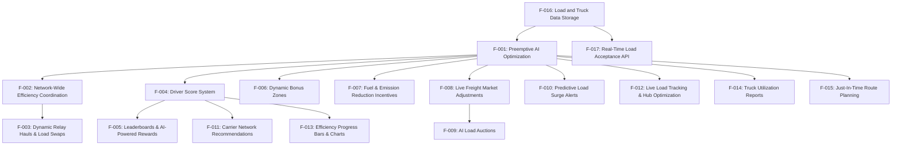
```mermaid
graph TD
    F016[F-016: Load and Truck Data Storage] --> F001[F-001: Preemptive AI Optimization]
    F016 --> F017[F-017: Real-Time Load Acceptance API]
    F001 --> F002[F-002: Network-Wide Efficiency Coordination]
    F002 --> F003[F-003: Dynamic Relay Hauls & Load Swaps]
    F001 --> F004[F-004: Driver Score System]
    F004 --> F005[F-005: Leaderboards & AI-Powered Rewards]
    F001 --> F006[F-006: Dynamic Bonus Zones]
    F001 --> F007[F-007: Fuel & Emission Reduction Incentives]
    F001 --> F008[F-008: Live Freight Market Adjustments]
    F008 --> F009[F-009: AI Load Auctions]
    F001 --> F010[F-010: Predictive Load Surge Alerts]
    F004 --> F011[F-011: Carrier Network Recommendations]
    F001 --> F012[F-012: Live Load Tracking & Hub Optimization]
    F004 --> F013[F-013: Efficiency Progress Bars & Charts]
    F001 --> F014[F-014: Truck Utilization Reports]
    F001 --> F015[F-015: Just-In-Time Route Planning]
```

#### Integration Points

| Feature | Integration Points |
|---------|-------------------|
| F-001: Preemptive AI Optimization | TMS systems, ELD devices, GPS tracking services |
| F-002: Network-Wide Efficiency Coordination | Warehouse management systems, facility scheduling |
| F-003: Dynamic Relay Hauls & Load Swaps | Driver mobile app, facility check-in systems |
| F-008: Live Freight Market Adjustments | Payment systems, market data feeds |
| F-012: Live Load Tracking & Hub Optimization | Mapping services, traffic data providers |
| F-017: Real-Time Load Acceptance API | Mobile apps, TMS systems, notification services |

#### Shared Components

| Component | Used By Features |
|-----------|-----------------|
| AI Prediction Engine | F-001, F-002, F-008, F-010, F-015 |
| Geospatial Visualization | F-006, F-010, F-012 |
| Driver Scoring Algorithm | F-004, F-005, F-011, F-013 |
| Real-Time Data Processing | F-001, F-008, F-012, F-015, F-017 |
| Notification System | F-005, F-006, F-010, F-015 |

### 2.4 IMPLEMENTATION CONSIDERATIONS

#### Technical Constraints

| Feature | Technical Constraints |
|---------|----------------------|
| F-001: Preemptive AI Optimization | Requires significant historical data for accurate predictions; minimum 6 months of load history |
| F-002: Network-Wide Efficiency Coordination | Computational complexity increases exponentially with network size; requires optimization techniques |
| F-012: Live Load Tracking & Hub Optimization | Mobile bandwidth limitations may affect map rendering in rural areas |
| F-017: Real-Time Load Acceptance API | Must handle high concurrency during peak hours |

#### Performance Requirements

| Feature | Performance Requirements |
|---------|--------------------------|
| F-001: Preemptive AI Optimization | Prediction models must complete within 5 minutes for network-wide forecasts |
| F-008: Live Freight Market Adjustments | Price calculations must complete in <3 seconds to support real-time bidding |
| F-012: Live Load Tracking & Hub Optimization | Map must render in <3 seconds on mobile devices with 4G connections |
| F-017: Real-Time Load Acceptance API | Must support 1000+ concurrent requests with <500ms response time |

#### Scalability Considerations

| Feature | Scalability Considerations |
|---------|----------------------------|
| F-001: Preemptive AI Optimization | Prediction models must scale to handle 100,000+ trucks and loads |
| F-002: Network-Wide Efficiency Coordination | Optimization algorithms must use partitioning for large networks |
| F-016: Load and Truck Data Storage | Database must scale to billions of records with efficient querying |
| F-017: Real-Time Load Acceptance API | API gateway must support horizontal scaling during peak demand |

#### Security Implications

| Feature | Security Implications |
|---------|----------------------|
| F-004: Driver Score System | Personal driver data must be protected according to privacy regulations |
| F-008: Live Freight Market Adjustments | Pricing algorithms must be protected from manipulation attempts |
| F-016: Load and Truck Data Storage | Sensitive shipper and carrier data requires encryption at rest and in transit |
| F-017: Real-Time Load Acceptance API | API requires strong authentication to prevent unauthorized load acceptance |

#### Traceability Matrix

| Requirement ID | Feature ID | Business Need | Validation Method |
|----------------|-----------|---------------|-------------------|
| F-001-RQ-001 | F-001 | Reduce empty miles | Statistical validation of prediction accuracy |
| F-001-RQ-002 | F-001 | Increase driver earnings | Measure before/after empty mile percentage |
| F-002-RQ-001 | F-002 | Optimize network efficiency | Validate hub selection against facility capabilities |
| F-004-RQ-001 | F-004 | Incentivize efficient behavior | User acceptance testing with driver focus groups |
| F-008-RQ-001 | F-008 | Balance supply and demand | Compare pricing to market benchmarks |
| F-012-RQ-001 | F-012 | Provide visual decision support | Usability testing with drivers |
| F-016-RQ-001 | F-016 | Enable data-driven decisions | Performance testing of data retrieval |
| F-017-RQ-001 | F-017 | Streamline load acceptance | Load testing of API endpoints |

## 3. TECHNOLOGY STACK

### 3.1 PROGRAMMING LANGUAGES

| Component | Language | Version | Justification |
|-----------|----------|---------|---------------|
| Backend Services | Python | 3.11+ | Ideal for AI/ML development with extensive libraries (NumPy, Pandas, scikit-learn, TensorFlow); excellent for data processing and analysis required by the optimization algorithms |
| Web Frontend | TypeScript | 5.0+ | Provides type safety for complex data structures; enhances maintainability for the interactive dashboards and visualizations |
| Mobile Apps | Swift (iOS) | 5.9+ | Native performance for real-time map rendering and location tracking on iOS devices |
| Mobile Apps | Kotlin (Android) | 1.9+ | Native performance for real-time map rendering and location tracking on Android devices; coroutines for asynchronous operations |
| Data Processing | SQL | - | For complex queries against relational data structures and geospatial operations |
| Infrastructure | YAML/HCL | - | For infrastructure as code and configuration management |

### 3.2 FRAMEWORKS & LIBRARIES

#### Backend Frameworks

| Framework | Version | Purpose | Justification |
|-----------|---------|---------|---------------|
| FastAPI | 0.103+ | API Development | High performance for real-time APIs; native async support; automatic OpenAPI documentation for the load acceptance API (F-017) |
| Django | 4.2+ | Admin Interface | Robust admin interface for internal operations; ORM for database interactions |
| Celery | 5.3+ | Task Queue | Distributed task processing for AI predictions and optimizations that require significant computation time |
| TensorFlow | 2.13+ | Machine Learning | Industry standard for developing and deploying ML models for load prediction (F-001) |
| PyTorch | 2.0+ | Machine Learning | Flexibility for research and development of complex optimization algorithms (F-002) |
| scikit-learn | 1.3+ | Machine Learning | For statistical models and preprocessing in the predictive analytics pipeline |
| OR-Tools | 9.7+ | Optimization | Google's operations research tools for solving complex routing and scheduling problems (F-002, F-003) |
| Pandas | 2.1+ | Data Analysis | Data manipulation and analysis for historical load data processing |
| GeoPandas | 0.13+ | Geospatial Analysis | Extension of Pandas for geospatial operations in Smart Hub identification (F-002) |
| Redis-py | 4.6+ | Caching Client | Python interface to Redis for real-time data caching |
| SQLAlchemy | 2.0+ | ORM | Database abstraction and ORM for complex queries |
| Pydantic | 2.4+ | Data Validation | Input validation and settings management for API endpoints |

#### Frontend Frameworks

| Framework | Version | Purpose | Justification |
|-----------|---------|---------|---------------|
| React | 18.2+ | Web UI | Component-based architecture for building interactive UIs; large ecosystem of libraries |
| React Native | 0.72+ | Mobile UI | Cross-platform code sharing while maintaining native performance for driver mobile app |
| Redux | 4.2+ | State Management | Centralized state management for complex UI interactions and real-time updates |
| MapboxGL JS | 2.15+ | Map Visualization | High-performance maps with customization for the live load tracking feature (F-012) |
| D3.js | 7.8+ | Data Visualization | Advanced custom visualizations for efficiency charts and heat maps (F-013) |
| Material-UI | 5.14+ | UI Components | Comprehensive component library with responsive design for web interfaces |
| React Native Paper | 5.10+ | Mobile UI Components | Material Design components optimized for React Native |
| Socket.IO | 4.7+ | Real-time Communication | Bidirectional event-based communication for live updates |
| React Query | 4.35+ | Data Fetching | Efficient data fetching, caching, and state management for API interactions |
| Formik | 2.4+ | Form Management | Form state management and validation for load entry and driver profiles |

### 3.3 DATABASES & STORAGE

| Database/Storage | Version | Purpose | Justification |
|------------------|---------|---------|---------------|
| PostgreSQL | 15+ | Primary Relational Database | Strong support for geospatial queries (PostGIS) essential for location-based features; ACID compliance for transaction integrity in load booking |
| TimescaleDB | 2.11+ | Time-Series Data | Extension to PostgreSQL optimized for time-series data to store historical truck movements and load patterns |
| Redis | 7.2+ | Caching & Real-time Data | In-memory data store for real-time position data, leaderboards (F-005), and pub/sub messaging |
| MongoDB | 6.0+ | Document Storage | Flexible schema for storing complex, nested documents like driver profiles and preferences |
| Amazon S3 | - | Object Storage | Durable storage for documents, images, and backup data |
| Elasticsearch | 8.10+ | Search & Analytics | Fast full-text search and analytics for load discovery and market intelligence features (F-008, F-010) |
| Amazon RDS | - | Database Hosting | Managed database service with high availability and automated backups |
| Amazon ElastiCache | - | Managed Redis | Managed Redis service for production deployment |

#### Data Persistence Strategies

| Strategy | Application | Justification |
|----------|-------------|---------------|
| Write-Through Cache | Real-time Position Data | Ensures data consistency while maintaining performance for frequently accessed data |
| Event Sourcing | Load Transactions | Maintains complete audit trail of all load-related events for compliance and analytics |
| CQRS Pattern | Load Matching System | Separates read and write operations to optimize for both high-volume writes (position updates) and complex reads (optimization algorithms) |
| Materialized Views | Analytics Dashboards | Pre-computed aggregations for dashboard performance (F-013, F-014) |
| Sharding | Position Data | Horizontal partitioning by geographic region to maintain performance at scale |

### 3.4 THIRD-PARTY SERVICES

| Service | Purpose | Justification |
|---------|---------|---------------|
| AWS Location Service | Geospatial Capabilities | Managed service for maps, geocoding, and routing essential for Smart Hub identification (F-002) |
| Google Maps API | Address Validation & Routing | Industry standard for address validation and route optimization |
| Stripe | Payment Processing | Secure handling of driver incentives and bonuses (F-004, F-005) |
| Twilio | SMS Notifications | Real-time alerts for drivers about load opportunities and status changes |
| Auth0 | Authentication & Authorization | Secure identity management with support for multiple authentication methods |
| Sentry | Error Tracking | Real-time error tracking and monitoring to ensure system reliability |
| DataDog | Application Performance Monitoring | Comprehensive monitoring of system performance and health |
| ELD API Integrations | Hours of Service Data | Integration with major ELD providers to access driver HOS data for compliance |
| Weather API (OpenWeatherMap) | Weather Data | Weather forecasting for route planning and risk assessment |
| Fuel Card APIs | Fuel Discounts | Integration with fuel card providers for driver incentives (F-007) |
| TMS Integration APIs | Load Import/Export | Connections to major TMS systems for seamless data exchange |

### 3.5 DEVELOPMENT & DEPLOYMENT

#### Development Tools

| Tool | Version | Purpose | Justification |
|------|---------|---------|---------------|
| VS Code | Latest | IDE | Extensible editor with strong support for all required languages |
| PyCharm | Latest | Python IDE | Specialized Python development environment with advanced debugging |
| Jupyter Notebook | Latest | Data Analysis & ML Prototyping | Interactive environment for developing and testing ML models |
| Postman | Latest | API Testing | Comprehensive API development and testing platform |
| Git | Latest | Version Control | Industry standard for source code management |
| GitHub | - | Code Repository | Collaborative development platform with CI/CD integration |
| npm/Yarn | Latest | Package Management | Dependency management for JavaScript/TypeScript projects |
| Poetry | Latest | Python Package Management | Modern dependency management for Python projects |

#### Infrastructure & Deployment

| Tool/Service | Version | Purpose | Justification |
|--------------|---------|---------|---------------|
| Docker | 24+ | Containerization | Application packaging for consistent deployment across environments |
| Kubernetes | 1.28+ | Container Orchestration | Scalable management of containerized applications with auto-scaling capabilities |
| Terraform | 1.6+ | Infrastructure as Code | Declarative infrastructure definition for consistent environment provisioning |
| AWS EKS | - | Managed Kubernetes | Simplified Kubernetes cluster management |
| AWS Lambda | - | Serverless Computing | Cost-effective execution of event-driven functions for notifications and data processing |
| AWS CloudFront | - | CDN | Global content delivery for web and mobile assets |
| GitHub Actions | - | CI/CD | Automated testing and deployment integrated with code repository |
| AWS CloudWatch | - | Monitoring & Logging | Centralized logging and monitoring for system health |
| AWS Secrets Manager | - | Secrets Management | Secure storage and management of API keys and credentials |
| AWS SQS | - | Message Queue | Reliable message delivery for asynchronous processing |

### 3.6 ARCHITECTURE DIAGRAM

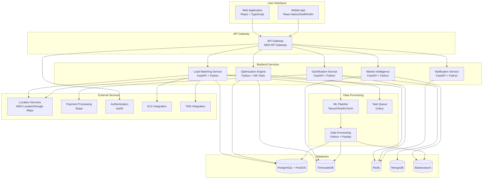
```mermaid
graph TD
    subgraph "User Interfaces"
        WebApp[Web Application\nReact + TypeScript]
        MobileApp[Mobile App\nReact Native/Swift/Kotlin]
    end

    subgraph "API Gateway"
        APIGateway[API Gateway\nAWS API Gateway]
    end

    subgraph "Backend Services"
        LoadMatchingService[Load Matching Service\nFastAPI + Python]
        OptimizationService[Optimization Engine\nPython + OR-Tools]
        GamificationService[Gamification Service\nFastAPI + Python]
        MarketIntelligenceService[Market Intelligence\nFastAPI + Python]
        NotificationService[Notification Service\nFastAPI + Python]
    end

    subgraph "Data Processing"
        MLPipeline[ML Pipeline\nTensorFlow/PyTorch]
        DataProcessing[Data Processing\nPython + Pandas]
        CeleryWorkers[Task Queue\nCelery]
    end

    subgraph "Databases"
        PostgreSQL[(PostgreSQL + PostGIS)]
        TimescaleDB[(TimescaleDB)]
        Redis[(Redis)]
        MongoDB[(MongoDB)]
        Elasticsearch[(Elasticsearch)]
    end

    subgraph "External Services"
        LocationServices[Location Services\nAWS Location/Google Maps]
        PaymentProcessor[Payment Processing\nStripe]
        AuthService[Authentication\nAuth0]
        ELDIntegration[ELD Integration]
        TMSIntegration[TMS Integration]
    end

    WebApp --> APIGateway
    MobileApp --> APIGateway
    
    APIGateway --> LoadMatchingService
    APIGateway --> OptimizationService
    APIGateway --> GamificationService
    APIGateway --> MarketIntelligenceService
    APIGateway --> NotificationService
    
    LoadMatchingService --> PostgreSQL
    LoadMatchingService --> Redis
    LoadMatchingService --> MLPipeline
    
    OptimizationService --> PostgreSQL
    OptimizationService --> TimescaleDB
    OptimizationService --> CeleryWorkers
    
    GamificationService --> MongoDB
    GamificationService --> Redis
    
    MarketIntelligenceService --> Elasticsearch
    MarketIntelligenceService --> TimescaleDB
    
    NotificationService --> Redis
    
    MLPipeline --> DataProcessing
    DataProcessing --> PostgreSQL
    DataProcessing --> TimescaleDB
    DataProcessing --> Elasticsearch
    
    LoadMatchingService --> LocationServices
    OptimizationService --> LocationServices
    
    GamificationService --> PaymentProcessor
    
    APIGateway --> AuthService
    
    LoadMatchingService --> ELDIntegration
    LoadMatchingService --> TMSIntegration
```

### 3.7 TECHNOLOGY SELECTION RATIONALE

| Technology Decision | Alternatives Considered | Selection Rationale |
|---------------------|-------------------------|---------------------|
| Python for Backend | Go, Java, Node.js | Python's extensive ML/AI ecosystem and data processing libraries make it ideal for the complex optimization algorithms required; team expertise in Python |
| FastAPI for API Development | Flask, Django REST Framework | Superior performance for real-time APIs; native async support critical for handling concurrent load acceptance requests (F-017) |
| PostgreSQL + PostGIS | MySQL, MongoDB | Strong geospatial capabilities essential for location-based features; ACID compliance for transaction integrity in load booking |
| React + TypeScript | Angular, Vue.js | Component reusability between web and mobile; strong typing for complex data structures; large ecosystem of mapping and visualization libraries |
| TensorFlow + PyTorch | scikit-learn only | Need for both production-ready deployment (TensorFlow) and research flexibility (PyTorch) for different aspects of the AI system |
| Kubernetes | AWS ECS, Serverless | Scalability and portability requirements; ability to handle variable workloads efficiently |
| Redis | Memcached, Hazelcast | Pub/sub capabilities for real-time updates; sorted sets for leaderboards; geospatial commands for proximity queries |
| AWS as Cloud Provider | Azure, GCP | Comprehensive service offerings; strong support for containerized applications; mature location services |

## 4. PROCESS FLOWCHART

### 4.1 SYSTEM WORKFLOWS

#### 4.1.1 Core Business Processes

##### Load Matching and Optimization Workflow

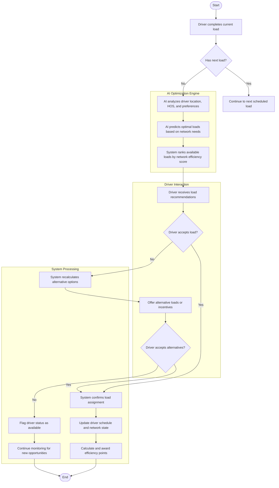
```mermaid
flowchart TD
    Start([Start]) --> A[Driver completes current load]
    A --> B{Has next load?}
    B -->|Yes| C[Continue to next scheduled load]
    B -->|No| D[AI analyzes driver location, HOS, and preferences]
    D --> E[AI predicts optimal loads based on network needs]
    E --> F[System ranks available loads by network efficiency score]
    F --> G[Driver receives load recommendations]
    G --> H{Driver accepts load?}
    H -->|Yes| I[System confirms load assignment]
    I --> J[Update driver schedule and network state]
    J --> K[Calculate and award efficiency points]
    K --> End([End])
    H -->|No| L[System recalculates alternative options]
    L --> M[Offer alternative loads or incentives]
    M --> N{Driver accepts alternatives?}
    N -->|Yes| I
    N -->|No| O[Flag driver status as available]
    O --> P[Continue monitoring for new opportunities]
    P --> End
    
    subgraph "AI Optimization Engine"
        D
        E
        F
    end
    
    subgraph "Driver Interaction"
        G
        H
        M
        N
    end
    
    subgraph "System Processing"
        I
        J
        K
        L
        O
        P
    end
```

##### Smart Hub Identification and Relay Planning

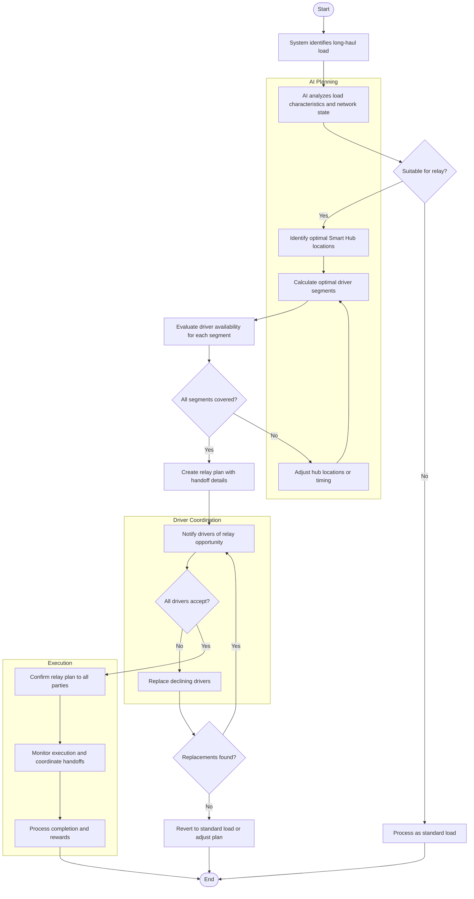
```mermaid
flowchart TD
    Start([Start]) --> A[System identifies long-haul load]
    A --> B[AI analyzes load characteristics and network state]
    B --> C{Suitable for relay?}
    C -->|No| D[Process as standard load]
    D --> End([End])
    C -->|Yes| E[Identify optimal Smart Hub locations]
    E --> F[Calculate optimal driver segments]
    F --> G[Evaluate driver availability for each segment]
    G --> H{All segments covered?}
    H -->|No| I[Adjust hub locations or timing]
    I --> F
    H -->|Yes| J[Create relay plan with handoff details]
    J --> K[Notify drivers of relay opportunity]
    K --> L{All drivers accept?}
    L -->|No| M[Replace declining drivers]
    M --> N{Replacements found?}
    N -->|Yes| K
    N -->|No| O[Revert to standard load or adjust plan]
    O --> End
    L -->|Yes| P[Confirm relay plan to all parties]
    P --> Q[Monitor execution and coordinate handoffs]
    Q --> R[Process completion and rewards]
    R --> End
    
    subgraph "AI Planning"
        B
        E
        F
        I
    end
    
    subgraph "Driver Coordination"
        K
        L
        M
    end
    
    subgraph "Execution"
        P
        Q
        R
    end
```

##### Driver Gamification and Reward Process

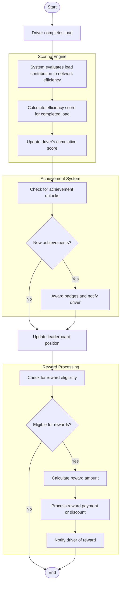
```mermaid
flowchart TD
    Start([Start]) --> A[Driver completes load]
    A --> B[System evaluates load contribution to network efficiency]
    B --> C[Calculate efficiency score for completed load]
    C --> D[Update driver's cumulative score]
    D --> E[Check for achievement unlocks]
    E --> F{New achievements?}
    F -->|Yes| G[Award badges and notify driver]
    F -->|No| H[Update leaderboard position]
    G --> H
    H --> I[Check for reward eligibility]
    I --> J{Eligible for rewards?}
    J -->|No| End([End])
    J -->|Yes| K[Calculate reward amount]
    K --> L[Process reward payment or discount]
    L --> M[Notify driver of reward]
    M --> End
    
    subgraph "Scoring Engine"
        B
        C
        D
    end
    
    subgraph "Achievement System"
        E
        F
        G
    end
    
    subgraph "Reward Processing"
        I
        J
        K
        L
        M
    end
```

#### 4.1.2 Integration Workflows

##### ELD and Hours of Service Integration

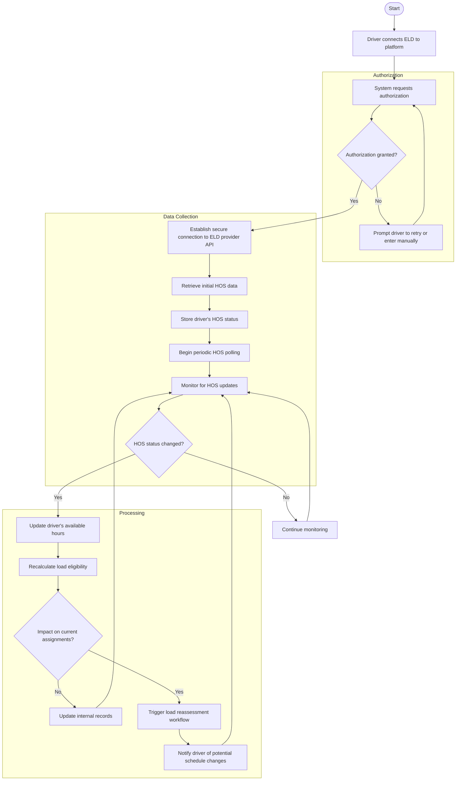
```mermaid
flowchart TD
    Start([Start]) --> A[Driver connects ELD to platform]
    A --> B[System requests authorization]
    B --> C{Authorization granted?}
    C -->|No| D[Prompt driver to retry or enter manually]
    D --> B
    C -->|Yes| E[Establish secure connection to ELD provider API]
    E --> F[Retrieve initial HOS data]
    F --> G[Store driver's HOS status]
    G --> H[Begin periodic HOS polling]
    H --> I[Monitor for HOS updates]
    I --> J{HOS status changed?}
    J -->|No| K[Continue monitoring]
    K --> I
    J -->|Yes| L[Update driver's available hours]
    L --> M[Recalculate load eligibility]
    M --> N{Impact on current assignments?}
    N -->|No| O[Update internal records]
    N -->|Yes| P[Trigger load reassessment workflow]
    O --> I
    P --> Q[Notify driver of potential schedule changes]
    Q --> I
    
    subgraph "Authorization"
        B
        C
        D
    end
    
    subgraph "Data Collection"
        E
        F
        G
        H
        I
        J
    end
    
    subgraph "Processing"
        L
        M
        N
        O
        P
        Q
    end
```

##### TMS Integration and Load Synchronization

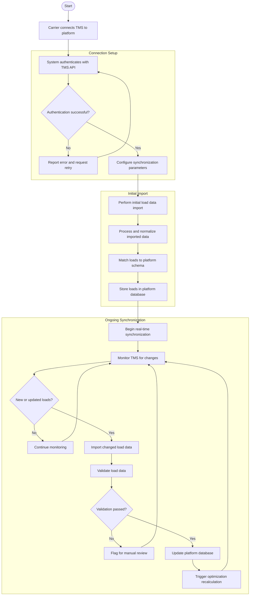
```mermaid
flowchart TD
    Start([Start]) --> A[Carrier connects TMS to platform]
    A --> B[System authenticates with TMS API]
    B --> C{Authentication successful?}
    C -->|No| D[Report error and request retry]
    D --> B
    C -->|Yes| E[Configure synchronization parameters]
    E --> F[Perform initial load data import]
    F --> G[Process and normalize imported data]
    G --> H[Match loads to platform schema]
    H --> I[Store loads in platform database]
    I --> J[Begin real-time synchronization]
    J --> K[Monitor TMS for changes]
    K --> L{New or updated loads?}
    L -->|No| M[Continue monitoring]
    M --> K
    L -->|Yes| N[Import changed load data]
    N --> O[Validate load data]
    O --> P{Validation passed?}
    P -->|No| Q[Flag for manual review]
    Q --> K
    P -->|Yes| R[Update platform database]
    R --> S[Trigger optimization recalculation]
    S --> K
    
    subgraph "Connection Setup"
        B
        C
        D
        E
    end
    
    subgraph "Initial Import"
        F
        G
        H
        I
    end
    
    subgraph "Ongoing Synchronization"
        J
        K
        L
        M
        N
        O
        P
        Q
        R
        S
    end
```

### 4.2 FLOWCHART REQUIREMENTS

#### 4.2.1 Load Acceptance and Processing Workflow

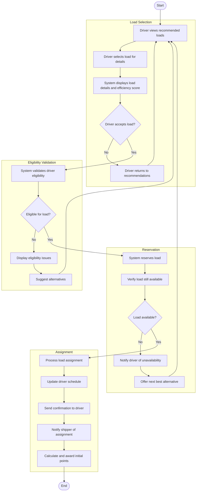
```mermaid
flowchart TD
    Start([Start]) --> A[Driver views recommended loads]
    A --> B[Driver selects load for details]
    B --> C[System displays load details and efficiency score]
    C --> D{Driver accepts load?}
    D -->|No| E[Driver returns to recommendations]
    E --> A
    D -->|Yes| F[System validates driver eligibility]
    F --> G{Eligible for load?}
    G -->|No| H[Display eligibility issues]
    H --> I[Suggest alternatives]
    I --> A
    G -->|Yes| J[System reserves load]
    J --> K[Verify load still available]
    K --> L{Load available?}
    L -->|No| M[Notify driver of unavailability]
    M --> N[Offer next best alternative]
    N --> A
    L -->|Yes| O[Process load assignment]
    O --> P[Update driver schedule]
    P --> Q[Send confirmation to driver]
    Q --> R[Notify shipper of assignment]
    R --> S[Calculate and award initial points]
    S --> End([End])
    
    subgraph "Load Selection"
        A
        B
        C
        D
        E
    end
    
    subgraph "Eligibility Validation"
        F
        G
        H
        I
    end
    
    subgraph "Reservation"
        J
        K
        L
        M
        N
    end
    
    subgraph "Assignment"
        O
        P
        Q
        R
        S
    end
```

#### 4.2.2 Dynamic Pricing and Market Adjustment Workflow

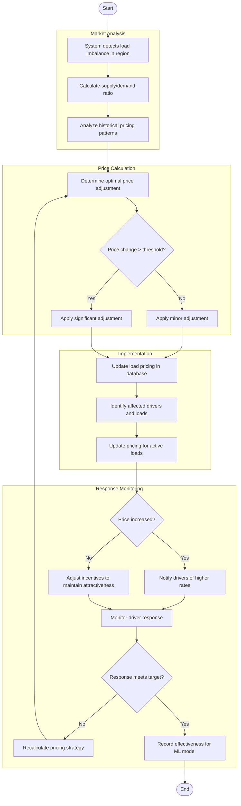
```mermaid
flowchart TD
    Start([Start]) --> A[System detects load imbalance in region]
    A --> B[Calculate supply/demand ratio]
    B --> C[Analyze historical pricing patterns]
    C --> D[Determine optimal price adjustment]
    D --> E{Price change > threshold?}
    E -->|No| F[Apply minor adjustment]
    E -->|Yes| G[Apply significant adjustment]
    F --> H[Update load pricing in database]
    G --> H
    H --> I[Identify affected drivers and loads]
    I --> J[Update pricing for active loads]
    J --> K{Price increased?}
    K -->|Yes| L[Notify drivers of higher rates]
    K -->|No| M[Adjust incentives to maintain attractiveness]
    L --> N[Monitor driver response]
    M --> N
    N --> O{Response meets target?}
    O -->|No| P[Recalculate pricing strategy]
    P --> D
    O -->|Yes| Q[Record effectiveness for ML model]
    Q --> End([End])
    
    subgraph "Market Analysis"
        A
        B
        C
    end
    
    subgraph "Price Calculation"
        D
        E
        F
        G
    end
    
    subgraph "Implementation"
        H
        I
        J
    end
    
    subgraph "Response Monitoring"
        K
        L
        M
        N
        O
        P
        Q
    end
```

#### 4.2.3 Error Handling and Recovery Workflow

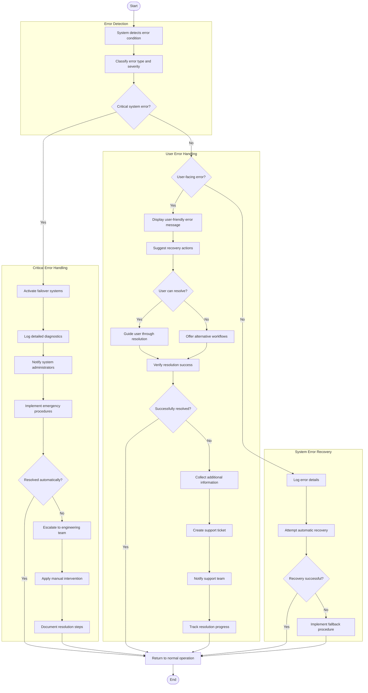
```mermaid
flowchart TD
    Start([Start]) --> A[System detects error condition]
    A --> B[Classify error type and severity]
    B --> C{Critical system error?}
    C -->|Yes| D[Activate failover systems]
    D --> E[Log detailed diagnostics]
    E --> F[Notify system administrators]
    F --> G[Implement emergency procedures]
    G --> H{Resolved automatically?}
    H -->|Yes| I[Return to normal operation]
    H -->|No| J[Escalate to engineering team]
    J --> K[Apply manual intervention]
    K --> L[Document resolution steps]
    L --> I
    C -->|No| M{User-facing error?}
    M -->|Yes| N[Display user-friendly error message]
    N --> O[Suggest recovery actions]
    O --> P{User can resolve?}
    P -->|Yes| Q[Guide user through resolution]
    P -->|No| R[Offer alternative workflows]
    Q --> S[Verify resolution success]
    R --> S
    S --> T{Successfully resolved?}
    T -->|Yes| I
    T -->|No| U[Collect additional information]
    U --> V[Create support ticket]
    V --> W[Notify support team]
    W --> X[Track resolution progress]
    X --> I
    M -->|No| Y[Log error details]
    Y --> Z[Attempt automatic recovery]
    Z --> AA{Recovery successful?}
    AA -->|Yes| I
    AA -->|No| BB[Implement fallback procedure]
    BB --> I
    I --> End([End])
    
    subgraph "Error Detection"
        A
        B
        C
    end
    
    subgraph "Critical Error Handling"
        D
        E
        F
        G
        H
        J
        K
        L
    end
    
    subgraph "User Error Handling"
        M
        N
        O
        P
        Q
        R
        S
        T
        U
        V
        W
        X
    end
    
    subgraph "System Error Recovery"
        Y
        Z
        AA
        BB
    end
```

### 4.3 TECHNICAL IMPLEMENTATION

#### 4.3.1 State Management for Load Tracking

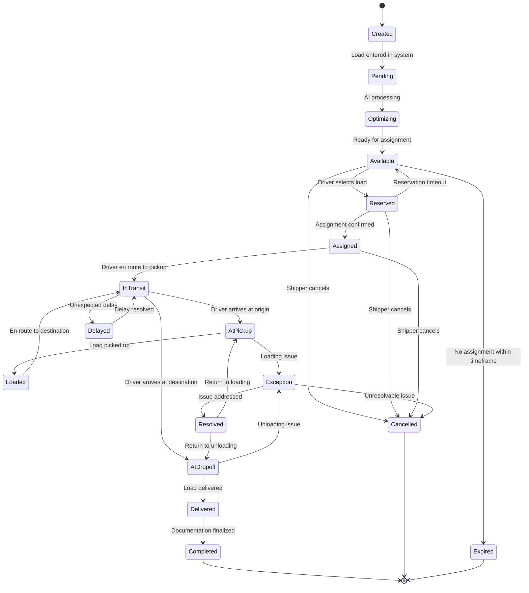
```mermaid
stateDiagram-v2
    [*] --> Created
    Created --> Pending: Load entered in system
    Pending --> Optimizing: AI processing
    Optimizing --> Available: Ready for assignment
    Available --> Reserved: Driver selects load
    Reserved --> Assigned: Assignment confirmed
    Reserved --> Available: Reservation timeout
    Assigned --> InTransit: Driver en route to pickup
    InTransit --> AtPickup: Driver arrives at origin
    AtPickup --> Loaded: Load picked up
    Loaded --> InTransit: En route to destination
    InTransit --> AtDropoff: Driver arrives at destination
    AtDropoff --> Delivered: Load delivered
    Delivered --> Completed: Documentation finalized
    Completed --> [*]
    
    Available --> Cancelled: Shipper cancels
    Reserved --> Cancelled: Shipper cancels
    Assigned --> Cancelled: Shipper cancels
    Cancelled --> [*]
    
    Available --> Expired: No assignment within timeframe
    Expired --> [*]
    
    InTransit --> Delayed: Unexpected delay
    Delayed --> InTransit: Delay resolved
    
    AtPickup --> Exception: Loading issue
    AtDropoff --> Exception: Unloading issue
    Exception --> Resolved: Issue addressed
    Resolved --> AtPickup: Return to loading
    Resolved --> AtDropoff: Return to unloading
    Exception --> Cancelled: Unresolvable issue
```

#### 4.3.2 Integration Sequence for Load Booking

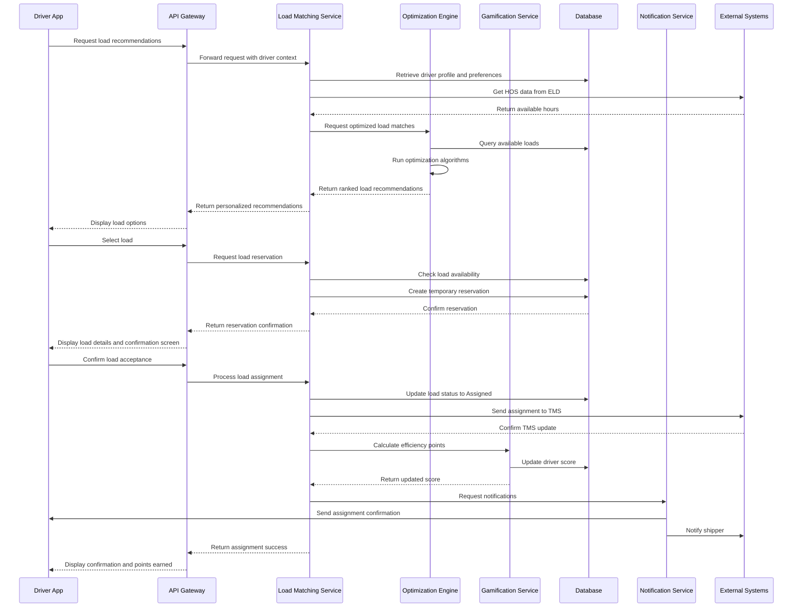
```mermaid
sequenceDiagram
    participant Driver as Driver App
    participant API as API Gateway
    participant Matching as Load Matching Service
    participant Optimization as Optimization Engine
    participant Gamification as Gamification Service
    participant DB as Database
    participant Notification as Notification Service
    participant External as External Systems
    
    Driver->>API: Request load recommendations
    API->>Matching: Forward request with driver context
    Matching->>DB: Retrieve driver profile and preferences
    Matching->>External: Get HOS data from ELD
    External-->>Matching: Return available hours
    Matching->>Optimization: Request optimized load matches
    Optimization->>DB: Query available loads
    Optimization->>Optimization: Run optimization algorithms
    Optimization-->>Matching: Return ranked load recommendations
    Matching-->>API: Return personalized recommendations
    API-->>Driver: Display load options
    
    Driver->>API: Select load
    API->>Matching: Request load reservation
    Matching->>DB: Check load availability
    Matching->>DB: Create temporary reservation
    DB-->>Matching: Confirm reservation
    Matching-->>API: Return reservation confirmation
    API-->>Driver: Display load details and confirmation screen
    
    Driver->>API: Confirm load acceptance
    API->>Matching: Process load assignment
    Matching->>DB: Update load status to Assigned
    Matching->>External: Send assignment to TMS
    External-->>Matching: Confirm TMS update
    Matching->>Gamification: Calculate efficiency points
    Gamification->>DB: Update driver score
    Gamification-->>Matching: Return updated score
    Matching->>Notification: Request notifications
    Notification->>Driver: Send assignment confirmation
    Notification->>External: Notify shipper
    Matching-->>API: Return assignment success
    API-->>Driver: Display confirmation and points earned
```

#### 4.3.3 Error Handling and Retry Mechanism

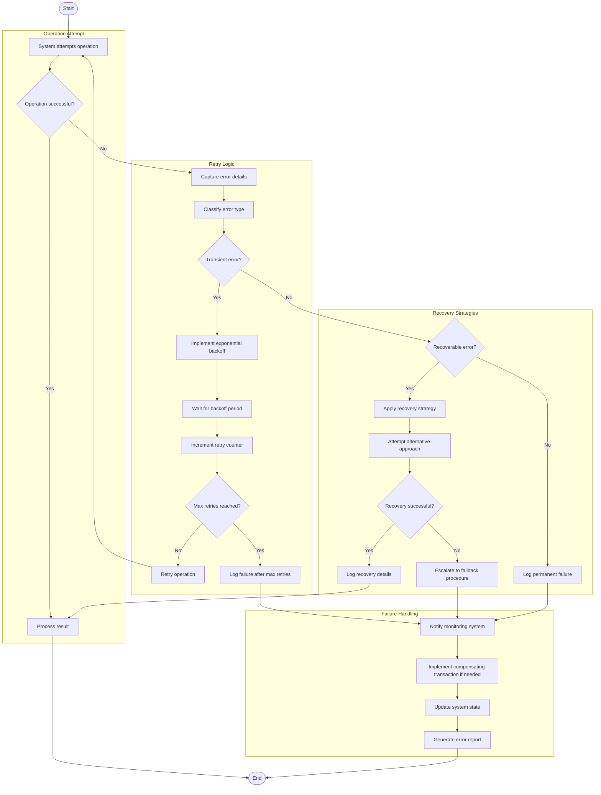
```mermaid
flowchart TD
    Start([Start]) --> A[System attempts operation]
    A --> B{Operation successful?}
    B -->|Yes| C[Process result]
    C --> End([End])
    B -->|No| D[Capture error details]
    D --> E[Classify error type]
    E --> F{Transient error?}
    F -->|Yes| G[Implement exponential backoff]
    G --> H[Wait for backoff period]
    H --> I[Increment retry counter]
    I --> J{Max retries reached?}
    J -->|No| K[Retry operation]
    K --> A
    J -->|Yes| L[Log failure after max retries]
    F -->|No| M{Recoverable error?}
    M -->|Yes| N[Apply recovery strategy]
    N --> O[Attempt alternative approach]
    O --> P{Recovery successful?}
    P -->|Yes| Q[Log recovery details]
    Q --> C
    P -->|No| R[Escalate to fallback procedure]
    M -->|No| S[Log permanent failure]
    L --> T[Notify monitoring system]
    R --> T
    S --> T
    T --> U[Implement compensating transaction if needed]
    U --> V[Update system state]
    V --> W[Generate error report]
    W --> End
    
    subgraph "Operation Attempt"
        A
        B
        C
    end
    
    subgraph "Retry Logic"
        D
        E
        F
        G
        H
        I
        J
        K
        L
    end
    
    subgraph "Recovery Strategies"
        M
        N
        O
        P
        Q
        R
        S
    end
    
    subgraph "Failure Handling"
        T
        U
        V
        W
    end
```

### 4.4 VALIDATION RULES

#### 4.4.1 Load Validation Workflow

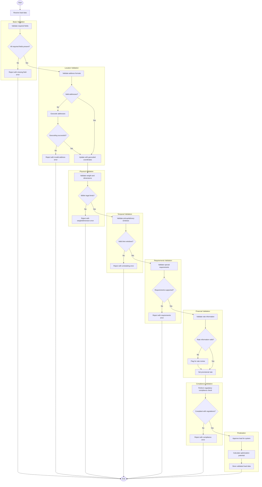
```mermaid
flowchart TD
    Start([Start]) --> A[Receive load data]
    A --> B[Validate required fields]
    B --> C{All required fields present?}
    C -->|No| D[Reject with missing field error]
    D --> End([End])
    C -->|Yes| E[Validate address formats]
    E --> F{Valid addresses?}
    F -->|No| G[Geocode addresses]
    G --> H{Geocoding successful?}
    H -->|No| I[Reject with invalid address error]
    I --> End
    H -->|Yes| J[Update with geocoded coordinates]
    F -->|Yes| J
    J --> K[Validate weight and dimensions]
    K --> L{Within legal limits?}
    L -->|No| M[Reject with weight/dimension error]
    M --> End
    L -->|Yes| N[Validate pickup/delivery windows]
    N --> O{Valid time windows?}
    O -->|No| P[Reject with scheduling error]
    P --> End
    O -->|Yes| Q[Validate special requirements]
    Q --> R{Requirements supported?}
    R -->|No| S[Reject with requirements error]
    S --> End
    R -->|Yes| T[Validate rate information]
    T --> U{Rate information valid?}
    U -->|No| V[Flag for rate review]
    V --> W[Set provisional rate]
    U -->|Yes| W
    W --> X[Perform regulatory compliance check]
    X --> Y{Compliant with regulations?}
    Y -->|No| Z[Reject with compliance error]
    Z --> End
    Y -->|Yes| AA[Approve load for system]
    AA --> BB[Calculate optimization potential]
    BB --> CC[Store validated load data]
    CC --> End
    
    subgraph "Basic Validation"
        B
        C
        D
    end
    
    subgraph "Location Validation"
        E
        F
        G
        H
        I
        J
    end
    
    subgraph "Physical Validation"
        K
        L
        M
    end
    
    subgraph "Temporal Validation"
        N
        O
        P
    end
    
    subgraph "Requirements Validation"
        Q
        R
        S
    end
    
    subgraph "Financial Validation"
        T
        U
        V
        W
    end
    
    subgraph "Compliance Validation"
        X
        Y
        Z
    end
    
    subgraph "Finalization"
        AA
        BB
        CC
    end
```

#### 4.4.2 Driver Eligibility Validation

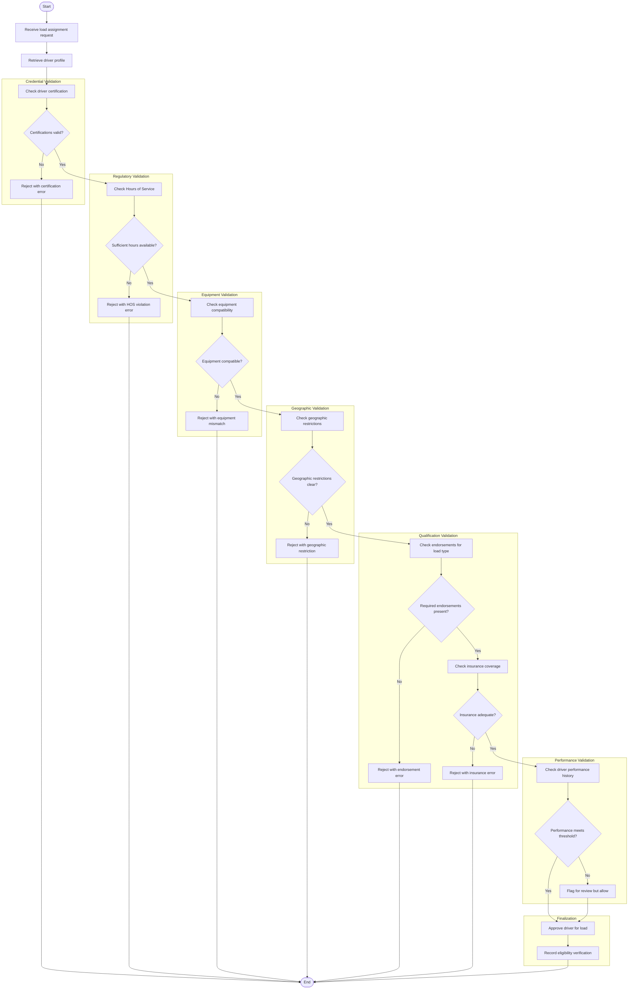
```mermaid
flowchart TD
    Start([Start]) --> A[Receive load assignment request]
    A --> B[Retrieve driver profile]
    B --> C[Check driver certification]
    C --> D{Certifications valid?}
    D -->|No| E[Reject with certification error]
    E --> End([End])
    D -->|Yes| F[Check Hours of Service]
    F --> G{Sufficient hours available?}
    G -->|No| H[Reject with HOS violation error]
    H --> End
    G -->|Yes| I[Check equipment compatibility]
    I --> J{Equipment compatible?}
    J -->|No| K[Reject with equipment mismatch]
    K --> End
    J -->|Yes| L[Check geographic restrictions]
    L --> M{Geographic restrictions clear?}
    M -->|No| N[Reject with geographic restriction]
    N --> End
    M -->|Yes| O[Check endorsements for load type]
    O --> P{Required endorsements present?}
    P -->|No| Q[Reject with endorsement error]
    Q --> End
    P -->|Yes| R[Check insurance coverage]
    R --> S{Insurance adequate?}
    S -->|No| T[Reject with insurance error]
    T --> End
    S -->|Yes| U[Check driver performance history]
    U --> V{Performance meets threshold?}
    V -->|No| W[Flag for review but allow]
    V -->|Yes| X[Approve driver for load]
    W --> X
    X --> Y[Record eligibility verification]
    Y --> End
    
    subgraph "Credential Validation"
        C
        D
        E
    end
    
    subgraph "Regulatory Validation"
        F
        G
        H
    end
    
    subgraph "Equipment Validation"
        I
        J
        K
    end
    
    subgraph "Geographic Validation"
        L
        M
        N
    end
    
    subgraph "Qualification Validation"
        O
        P
        Q
        R
        S
        T
    end
    
    subgraph "Performance Validation"
        U
        V
        W
    end
    
    subgraph "Finalization"
        X
        Y
    end
```

### 4.5 HIGH-LEVEL SYSTEM WORKFLOW

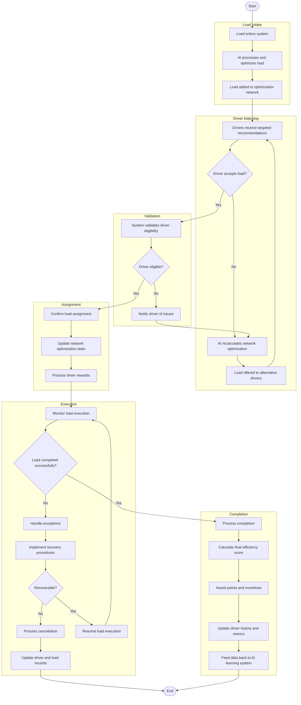
```mermaid
flowchart TD
    Start([Start]) --> A[Load enters system]
    A --> B[AI processes and optimizes load]
    B --> C[Load added to optimization network]
    C --> D[Drivers receive targeted recommendations]
    D --> E{Driver accepts load?}
    E -->|No| F[AI recalculates network optimization]
    F --> G[Load offered to alternative drivers]
    G --> D
    E -->|Yes| H[System validates driver eligibility]
    H --> I{Driver eligible?}
    I -->|No| J[Notify driver of issues]
    J --> F
    I -->|Yes| K[Confirm load assignment]
    K --> L[Update network optimization state]
    L --> M[Process driver rewards]
    M --> N[Monitor load execution]
    N --> O{Load completed successfully?}
    O -->|No| P[Handle exceptions]
    P --> Q[Implement recovery procedures]
    Q --> R{Recoverable?}
    R -->|No| S[Process cancellation]
    S --> T[Update driver and load records]
    T --> End([End])
    R -->|Yes| U[Resume load execution]
    U --> N
    O -->|Yes| V[Process completion]
    V --> W[Calculate final efficiency score]
    W --> X[Award points and incentives]
    X --> Y[Update driver history and metrics]
    Y --> Z[Feed data back to AI learning system]
    Z --> End
    
    subgraph "Load Intake"
        A
        B
        C
    end
    
    subgraph "Driver Matching"
        D
        E
        F
        G
    end
    
    subgraph "Validation"
        H
        I
        J
    end
    
    subgraph "Assignment"
        K
        L
        M
    end
    
    subgraph "Execution"
        N
        O
        P
        Q
        R
        S
        T
        U
    end
    
    subgraph "Completion"
        V
        W
        X
        Y
        Z
    end
```

## 5. SYSTEM ARCHITECTURE

### 5.1 HIGH-LEVEL ARCHITECTURE

#### 5.1.1 System Overview

The AI-driven Freight Optimization Platform employs a microservices architecture with event-driven communication patterns to enable real-time optimization and coordination across the freight network. This architecture was selected to provide the necessary scalability, resilience, and flexibility required for a dynamic, AI-powered logistics platform.

- **Architectural Style**: Microservices architecture with event-driven communication, allowing independent scaling of high-demand components like the AI optimization engine and real-time tracking services.

- **Key Architectural Principles**:
  - Separation of concerns with bounded contexts for load management, driver interactions, and optimization
  - Event-driven communication for real-time updates and loose coupling
  - CQRS (Command Query Responsibility Segregation) pattern for optimizing read and write operations
  - Polyglot persistence with specialized data stores for different data types and access patterns
  - API-first design enabling seamless integration with external systems

- **System Boundaries and Interfaces**:
  - Driver-facing mobile applications and web interfaces
  - Carrier/fleet management portals
  - Shipper interfaces for load entry and tracking
  - External system integrations (ELD, TMS, GPS, payment processors)
  - Public APIs for third-party integration

#### 5.1.2 Core Components Table

| Component Name | Primary Responsibility | Key Dependencies | Critical Considerations |
|----------------|------------------------|------------------|-------------------------|
| Load Matching Service | Matches available loads with drivers based on AI predictions | Optimization Engine, Driver Service, Load Service | Must handle high throughput with low latency; requires real-time data processing |
| Optimization Engine | Executes AI algorithms for network-wide efficiency | ML Models, Historical Data Store, Real-time Position Data | Computationally intensive; requires efficient algorithms and parallel processing |
| Driver Service | Manages driver profiles, preferences, and availability | Authentication Service, ELD Integration | Must maintain accurate driver state; sensitive personal data handling |
| Load Service | Manages load lifecycle from creation to delivery | Shipper Service, TMS Integration | Requires strong consistency and transaction support |
| Gamification Service | Implements scoring, rewards, and incentives | Driver Service, Load Matching Service | Must be perceived as fair and transparent by drivers |
| Real-time Tracking | Monitors truck positions and load status | GPS Integration, Mobile Apps | High volume of position updates; geospatial processing |
| Market Intelligence | Analyzes market conditions and adjusts pricing | Historical Data Store, External Market Data | Complex analytics requiring both historical and real-time data |
| Notification Service | Delivers alerts and updates to all users | All services, Push Notification Providers | Must ensure timely delivery across multiple channels |

#### 5.1.3 Data Flow Description

The platform's data flows are designed to support both real-time operations and long-term optimization learning:

- **Driver Position Updates**: GPS data from mobile devices flows through the Real-time Tracking service, which processes and stores current positions while publishing position change events to interested services.

- **Load Creation and Matching**: New loads enter through the Load Service, which validates and persists the data. The Optimization Engine continuously analyzes the network state, generating optimal matches that are published as recommendations to the Load Matching Service.

- **Driver Interactions**: Driver actions (load acceptance, completion, etc.) flow through the Driver Service, which updates driver state and publishes events consumed by the Load Service, Gamification Service, and Optimization Engine.

- **Learning Feedback Loop**: Completed load data, including actual routes, timing, and efficiency metrics, flows back to the Historical Data Store, where it's used to train and improve the ML models powering the Optimization Engine.

- **Market Intelligence**: External market data and internal load patterns flow into the Market Intelligence service, which generates pricing adjustments and demand forecasts consumed by the Load Service and Notification Service.

#### 5.1.4 External Integration Points

| System Name | Integration Type | Data Exchange Pattern | Protocol/Format | SLA Requirements |
|-------------|------------------|------------------------|-----------------|------------------|
| Electronic Logging Devices (ELD) | Real-time data feed | Pull with webhooks for updates | REST API / JSON | 99.9% availability, <5s latency |
| Transportation Management Systems (TMS) | Bidirectional sync | Pull/Push with webhooks | REST API / JSON, EDI | 99.5% availability, <30s sync time |
| GPS Tracking Services | Real-time data feed | Push (streaming) | WebSockets, MQTT / JSON | 99.99% availability, <2s latency |
| Payment Processors | Transaction processing | Request/Response | REST API / JSON | 99.99% availability, <3s processing time |
| Fuel Card Systems | Transaction and discount | Request/Response | REST API / JSON | 99.5% availability, <5s processing time |
| Weather Data Services | Periodic data feed | Pull (polling) | REST API / JSON | 99% availability, <1min freshness |
| Map Service Providers | Data and rendering | Request/Response | REST API, Tile API / JSON, Vector Tiles | 99.9% availability, <500ms response |

### 5.2 COMPONENT DETAILS

#### 5.2.1 Load Matching Service

- **Purpose**: Matches drivers with loads based on optimization algorithms, driver preferences, and real-time conditions.
- **Technologies**: Python, FastAPI, Redis, Kafka
- **Key Interfaces**:
  - `/api/v1/matches` - Get recommended loads for a driver
  - `/api/v1/matches/accept` - Accept a recommended load
  - `/api/v1/matches/decline` - Decline a recommended load with reason
- **Data Persistence**: Redis for caching recommendations, PostgreSQL for match history
- **Scaling Considerations**: Horizontal scaling with stateless design; partitioning by geographic region

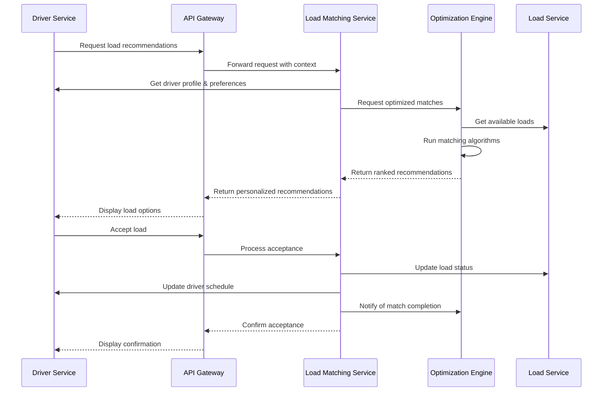
```mermaid
sequenceDiagram
    participant Driver as Driver App
    participant API as API Gateway
    participant Matching as Load Matching Service
    participant Optimization as Optimization Engine
    participant Load as Load Service
    participant Driver as Driver Service
    
    Driver->>API: Request load recommendations
    API->>Matching: Forward request with context
    Matching->>Driver: Get driver profile & preferences
    Matching->>Optimization: Request optimized matches
    Optimization->>Load: Get available loads
    Optimization->>Optimization: Run matching algorithms
    Optimization-->>Matching: Return ranked recommendations
    Matching-->>API: Return personalized recommendations
    API-->>Driver: Display load options
    
    Driver->>API: Accept load
    API->>Matching: Process acceptance
    Matching->>Load: Update load status
    Matching->>Driver: Update driver schedule
    Matching->>Optimization: Notify of match completion
    Matching-->>API: Confirm acceptance
    API-->>Driver: Display confirmation
```

#### 5.2.2 Optimization Engine

- **Purpose**: Executes AI algorithms to optimize the entire freight network, identifying efficient load matches and Smart Hubs.
- **Technologies**: Python, TensorFlow, PyTorch, OR-Tools, Celery
- **Key Interfaces**:
  - Internal API for prediction and optimization requests
  - Kafka consumers for network state changes
  - Kafka producers for optimization results
- **Data Persistence**: TimescaleDB for time-series data, MongoDB for model parameters
- **Scaling Considerations**: Vertical scaling for ML workloads; distributed training for model updates

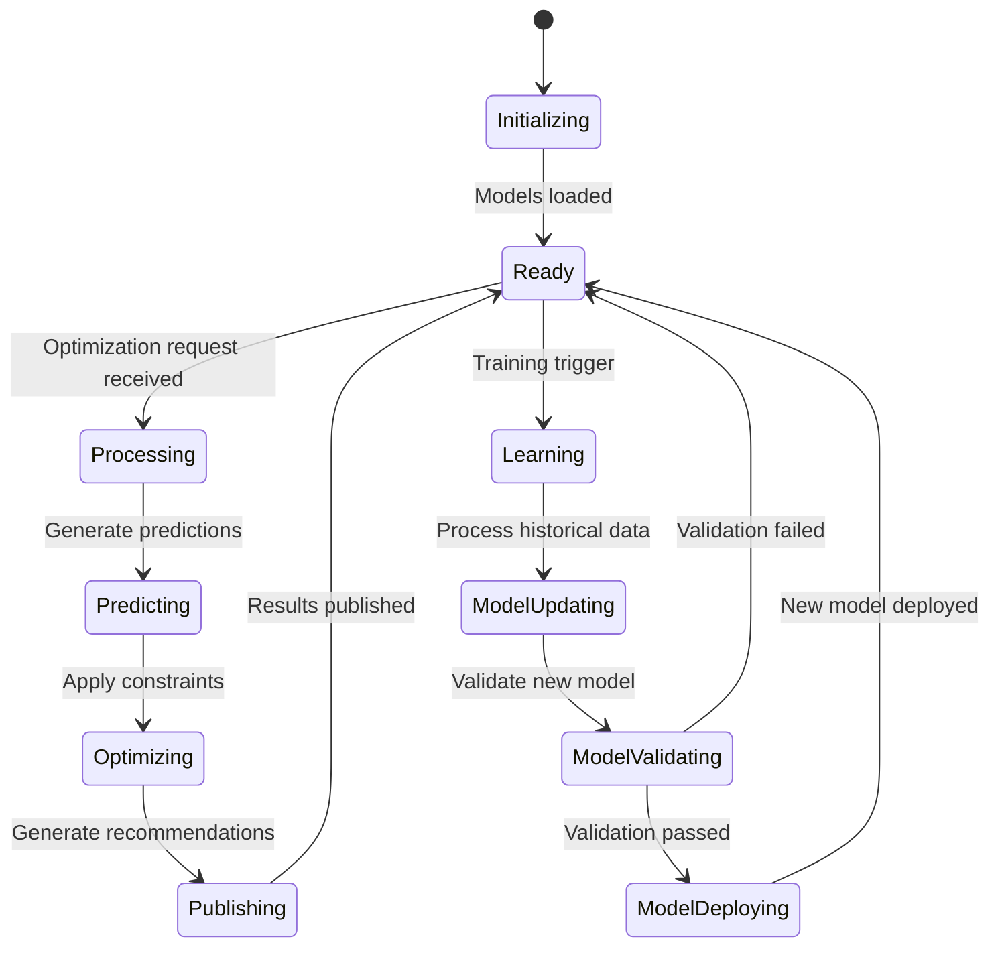
```mermaid
stateDiagram-v2
    [*] --> Initializing
    Initializing --> Ready: Models loaded
    Ready --> Processing: Optimization request received
    Processing --> Predicting: Generate predictions
    Predicting --> Optimizing: Apply constraints
    Optimizing --> Publishing: Generate recommendations
    Publishing --> Ready: Results published
    
    Ready --> Learning: Training trigger
    Learning --> ModelUpdating: Process historical data
    ModelUpdating --> ModelValidating: Validate new model
    ModelValidating --> ModelDeploying: Validation passed
    ModelDeploying --> Ready: New model deployed
    ModelValidating --> Ready: Validation failed
```

#### 5.2.3 Driver Service

- **Purpose**: Manages driver profiles, preferences, availability, and HOS compliance.
- **Technologies**: Node.js, Express, PostgreSQL
- **Key Interfaces**:
  - `/api/v1/drivers` - CRUD operations for driver profiles
  - `/api/v1/drivers/availability` - Update driver availability
  - `/api/v1/drivers/preferences` - Manage driver preferences
  - `/api/v1/drivers/hos` - Hours of service management
- **Data Persistence**: PostgreSQL for profiles, Redis for current status
- **Scaling Considerations**: Horizontal scaling with database sharding by driver ID ranges

#### 5.2.4 Load Service

- **Purpose**: Manages the complete lifecycle of loads from creation to delivery.
- **Technologies**: Java, Spring Boot, PostgreSQL
- **Key Interfaces**:
  - `/api/v1/loads` - CRUD operations for loads
  - `/api/v1/loads/status` - Update load status
  - `/api/v1/loads/tracking` - Load tracking information
- **Data Persistence**: PostgreSQL with PostGIS extension for geospatial data
- **Scaling Considerations**: Horizontal scaling with database sharding by geographic region

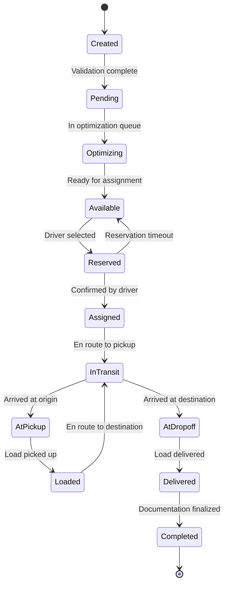
```mermaid
stateDiagram-v2
    [*] --> Created
    Created --> Pending: Validation complete
    Pending --> Optimizing: In optimization queue
    Optimizing --> Available: Ready for assignment
    Available --> Reserved: Driver selected
    Reserved --> Assigned: Confirmed by driver
    Reserved --> Available: Reservation timeout
    Assigned --> InTransit: En route to pickup
    InTransit --> AtPickup: Arrived at origin
    AtPickup --> Loaded: Load picked up
    Loaded --> InTransit: En route to destination
    InTransit --> AtDropoff: Arrived at destination
    AtDropoff --> Delivered: Load delivered
    Delivered --> Completed: Documentation finalized
    Completed --> [*]
```

#### 5.2.5 Gamification Service

- **Purpose**: Implements scoring, rewards, leaderboards, and incentives to encourage network-efficient behavior.
- **Technologies**: Node.js, Express, MongoDB, Redis
- **Key Interfaces**:
  - `/api/v1/gamification/scores` - Driver efficiency scores
  - `/api/v1/gamification/rewards` - Available and earned rewards
  - `/api/v1/gamification/leaderboards` - Driver rankings
  - `/api/v1/gamification/bonuses` - Dynamic bonus zones
- **Data Persistence**: MongoDB for flexible reward structures, Redis for leaderboards
- **Scaling Considerations**: Horizontal scaling with eventual consistency model

#### 5.2.6 Real-time Tracking Service

- **Purpose**: Monitors and manages real-time position data for trucks and loads.
- **Technologies**: Go, MQTT, Redis, TimescaleDB
- **Key Interfaces**:
  - WebSocket API for real-time position updates
  - `/api/v1/tracking/positions` - Current positions
  - `/api/v1/tracking/history` - Historical position data
- **Data Persistence**: Redis for current positions, TimescaleDB for historical data
- **Scaling Considerations**: Horizontal scaling with geospatial partitioning

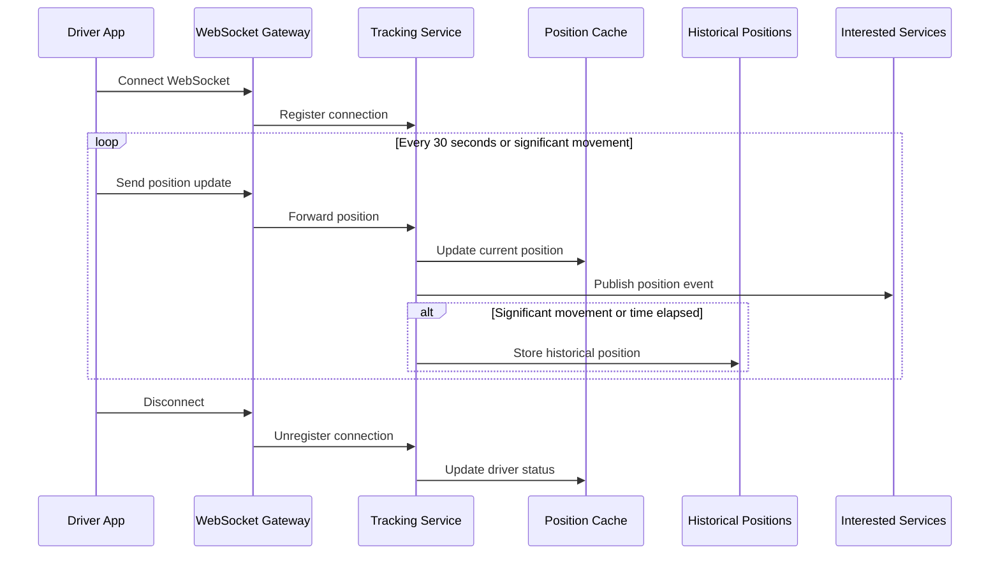
```mermaid
sequenceDiagram
    participant Driver as Driver App
    participant Gateway as WebSocket Gateway
    participant Tracking as Tracking Service
    participant Redis as Position Cache
    participant TimescaleDB as Historical Positions
    participant Interested as Interested Services
    
    Driver->>Gateway: Connect WebSocket
    Gateway->>Tracking: Register connection
    
    loop Every 30 seconds or significant movement
        Driver->>Gateway: Send position update
        Gateway->>Tracking: Forward position
        Tracking->>Redis: Update current position
        Tracking->>Interested: Publish position event
        
        alt Significant movement or time elapsed
            Tracking->>TimescaleDB: Store historical position
        end
    end
    
    Driver->>Gateway: Disconnect
    Gateway->>Tracking: Unregister connection
    Tracking->>Redis: Update driver status
```

#### 5.2.7 Market Intelligence Service

- **Purpose**: Analyzes market conditions and adjusts pricing based on supply/demand dynamics.
- **Technologies**: Python, FastAPI, Apache Spark, Elasticsearch
- **Key Interfaces**:
  - `/api/v1/market/rates` - Current market rates
  - `/api/v1/market/forecasts` - Demand forecasts
  - `/api/v1/market/hotspots` - High-demand areas
- **Data Persistence**: Elasticsearch for analytics, PostgreSQL for rate history
- **Scaling Considerations**: Vertical scaling for analytics workloads, horizontal scaling for API layer

#### 5.2.8 Notification Service

- **Purpose**: Delivers timely alerts and updates to all system users across multiple channels.
- **Technologies**: Node.js, Express, Redis, Kafka
- **Key Interfaces**:
  - Internal API for sending notifications
  - WebSocket API for real-time notifications
  - Integration with push notification services
- **Data Persistence**: Redis for notification queue, MongoDB for notification history
- **Scaling Considerations**: Horizontal scaling with message deduplication

### 5.3 TECHNICAL DECISIONS

#### 5.3.1 Architecture Style Decisions

| Decision | Options Considered | Selected Approach | Rationale |
|----------|-------------------|-------------------|-----------|
| Overall Architecture | Monolithic, Microservices, Serverless | Microservices | Enables independent scaling of components with different resource needs; supports polyglot development for specialized components |
| Communication Pattern | Request/Response, Event-Driven, Hybrid | Hybrid (Event-Driven with Request/Response) | Event-driven for real-time updates and loose coupling; request/response for immediate feedback requirements |
| API Design | REST, GraphQL, gRPC | REST with WebSockets | REST for broad compatibility; WebSockets for real-time updates to driver and dispatcher interfaces |
| Deployment Model | VM-based, Container-based, Serverless | Container-based with Kubernetes | Provides deployment flexibility, efficient resource utilization, and robust orchestration capabilities |

```mermaid
graph TD
    A[Architecture Decision: System Style] --> B{Scalability Requirements?}
    B -->|High, Variable Load| C[Consider Microservices]
    B -->|Moderate, Predictable Load| D[Consider Monolith]
    
    C --> E{Team Structure?}
    E -->|Multiple Teams| F[Microservices Preferred]
    E -->|Single Team| G[Consider Modular Monolith]
    
    F --> H{Development Velocity?}
    H -->|High Priority| I[Adopt Microservices]
    H -->|Lower Priority| J[Consider Hybrid Approach]
    
    I --> K[Decision: Microservices Architecture]
```

#### 5.3.2 Communication Pattern Choices

| Pattern | Use Cases | Benefits | Tradeoffs |
|---------|-----------|----------|-----------|
| Synchronous REST | User-initiated actions, CRUD operations | Immediate feedback, simplicity | Potential for increased coupling, blocking operations |
| Event-Driven Messaging | Status updates, notifications, data changes | Loose coupling, scalability | Eventual consistency, more complex error handling |
| WebSockets | Real-time position updates, live dashboards | Bidirectional real-time communication | Connection management overhead, stateful connections |
| Batch Processing | Historical data analysis, model training | Efficiency for large datasets | Not suitable for real-time needs |

#### 5.3.3 Data Storage Solution Rationale

| Data Type | Selected Solution | Rationale |
|-----------|-------------------|-----------|
| Relational Data (Loads, Drivers) | PostgreSQL | ACID compliance for critical business data; PostGIS extension for geospatial capabilities |
| Time-Series Data (Positions, Telemetry) | TimescaleDB | Optimized for time-series queries with PostgreSQL compatibility; efficient storage of position history |
| Caching Layer | Redis | In-memory performance for frequently accessed data; support for geospatial operations, sorted sets for leaderboards |
| Document Data (Preferences, Settings) | MongoDB | Schema flexibility for evolving data structures; rich query capabilities |
| Search and Analytics | Elasticsearch | Full-text search capabilities; analytics for market intelligence |

#### 5.3.4 Caching Strategy Justification

| Cache Type | Implementation | Use Cases | Invalidation Strategy |
|------------|----------------|-----------|------------------------|
| Data Cache | Redis | Driver profiles, load details, preferences | TTL with write-through updates |
| Computation Cache | Redis | Optimization results, recommendations | Event-based invalidation on network changes |
| Session Cache | Redis | User sessions, authentication tokens | TTL with sliding expiration |
| Geospatial Cache | Redis | Nearby trucks, loads, facilities | Spatial TTL based on position updates |

#### 5.3.5 Security Mechanism Selection

| Security Concern | Selected Approach | Rationale |
|------------------|-------------------|-----------|
| Authentication | OAuth 2.0 with JWT | Industry standard; supports multiple authentication flows for different user types |
| Authorization | Role-Based Access Control (RBAC) | Granular permission control based on user roles and resource ownership |
| API Security | API Gateway with rate limiting | Centralized security enforcement; protection against abuse |
| Data Protection | Encryption at rest and in transit | Compliance with data protection regulations; protection of sensitive information |
| Secure Communication | TLS 1.3 | Modern encryption for all communications; forward secrecy |

### 5.4 CROSS-CUTTING CONCERNS

#### 5.4.1 Monitoring and Observability Approach

The platform implements a comprehensive monitoring and observability strategy to ensure reliable operation and rapid problem resolution:

- **Metrics Collection**:
  - Infrastructure metrics: CPU, memory, disk, network
  - Application metrics: request rates, error rates, response times
  - Business metrics: matches created, loads delivered, efficiency scores

- **Distributed Tracing**:
  - OpenTelemetry implementation across all services
  - Correlation IDs for tracking requests across service boundaries
  - Sampling strategies to balance observability and performance

- **Alerting Strategy**:
  - Multi-level alerting based on severity
  - Automated escalation paths for critical issues
  - Business impact-based prioritization

- **Dashboards and Visualization**:
  - Real-time system health dashboards
  - Service-level SLA monitoring
  - Business KPI tracking

#### 5.4.2 Logging and Tracing Strategy

| Log Type | Implementation | Retention Policy | Access Control |
|----------|----------------|------------------|----------------|
| Application Logs | ELK Stack (Elasticsearch, Logstash, Kibana) | 30 days online, 1 year archived | Role-based with audit trail |
| Security Logs | Dedicated secure log store | 1 year online, 7 years archived | Restricted access with audit |
| Audit Logs | Append-only store with integrity verification | 7 years | Read-only with strict access control |
| Performance Traces | Jaeger/Zipkin with sampling | 7 days | Engineering team access |

#### 5.4.3 Error Handling Patterns

The platform implements consistent error handling patterns across all components:

- **User-Facing Errors**:
  - Friendly error messages with actionable information
  - Error codes for client-side handling
  - Appropriate HTTP status codes for REST APIs

- **System Errors**:
  - Detailed internal logging with context
  - Automatic retry with exponential backoff for transient failures
  - Circuit breakers to prevent cascading failures

- **Data Validation Errors**:
  - Comprehensive input validation at API boundaries
  - Detailed validation error responses
  - Consistent validation approach across services

```mermaid
flowchart TD
    A[Error Detected] --> B{Error Type?}
    
    B -->|Transient| C[Apply Retry Strategy]
    C --> D{Max Retries Reached?}
    D -->|No| E[Exponential Backoff]
    E --> F[Retry Operation]
    F --> G{Success?}
    G -->|Yes| H[Log Resolution]
    G -->|No| C
    D -->|Yes| I[Log Failure]
    I --> J[Trigger Alert]
    
    B -->|Validation| K[Return Detailed Validation Errors]
    K --> L[Log Validation Failure]
    
    B -->|System| M[Log Detailed Error]
    M --> N[Check Circuit Breaker]
    N --> O{Circuit Open?}
    O -->|Yes| P[Use Fallback Strategy]
    O -->|No| Q[Increment Failure Count]
    Q --> R{Threshold Reached?}
    R -->|Yes| S[Open Circuit]
    R -->|No| T[Process Normally]
    
    B -->|Security| U[Log Security Event]
    U --> V[Sanitize Response]
    V --> W[Return Generic Error]
    
    H --> Z[End]
    J --> Z
    L --> Z
    P --> Z
    S --> Z
    T --> Z
    W --> Z
```

#### 5.4.4 Authentication and Authorization Framework

The platform implements a comprehensive security framework:

- **Authentication**:
  - OAuth 2.0 with multiple grant types
  - Multi-factor authentication for sensitive operations
  - JWT tokens with appropriate expiration
  - Refresh token rotation for enhanced security

- **Authorization**:
  - Role-based access control (RBAC)
  - Resource-based permissions
  - Attribute-based access control for complex rules
  - Hierarchical permission structure

- **Identity Management**:
  - Self-service account management
  - Role assignment and delegation
  - Audit trail for permission changes
  - Integration with enterprise identity providers

#### 5.4.5 Performance Requirements and SLAs

| Service | Response Time SLA | Throughput Requirement | Availability Target |
|---------|-------------------|------------------------|---------------------|
| Load Matching API | 95% < 500ms | 1000 req/sec peak | 99.9% |
| Real-time Tracking | 99% < 100ms | 10,000 updates/sec | 99.99% |
| Optimization Engine | 95% < 5s | 100 optimizations/sec | 99.5% |
| Mobile API Gateway | 95% < 300ms | 5,000 req/sec peak | 99.95% |
| Web API Gateway | 95% < 200ms | 2,000 req/sec peak | 99.9% |

#### 5.4.6 Disaster Recovery Procedures

The platform implements a comprehensive disaster recovery strategy:

- **Backup Strategy**:
  - Automated daily backups of all databases
  - Transaction log backups every 15 minutes
  - Geo-replicated storage for backup data
  - Regular backup restoration testing

- **Recovery Time Objectives (RTO)**:
  - Critical services: 1 hour
  - Non-critical services: 4 hours
  - Complete system: 8 hours

- **Recovery Point Objectives (RPO)**:
  - Critical data: 15 minutes
  - Non-critical data: 1 hour

- **Failover Strategy**:
  - Active-active deployment for critical services
  - Automated failover for database systems
  - Geographic redundancy across multiple regions
  - Regular failover testing and drills

## 6. SYSTEM COMPONENTS DESIGN

### 6.1 FRONTEND COMPONENTS

#### 6.1.1 Driver Mobile Application

The Driver Mobile Application serves as the primary interface for truck drivers to interact with the AI-driven Freight Optimization Platform. It provides real-time load recommendations, route guidance, and gamification features.

**Key Features:**
- Load recommendation feed with AI-optimized matches
- Interactive map with real-time position tracking
- Load details and acceptance workflow
- Earnings and efficiency score dashboard
- Gamification elements (leaderboards, achievements, rewards)
- Smart Hub and relay coordination
- HOS integration and compliance monitoring

**UI Components:**

| Component | Description | Interaction Pattern |
|-----------|-------------|---------------------|
| Load Feed | Scrollable list of recommended loads with efficiency scores | Pull-to-refresh, infinite scroll |
| Load Detail | Comprehensive view of load information with accept/decline actions | Modal overlay with action buttons |
| Map View | Interactive map showing truck position, loads, and Smart Hubs | Pan/zoom, tap for details |
| Navigation | Turn-by-turn directions to pickup/delivery locations | Background updates, voice guidance |
| Earnings Dashboard | Visual representation of earnings, efficiency, and rewards | Swipeable cards with drill-down |
| Leaderboard | Rankings of drivers by efficiency score | Tabbed view with filters |
| Profile | Driver information, preferences, and achievements | Form-based editing |
| Notifications | System alerts and load opportunities | Push notifications, in-app inbox |

**Technical Specifications:**
- React Native for cross-platform compatibility
- Mapbox for mapping and geospatial visualization
- WebSocket connection for real-time updates
- Offline capability for rural areas with intermittent connectivity
- Background location tracking with battery optimization
- Deep linking for notification-to-screen navigation

**Responsive Design Considerations:**
- Support for various screen sizes (phones and tablets)
- Landscape and portrait orientation support
- Accessibility features for drivers with disabilities
- Night mode for improved visibility during evening driving

```mermaid
flowchart TD
    A[Login Screen] --> B[Home Dashboard]
    B --> C[Load Feed]
    B --> D[Map View]
    B --> E[Earnings & Rewards]
    B --> F[Profile & Settings]
    
    C --> G[Load Detail]
    G --> H{Accept Load?}
    H -->|Yes| I[Load Confirmation]
    H -->|No| J[Decline Reason]
    I --> K[Active Load View]
    J --> C
    
    D --> L[Smart Hub Details]
    D --> M[Navigation]
    
    E --> N[Efficiency Score]
    E --> O[Leaderboards]
    E --> P[Rewards History]
    
    K --> Q[Load Status Updates]
    Q --> R{Completed?}
    R -->|Yes| S[Delivery Confirmation]
    R -->|No| K
    S --> B
```

#### 6.1.2 Carrier Management Portal

The Carrier Management Portal provides fleet operators and dispatchers with comprehensive tools to manage their trucks, drivers, and loads within the optimization network.

**Key Features:**
- Fleet dashboard with real-time truck positions and status
- Load management and assignment interface
- Driver performance and efficiency analytics
- Network optimization recommendations
- Integration with existing TMS systems
- Customizable alerts and notifications
- Administrative tools for account management

**UI Components:**

| Component | Description | Interaction Pattern |
|-----------|-------------|---------------------|
| Fleet Map | Interactive map showing all trucks with status indicators | Filterable, clickable markers |
| Driver List | Sortable list of drivers with key metrics | Search, sort, filter |
| Load Board | Available and assigned loads with optimization scores | Drag-and-drop assignment |
| Analytics Dashboard | Performance metrics and efficiency reports | Interactive charts with drill-down |
| Settings Panel | Account configuration and preferences | Form-based editing |
| Notification Center | System alerts and important updates | Filterable list with actions |
| Integration Hub | Connections to external systems | Configuration wizards |

**Technical Specifications:**
- React with TypeScript for robust type checking
- Redux for state management
- D3.js for advanced data visualization
- REST API integration with polling and WebSocket updates
- Role-based access control for different user types
- Export functionality for reports (CSV, PDF, Excel)

**Responsive Design Considerations:**
- Progressive web app capabilities for mobile access
- Responsive layout for desktop, tablet, and mobile views
- Persistent user preferences and settings
- Keyboard shortcuts for power users

```mermaid
flowchart TD
    A[Login] --> B[Dashboard]
    B --> C[Fleet Management]
    B --> D[Load Management]
    B --> E[Driver Management]
    B --> F[Analytics]
    B --> G[Settings]
    
    C --> H[Fleet Map]
    C --> I[Vehicle Details]
    C --> J[Maintenance Tracking]
    
    D --> K[Available Loads]
    D --> L[Assigned Loads]
    D --> M[Load History]
    D --> N[Create Manual Load]
    
    E --> O[Driver List]
    E --> P[Driver Performance]
    E --> Q[HOS Compliance]
    
    F --> R[Efficiency Reports]
    F --> S[Cost Analysis]
    F --> T[Network Contribution]
    
    G --> U[Account Settings]
    G --> V[Integrations]
    G --> W[Notifications]
    G --> X[User Management]
```

#### 6.1.3 Shipper Interface

The Shipper Interface allows freight owners to enter loads into the system, track shipments, and benefit from the network optimization capabilities.

**Key Features:**
- Load creation and management
- Carrier recommendation based on optimization scores
- Real-time shipment tracking
- Delivery confirmation and documentation
- Performance analytics and reporting
- Rate management and bidding
- Integration with existing shipping systems

**UI Components:**

| Component | Description | Interaction Pattern |
|-----------|-------------|---------------------|
| Load Entry Form | Structured input for load details | Multi-step wizard |
| Tracking Dashboard | Real-time status of active shipments | Interactive map and timeline |
| Carrier Selection | AI-recommended carriers with performance metrics | Sortable list with filters |
| Rate Calculator | Dynamic pricing based on market conditions | Interactive form with instant feedback |
| Document Center | Digital BOLs, PODs, and other documentation | Upload/download interface |
| Analytics Dashboard | Shipping performance and cost metrics | Interactive charts with export |
| Settings Panel | Account configuration and preferences | Form-based editing |

**Technical Specifications:**
- React with Material-UI for consistent design language
- Form validation with Formik and Yup
- PDF generation for shipping documents
- Secure document storage and retrieval
- Integration with common shipping software via APIs
- Address validation and geocoding

**Responsive Design Considerations:**
- Mobile-friendly design for on-the-go access
- Simplified mobile views for critical functions
- Offline data entry with synchronization
- Accessibility compliance (WCAG 2.1)

```mermaid
flowchart TD
    A[Login] --> B[Dashboard]
    B --> C[Create Load]
    B --> D[Active Shipments]
    B --> E[Completed Shipments]
    B --> F[Analytics]
    B --> G[Settings]
    
    C --> H[Load Details Form]
    H --> I[Pickup/Delivery Information]
    I --> J[Special Requirements]
    J --> K[Rate Information]
    K --> L[Review & Submit]
    L --> M{Submit Load}
    M -->|Success| N[Load Confirmation]
    M -->|Error| O[Error Resolution]
    
    D --> P[Shipment Tracking]
    P --> Q[Carrier Communication]
    P --> R[Document Upload]
    
    E --> S[Shipment History]
    E --> T[Performance Metrics]
    E --> U[Document Archive]
    
    F --> V[Cost Analysis]
    F --> W[Carrier Performance]
    F --> X[Optimization Savings]
```

### 6.2 BACKEND SERVICES

#### 6.2.1 Load Matching Service

The Load Matching Service is responsible for matching available loads with drivers based on AI predictions, driver preferences, and network optimization goals.

**Key Responsibilities:**
- Process load recommendation requests from drivers
- Apply driver preferences and constraints to matches
- Coordinate with the Optimization Engine for network-efficient matches
- Handle load acceptance and reservation workflow
- Maintain match history for continuous learning

**API Endpoints:**

| Endpoint | Method | Description | Request Parameters | Response |
|----------|--------|-------------|-------------------|----------|
| `/api/v1/matches/recommendations` | GET | Get load recommendations for a driver | `driverId`, `count`, `location`, `filters` | Array of recommended loads with scores |
| `/api/v1/matches/reserve` | POST | Reserve a load for potential acceptance | `driverId`, `loadId`, `expirationTime` | Reservation confirmation with timeout |
| `/api/v1/matches/accept` | POST | Accept a previously reserved load | `driverId`, `loadId`, `reservationId` | Load assignment confirmation |
| `/api/v1/matches/decline` | POST | Decline a recommended load | `driverId`, `loadId`, `reasonCode` | Acknowledgment |
| `/api/v1/matches/history` | GET | Get match history for a driver | `driverId`, `startDate`, `endDate`, `status` | Array of historical matches |

**Internal Components:**

| Component | Responsibility | Implementation |
|-----------|----------------|----------------|
| Recommendation Engine | Generate personalized load recommendations | Python with scikit-learn for personalization |
| Reservation Manager | Handle temporary load reservations | Redis-based locking mechanism |
| Constraint Validator | Verify driver eligibility for loads | Rule-based validation engine |
| Match Processor | Process accepted matches | Transaction-based state management |
| History Recorder | Maintain match history for analytics | Event sourcing pattern |

**Data Model:**

```mermaid
erDiagram
    DRIVER ||--o{ MATCH : has
    LOAD ||--o{ MATCH : has
    MATCH ||--o{ MATCH_EVENT : generates
    DRIVER {
        string driverId
        string name
        object preferences
        object constraints
        float currentLat
        float currentLng
        string status
    }
    LOAD {
        string loadId
        string status
        float originLat
        float originLng
        float destLat
        float destLng
        datetime pickupWindow
        datetime deliveryWindow
        object requirements
        float rate
    }
    MATCH {
        string matchId
        string driverId
        string loadId
        float score
        string status
        datetime createdAt
        datetime updatedAt
    }
    MATCH_EVENT {
        string eventId
        string matchId
        string eventType
        object eventData
        datetime timestamp
    }
```

**Performance Considerations:**
- Caching of frequently accessed driver and load data
- Asynchronous processing of non-critical operations
- Horizontal scaling based on geographic partitioning
- Rate limiting to prevent API abuse
- Timeout handling for optimization requests

#### 6.2.2 Optimization Engine

The Optimization Engine is the core AI component responsible for network-wide freight optimization, identifying efficient matches and Smart Hubs.

**Key Responsibilities:**
- Execute predictive models for truck and load availability
- Perform network-wide optimization to minimize empty miles
- Identify optimal Smart Hub locations for load exchanges
- Generate relay plans for long-haul loads
- Continuously learn from historical data and outcomes

**Internal API Endpoints:**

| Endpoint | Method | Description | Request Parameters | Response |
|----------|--------|-------------|-------------------|----------|
| `/internal/api/v1/optimization/matches` | POST | Generate optimized matches | `region`, `constraints`, `preferences` | Array of optimized matches with scores |
| `/internal/api/v1/optimization/hubs` | POST | Identify optimal Smart Hubs | `originLat`, `originLng`, `destLat`, `destLng`, `constraints` | Array of Smart Hub locations with scores |
| `/internal/api/v1/optimization/relays` | POST | Generate relay plans | `loadId`, `constraints` | Relay plan with segments and handoffs |
| `/internal/api/v1/optimization/forecast` | POST | Predict truck/load availability | `region`, `timeWindow` | Forecast of truck and load density |
| `/internal/api/v1/optimization/learn` | POST | Submit completed load data for learning | `matchId`, `actualRoute`, `metrics` | Learning confirmation |

**Internal Components:**

| Component | Responsibility | Implementation |
|-----------|----------------|----------------|
| Prediction Engine | Forecast truck and load availability | TensorFlow with LSTM models |
| Network Optimizer | Perform global optimization | OR-Tools with custom constraints |
| Hub Identifier | Locate optimal exchange points | Geospatial clustering with facility constraints |
| Relay Planner | Create multi-driver relay plans | Graph-based path optimization |
| Learning Pipeline | Process historical data for model improvement | Apache Beam data processing |

**Algorithm Overview:**

1. **Predictive Modeling:**
   - Time-series forecasting of truck availability by location
   - Demand prediction based on historical patterns and seasonality
   - Driver behavior modeling for preference prediction

2. **Optimization Approach:**
   - Mixed Integer Linear Programming for network-wide optimization
   - Constraint satisfaction for driver and load requirements
   - Multi-objective optimization balancing efficiency and driver preferences

3. **Smart Hub Identification:**
   - Geospatial clustering of frequent crossover points
   - Facility evaluation based on amenities and accessibility
   - Dynamic adjustment based on real-time conditions

**Performance Considerations:**
- Parallel processing of optimization tasks
- Incremental optimization for real-time updates
- Caching of optimization results with appropriate invalidation
- Fallback strategies for time-constrained scenarios
- Batch processing for non-time-critical optimizations

```mermaid
flowchart TD
    A[Data Ingestion] --> B[Data Preprocessing]
    B --> C[Feature Engineering]
    C --> D[Prediction Models]
    D --> E[Constraint Generation]
    E --> F[Optimization Engine]
    F --> G[Solution Evaluation]
    G --> H{Solution Quality?}
    H -->|Good| I[Solution Finalization]
    H -->|Poor| J[Parameter Adjustment]
    J --> F
    I --> K[Result Publication]
    
    L[Historical Data] --> M[Model Training Pipeline]
    M --> N[Model Evaluation]
    N --> O{Model Improvement?}
    O -->|Yes| P[Model Deployment]
    O -->|No| Q[Feature Refinement]
    Q --> M
    P --> D
```

#### 6.2.3 Driver Service

The Driver Service manages all driver-related data, including profiles, preferences, availability, and Hours of Service (HOS) compliance.

**Key Responsibilities:**
- Maintain driver profiles and preferences
- Track driver availability and HOS status
- Process driver location updates
- Manage driver scores and achievements
- Handle driver authentication and authorization

**API Endpoints:**

| Endpoint | Method | Description | Request Parameters | Response |
|----------|--------|-------------|-------------------|----------|
| `/api/v1/drivers/profile` | GET | Get driver profile | `driverId` | Driver profile data |
| `/api/v1/drivers/profile` | PUT | Update driver profile | `driverId`, profile data | Updated profile confirmation |
| `/api/v1/drivers/preferences` | GET | Get driver preferences | `driverId` | Driver preferences |
| `/api/v1/drivers/preferences` | PUT | Update driver preferences | `driverId`, preference data | Updated preferences confirmation |
| `/api/v1/drivers/availability` | GET | Get driver availability | `driverId` | Current availability status |
| `/api/v1/drivers/availability` | PUT | Update driver availability | `driverId`, availability data | Updated availability confirmation |
| `/api/v1/drivers/location` | PUT | Update driver location | `driverId`, `latitude`, `longitude`, `heading`, `speed` | Location update confirmation |
| `/api/v1/drivers/hos` | GET | Get driver HOS status | `driverId` | Current HOS status |

**Internal Components:**

| Component | Responsibility | Implementation |
|-----------|----------------|----------------|
| Profile Manager | Handle driver profile CRUD operations | Standard repository pattern |
| Preference Engine | Manage driver preferences | Flexible schema with validation |
| Availability Tracker | Track driver status and availability | State machine with transitions |
| Location Processor | Process and store location updates | Geospatial indexing |
| HOS Monitor | Track and enforce Hours of Service | Rule-based compliance engine |
| Authentication Provider | Handle driver authentication | OAuth 2.0 implementation |

**Data Model:**

```mermaid
erDiagram
    DRIVER ||--o{ DRIVER_LOCATION : has
    DRIVER ||--o{ DRIVER_HOS : has
    DRIVER ||--o{ DRIVER_PREFERENCE : has
    DRIVER ||--o{ DRIVER_ACHIEVEMENT : earns
    DRIVER {
        string driverId
        string firstName
        string lastName
        string email
        string phone
        string licenseNumber
        string licenseState
        date licenseExpiration
        string status
        datetime createdAt
        datetime updatedAt
    }
    DRIVER_LOCATION {
        string locationId
        string driverId
        float latitude
        float longitude
        float heading
        float speed
        datetime timestamp
    }
    DRIVER_HOS {
        string hosId
        string driverId
        int drivingMinutesRemaining
        int dutyMinutesRemaining
        int cycleMinutesRemaining
        string status
        datetime statusSince
        datetime timestamp
    }
    DRIVER_PREFERENCE {
        string preferenceId
        string driverId
        string preferenceType
        string preferenceValue
        int priority
    }
    DRIVER_ACHIEVEMENT {
        string achievementId
        string driverId
        string achievementType
        int level
        datetime earnedAt
    }
```

**Integration Points:**
- ELD systems for Hours of Service data
- Mobile apps for location updates
- Authentication services for identity verification
- Gamification service for achievements and scores
- Optimization engine for driver constraints

**Performance Considerations:**
- Efficient storage and indexing of location history
- Caching of frequently accessed profile data
- Optimized geospatial queries for nearby drivers
- Batch processing of location updates
- Real-time HOS calculations for compliance

#### 6.2.4 Load Service

The Load Service manages the complete lifecycle of loads from creation to delivery, including status tracking and documentation.

**Key Responsibilities:**
- Process load creation and updates
- Track load status throughout the delivery lifecycle
- Manage load documentation (BOL, POD, etc.)
- Handle load-specific requirements and constraints
- Provide load search and filtering capabilities

**API Endpoints:**

| Endpoint | Method | Description | Request Parameters | Response |
|----------|--------|-------------|-------------------|----------|
| `/api/v1/loads` | POST | Create a new load | Load details | Created load with ID |
| `/api/v1/loads/{loadId}` | GET | Get load details | `loadId` | Complete load details |
| `/api/v1/loads/{loadId}` | PUT | Update load details | `loadId`, updated fields | Updated load confirmation |
| `/api/v1/loads/{loadId}/status` | PUT | Update load status | `loadId`, `status`, status details | Status update confirmation |
| `/api/v1/loads/search` | GET | Search for loads | Search criteria | Array of matching loads |
| `/api/v1/loads/{loadId}/documents` | GET | Get load documents | `loadId` | Array of document metadata |
| `/api/v1/loads/{loadId}/documents` | POST | Upload load document | `loadId`, document file | Document upload confirmation |

**Internal Components:**

| Component | Responsibility | Implementation |
|-----------|----------------|----------------|
| Load Manager | Handle load CRUD operations | Repository pattern with validation |
| Status Tracker | Manage load status transitions | State machine with event sourcing |
| Document Handler | Process load documentation | Secure storage with versioning |
| Search Provider | Enable load discovery | Elasticsearch integration |
| Validation Engine | Verify load data integrity | Schema-based validation |
| Notification Dispatcher | Send load-related notifications | Event-driven notification system |

**Load Status Workflow:**

```mermaid
stateDiagram-v2
    [*] --> Created: Load entered
    Created --> Pending: Validation complete
    Pending --> Available: Ready for matching
    Available --> Reserved: Driver selected
    Reserved --> Available: Reservation expired
    Reserved --> Assigned: Driver confirmed
    Assigned --> InTransit: En route to pickup
    InTransit --> AtPickup: Arrived at origin
    AtPickup --> Loaded: Load picked up
    Loaded --> InTransit: En route to destination
    InTransit --> AtDropoff: Arrived at destination
    AtDropoff --> Delivered: Load delivered
    Delivered --> Completed: Documentation finalized
    Completed --> [*]
    
    Available --> Cancelled: Shipper cancelled
    Reserved --> Cancelled: Shipper cancelled
    Assigned --> Cancelled: Shipper cancelled
    Cancelled --> [*]
```

**Data Model:**

```mermaid
erDiagram
    LOAD ||--o{ LOAD_STATUS : has
    LOAD ||--o{ LOAD_DOCUMENT : has
    LOAD ||--o{ LOAD_REQUIREMENT : has
    SHIPPER ||--o{ LOAD : creates
    LOAD {
        string loadId
        string shipperId
        string reference
        string description
        float weight
        string equipmentType
        datetime createdAt
        datetime updatedAt
    }
    LOAD_LOCATION {
        string locationId
        string loadId
        string locationType
        string address
        float latitude
        float longitude
        datetime earliestTime
        datetime latestTime
        string contactName
        string contactPhone
    }
    LOAD_STATUS {
        string statusId
        string loadId
        string status
        object statusDetails
        datetime timestamp
    }
    LOAD_DOCUMENT {
        string documentId
        string loadId
        string documentType
        string filename
        string contentType
        string storageUrl
        datetime uploadedAt
    }
    LOAD_REQUIREMENT {
        string requirementId
        string loadId
        string requirementType
        string requirementValue
    }
    SHIPPER {
        string shipperId
        string name
        string accountType
        datetime createdAt
    }
```

**Performance Considerations:**
- Efficient indexing for load search and filtering
- Caching of frequently accessed load data
- Optimized geospatial queries for location-based searches
- Batch processing for bulk load operations
- Scalable document storage for attachments

#### 6.2.5 Gamification Service

The Gamification Service implements scoring, rewards, leaderboards, and incentives to encourage network-efficient behavior among drivers.

**Key Responsibilities:**
- Calculate and update driver efficiency scores
- Manage achievements and badges
- Maintain leaderboards and rankings
- Process rewards and incentives
- Identify and manage dynamic bonus zones

**API Endpoints:**

| Endpoint | Method | Description | Request Parameters | Response |
|----------|--------|-------------|-------------------|----------|
| `/api/v1/gamification/scores/{driverId}` | GET | Get driver's efficiency score | `driverId` | Current score with history |
| `/api/v1/gamification/scores/calculate` | POST | Calculate score for completed load | `driverId`, `loadId`, metrics | Updated score |
| `/api/v1/gamification/achievements/{driverId}` | GET | Get driver's achievements | `driverId` | List of achievements |
| `/api/v1/gamification/leaderboards` | GET | Get leaderboard rankings | `boardType`, `timeframe`, `region` | Ranked list of drivers |
| `/api/v1/gamification/rewards/{driverId}` | GET | Get driver's available rewards | `driverId` | List of available rewards |
| `/api/v1/gamification/rewards/redeem` | POST | Redeem a reward | `driverId`, `rewardId` | Redemption confirmation |
| `/api/v1/gamification/bonuszones` | GET | Get current bonus zones | `latitude`, `longitude`, `radius` | List of active bonus zones |

**Internal Components:**

| Component | Responsibility | Implementation |
|-----------|----------------|----------------|
| Score Calculator | Compute efficiency scores | Weighted algorithm with multiple factors |
| Achievement Manager | Track and award achievements | Rule-based achievement system |
| Leaderboard Engine | Maintain driver rankings | Redis sorted sets for performance |
| Reward Processor | Manage reward issuance and redemption | Transaction-based reward system |
| Bonus Zone Generator | Identify and manage bonus zones | Geospatial analysis with demand prediction |

**Scoring Algorithm Factors:**

| Factor | Weight | Description |
|--------|--------|-------------|
| Empty Miles Reduction | 30% | Percentage reduction in empty miles compared to average |
| Network Contribution | 25% | How much the accepted load improves overall network efficiency |
| On-Time Performance | 20% | Adherence to pickup and delivery windows |
| Smart Hub Utilization | 15% | Participation in load exchanges at Smart Hubs |
| Fuel Efficiency | 10% | Fuel consumption relative to route and load type |

**Gamification Elements:**

```mermaid
flowchart TD
    A[Driver Action] --> B[Score Calculation]
    B --> C[Score Update]
    C --> D{Achievement Triggered?}
    D -->|Yes| E[Award Achievement]
    D -->|No| F[Update Leaderboard]
    E --> F
    F --> G{Reward Eligibility?}
    G -->|Yes| H[Generate Reward]
    G -->|No| I[Continue Monitoring]
    H --> J[Notify Driver]
    I --> K[Feedback Loop]
    J --> K
    
    L[Network Analysis] --> M[Identify High-Need Areas]
    M --> N[Create Bonus Zones]
    N --> O[Set Bonus Amounts]
    O --> P[Publish to Drivers]
    P --> Q[Monitor Effectiveness]
    Q --> R{Effective?}
    R -->|Yes| S[Maintain Zone]
    R -->|No| T[Adjust Parameters]
    T --> N
    S --> U[Expire When Balanced]
```

**Performance Considerations:**
- Real-time leaderboard updates using Redis sorted sets
- Caching of achievement criteria and progress
- Asynchronous processing of score updates
- Efficient geospatial indexing for bonus zones
- Batch processing for periodic recalculations

#### 6.2.6 Real-time Tracking Service

The Real-time Tracking Service monitors and manages position data for trucks and loads, enabling location-based features and real-time visibility.

**Key Responsibilities:**
- Process and store real-time position updates
- Provide current and historical location data
- Calculate estimated arrival times
- Detect geofence entry and exit events
- Support proximity-based features

**API Endpoints:**

| Endpoint | Method | Description | Request Parameters | Response |
|----------|--------|-------------|-------------------|----------|
| `/api/v1/tracking/positions` | POST | Update position | `entityId`, `entityType`, position data | Update confirmation |
| `/api/v1/tracking/positions/{entityId}` | GET | Get current position | `entityId`, `entityType` | Current position data |
| `/api/v1/tracking/history/{entityId}` | GET | Get position history | `entityId`, `startTime`, `endTime` | Position history array |
| `/api/v1/tracking/eta/{entityId}` | GET | Get estimated arrival time | `entityId`, `destinationId` | ETA prediction |
| `/api/v1/tracking/nearby` | GET | Find nearby entities | `latitude`, `longitude`, `radius`, `entityType` | Array of nearby entities |
| `/api/v1/tracking/geofences` | POST | Create geofence | Geofence definition | Created geofence with ID |
| `/api/v1/tracking/geofences/{geofenceId}/events` | GET | Get geofence events | `geofenceId`, `startTime`, `endTime` | Array of geofence events |

**WebSocket API:**
- `/ws/tracking` - Real-time position updates and notifications

**Internal Components:**

| Component | Responsibility | Implementation |
|-----------|----------------|----------------|
| Position Processor | Handle incoming position updates | High-throughput event processing |
| Geospatial Index | Enable location-based queries | PostGIS or specialized geospatial database |
| History Manager | Store and retrieve position history | TimescaleDB for time-series data |
| ETA Calculator | Predict arrival times | ML-based prediction with traffic data |
| Geofence Monitor | Detect geofence events | Efficient point-in-polygon algorithms |
| WebSocket Server | Push real-time updates | Scalable WebSocket implementation |

**Data Model:**

```mermaid
erDiagram
    ENTITY ||--o{ POSITION : has
    ENTITY ||--o{ GEOFENCE_EVENT : generates
    GEOFENCE ||--o{ GEOFENCE_EVENT : triggers
    ENTITY {
        string entityId
        string entityType
        string status
        datetime lastUpdated
    }
    POSITION {
        string positionId
        string entityId
        float latitude
        float longitude
        float heading
        float speed
        float accuracy
        datetime timestamp
    }
    GEOFENCE {
        string geofenceId
        string name
        string type
        geometry boundary
        datetime createdAt
        datetime expiresAt
    }
    GEOFENCE_EVENT {
        string eventId
        string geofenceId
        string entityId
        string eventType
        datetime timestamp
    }
```

**Performance Considerations:**
- High-throughput position update processing
- Efficient geospatial indexing for proximity queries
- Time-series optimization for historical data
- Downsampling of historical data for long-term storage
- WebSocket connection management for scalability

```mermaid
flowchart TD
    A[Position Update] --> B[Validation]
    B --> C[Store Current Position]
    C --> D[Update Entity Status]
    D --> E{Significant Movement?}
    E -->|Yes| F[Store in History]
    E -->|No| G[Skip History Update]
    F --> H[Check Geofences]
    G --> H
    H --> I{Geofence Event?}
    I -->|Yes| J[Generate Event]
    I -->|No| K[Update ETA]
    J --> K
    K --> L[Publish Update]
    L --> M[WebSocket Clients]
    L --> N[Interested Services]
```

#### 6.2.7 Market Intelligence Service

The Market Intelligence Service analyzes market conditions and adjusts pricing based on supply/demand dynamics to optimize network efficiency.

**Key Responsibilities:**
- Analyze market rates and trends
- Adjust load pricing based on real-time conditions
- Generate demand forecasts and hotspot identification
- Provide competitive rate information
- Support dynamic pricing for load auctions

**API Endpoints:**

| Endpoint | Method | Description | Request Parameters | Response |
|----------|--------|-------------|-------------------|----------|
| `/api/v1/market/rates` | GET | Get current market rates | `origin`, `destination`, `equipmentType` | Current rate information |
| `/api/v1/market/rates/adjust` | POST | Calculate adjusted rate | Rate factors | Adjusted rate with factors |
| `/api/v1/market/forecasts` | GET | Get demand forecasts | `region`, `timeframe` | Demand forecast data |
| `/api/v1/market/hotspots` | GET | Get high-demand areas | `latitude`, `longitude`, `radius` | List of hotspot areas |
| `/api/v1/market/auctions/{loadId}` | GET | Get auction status | `loadId` | Current auction status |
| `/api/v1/market/auctions/{loadId}/bid` | POST | Place bid in auction | `loadId`, `driverId`, `amount` | Bid confirmation |

**Internal Components:**

| Component | Responsibility | Implementation |
|-----------|----------------|----------------|
| Rate Analyzer | Process and analyze market rates | Statistical analysis with historical data |
| Price Adjuster | Calculate dynamic pricing | Multi-factor pricing algorithm |
| Demand Forecaster | Predict future demand patterns | Time-series forecasting with ML |
| Hotspot Identifier | Locate high-demand areas | Geospatial clustering and heat mapping |
| Auction Manager | Handle load auctions | Real-time bidding system |

**Pricing Factors:**

| Factor | Weight | Description |
|--------|--------|-------------|
| Base Market Rate | 40% | Current average market rate for lane |
| Supply/Demand Ratio | 25% | Current balance of available trucks vs. loads |
| Historical Trends | 15% | Seasonal and day-of-week patterns |
| Urgency Factor | 10% | Time sensitivity of the load |
| Network Optimization | 10% | Value of the load to overall network efficiency |

**Data Analysis Workflow:**

```mermaid
flowchart TD
    A[Data Collection] --> B[Data Cleaning]
    B --> C[Feature Engineering]
    C --> D[Historical Analysis]
    C --> E[Real-time Analysis]
    D --> F[Trend Identification]
    E --> G[Current State Assessment]
    F --> H[Forecast Generation]
    G --> I[Imbalance Detection]
    H --> J[Strategic Recommendations]
    I --> K[Tactical Adjustments]
    J --> L[Pricing Strategy]
    K --> L
    L --> M[Rate Publication]
    L --> N[Incentive Generation]
    M --> O[Load Pricing]
    N --> P[Bonus Zone Creation]
```

**Performance Considerations:**
- Caching of market rate data with appropriate TTL
- Batch processing for non-time-critical analyses
- Incremental updates for real-time market conditions
- Efficient storage and indexing of historical rate data
- Scheduled forecasting with event-triggered updates

### 6.3 DATA STORAGE COMPONENTS

#### 6.3.1 Relational Database

The relational database stores structured data with complex relationships and transaction requirements, primarily using PostgreSQL with PostGIS extension for geospatial capabilities.

**Primary Data Domains:**
- Core business entities (Drivers, Loads, Carriers, Shippers)
- Transactional data (Load assignments, Status changes)
- Relationship data (Driver-Load matches, Carrier-Driver relationships)
- Configuration data (System settings, Reference data)

**Schema Design Principles:**
- Normalization for data integrity
- Appropriate indexing for query performance
- Partitioning for large tables (by date or region)
- Consistent naming conventions
- Proper constraint enforcement

**Key Tables and Relationships:**

```mermaid
erDiagram
    CARRIER ||--o{ DRIVER : employs
    CARRIER ||--o{ VEHICLE : owns
    DRIVER ||--o{ DRIVER_QUALIFICATION : has
    DRIVER ||--o{ DRIVER_PREFERENCE : has
    DRIVER ||--o{ LOAD_ASSIGNMENT : performs
    VEHICLE ||--o{ LOAD_ASSIGNMENT : used_for
    SHIPPER ||--o{ LOAD : creates
    LOAD ||--o{ LOAD_LOCATION : has
    LOAD ||--o{ LOAD_REQUIREMENT : has
    LOAD ||--o{ LOAD_ASSIGNMENT : fulfilled_by
    LOAD_ASSIGNMENT ||--o{ ASSIGNMENT_STATUS : tracks
    LOAD_ASSIGNMENT ||--o{ ASSIGNMENT_EVENT : generates
```

**Indexing Strategy:**

| Table | Index Type | Columns | Purpose |
|-------|------------|---------|---------|
| LOAD | B-tree | id, status, created_at | Fast lookup and filtering |
| LOAD | GiST | origin_location, destination_location | Geospatial queries |
| DRIVER | B-tree | id, carrier_id, status | Relationship queries |
| DRIVER_LOCATION | GiST | location | Proximity searches |
| LOAD_ASSIGNMENT | B-tree | load_id, driver_id, status | Status tracking |
| LOAD_ASSIGNMENT | B-tree | created_at | Time-based queries |

**Partitioning Strategy:**
- Time-based partitioning for historical data (monthly partitions)
- Geographic partitioning for location-based data (regional partitions)
- Status-based partitioning for high-volume tables (active vs. archived)

**Backup and Recovery:**
- Daily full backups with point-in-time recovery
- Transaction log backups every 15 minutes
- Geo-replicated storage for disaster recovery
- Regular restore testing to validate backup integrity

**Performance Optimization:**
- Connection pooling for efficient resource utilization
- Query optimization and execution plan analysis
- Appropriate use of materialized views for complex aggregations
- Regular maintenance (vacuum, analyze, reindex)
- Read replicas for reporting and analytics queries

#### 6.3.2 Time-Series Database

The time-series database (TimescaleDB) stores high-volume temporal data such as position updates, telemetry, and performance metrics.

**Primary Data Domains:**
- Vehicle position history
- Sensor and telemetry data
- Performance metrics and monitoring data
- Time-based analytics data

**Schema Design Principles:**
- Hypertable design for efficient time-based partitioning
- Appropriate chunk intervals based on data volume and query patterns
- Retention policies for automatic data management
- Continuous aggregates for efficient analytics

**Key Hypertables:**

| Hypertable | Time Column | Chunk Interval | Retention Policy | Purpose |
|------------|-------------|----------------|------------------|---------|
| position_updates | timestamp | 1 day | 90 days raw, 1 year downsampled | Track vehicle movements |
| telemetry_data | timestamp | 1 day | 30 days raw, 1 year downsampled | Store vehicle telemetry |
| performance_metrics | timestamp | 1 hour | 30 days | System performance monitoring |
| market_rates | timestamp | 1 day | 2 years | Historical rate tracking |

**Continuous Aggregates:**

| Aggregate View | Source Hypertable | Aggregation Interval | Retention | Purpose |
|----------------|-------------------|----------------------|-----------|---------|
| hourly_positions | position_updates | 1 hour | 1 year | Position analytics |
| daily_positions | position_updates | 1 day | 5 years | Long-term movement patterns |
| hourly_telemetry | telemetry_data | 1 hour | 1 year | Vehicle performance analysis |
| daily_rates | market_rates | 1 day | 5 years | Rate trend analysis |

**Query Optimization:**
- Time-bucket functions for efficient time-based grouping
- Appropriate indexing for non-time columns
- Parallel query execution for large datasets
- Materialized path optimization for hierarchical data

**Data Lifecycle Management:**
- Automated downsampling of high-resolution data
- Configurable retention policies by data importance
- Archival process for long-term storage
- Data compression for storage efficiency

**Integration with Analytics:**
- Direct connection to analytics tools
- Export capabilities for data science workflows
- API access for custom reporting
- Real-time dashboards with time-series visualization

#### 6.3.3 Document Database

The document database (MongoDB) stores semi-structured and flexible schema data such as user preferences, configurations, and complex objects.

**Primary Data Domains:**
- User preferences and settings
- Complex configuration objects
- Flexible business rules
- Rich document storage (e.g., driver qualifications)

**Collection Design:**

| Collection | Purpose | Index Strategy | Sharding Key |
|------------|---------|----------------|-------------|
| driver_profiles | Extended driver information | { driver_id: 1 }, { email: 1 } | driver_id |
| preferences | User and system preferences | { entity_id: 1, preference_type: 1 } | entity_id |
| configurations | System configuration | { component: 1, environment: 1 } | component |
| business_rules | Dynamic business rules | { rule_type: 1, priority: -1 } | rule_type |
| achievements | Gamification achievements | { achievement_id: 1 }, { category: 1 } | achievement_id |

**Document Structure Examples:**

```json
// Driver Profile
{
  "driver_id": "d12345",
  "basic_info": {
    "first_name": "John",
    "last_name": "Smith",
    "email": "john.smith@example.com",
    "phone": "555-123-4567"
  },
  "qualifications": [
    {
      "type": "CDL",
      "class": "A",
      "endorsements": ["H", "T"],
      "issuing_state": "TX",
      "expiration_date": "2025-06-30"
    },
    {
      "type": "HAZMAT",
      "certification_number": "HM12345",
      "expiration_date": "2024-12-31"
    }
  ],
  "preferences": {
    "load_types": ["dry_van", "refrigerated"],
    "max_distance_from_home": 500,
    "preferred_regions": ["southwest", "midwest"],
    "avoid_cities": ["New York", "Chicago"],
    "notification_settings": {
      "sms": true,
      "email": false,
      "push": true
    }
  },
  "metrics": {
    "efficiency_score": 87,
    "on_time_percentage": 95.3,
    "safety_rating": "excellent"
  },
  "created_at": "2023-01-15T08:30:00Z",
  "updated_at": "2023-09-22T14:45:00Z"
}
```

**Indexing Strategy:**
- Single-field indexes for direct lookups
- Compound indexes for common query patterns
- Text indexes for full-text search capabilities
- TTL indexes for automatic document expiration
- Geospatial indexes for location-based queries

**Performance Considerations:**
- Appropriate document size management
- Denormalization for query efficiency
- Read/write concern configuration based on data importance
- Index coverage analysis for query optimization
- Aggregation pipeline optimization

**Data Consistency Approach:**
- Write concern configuration based on data criticality
- Read preference settings for consistency requirements
- Two-phase commits for multi-document transactions
- Change streams for real-time updates
- Versioning for conflict resolution

#### 6.3.4 In-Memory Data Store

The in-memory data store (Redis) provides high-performance caching, real-time data structures, and pub/sub messaging capabilities.

**Primary Use Cases:**
- Caching frequently accessed data
- Real-time position tracking
- Leaderboards and sorted sets
- Pub/sub messaging for real-time updates
- Distributed locking and synchronization
- Session management and rate limiting

**Key Data Structures:**

| Data Structure | Key Pattern | Purpose | TTL Strategy |
|----------------|-------------|---------|-------------|
| Hash | driver:{id}:profile | Driver profile cache | 30 minutes, invalidate on update |
| Hash | load:{id}:details | Load details cache | 15 minutes, invalidate on update |
| Sorted Set | leaderboard:efficiency:weekly | Driver efficiency rankings | 1 week, rebuild weekly |
| Geo Set | trucks:locations | Current truck positions | No TTL, continuous updates |
| List | driver:{id}:notifications | Recent notifications | 100 items max, FIFO |
| Set | available:drivers:{region} | Available drivers by region | Dynamic, updated on status change |
| String | rate:limit:{ip} | API rate limiting | 1 minute, sliding window |

**Caching Strategy:**

| Cache Type | Implementation | Invalidation Approach |
|------------|----------------|------------------------|
| Look-aside Cache | Client checks cache before database | TTL with manual invalidation on updates |
| Write-through Cache | Updates write to cache and database | Immediate update on write operations |
| Session Cache | Store session data with expiration | Sliding expiration with activity |
| Computed Results | Store expensive calculation results | Event-based invalidation or TTL |

**Pub/Sub Channels:**

| Channel | Publishers | Subscribers | Purpose |
|---------|------------|-------------|---------|
| position_updates | Tracking Service | Map Services, Optimization Engine | Real-time position broadcasting |
| load_status_changes | Load Service | Interested Services, Client Apps | Load status notifications |
| driver_availability | Driver Service | Matching Service, Dispatchers | Driver status updates |
| system_notifications | All Services | Notification Service | System-wide alerts |

**Performance Optimization:**
- Pipeline commands for reduced network overhead
- Lua scripting for atomic operations
- Key expiration management to control memory usage
- Eviction policies based on data importance
- Redis Cluster for horizontal scaling

**Persistence Configuration:**
- RDB snapshots for point-in-time recovery
- AOF for transaction durability
- Hybrid persistence for balance of performance and durability
- Replication for high availability
- Backup strategy for disaster recovery

#### 6.3.5 Search and Analytics Engine

The search and analytics engine (Elasticsearch) provides powerful full-text search, analytics, and visualization capabilities for complex data queries.

**Primary Use Cases:**
- Full-text search for loads and drivers
- Complex filtering and faceted search
- Geospatial search and analytics
- Log aggregation and analysis
- Market intelligence and trend analysis
- Real-time dashboards and visualizations

**Index Design:**

| Index | Document Type | Sharding Strategy | Purpose |
|-------|---------------|-------------------|---------|
| loads | Load details | Time-based + Region | Searchable load repository |
| drivers | Driver profiles | ID-based | Driver search and filtering |
| market_data | Rate information | Time-based | Market analysis and trends |
| system_logs | Application logs | Time-based | System monitoring and troubleshooting |
| analytics | Aggregated metrics | Time-based | Performance analytics |

**Mapping Example (Load Index):**

```json
{
  "mappings": {
    "properties": {
      "load_id": { "type": "keyword" },
      "status": { "type": "keyword" },
      "equipment_type": { "type": "keyword" },
      "weight": { "type": "float" },
      "description": { "type": "text", "analyzer": "english" },
      "special_requirements": { "type": "text", "analyzer": "english" },
      "origin": {
        "properties": {
          "address": { "type": "text" },
          "city": { "type": "keyword" },
          "state": { "type": "keyword" },
          "zip": { "type": "keyword" },
          "location": { "type": "geo_point" }
        }
      },
      "destination": {
        "properties": {
          "address": { "type": "text" },
          "city": { "type": "keyword" },
          "state": { "type": "keyword" },
          "zip": { "type": "keyword" },
          "location": { "type": "geo_point" }
        }
      },
      "pickup_window": {
        "properties": {
          "earliest": { "type": "date" },
          "latest": { "type": "date" }
        }
      },
      "delivery_window": {
        "properties": {
          "earliest": { "type": "date" },
          "latest": { "type": "date" }
        }
      },
      "rate": { "type": "float" },
      "created_at": { "type": "date" },
      "updated_at": { "type": "date" }
    }
  }
}
```

**Query Optimization:**
- Appropriate field mappings for query types
- Strategic use of keyword vs. text fields
- Efficient aggregation design
- Query caching for common searches
- Search template usage for parameterized queries

**Indexing Strategy:**
- Bulk indexing for efficiency
- Refresh interval tuning based on update frequency
- Index lifecycle management for data retention
- Aliases for zero-downtime reindexing
- Ingest pipelines for data transformation

**Analytics Capabilities:**
- Aggregation framework for complex analytics
- Geospatial analytics for location-based insights
- Time-series analysis for trend identification
- Machine learning for anomaly detection
- Visualization integration with Kibana

### 6.4 INTEGRATION COMPONENTS

#### 6.4.1 API Gateway

The API Gateway serves as the entry point for all client applications, providing routing, authentication, rate limiting, and request/response transformation.

**Key Responsibilities:**
- Route requests to appropriate backend services
- Authenticate and authorize API requests
- Implement rate limiting and throttling
- Handle request/response transformation
- Provide API documentation and discovery
- Monitor API usage and performance
- Implement cross-cutting concerns (logging, tracing)

**Implementation Components:**

| Component | Responsibility | Implementation |
|-----------|----------------|----------------|
| Routing Engine | Direct requests to appropriate services | Path-based and content-based routing |
| Authentication Handler | Verify client identity | OAuth 2.0, API keys, JWT validation |
| Authorization Filter | Enforce access control | Role-based and scope-based authorization |
| Rate Limiter | Prevent API abuse | Token bucket algorithm with Redis backend |
| Request Transformer | Normalize and validate requests | Schema validation, payload transformation |
| Response Transformer | Format and optimize responses | Content negotiation, compression |
| Documentation Provider | Expose API documentation | OpenAPI/Swagger integration |
| Monitoring Agent | Track API usage and performance | Metrics collection, distributed tracing |

**API Gateway Patterns:**

```mermaid
flowchart TD
    A[Client Request] --> B[TLS Termination]
    B --> C[Request Validation]
    C --> D[Authentication]
    D --> E[Authorization]
    E --> F[Rate Limiting]
    F --> G{Route Selection}
    G --> H[Service A]
    G --> I[Service B]
    G --> J[Service C]
    H --> K[Response Transformation]
    I --> K
    J --> K
    K --> L[Response Compression]
    L --> M[Client Response]
    
    N[API Documentation] --> O[Developer Portal]
    P[Metrics Collection] --> Q[Monitoring Dashboard]
    R[Circuit Breaker] --> S[Fallback Handling]
```

**Security Implementation:**
- TLS 1.3 for all communications
- OAuth 2.0 with multiple grant types
- JWT validation with proper signature verification
- API key management for service-to-service communication
- IP-based filtering for certain endpoints
- DDoS protection mechanisms

**Performance Optimization:**
- Response caching for appropriate endpoints
- Request batching for mobile clients
- Compression for bandwidth optimization
- Connection pooling to backend services
- Circuit breakers for fault tolerance
- Request collapsing for duplicate requests

**API Versioning Strategy:**
- URL path versioning (e.g., /api/v1/resource)
- Graceful deprecation with sunset headers
- Version compatibility documentation
- Automated compatibility testing
- Client migration support

#### 6.4.2 Event Bus

The Event Bus facilitates asynchronous communication between services using a publish-subscribe pattern, enabling loose coupling and scalability.

**Key Responsibilities:**
- Enable asynchronous inter-service communication
- Support publish-subscribe messaging patterns
- Ensure reliable message delivery
- Provide message persistence and replay
- Support event sourcing patterns
- Enable real-time data streaming
- Facilitate system extensibility

**Implementation Components:**

| Component | Responsibility | Implementation |
|-----------|----------------|----------------|
| Message Broker | Handle message routing and delivery | Apache Kafka or RabbitMQ |
| Topic Manager | Manage topic creation and configuration | Automated topic provisioning |
| Consumer Groups | Coordinate message processing | Balanced consumer groups |
| Schema Registry | Ensure message compatibility | Avro schema evolution |
| Stream Processor | Process event streams | Kafka Streams or KSQL |
| Connector Framework | Integrate with external systems | Kafka Connect |
| Monitoring Agent | Track message flow and performance | Metrics collection, alerting |

**Event Types and Topics:**

| Event Category | Topics | Producers | Consumers | Purpose |
|----------------|--------|-----------|-----------|---------|
| Position Updates | position-updates | Tracking Service | Optimization Engine, Map Services | Real-time location tracking |
| Load Status Changes | load-status-changes | Load Service | Notification Service, Analytics | Load lifecycle tracking |
| Driver Status Changes | driver-status-changes | Driver Service | Matching Service, Analytics | Driver availability tracking |
| Match Events | load-matches | Matching Service | Gamification Service, Analytics | Track load assignments |
| System Events | system-events | All Services | Monitoring, Logging | System health and metrics |

**Message Structure:**

```json
{
  "metadata": {
    "event_id": "evt-12345-abcde",
    "event_type": "load.status.changed",
    "event_version": "1.0",
    "event_time": "2023-09-25T14:30:22.123Z",
    "producer": "load-service",
    "correlation_id": "corr-67890-fghij"
  },
  "payload": {
    "load_id": "ld-54321",
    "previous_status": "assigned",
    "new_status": "in_transit",
    "timestamp": "2023-09-25T14:30:20.000Z",
    "actor_id": "drv-98765",
    "actor_type": "driver",
    "location": {
      "latitude": 34.0522,
      "longitude": -118.2437
    },
    "additional_data": {
      "estimated_arrival": "2023-09-25T18:45:00Z"
    }
  }
}
```

**Event Flow Patterns:**

```mermaid
flowchart TD
    A[Event Producer] --> B[Event Bus]
    B --> C[Consumer Group 1]
    B --> D[Consumer Group 2]
    B --> E[Consumer Group 3]
    
    C --> F[Service A Instance 1]
    C --> G[Service A Instance 2]
    
    D --> H[Service B Instance 1]
    D --> I[Service B Instance 2]
    D --> J[Service B Instance 3]
    
    E --> K[Analytics Pipeline]
    
    L[Schema Registry] -.-> A
    L -.-> C
    L -.-> D
    L -.-> E
    
    M[Monitoring] -.-> B
```

**Reliability Considerations:**
- At-least-once delivery semantics
- Message persistence for durability
- Consumer offset management
- Dead letter queues for failed processing
- Retry policies with exponential backoff
- Circuit breakers for producer protection

**Performance Optimization:**
- Topic partitioning for parallelism
- Batch processing for efficiency
- Compression for bandwidth optimization
- Consumer group balancing
- Optimized serialization formats
- Appropriate retention policies

#### 6.4.3 External System Connectors

External System Connectors enable integration with third-party services and systems, providing standardized interfaces for data exchange and functionality extension.

**Key Integration Points:**

| System Type | Integration Purpose | Integration Method | Data Exchange Pattern |
|-------------|---------------------|-------------------|------------------------|
| Electronic Logging Devices (ELD) | Hours of Service data | REST API, WebHooks | Pull with change notifications |
| Transportation Management Systems (TMS) | Load and carrier data | REST API, SFTP, EDI | Bidirectional sync |
| GPS Tracking Services | Real-time position data | WebSockets, MQTT | Streaming updates |
| Weather Services | Route conditions | REST API | Scheduled polling |
| Fuel Card Systems | Driver rewards and discounts | REST API | Request/response |
| Payment Processors | Financial transactions | REST API | Secure request/response |
| Map Providers | Geocoding, routing, visualization | REST API, JavaScript SDK | Request/response, client-side rendering |

**Connector Architecture:**

```mermaid
flowchart TD
    A[External System] <--> B[Connector Adapter]
    B <--> C[Transformation Layer]
    C <--> D[Integration Bus]
    D <--> E[Internal Services]
    
    F[Configuration Store] -.-> B
    G[Credential Vault] -.-> B
    H[Monitoring] -.-> B
    I[Circuit Breaker] -.-> B
    
    J[Schema Registry] -.-> C
    K[Validation Rules] -.-> C
    
    L[Message Queue] -.-> D
    M[Event Stream] -.-> D
```

**Implementation Patterns:**

| Pattern | Use Case | Implementation |
|---------|----------|----------------|
| Adapter Pattern | Convert external APIs to internal format | Custom adapters for each system type |
| Circuit Breaker | Prevent cascading failures | Resilience4j or similar library |
| Retry Pattern | Handle transient failures | Exponential backoff with jitter |
| Bulkhead Pattern | Isolate integration points | Thread pool isolation |
| Cache-Aside | Reduce external calls | Redis caching with TTL |
| Webhook Receiver | Accept push notifications | Validated endpoint with queue |
| Polling Consumer | Retrieve data on schedule | Configurable intervals with backoff |

**ELD Integration Example:**

```mermaid
sequenceDiagram
    participant Driver as Driver App
    participant Gateway as API Gateway
    participant Connector as ELD Connector
    participant ELD as ELD Provider API
    participant HOS as HOS Service
    
    Driver->>Gateway: Connect ELD account
    Gateway->>Connector: Forward connection request
    Connector->>ELD: Initiate OAuth flow
    ELD-->>Driver: Authentication prompt
    Driver->>ELD: Provide credentials
    ELD-->>Connector: Return authorization code
    Connector->>ELD: Exchange for access token
    ELD-->>Connector: Return access token
    Connector->>Connector: Store token securely
    Connector-->>Gateway: Confirm connection
    Gateway-->>Driver: Display success
    
    loop Every 15 minutes or on webhook
        Connector->>ELD: Request HOS data
        ELD-->>Connector: Return current HOS
        Connector->>Connector: Transform data
        Connector->>HOS: Update driver HOS
        HOS-->>Connector: Confirm update
    end
```

**Security Considerations:**
- Secure credential storage using vault technology
- OAuth 2.0 for authentication where supported
- API key rotation policies
- IP whitelisting for sensitive endpoints
- Data encryption in transit and at rest
- Audit logging of all integration activities

**Monitoring and Reliability:**
- Health checks for each integration point
- Detailed error logging with context
- Performance metrics collection
- SLA monitoring and alerting
- Automatic recovery procedures
- Manual override capabilities

#### 6.4.4 Notification Service

The Notification Service manages the delivery of alerts, messages, and updates to users across multiple channels, ensuring timely and relevant communication.

**Key Responsibilities:**
- Deliver notifications across multiple channels
- Manage notification preferences and subscriptions
- Handle notification templating and personalization
- Implement delivery tracking and confirmation
- Support scheduled and triggered notifications
- Provide notification history and management

**Notification Channels:**

| Channel | Implementation | Use Cases | Delivery Characteristics |
|---------|----------------|-----------|--------------------------|
| Push Notifications | Firebase Cloud Messaging, APNS | Immediate alerts, load opportunities | High visibility, limited content |
| SMS | Twilio, Nexmo | Critical alerts, authentication | Wide reach, concise messages |
| Email | SendGrid, Amazon SES | Detailed information, reports | Rich content, lower urgency |
| In-App Notifications | WebSocket, polling | Status updates, general information | Interactive, contextual |
| Voice Calls | Twilio, Nexmo | Emergency alerts, verification | Highest attention, limited scale |

**Notification Types:**

| Type | Priority | Channels | Frequency Control | Example |
|------|----------|----------|-------------------|---------|
| Load Opportunities | High | Push, SMS, In-App | Immediate, configurable | "New high-paying load available in your area" |
| Status Updates | Medium | In-App, Email | Real-time, batched | "Your load status changed to In Transit" |
| System Alerts | High | Push, SMS, In-App | Immediate | "System maintenance in 30 minutes" |
| Achievement Notifications | Low | In-App, Email | Immediate, digest | "Congratulations! You earned the Efficiency Master badge" |
| Reminders | Medium | Push, SMS, In-App | Scheduled | "Pickup window starts in 2 hours" |
| Digest Updates | Low | Email, In-App | Daily, weekly | "Your weekly performance summary" |

**Notification Workflow:**

```mermaid
flowchart TD
    A[Notification Request] --> B[Validation]
    B --> C[User Preference Check]
    C --> D{Channel Selection}
    D --> E[Push Notification]
    D --> F[SMS]
    D --> G[Email]
    D --> H[In-App]
    
    E --> I[Delivery Attempt]
    F --> I
    G --> I
    H --> I
    
    I --> J{Delivery Status}
    J -->|Success| K[Record Delivery]
    J -->|Failure| L[Retry Strategy]
    L --> M{Retry Limit Reached?}
    M -->|No| I
    M -->|Yes| N[Record Failure]
    
    K --> O[Analytics Update]
    N --> O
    
    P[Template Engine] -.-> E
    P -.-> F
    P -.-> G
    P -.-> H
    
    Q[User Preferences] -.-> C
    R[Delivery Rules] -.-> D
```

**Template Management:**
- Parameterized templates for each notification type
- Localization support for multiple languages
- Responsive design for various devices
- Version control for template changes
- A/B testing capabilities for optimization

**Delivery Optimization:**
- Intelligent channel selection based on urgency
- Time-zone aware delivery scheduling
- Frequency capping to prevent notification fatigue
- Batching of low-priority notifications
- Fallback channels for critical notifications

**Performance Considerations:**
- Asynchronous processing for high volume
- Queue-based architecture for reliability
- Horizontal scaling for peak periods
- Rate limiting for external providers
- Monitoring of delivery success rates

#### 6.4.5 Authentication and Authorization Service

The Authentication and Authorization Service manages user identity, access control, and security policies across the platform.

**Key Responsibilities:**
- Authenticate users across multiple channels
- Manage user identity and profile information
- Enforce role-based access control
- Issue and validate security tokens
- Integrate with external identity providers
- Audit security-related activities
- Implement security policies and compliance

**Authentication Methods:**

| Method | Use Cases | Implementation | Security Level |
|--------|-----------|----------------|---------------|
| Username/Password | Web portal login | Secure password hashing | Basic |
| Multi-factor Authentication | High-security operations | Time-based OTP, SMS codes | High |
| Social Login | Consumer-facing interfaces | OAuth integration | Medium |
| Single Sign-On | Enterprise integration | SAML, OpenID Connect | High |
| API Keys | Service-to-service, developer access | Secure key management | Medium-High |
| Mobile Biometrics | Mobile app authentication | Fingerprint, Face ID | High |

**Authorization Model:**

| Component | Implementation | Purpose |
|-----------|----------------|---------|
| Roles | Predefined permission sets | Group common permissions |
| Permissions | Granular access controls | Define specific actions |
| Resources | Protected entities | Objects being accessed |
| Policies | Rules governing access | Complex access logic |
| Groups | User collections | Simplify management |

**Role Hierarchy:**

```mermaid
flowchart TD
    A[System Administrator] --> B[Fleet Manager]
    A --> C[Shipper Administrator]
    A --> D[System Operator]
    
    B --> E[Dispatcher]
    B --> F[Fleet Analyst]
    
    C --> G[Shipping Coordinator]
    C --> H[Account Manager]
    
    E --> I[Driver]
    G --> J[Warehouse User]
```

**Authentication Flow:**

```mermaid
sequenceDiagram
    participant User as User
    participant Client as Client App
    participant Auth as Auth Service
    participant API as API Gateway
    participant Service as Protected Service
    
    User->>Client: Login Request
    Client->>Auth: Authentication Request
    Auth->>Auth: Validate Credentials
    
    alt Valid Credentials
        Auth->>Auth: Generate Tokens
        Auth-->>Client: Return Access & Refresh Tokens
        Client->>Client: Store Tokens
        Client-->>User: Login Success
        
        User->>Client: Request Protected Resource
        Client->>API: Request with Access Token
        API->>API: Validate Token
        API->>Service: Forward Request
        Service-->>API: Response
        API-->>Client: Forward Response
        Client-->>User: Display Resource
    else Invalid Credentials
        Auth-->>Client: Authentication Failed
        

## 6.1 CORE SERVICES ARCHITECTURE

### 6.1.1 SERVICE COMPONENTS

The AI-driven Freight Optimization Platform employs a microservices architecture to enable independent scaling, resilience, and specialized optimization of each core function. This approach allows the system to handle varying loads across different components while maintaining overall system stability.

#### Service Boundaries and Responsibilities

| Service | Primary Responsibility | Key Functions |
|---------|------------------------|--------------|
| Load Matching Service | Match drivers with loads based on optimization algorithms | Process recommendation requests, handle load acceptance workflow, maintain match history |
| Optimization Engine | Execute AI algorithms for network-wide efficiency | Run predictive models, perform global optimization, identify Smart Hubs, generate relay plans |
| Driver Service | Manage driver profiles, preferences, and availability | Track driver status, process location updates, manage HOS compliance |
| Load Service | Manage load lifecycle from creation to delivery | Process load creation, track status changes, manage documentation |
| Gamification Service | Implement scoring, rewards, and incentives | Calculate efficiency scores, manage leaderboards, process rewards |
| Tracking Service | Monitor real-time position data | Process position updates, provide historical tracking, calculate ETAs |
| Market Intelligence | Analyze market conditions and adjust pricing | Process rate data, generate forecasts, identify hotspots |
| Notification Service | Deliver alerts across multiple channels | Manage user preferences, handle templating, track delivery |

#### Inter-service Communication Patterns

```mermaid
flowchart TD
    A[API Gateway] --> B[Load Matching Service]
    A --> C[Driver Service]
    A --> D[Load Service]
    A --> E[Gamification Service]
    A --> F[Market Intelligence]
    
    B <--> G[Event Bus]
    C <--> G
    D <--> G
    E <--> G
    F <--> G
    H[Tracking Service] <--> G
    I[Optimization Engine] <--> G
    J[Notification Service] <--> G
    
    B <-- REST --> I
    C <-- REST --> H
    D <-- REST --> B
    E <-- REST --> B
    
    K[External System Connectors] --> G
    L[Mobile Apps] --> A
    M[Web Portal] --> A
```

| Communication Pattern | Implementation | Use Cases |
|------------------------|----------------|-----------|
| Synchronous REST | HTTP/JSON with OpenAPI | User-initiated actions, CRUD operations, immediate feedback requirements |
| Asynchronous Events | Kafka/RabbitMQ | Status updates, notifications, background processing, system-wide state changes |
| WebSockets | Socket.IO/native WebSockets | Real-time position updates, live dashboards, instant notifications |
| gRPC | Protocol Buffers | High-performance internal service communication, streaming data |

#### Service Discovery and Load Balancing

The platform implements a robust service discovery and load balancing strategy to ensure reliable communication between services and optimal resource utilization.

| Component | Implementation | Purpose |
|-----------|----------------|---------|
| Service Registry | Kubernetes Service/Consul | Maintain registry of available service instances |
| Load Balancer | Kubernetes Service/NGINX | Distribute traffic across service instances |
| Health Checks | Readiness/Liveness Probes | Verify service availability and readiness |
| Circuit Breaker | Resilience4j/Hystrix | Prevent cascading failures between services |

#### Retry and Fallback Mechanisms

```mermaid
flowchart TD
    A[Service Call] --> B{Success?}
    B -->|Yes| C[Process Response]
    B -->|No| D{Retryable Error?}
    D -->|Yes| E[Apply Backoff]
    E --> F[Increment Retry Count]
    F --> G{Max Retries?}
    G -->|No| A
    G -->|Yes| H[Execute Fallback]
    D -->|No| H
    H --> I[Log Failure]
    I --> J[Return Degraded Response]
```

| Error Handling Pattern | Implementation | Purpose |
|------------------------|----------------|---------|
| Retry with Backoff | Exponential backoff with jitter | Handle transient failures in service communication |
| Circuit Breaker | Open circuit after failure threshold | Prevent overloading failing services |
| Fallback Responses | Cached data or simplified alternatives | Provide degraded service when primary path fails |
| Bulkhead Pattern | Isolated thread pools | Contain failures to specific components |

### 6.1.2 SCALABILITY DESIGN

The platform is designed for elastic scalability to handle varying load patterns across different components and ensure consistent performance during peak usage periods.

#### Horizontal/Vertical Scaling Approach

```mermaid
flowchart TD
    subgraph "Horizontal Scaling"
        A1[API Gateway] --- A2[API Gateway]
        A2 --- A3[API Gateway]
        B1[Load Matching] --- B2[Load Matching]
        C1[Driver Service] --- C2[Driver Service]
        D1[Load Service] --- D2[Load Service]
        E1[Tracking Service] --- E2[Tracking Service]
        E2 --- E3[Tracking Service]
    end
    
    subgraph "Vertical Scaling"
        F[Optimization Engine]
        G[Market Intelligence]
        H[Analytics Engine]
    end
    
    I[Load Balancer] --> A1
    I --> A2
    I --> A3
```

| Service | Scaling Approach | Rationale |
|---------|------------------|-----------|
| API Gateway | Horizontal | High request volume with stateless processing |
| Load Matching | Horizontal | Variable load with stateless request handling |
| Driver Service | Horizontal | User-facing with predictable resource needs |
| Load Service | Horizontal | Transaction-based with database as bottleneck |
| Tracking Service | Horizontal | High-volume position updates requiring distribution |
| Optimization Engine | Vertical | Compute-intensive algorithms benefit from more resources per instance |
| Market Intelligence | Vertical | Complex analytics requiring significant memory and CPU |
| Notification Service | Horizontal | Bursty workload with independent processing |

#### Auto-scaling Triggers and Rules

The platform implements automated scaling based on multiple metrics to ensure optimal resource utilization and performance.

| Service | Primary Scaling Metric | Secondary Metrics | Scale-out Threshold | Scale-in Threshold |
|---------|------------------------|-------------------|---------------------|-------------------|
| API Gateway | Request rate | CPU utilization | >1000 req/sec per instance | <300 req/sec per instance |
| Load Matching | Queue depth | Response time | >100 pending requests | <20 pending requests |
| Driver Service | Active sessions | CPU utilization | >80% CPU utilization | <30% CPU utilization |
| Tracking Service | Message processing rate | Memory usage | >5000 updates/sec per instance | <1000 updates/sec per instance |
| Notification Service | Queue length | CPU utilization | >500 pending notifications | <100 pending notifications |

#### Resource Allocation Strategy

```mermaid
flowchart TD
    A[Resource Requirements Analysis] --> B[Base Capacity Planning]
    B --> C[Resource Reservation]
    C --> D[Burst Capacity Configuration]
    D --> E[Resource Limits Definition]
    E --> F[Monitoring and Adjustment]
    F --> G{Performance Issues?}
    G -->|Yes| H[Resource Adjustment]
    H --> F
    G -->|No| I[Regular Review Cycle]
    I --> A
```

| Resource Type | Allocation Strategy | Optimization Approach |
|---------------|---------------------|------------------------|
| CPU | Request-based with headroom | Set requests at 60% of typical load, limits at 150% |
| Memory | Fixed allocation with safety margin | Set requests based on application profiling, limits 30% higher |
| Storage | Dynamic provisioning with thresholds | Auto-expand volumes at 80% capacity, review at 90% |
| Network | Bandwidth throttling for fairness | Prioritize critical traffic, limit non-essential transfers during peaks |

#### Performance Optimization Techniques

The platform employs multiple optimization techniques to maximize throughput and minimize latency across all services.

| Technique | Implementation | Target Services |
|-----------|----------------|-----------------|
| Caching | Redis for frequently accessed data | Load Service, Driver Service, Market Intelligence |
| Connection Pooling | Database and service connection reuse | All database-dependent services |
| Asynchronous Processing | Event-driven for non-critical operations | Notification Service, Analytics, Gamification |
| Data Partitioning | Sharding by geographic region | Tracking Service, Load Matching |
| Query Optimization | Indexing and query tuning | All database-dependent services |
| Compression | gzip for API responses | API Gateway, all external-facing services |

### 6.1.3 RESILIENCE PATTERNS

The platform implements comprehensive resilience patterns to ensure high availability and fault tolerance across all components.

#### Fault Tolerance Mechanisms

```mermaid
flowchart TD
    A[Service Request] --> B{Primary Available?}
    B -->|Yes| C[Route to Primary]
    B -->|No| D{Replica Available?}
    D -->|Yes| E[Route to Replica]
    D -->|No| F{Cached Data Available?}
    F -->|Yes| G[Serve Cached Data]
    F -->|No| H{Degraded Mode Possible?}
    H -->|Yes| I[Serve Degraded Response]
    H -->|No| J[Return Error]
    
    C --> K{Response OK?}
    K -->|Yes| L[Return Response]
    K -->|No| M[Mark Primary Unhealthy]
    M --> D
    
    E --> N{Response OK?}
    N -->|Yes| L
    N -->|No| O[Mark Replica Unhealthy]
    O --> F
```

| Mechanism | Implementation | Purpose |
|-----------|----------------|---------|
| Redundancy | Multiple service instances | Ensure service availability if instances fail |
| Health Monitoring | Active and passive health checks | Detect service degradation early |
| Circuit Breakers | Automatic failure detection | Prevent cascading failures |
| Graceful Degradation | Fallback functionality | Provide reduced service rather than complete failure |
| Timeout Management | Configurable timeouts | Prevent resource exhaustion from slow responses |

#### Disaster Recovery Procedures

The platform implements a comprehensive disaster recovery strategy to ensure business continuity in the event of major failures.

| Recovery Component | Implementation | Recovery Metrics |
|-------------------|----------------|------------------|
| Backup Strategy | Automated daily backups, transaction logs every 15 minutes | RPO: 15 minutes |
| Multi-region Deployment | Active-active in two regions, standby in third | RTO: <1 hour for critical services |
| Data Replication | Real-time replication between primary regions | RPO: Near zero for critical data |
| Recovery Automation | Scripted recovery procedures | RTO: 4 hours for full system |
| Disaster Testing | Quarterly DR drills | Validation of RTO/RPO targets |

#### Data Redundancy Approach

```mermaid
flowchart TD
    A[Primary Database] -->|Synchronous Replication| B[Standby Database Region 1]
    A -->|Asynchronous Replication| C[Standby Database Region 2]
    
    D[Backup System] -->|Daily Full Backup| E[Backup Storage]
    D -->|15-min Transaction Logs| E
    
    F[Disaster Event] -->|Triggers| G{Automated Failover}
    G -->|Primary Region Available| H[Failover to Standby in Region 1]
    G -->|Primary Region Unavailable| I[Failover to Region 2]
    
    J[Recovery Complete] -->|Triggers| K[Reestablish Replication]
```

| Data Type | Redundancy Approach | Recovery Method |
|-----------|---------------------|-----------------|
| Transactional Data | Multi-region synchronous replication | Automatic failover with consistency verification |
| Historical Data | Asynchronous replication with daily backups | Prioritized restoration based on business impact |
| Configuration Data | Version-controlled with multi-region deployment | Automated configuration management |
| User Content | Geo-replicated object storage | Automatic region failover |

#### Service Degradation Policies

The platform implements graceful degradation policies to maintain core functionality during partial system failures.

| Degradation Level | Triggered By | Affected Features | Preserved Functionality |
|-------------------|--------------|-------------------|-------------------------|
| Level 1 (Minor) | Non-critical service degradation | Advanced analytics, historical reporting | Core matching, tracking, notifications |
| Level 2 (Moderate) | Multiple service failures | Optimization quality, gamification features | Basic load matching, tracking, communications |
| Level 3 (Severe) | Regional outage | Advanced matching, real-time optimization | Emergency load assignment, basic communication |
| Level 4 (Critical) | Multi-region failure | Most platform features | Read-only emergency operations, critical alerts |

### 6.1.4 SERVICE INTERACTION DIAGRAMS

#### Core Load Matching Flow

```mermaid
sequenceDiagram
    participant Driver as Driver App
    participant Gateway as API Gateway
    participant Matching as Load Matching Service
    participant Optimization as Optimization Engine
    participant Driver as Driver Service
    participant Load as Load Service
    participant Notification as Notification Service
    
    Driver->>Gateway: Request load recommendations
    Gateway->>Matching: Forward request
    Matching->>Driver: Get driver profile & preferences
    Matching->>Optimization: Request optimized matches
    Optimization->>Load: Get available loads
    Optimization->>Optimization: Run matching algorithms
    Optimization-->>Matching: Return ranked recommendations
    Matching-->>Gateway: Return personalized recommendations
    Gateway-->>Driver: Display load options
    
    Driver->>Gateway: Accept load
    Gateway->>Matching: Process acceptance
    Matching->>Load: Update load status
    Matching->>Driver: Update driver schedule
    Matching->>Notification: Send confirmations
    Notification-->>Driver: Notify driver
    Matching-->>Gateway: Confirm acceptance
    Gateway-->>Driver: Display confirmation
```

#### Real-time Position Tracking Flow

```mermaid
sequenceDiagram
    participant Driver as Driver App
    participant Gateway as API Gateway
    participant Tracking as Tracking Service
    participant EventBus as Event Bus
    participant Optimization as Optimization Engine
    participant Load as Load Service
    
    Driver->>Gateway: Send position update
    Gateway->>Tracking: Process position
    Tracking->>Tracking: Update current position
    Tracking->>EventBus: Publish position event
    
    EventBus->>Optimization: Position update event
    Optimization->>Optimization: Recalculate ETAs
    Optimization->>EventBus: Publish ETA update
    
    EventBus->>Load: ETA update event
    Load->>Load: Update load status
    
    EventBus->>Tracking: Query for nearby entities
    Tracking-->>EventBus: Return nearby entities
```

### 6.1.5 SCALABILITY ARCHITECTURE

```mermaid
flowchart TD
    subgraph "User Interface Layer"
        A1[Mobile App] --- A2[Web Portal]
        A2 --- A3[Shipper Interface]
    end
    
    subgraph "API Gateway Layer"
        B1[API Gateway Region 1] --- B2[API Gateway Region 2]
        C1[Load Balancer R1] --- C2[Load Balancer R2]
    end
    
    subgraph "Service Layer Region 1"
        D1[Load Matching] --- D2[Load Matching]
        E1[Driver Service] --- E2[Driver Service]
        F1[Load Service] --- F2[Load Service]
        G1[Tracking Service] --- G2[Tracking Service]
        G2 --- G3[Tracking Service]
        H1[Notification]
        I1[Optimization Engine]
        J1[Market Intelligence]
    end
    
    subgraph "Service Layer Region 2"
        D3[Load Matching] --- D4[Load Matching]
        E3[Driver Service] --- E4[Driver Service]
        F3[Load Service] --- F4[Load Service]
        G4[Tracking Service] --- G5[Tracking Service]
        H2[Notification]
        I2[Optimization Engine]
        J2[Market Intelligence]
    end
    
    subgraph "Data Layer"
        K1[Primary DB R1] <--> K2[Replica DB R2]
        L1[Redis Cluster R1] <--> L2[Redis Cluster R2]
        M1[Kafka Cluster R1] <--> M2[Kafka Cluster R2]
        N1[Object Storage R1] <--> N2[Object Storage R2]
    end
    
    A1 --> C1
    A2 --> C1
    A3 --> C1
    
    C1 --> B1
    C2 --> B2
    
    B1 --> D1
    B1 --> E1
    B1 --> F1
    B1 --> G1
    B1 --> H1
    B1 --> I1
    B1 --> J1
    
    B2 --> D3
    B2 --> E3
    B2 --> F3
    B2 --> G4
    B2 --> H2
    B2 --> I2
    B2 --> J2
    
    D1 --> K1
    E1 --> K1
    F1 --> K1
    G1 --> K1
    H1 --> K1
    I1 --> K1
    J1 --> K1
    
    D1 --> L1
    E1 --> L1
    F1 --> L1
    G1 --> L1
    
    D3 --> K2
    E3 --> K2
    F3 --> K2
    G4 --> K2
    H2 --> K2
    I2 --> K2
    J2 --> K2
    
    D3 --> L2
    E3 --> L2
    F3 --> L2
    G4 --> L2
```

### 6.1.6 RESILIENCE PATTERN IMPLEMENTATIONS

#### Circuit Breaker Implementation

```mermaid
stateDiagram-v2
    [*] --> Closed
    Closed --> Open: Failure threshold exceeded
    Open --> HalfOpen: Timeout period elapsed
    HalfOpen --> Closed: Success threshold met
    HalfOpen --> Open: Failure occurs
    
    state Closed {
        [*] --> Normal
        Normal --> Counting: Failure occurs
        Counting --> Normal: Success occurs
        Counting --> Threshold: Failures accumulate
        Threshold --> [*]: Threshold reached
    }
    
    state Open {
        [*] --> Waiting
        Waiting --> [*]: Timeout elapses
    }
    
    state HalfOpen {
        [*] --> Testing
        Testing --> Success: Request succeeds
        Testing --> Failure: Request fails
        Success --> [*]: Success threshold reached
        Failure --> [*]: Failure occurs
    }
```

#### Disaster Recovery Implementation

```mermaid
flowchart TD
    A[Normal Operation] --> B{Health Check}
    B -->|Healthy| A
    B -->|Unhealthy| C{Severity Assessment}
    
    C -->|Minor| D[Restart Service]
    D --> E{Resolved?}
    E -->|Yes| A
    E -->|No| F[Scale Replacement Instances]
    F --> G{Resolved?}
    G -->|Yes| A
    G -->|No| H[Region-level Issue]
    
    C -->|Major| H
    H --> I[Activate Cross-Region Failover]
    I --> J[Route Traffic to Secondary Region]
    J --> K[Verify Data Consistency]
    K --> L{Consistent?}
    L -->|Yes| M[Continue in DR Mode]
    L -->|No| N[Execute Data Recovery]
    N --> M
    
    M --> O{Primary Region Restored?}
    O -->|No| M
    O -->|Yes| P[Sync Data Back to Primary]
    P --> Q[Gradually Shift Traffic]
    Q --> R{Stable?}
    R -->|No| S[Rollback to DR Mode]
    S --> M
    R -->|Yes| T[Complete Failback]
    T --> A
```

## 6.2 DATABASE DESIGN

### 6.2.1 SCHEMA DESIGN

#### Entity Relationships

The AI-driven Freight Optimization Platform requires a robust database design to support its complex operations, real-time data processing, and machine learning capabilities. The system uses a polyglot persistence approach with different database technologies for specific use cases.

```mermaid
erDiagram
    CARRIER ||--o{ DRIVER : employs
    CARRIER ||--o{ VEHICLE : owns
    DRIVER ||--o{ DRIVER_QUALIFICATION : has
    DRIVER ||--o{ DRIVER_PREFERENCE : has
    DRIVER ||--o{ LOAD_ASSIGNMENT : performs
    DRIVER ||--o{ DRIVER_LOCATION : generates
    DRIVER ||--o{ DRIVER_HOS : tracks
    DRIVER ||--o{ DRIVER_SCORE : earns
    VEHICLE ||--o{ LOAD_ASSIGNMENT : used_for
    SHIPPER ||--o{ LOAD : creates
    LOAD ||--o{ LOAD_LOCATION : has
    LOAD ||--o{ LOAD_REQUIREMENT : has
    LOAD ||--o{ LOAD_ASSIGNMENT : fulfilled_by
    LOAD_ASSIGNMENT ||--o{ ASSIGNMENT_STATUS : tracks
    LOAD_ASSIGNMENT ||--o{ ASSIGNMENT_EVENT : generates
    SMART_HUB ||--o{ LOAD_ASSIGNMENT : facilitates
    SMART_HUB ||--o{ HUB_FACILITY : contains
    DRIVER ||--o{ ACHIEVEMENT : earns
    DRIVER ||--o{ LEADERBOARD_ENTRY : ranks_in
    GEOGRAPHIC_ZONE ||--o{ BONUS_ZONE : defines
    BONUS_ZONE ||--o{ DRIVER_BONUS : awards
    DRIVER ||--o{ DRIVER_BONUS : receives
```

#### Data Models and Structures

##### Core Entities

| Entity | Description | Key Attributes |
|--------|-------------|----------------|
| CARRIER | Trucking companies or fleet operators | ID, name, DOT number, MC number, address, contact info |
| DRIVER | Individual truck drivers | ID, carrier ID, name, license, contact info, status, preferences |
| VEHICLE | Trucks and trailers | ID, carrier ID, type, capacity, current location, status |
| SHIPPER | Companies that need freight transported | ID, name, address, contact info, credit rating |
| LOAD | Freight that needs to be transported | ID, shipper ID, origin, destination, weight, dimensions, equipment type, status |
| LOAD_ASSIGNMENT | Connection between loads and drivers | ID, load ID, driver ID, vehicle ID, status, assignment type (direct/relay) |
| SMART_HUB | Optimal locations for load exchanges | ID, name, location, facility type, amenities, capacity |

##### Supporting Entities

| Entity | Description | Key Attributes |
|--------|-------------|----------------|
| DRIVER_LOCATION | Historical and current driver positions | ID, driver ID, latitude, longitude, timestamp, speed, heading |
| DRIVER_HOS | Hours of Service tracking | ID, driver ID, status, available hours, cycle hours, timestamp |
| DRIVER_SCORE | Efficiency and performance metrics | ID, driver ID, score value, components, timestamp |
| LOAD_LOCATION | Origin and destination details | ID, load ID, type (pickup/delivery), address, coordinates, time windows |
| ASSIGNMENT_STATUS | Status history of assignments | ID, assignment ID, status, timestamp, location |
| BONUS_ZONE | Dynamic incentive areas | ID, zone ID, multiplier, start time, end time, reason |
| ACHIEVEMENT | Gamification achievements | ID, name, description, criteria, points, badge image |
| LEADERBOARD | Performance rankings | ID, type, timeframe, region, update frequency |

#### Indexing Strategy

| Entity | Index Type | Columns | Purpose |
|--------|------------|---------|---------|
| DRIVER | B-tree | id, carrier_id, status | Fast lookup and filtering |
| DRIVER | Hash | email, phone | Unique constraint enforcement |
| DRIVER_LOCATION | GiST | location (PostGIS) | Geospatial queries for nearby drivers |
| DRIVER_LOCATION | B-tree | driver_id, timestamp | Time-series queries for specific drivers |
| LOAD | B-tree | id, shipper_id, status | Fast lookup and filtering |
| LOAD | GiST | origin_location, destination_location | Geospatial route matching |
| LOAD_ASSIGNMENT | B-tree | load_id, driver_id, status | Status tracking and relationship queries |
| LOAD_ASSIGNMENT | B-tree | created_at | Time-based queries and reporting |
| SMART_HUB | GiST | location | Proximity searches for optimal hubs |
| DRIVER_SCORE | B-tree | driver_id, timestamp | Historical score tracking |
| DRIVER_SCORE | B-tree | score_value | Leaderboard generation |

#### Partitioning Approach

| Entity | Partition Type | Partition Key | Retention Strategy |
|--------|----------------|---------------|-------------------|
| DRIVER_LOCATION | Time-based | timestamp | 90 days raw, 1 year downsampled |
| DRIVER_HOS | Time-based | timestamp | 6 months (regulatory requirement) |
| LOAD_ASSIGNMENT | Status-based | status | Active vs. archived (completed/cancelled) |
| ASSIGNMENT_STATUS | Time-based | timestamp | 1 year online, 7 years archived |
| DRIVER_SCORE | Time-based | timestamp | 1 year online, 5 years archived |
| BONUS_ZONE | Time-based | start_time | 30 days after expiration |

#### Replication Configuration

```mermaid
flowchart TD
    subgraph "Primary Region"
        A[Primary PostgreSQL] --> B[Read Replica 1]
        A --> C[Read Replica 2]
        D[Primary TimescaleDB] --> E[Read Replica]
        F[Primary MongoDB] --> G[Secondary MongoDB]
        H[Redis Primary] --> I[Redis Replica]
    end
    
    subgraph "Secondary Region"
        J[Standby PostgreSQL] --> K[Read Replica]
        L[Standby TimescaleDB]
        M[Secondary MongoDB]
        N[Redis Replica]
    end
    
    A -->|Synchronous Replication| J
    D -->|Asynchronous Replication| L
    F -->|Asynchronous Replication| M
    H -->|Asynchronous Replication| N
```

| Database Type | Replication Method | Failover Strategy | Consistency Level |
|---------------|-------------------|-------------------|-------------------|
| PostgreSQL | Synchronous to standby, Asynchronous to read replicas | Automatic promotion with health checks | Strong consistency for primary operations |
| TimescaleDB | Asynchronous streaming replication | Manual failover with data verification | Eventually consistent for analytics |
| MongoDB | Replica set with majority write concern | Automatic election of new primary | Configurable per operation |
| Redis | Master-replica with sentinel | Automatic failover with quorum | Eventually consistent for caching |

#### Backup Architecture

| Database | Backup Type | Frequency | Retention | Storage |
|----------|-------------|-----------|-----------|---------|
| PostgreSQL | Full backup | Daily | 30 days | Cloud object storage with encryption |
| PostgreSQL | WAL archiving | Continuous | 7 days | Cloud object storage with encryption |
| TimescaleDB | Full backup | Daily | 30 days | Cloud object storage with encryption |
| TimescaleDB | Incremental backup | Hourly | 7 days | Cloud object storage with encryption |
| MongoDB | Full backup | Daily | 30 days | Cloud object storage with encryption |
| MongoDB | Oplog backup | Continuous | 7 days | Cloud object storage with encryption |
| Redis | RDB snapshot | Hourly | 7 days | Cloud object storage with encryption |
| Redis | AOF | Continuous | 3 days | Local storage with replication |

### 6.2.2 DATA MANAGEMENT

#### Migration Procedures

The platform implements a robust migration strategy to ensure seamless schema evolution without service disruption:

1. **Blue-Green Migration Approach**:
   - Prepare new schema version in parallel
   - Migrate data to new schema
   - Validate data integrity
   - Switch traffic to new schema
   - Keep old schema as fallback

2. **Migration Tools and Processes**:

| Migration Phase | Tools/Techniques | Validation Method |
|-----------------|------------------|-------------------|
| Schema Changes | Liquibase/Flyway | Automated schema validation |
| Data Migration | Custom ETL scripts | Row count and checksum verification |
| Service Transition | Feature flags | Canary testing with monitoring |
| Rollback Procedure | Automated scripts | Predefined recovery points |

3. **Zero-Downtime Strategy**:
   - Backward compatible schema changes
   - Dual-write during transition periods
   - Read from new, write to both during migration
   - Gradual cutover by service

#### Versioning Strategy

| Versioning Aspect | Approach | Implementation |
|-------------------|----------|----------------|
| Schema Versioning | Semantic versioning | Schema version table with migration history |
| Data Versioning | Temporal tables | Effective date ranges for critical entities |
| API Versioning | URL path versioning | /api/v1/, /api/v2/ with deprecation notices |
| Migration Scripts | Sequential numbering | Timestamp-prefixed migration files |

#### Archival Policies

| Data Category | Active Retention | Archive Retention | Archival Trigger |
|---------------|------------------|-------------------|------------------|
| Transactional Data | 1 year | 7 years | Age-based + status |
| Position History | 90 days full resolution | 1 year downsampled | Age-based + resolution reduction |
| Performance Metrics | 1 year | 5 years | Age-based + aggregation |
| System Logs | 30 days | 1 year | Age-based + severity |
| User Activity | 90 days | 2 years | Age-based + aggregation |

#### Data Storage and Retrieval Mechanisms

```mermaid
flowchart TD
    A[Application Layer] --> B[API Gateway]
    B --> C[Service Layer]
    
    C --> D[Cache Layer]
    D --> E[Database Layer]
    C --> E
    
    E --> F[PostgreSQL]
    E --> G[TimescaleDB]
    E --> H[MongoDB]
    E --> I[Redis]
    
    F --> J[Active Data]
    F --> K[Archived Data]
    G --> L[Time-Series Data]
    H --> M[Document Data]
    I --> N[Cache Data]
    
    J --> O[Cloud Storage]
    K --> O
    L --> O
```

| Data Type | Storage Mechanism | Retrieval Pattern | Optimization Technique |
|-----------|-------------------|-------------------|------------------------|
| Relational Data | PostgreSQL tables | Direct queries with indexes | Connection pooling, query optimization |
| Time-Series Data | TimescaleDB hypertables | Time-bucketed queries | Continuous aggregates, retention policies |
| Document Data | MongoDB collections | Document queries with projections | Indexing, denormalization |
| Geospatial Data | PostGIS extension | Spatial queries | Spatial indexing, clustering |
| Cache Data | Redis structures | Key-based lookups | TTL policies, eviction strategies |

#### Caching Policies

| Cache Type | Implementation | Invalidation Strategy | TTL |
|------------|----------------|------------------------|-----|
| Data Cache | Redis hashes | Write-through with event-based invalidation | 15-30 minutes |
| Query Cache | Redis strings | Time-based expiration | 5-15 minutes |
| Session Cache | Redis hashes | Sliding expiration | 24 hours |
| Geospatial Cache | Redis geo sets | Continuous updates with TTL | 5 minutes |
| Leaderboard Cache | Redis sorted sets | Scheduled refresh | 1 hour |

### 6.2.3 COMPLIANCE CONSIDERATIONS

#### Data Retention Rules

| Data Category | Regulatory Framework | Retention Period | Deletion Method |
|---------------|----------------------|------------------|-----------------|
| Driver Records | DOT/FMCSA | 3 years after termination | Soft delete with audit trail |
| HOS Logs | ELD Mandate | 6 months | Secure deletion after retention period |
| Load Documents | BOL Requirements | 3 years | Archival then secure deletion |
| Financial Records | Tax Requirements | 7 years | Archival then secure deletion |
| User Activity | Privacy Regulations | 2 years | Anonymization after retention period |

#### Backup and Fault Tolerance Policies

| System Component | Recovery Point Objective (RPO) | Recovery Time Objective (RTO) | Fault Tolerance Mechanism |
|------------------|-------------------------------|-------------------------------|---------------------------|
| Core Transaction DB | 5 minutes | 1 hour | Multi-region synchronous replication |
| Time-Series Data | 1 hour | 4 hours | Asynchronous replication with point-in-time recovery |
| Document Store | 15 minutes | 2 hours | Replica sets with majority write concern |
| Cache Layer | Best effort | 5 minutes | Redis sentinel with automatic failover |

#### Privacy Controls

| Privacy Aspect | Implementation | Verification Method |
|----------------|----------------|---------------------|
| Data Minimization | Schema design with purpose limitation | Regular data audits |
| Consent Management | Granular permission system | Consent audit logs |
| Data Subject Rights | API endpoints for access/deletion | Automated request handling |
| Data Anonymization | Tokenization of PII | Re-identification risk assessment |
| Cross-Border Transfers | Geo-fencing and data residency controls | Compliance monitoring |

#### Audit Mechanisms

| Audit Category | Implementation | Retention | Access Control |
|----------------|----------------|-----------|---------------|
| Data Modifications | Trigger-based audit tables | 7 years | Read-only for compliance team |
| Authentication Events | Dedicated security log | 2 years | Security team only |
| API Access | Gateway logging | 1 year | System administrators |
| Database Queries | Query logging (sampled) | 90 days | Database administrators |
| Privacy Operations | Dedicated compliance log | 7 years | Compliance officers only |

#### Access Controls

```mermaid
flowchart TD
    A[Authentication] --> B[Identity Verification]
    B --> C[Role Assignment]
    C --> D[Permission Evaluation]
    
    D --> E{Access Type?}
    E -->|Read| F[Read Permission Check]
    E -->|Write| G[Write Permission Check]
    E -->|Admin| H[Admin Permission Check]
    
    F --> I{Resource Owner?}
    I -->|Yes| J[Grant Access]
    I -->|No| K{Public Resource?}
    K -->|Yes| J
    K -->|No| L{Role Has Access?}
    L -->|Yes| J
    L -->|No| M[Deny Access]
    
    G --> N{Resource Owner?}
    N -->|Yes| J
    N -->|No| O{Role Has Write?}
    O -->|Yes| J
    O -->|No| M
    
    H --> P{Admin Role?}
    P -->|Yes| J
    P -->|No| M
    
    J --> Q[Log Access]
    M --> R[Log Denial]
```

| Access Level | User Roles | Implementation | Enforcement Point |
|--------------|------------|----------------|-------------------|
| Read-only | Viewers, Analysts | Row-level security policies | Database and application |
| Read-write | Operators, Dispatchers | Role-based access control | Application middleware |
| Administrative | Admins, System Managers | Permission-based system | API gateway and application |
| System-level | DevOps, DBAs | Infrastructure IAM | Cloud provider and infrastructure |

### 6.2.4 PERFORMANCE OPTIMIZATION

#### Query Optimization Patterns

| Query Pattern | Optimization Technique | Implementation |
|---------------|------------------------|----------------|
| Frequent Lookups | Covering indexes | Include commonly accessed columns in indexes |
| Range Queries | Partial indexes | Create specialized indexes for common filters |
| Geospatial Searches | Spatial indexing | PostGIS indexes with appropriate parameters |
| Aggregations | Materialized views | Pre-computed aggregates refreshed on schedule |
| Full-text Search | Dedicated text search | Trigram indexes or Elasticsearch integration |
| Complex Joins | Query rewriting | Denormalization for critical paths |

#### Caching Strategy

```mermaid
flowchart TD
    A[Client Request] --> B{Cached?}
    B -->|Yes| C[Return Cached Result]
    B -->|No| D[Query Database]
    D --> E[Process Result]
    E --> F[Cache Result]
    F --> G[Return Result]
    
    H[Data Change] --> I[Publish Change Event]
    I --> J[Cache Invalidation]
    J --> K[Update or Invalidate Cache]
    
    L[TTL Expiration] --> M[Remove from Cache]
```

| Cache Level | Implementation | Use Cases | Invalidation Method |
|-------------|----------------|-----------|---------------------|
| Application Cache | In-memory with TTL | Configuration, reference data | Event-based + TTL |
| Distributed Cache | Redis | Session data, frequently accessed entities | Write-through + TTL |
| Database Cache | PgBouncer, query cache | Repeated identical queries | Automatic on data change |
| CDN Cache | CloudFront/Fastly | Static assets, API responses | Cache-Control headers + purge |
| Client Cache | Browser/mobile storage | User preferences, offline data | Versioned resources + ETags |

#### Connection Pooling

| Database | Pool Implementation | Min/Max Connections | Idle Timeout |
|----------|---------------------|---------------------|-------------|
| PostgreSQL | PgBouncer | 10/100 per service | 5 minutes |
| TimescaleDB | PgBouncer | 5/50 per service | 10 minutes |
| MongoDB | Connection pooling in driver | 5/50 per service | 10 minutes |
| Redis | Connection pooling in client | 5/30 per service | 1 minute |

#### Read/Write Splitting

| Database | Read/Write Strategy | Load Distribution | Consistency Approach |
|----------|---------------------|-------------------|----------------------|
| PostgreSQL | Write to primary, read from replicas | Round-robin with health checks | Session consistency with sticky primary |
| TimescaleDB | Write to primary, analytics on replicas | Workload-based routing | Eventual consistency acceptable for analytics |
| MongoDB | Write with majority concern, read from secondaries | Tag-based routing | Read preference based on consistency needs |
| Redis | Write to master, read from replicas | Random replica selection | Accept eventual consistency for reads |

#### Batch Processing Approach

| Process Type | Implementation | Scheduling | Error Handling |
|--------------|----------------|------------|----------------|
| Data Import | Chunked processing with idempotency | Event-triggered or scheduled | Dead letter queue with retry |
| Analytics | Spark jobs with checkpointing | Scheduled off-peak | Automatic retry with notification |
| Reporting | Materialized view refresh | Scheduled incremental | Fallback to previous state |
| Notifications | Batched delivery with priority | Real-time with throttling | Exponential backoff retry |
| Data Export | Paginated extraction with resumability | On-demand or scheduled | Partial success with continuation token |

### 6.2.5 DETAILED SCHEMA DESIGN

#### Core Tables Structure

```mermaid
erDiagram
    CARRIER {
        uuid carrier_id PK
        string name
        string dot_number UK
        string mc_number UK
        string tax_id
        jsonb address
        jsonb contact_info
        timestamp created_at
        timestamp updated_at
        boolean active
    }
    
    DRIVER {
        uuid driver_id PK
        uuid carrier_id FK
        string first_name
        string last_name
        string email UK
        string phone UK
        string license_number
        string license_state
        date license_expiration
        enum status
        jsonb preferences
        timestamp created_at
        timestamp updated_at
        boolean active
    }
    
    VEHICLE {
        uuid vehicle_id PK
        uuid carrier_id FK
        string vin UK
        string plate_number
        string plate_state
        enum vehicle_type
        float weight_capacity
        float volume_capacity
        jsonb dimensions
        enum status
        timestamp created_at
        timestamp updated_at
        boolean active
    }
    
    SHIPPER {
        uuid shipper_id PK
        string name
        string tax_id
        jsonb address
        jsonb contact_info
        float credit_rating
        timestamp created_at
        timestamp updated_at
        boolean active
    }
    
    LOAD {
        uuid load_id PK
        uuid shipper_id FK
        string reference_number UK
        enum equipment_type
        float weight
        jsonb dimensions
        enum status
        timestamp pickup_earliest
        timestamp pickup_latest
        timestamp delivery_earliest
        timestamp delivery_latest
        float offered_rate
        jsonb special_instructions
        timestamp created_at
        timestamp updated_at
    }
    
    LOAD_LOCATION {
        uuid location_id PK
        uuid load_id FK
        enum location_type
        string address
        float latitude
        float longitude
        timestamp earliest_time
        timestamp latest_time
        string contact_name
        string contact_phone
        jsonb special_instructions
    }
    
    LOAD_ASSIGNMENT {
        uuid assignment_id PK
        uuid load_id FK
        uuid driver_id FK
        uuid vehicle_id FK
        enum assignment_type
        enum status
        float agreed_rate
        timestamp created_at
        timestamp updated_at
    }
    
    SMART_HUB {
        uuid hub_id PK
        string name
        float latitude
        float longitude
        enum hub_type
        jsonb amenities
        int capacity
        float efficiency_score
        boolean active
        timestamp created_at
        timestamp updated_at
    }
```

#### Time-Series Tables Structure

```mermaid
erDiagram
    DRIVER_LOCATION {
        uuid location_id PK
        uuid driver_id FK
        float latitude
        float longitude
        float heading
        float speed
        float accuracy
        timestamp recorded_at
    }
    
    DRIVER_HOS {
        uuid hos_id PK
        uuid driver_id FK
        enum duty_status
        int driving_minutes_remaining
        int on_duty_minutes_remaining
        int cycle_minutes_remaining
        timestamp status_since
        timestamp recorded_at
    }
    
    DRIVER_SCORE {
        uuid score_id PK
        uuid driver_id FK
        float total_score
        float empty_miles_score
        float network_contribution_score
        float on_time_score
        float hub_utilization_score
        float fuel_efficiency_score
        jsonb score_factors
        timestamp calculated_at
    }
    
    ASSIGNMENT_STATUS {
        uuid status_id PK
        uuid assignment_id FK
        enum status
        jsonb status_details
        float latitude
        float longitude
        timestamp recorded_at
    }
    
    MARKET_RATE {
        uuid rate_id PK
        string origin_region
        string destination_region
        enum equipment_type
        float average_rate
        float min_rate
        float max_rate
        int sample_size
        timestamp recorded_at
    }
```

#### Gamification Tables Structure

```mermaid
erDiagram
    ACHIEVEMENT {
        uuid achievement_id PK
        string name
        string description
        enum category
        int level
        int points
        string badge_image_url
        jsonb criteria
        boolean active
    }
    
    DRIVER_ACHIEVEMENT {
        uuid driver_achievement_id PK
        uuid driver_id FK
        uuid achievement_id FK
        timestamp earned_at
        jsonb achievement_data
    }
    
    LEADERBOARD {
        uuid leaderboard_id PK
        enum leaderboard_type
        enum timeframe
        string region
        timestamp start_period
        timestamp end_period
        timestamp last_updated
    }
    
    LEADERBOARD_ENTRY {
        uuid entry_id PK
        uuid leaderboard_id FK
        uuid driver_id FK
        int rank
        float score
        jsonb score_components
        timestamp recorded_at
    }
    
    BONUS_ZONE {
        uuid zone_id PK
        string name
        geometry boundary
        float multiplier
        string reason
        timestamp start_time
        timestamp end_time
        boolean active
    }
    
    DRIVER_BONUS {
        uuid bonus_id PK
        uuid driver_id FK
        uuid zone_id FK
        uuid assignment_id FK
        float bonus_amount
        string bonus_reason
        boolean paid
        timestamp earned_at
        timestamp paid_at
    }
```

### 6.2.6 DATA FLOW DIAGRAMS

#### Load Assignment Data Flow

```mermaid
flowchart TD
    A[Load Creation] --> B[Load Service]
    B --> C[(PostgreSQL - LOAD)]
    
    D[Driver Location Update] --> E[Tracking Service]
    E --> F[(TimescaleDB - DRIVER_LOCATION)]
    
    G[Optimization Request] --> H[Optimization Engine]
    H --> I{Load Matching}
    
    C --> I
    F --> I
    
    I --> J[Match Recommendations]
    J --> K[Load Matching Service]
    K --> L[(Redis - Recommendations Cache)]
    
    M[Driver App] --> N[Request Recommendations]
    N --> K
    K --> L
    L --> O[Return Recommendations]
    O --> M
    
    M --> P[Accept Load]
    P --> K
    K --> Q[Process Assignment]
    Q --> R[(PostgreSQL - LOAD_ASSIGNMENT)]
    Q --> S[Update Load Status]
    S --> C
    Q --> T[Calculate Score]
    T --> U[(TimescaleDB - DRIVER_SCORE)]
    T --> V[Update Leaderboard]
    V --> W[(Redis - Leaderboard Cache)]
```

#### Real-time Position Tracking Flow

```mermaid
flowchart TD
    A[Driver App] --> B[Position Update]
    B --> C[API Gateway]
    C --> D[Tracking Service]
    
    D --> E[(Redis - Current Positions)]
    D --> F[(TimescaleDB - Position History)]
    D --> G[Kafka - Position Events]
    
    G --> H[Optimization Engine]
    G --> I[Geofence Service]
    
    I --> J{Geofence Check}
    J -->|Entry/Exit| K[Generate Event]
    K --> L[Kafka - Geofence Events]
    
    L --> M[Notification Service]
    L --> N[Assignment Service]
    
    H --> O[Update ETAs]
    O --> P[(PostgreSQL - LOAD_ASSIGNMENT)]
    
    E --> Q[Real-time Map Updates]
    Q --> R[Web/Mobile Clients]
```

#### Database Replication Architecture

```mermaid
flowchart TD
    subgraph "Primary Region"
        A[(PostgreSQL Primary)] --> B[(PostgreSQL Read Replica 1)]
        A --> C[(PostgreSQL Read Replica 2)]
        
        D[(TimescaleDB Primary)] --> E[(TimescaleDB Read Replica)]
        
        F[(MongoDB Primary)] --> G[(MongoDB Secondary 1)]
        F --> H[(MongoDB Secondary 2)]
        
        I[(Redis Master)] --> J[(Redis Replica 1)]
        I --> K[(Redis Replica 2)]
    end
    
    subgraph "DR Region"
        L[(PostgreSQL Standby)]
        M[(TimescaleDB Standby)]
        N[(MongoDB Secondary)]
        O[(Redis Replica)]
    end
    
    A -->|Synchronous Replication| L
    D -->|Asynchronous Replication| M
    F -->|Asynchronous Replication| N
    I -->|Asynchronous Replication| O
    
    subgraph "Backup System"
        P[Daily Full Backups]
        Q[Continuous WAL Archiving]
        R[Point-in-Time Recovery]
    end
    
    A --> P
    A --> Q
    L --> P
    D --> P
    F --> P
    
    P --> S[(Cloud Object Storage)]
    Q --> S
    
    S --> R
```

## 6.3 INTEGRATION ARCHITECTURE

The AI-driven Freight Optimization Platform requires extensive integration with external systems to create a comprehensive logistics ecosystem. This section outlines the integration architecture that enables seamless communication between the platform and various third-party services.

### 6.3.1 API DESIGN

#### Protocol Specifications

| Protocol | Usage | Implementation Details |
|----------|-------|------------------------|
| REST | Primary API protocol | JSON payloads, HTTP status codes for error handling, resource-oriented design |
| GraphQL | Complex data queries | Used for dashboard and analytics endpoints where flexible data retrieval is needed |
| WebSockets | Real-time updates | Used for position tracking, live notifications, and interactive maps |
| MQTT | IoT device integration | Lightweight protocol for ELD and telematics device integration |

#### Authentication Methods

| Method | Use Cases | Security Considerations |
|--------|-----------|-------------------------|
| OAuth 2.0 | Primary authentication | JWT tokens with short expiration, refresh token rotation |
| API Keys | Service-to-service | Regularly rotated, scoped to specific resources |
| SAML 2.0 | Enterprise SSO | For carrier/shipper portal integration with corporate identity providers |
| Multi-factor | High-security operations | Required for administrative functions and financial transactions |

#### Authorization Framework

```mermaid
flowchart TD
    A[Request with Authentication] --> B[Identity Verification]
    B --> C[Role Resolution]
    C --> D[Permission Evaluation]
    D --> E{Has Permission?}
    E -->|Yes| F[Access Granted]
    E -->|No| G[Access Denied]
    
    H[Role Definitions] -.-> C
    I[Permission Registry] -.-> D
    J[Resource Ownership] -.-> D
```

| Authorization Level | Implementation | Example |
|---------------------|----------------|---------|
| Role-Based | Predefined role sets | Driver, Dispatcher, Admin, Shipper |
| Resource-Based | Object-level permissions | Load owner can modify load details |
| Attribute-Based | Dynamic rule evaluation | Drivers can only see loads in their region |
| Hierarchical | Organizational structure | Fleet managers can access all their drivers' data |

#### Rate Limiting Strategy

| API Category | Rate Limit | Burst Allowance | Enforcement |
|--------------|------------|-----------------|------------|
| Public APIs | 100 req/min | 150 req/min for 2 min | Token bucket algorithm |
| Partner APIs | 300 req/min | 450 req/min for 2 min | Token bucket with partner-specific quotas |
| Internal Services | 1000 req/min | 1500 req/min for 2 min | Service mesh with circuit breakers |
| Critical Endpoints | 30 req/min | 45 req/min for 1 min | IP-based + token-based combined limits |

#### Versioning Approach

| Aspect | Strategy | Implementation |
|--------|----------|----------------|
| API Versioning | URL path versioning | `/api/v1/resource`, `/api/v2/resource` |
| Deprecation | Sunset headers | `Sunset: Sat, 31 Dec 2023 23:59:59 GMT` |
| Compatibility | Backward compatible changes | Add fields without removing existing ones |
| Documentation | Version-specific docs | OpenAPI specs for each version |

#### Documentation Standards

| Documentation Type | Tool/Format | Update Process |
|--------------------|-------------|----------------|
| API Reference | OpenAPI 3.0 | Auto-generated from code annotations |
| Integration Guides | Markdown + Examples | Updated with each release |
| Postman Collections | JSON | Maintained for all public endpoints |
| SDKs | Language-specific | Generated from OpenAPI specs |

### 6.3.2 MESSAGE PROCESSING

#### Event Processing Patterns

```mermaid
flowchart TD
    A[Event Producer] --> B[Event Bus]
    B --> C[Event Consumer 1]
    B --> D[Event Consumer 2]
    B --> E[Event Consumer 3]
    
    F[Event Schema Registry] -.-> A
    F -.-> C
    F -.-> D
    F -.-> E
    
    G[Dead Letter Queue] <-.-> C
    G <-.-> D
    G <-.-> E
    
    H[Event Monitoring] -.-> B
```

| Event Type | Processing Pattern | Implementation |
|------------|-------------------|----------------|
| Position Updates | Stream processing | High-throughput, low-latency processing with Kafka Streams |
| Status Changes | Publish-subscribe | Event notifications with guaranteed delivery via Kafka |
| System Events | Command pattern | Direct commands with acknowledgment requirements |
| Analytics Events | Batch aggregation | Collected and processed in time-windowed batches |

#### Message Queue Architecture

| Queue Type | Technology | Use Cases |
|------------|------------|-----------|
| Main Event Bus | Apache Kafka | High-volume events, position updates, status changes |
| Task Queues | RabbitMQ | Job processing, notifications, email delivery |
| Priority Queues | Redis Lists | Time-sensitive operations like load reservations |
| Dead Letter Queues | Kafka/RabbitMQ | Failed message handling and retry management |

#### Stream Processing Design

```mermaid
flowchart TD
    A[Position Updates] --> B[Kafka Topic: position-updates]
    B --> C[Position Processor]
    C --> D[Current Position Store]
    C --> E[Geofence Detector]
    E --> F[Kafka Topic: geofence-events]
    C --> G[ETA Calculator]
    G --> H[Kafka Topic: eta-updates]
    
    I[Load Status Changes] --> J[Kafka Topic: load-status]
    J --> K[Status Processor]
    K --> L[Status History Store]
    K --> M[Notification Generator]
    M --> N[Kafka Topic: notifications]
```

| Stream | Processing Requirements | Implementation |
|--------|-------------------------|----------------|
| Position Data | High volume, geospatial | Kafka Streams with custom geospatial operators |
| Load Status | Ordered processing, exactly-once | Kafka with transaction support |
| Market Data | Time-windowed aggregation | Kafka Streams with windowing functions |
| User Activity | Session-based analysis | Kafka Streams with session windows |

#### Batch Processing Flows

| Batch Process | Schedule | Implementation |
|---------------|----------|----------------|
| Historical Data Analysis | Daily at 2 AM | Apache Spark jobs with checkpointing |
| Report Generation | Weekly on Sundays | Scheduled Kubernetes jobs |
| Model Training | Weekly on Saturdays | ML pipeline with TensorFlow on Kubernetes |
| Data Archiving | Monthly on 1st | Automated ETL processes with validation |

#### Error Handling Strategy

```mermaid
flowchart TD
    A[Message Processing] --> B{Success?}
    B -->|Yes| C[Acknowledge Message]
    B -->|No| D{Retryable Error?}
    D -->|Yes| E[Increment Retry Count]
    E --> F{Max Retries Reached?}
    F -->|No| G[Apply Backoff]
    G --> H[Requeue Message]
    H --> A
    F -->|Yes| I[Move to Dead Letter Queue]
    D -->|No| I
    I --> J[Log Error Details]
    J --> K[Alert if Critical]
    K --> L[Manual Resolution Process]
```

| Error Type | Handling Approach | Recovery Method |
|------------|-------------------|-----------------|
| Transient Errors | Retry with exponential backoff | Automatic retry up to configured limit |
| Data Validation | Reject with detailed errors | Move to dead letter queue with error context |
| System Failures | Circuit breaking | Fallback to degraded mode with manual recovery |
| Integration Failures | Compensating transactions | Rollback and notify administrators |

### 6.3.3 EXTERNAL SYSTEMS

#### Third-party Integration Patterns

```mermaid
sequenceDiagram
    participant Platform as Freight Platform
    participant Gateway as API Gateway
    participant Adapter as Integration Adapter
    participant External as External System
    
    Platform->>Gateway: Request external data
    Gateway->>Adapter: Transform request
    Adapter->>External: Call external API
    External-->>Adapter: Return response
    Adapter->>Adapter: Transform response
    Adapter-->>Gateway: Standardized response
    Gateway-->>Platform: Return data
    
    Note over Adapter: Handles protocol translation, <br> error mapping, and retry logic
```

| Integration Pattern | Implementation | Use Cases |
|---------------------|----------------|-----------|
| Adapter Pattern | Custom adapters for each system type | Converting external APIs to internal format |
| Gateway Pattern | API Gateway with transformation | Unified access point for external systems |
| Anti-corruption Layer | Domain translation services | Protecting core domain from external concepts |
| Event Sourcing | Change data capture | Synchronizing with systems that don't support webhooks |

#### Legacy System Interfaces

| Legacy System Type | Integration Method | Data Synchronization |
|--------------------|-------------------|---------------------|
| EDI Systems | AS2 protocol with scheduled transfers | Batch synchronization with reconciliation |
| SOAP Web Services | SOAP client with WS-Security | Request/response with idempotency keys |
| FTP/SFTP Transfers | Secure file transfer with PGP encryption | Scheduled import/export with checksums |
| Mainframe Systems | API facades or batch file exchange | ETL processes with validation |

#### API Gateway Configuration

```mermaid
flowchart TD
    A[Client Request] --> B[API Gateway]
    B --> C{Route Request}
    C -->|ELD Data| D[ELD Integration Service]
    C -->|TMS Data| E[TMS Integration Service]
    C -->|Payment| F[Payment Processing Service]
    C -->|Mapping| G[Mapping Service]
    
    D --> H[ELD Provider Adapters]
    H --> I[KeepTruckin API]
    H --> J[Omnitracs API]
    H --> K[Samsara API]
    
    E --> L[TMS Provider Adapters]
    L --> M[McLeod API]
    L --> N[TMW API]
    L --> O[MercuryGate API]
    
    F --> P[Payment Processor Adapters]
    P --> Q[Stripe API]
    P --> R[Plaid API]
    
    G --> S[Map Provider Adapters]
    S --> T[Google Maps API]
    S --> U[Mapbox API]
```

| Gateway Function | Implementation | Purpose |
|------------------|----------------|---------|
| Request Routing | Path-based and header-based routing | Direct requests to appropriate integration services |
| Rate Limiting | Token bucket algorithm with Redis | Prevent API abuse and ensure fair usage |
| Authentication | OAuth 2.0 token validation | Secure access to integration endpoints |
| Transformation | Request/response mapping | Convert between external and internal formats |
| Monitoring | Detailed request logging | Track integration performance and errors |

#### External Service Contracts

| External System | Integration Purpose | Contract Management |
|-----------------|---------------------|-------------------|
| ELD Providers | Hours of Service data | Formal API contracts with version management |
| TMS Systems | Load and carrier data | Integration specifications with compatibility testing |
| Payment Processors | Financial transactions | Certified integrations with compliance requirements |
| Mapping Services | Geocoding and routing | Service level agreements with usage monitoring |
| Weather Services | Route conditions | Documented API dependencies with fallback options |

### 6.3.4 INTEGRATION FLOWS

#### ELD Integration Flow

```mermaid
sequenceDiagram
    participant Driver as Driver App
    participant Platform as Freight Platform
    participant ELDService as ELD Integration Service
    participant ELDProvider as ELD Provider API
    
    Driver->>Platform: Connect ELD account
    Platform->>ELDService: Initiate ELD connection
    ELDService->>ELDProvider: OAuth authorization request
    ELDProvider-->>Driver: Authentication prompt
    Driver->>ELDProvider: Provide credentials
    ELDProvider-->>ELDService: Return authorization code
    ELDService->>ELDProvider: Exchange for access token
    ELDProvider-->>ELDService: Return access token
    ELDService->>ELDService: Store token securely
    ELDService-->>Platform: Confirm connection
    Platform-->>Driver: Display success
    
    loop Every 15 minutes
        Platform->>ELDService: Request HOS data
        ELDService->>ELDProvider: Retrieve current HOS
        ELDProvider-->>ELDService: Return HOS data
        ELDService->>ELDService: Transform to standard format
        ELDService-->>Platform: Update driver HOS status
    end
```

#### TMS Integration Flow

```mermaid
sequenceDiagram
    participant Carrier as Carrier System
    participant Platform as Freight Platform
    participant TMSService as TMS Integration Service
    participant TMSProvider as TMS Provider
    
    Carrier->>Platform: Configure TMS integration
    Platform->>TMSService: Initialize connection
    TMSService->>TMSProvider: Authenticate with API key
    TMSProvider-->>TMSService: Confirm authentication
    
    loop Every 30 minutes
        TMSService->>TMSProvider: Request new/updated loads
        TMSProvider-->>TMSService: Return load data
        TMSService->>TMSService: Transform to platform format
        TMSService->>Platform: Import loads
        Platform-->>TMSService: Confirm import
    end
    
    Platform->>TMSService: Send load assignment
    TMSService->>TMSProvider: Update load status
    TMSProvider-->>TMSService: Confirm update
    TMSService-->>Platform: Report success
```

#### Payment Processing Flow

```mermaid
sequenceDiagram
    participant Driver as Driver App
    participant Platform as Freight Platform
    participant PaymentService as Payment Service
    participant PaymentProcessor as Payment Processor
    participant Bank as Banking System
    
    Driver->>Platform: Request payment for completed load
    Platform->>PaymentService: Process payment request
    PaymentService->>PaymentService: Validate completion
    PaymentService->>PaymentProcessor: Initiate payment
    PaymentProcessor->>Bank: Process ACH transfer
    Bank-->>PaymentProcessor: Confirm transfer initiation
    PaymentProcessor-->>PaymentService: Return payment status
    PaymentService-->>Platform: Update payment status
    Platform-->>Driver: Notify payment initiated
    
    Note over PaymentProcessor,Bank: Asynchronous process
    
    Bank-->>PaymentProcessor: Transfer complete notification
    PaymentProcessor-->>PaymentService: Payment completion webhook
    PaymentService-->>Platform: Update payment to completed
    Platform-->>Driver: Notify payment received
```

### 6.3.5 API SPECIFICATIONS

#### Driver API

| Endpoint | Method | Description | Authentication |
|----------|--------|-------------|----------------|
| `/api/v1/drivers/profile` | GET | Retrieve driver profile | OAuth 2.0 |
| `/api/v1/drivers/profile` | PUT | Update driver profile | OAuth 2.0 |
| `/api/v1/drivers/location` | POST | Update driver location | OAuth 2.0 |
| `/api/v1/drivers/availability` | PUT | Update driver availability | OAuth 2.0 |
| `/api/v1/drivers/hos` | GET | Get Hours of Service status | OAuth 2.0 |
| `/api/v1/drivers/loads/recommended` | GET | Get load recommendations | OAuth 2.0 |
| `/api/v1/drivers/loads/{id}/accept` | POST | Accept a load | OAuth 2.0 |
| `/api/v1/drivers/loads/{id}/decline` | POST | Decline a load | OAuth 2.0 |

#### Load API

| Endpoint | Method | Description | Authentication |
|----------|--------|-------------|----------------|
| `/api/v1/loads` | POST | Create a new load | OAuth 2.0 |
| `/api/v1/loads/{id}` | GET | Get load details | OAuth 2.0 |
| `/api/v1/loads/{id}` | PUT | Update load details | OAuth 2.0 |
| `/api/v1/loads/{id}/status` | PUT | Update load status | OAuth 2.0 |
| `/api/v1/loads/search` | GET | Search for loads | OAuth 2.0 |
| `/api/v1/loads/{id}/documents` | GET | Get load documents | OAuth 2.0 |
| `/api/v1/loads/{id}/documents` | POST | Upload load document | OAuth 2.0 |

#### Integration API

| Endpoint | Method | Description | Authentication |
|----------|--------|-------------|----------------|
| `/api/v1/integrations/eld/connect` | POST | Connect ELD provider | OAuth 2.0 |
| `/api/v1/integrations/eld/disconnect` | POST | Disconnect ELD provider | OAuth 2.0 |
| `/api/v1/integrations/tms/connect` | POST | Connect TMS provider | OAuth 2.0 |
| `/api/v1/integrations/tms/sync` | POST | Trigger TMS sync | OAuth 2.0 |
| `/api/v1/integrations/payment/methods` | GET | Get payment methods | OAuth 2.0 |
| `/api/v1/integrations/payment/methods` | POST | Add payment method | OAuth 2.0 |

#### Webhook API

| Endpoint | Method | Description | Authentication |
|----------|--------|-------------|----------------|
| `/api/v1/webhooks/eld/update` | POST | ELD data update | HMAC Signature |
| `/api/v1/webhooks/tms/load` | POST | TMS load update | HMAC Signature |
| `/api/v1/webhooks/payment/status` | POST | Payment status update | HMAC Signature |
| `/api/v1/webhooks/geofence` | POST | Geofence entry/exit | HMAC Signature |

### 6.3.6 MESSAGE FORMATS

#### Position Update Message

```json
{
  "event_type": "position_update",
  "driver_id": "drv-12345",
  "vehicle_id": "veh-67890",
  "timestamp": "2023-09-25T14:30:22.123Z",
  "position": {
    "latitude": 34.0522,
    "longitude": -118.2437,
    "heading": 90,
    "speed": 65,
    "accuracy": 5
  },
  "metadata": {
    "source": "mobile_app",
    "version": "2.3.0",
    "connection_type": "cellular"
  }
}
```

#### Load Status Change Message

```json
{
  "event_type": "load_status_change",
  "load_id": "ld-54321",
  "previous_status": "assigned",
  "new_status": "in_transit",
  "timestamp": "2023-09-25T14:30:20.000Z",
  "actor_id": "drv-98765",
  "actor_type": "driver",
  "location": {
    "latitude": 34.0522,
    "longitude": -118.2437
  },
  "additional_data": {
    "estimated_arrival": "2023-09-25T18:45:00Z",
    "notes": "Driver reported delay at pickup"
  }
}
```

#### Driver HOS Update Message

```json
{
  "event_type": "hos_update",
  "driver_id": "drv-12345",
  "timestamp": "2023-09-25T14:30:22.123Z",
  "duty_status": "driving",
  "available_hours": {
    "driving": 6.5,
    "on_duty": 8.25,
    "cycle": 45.75
  },
  "source": "eld_integration",
  "eld_provider": "keeptruckin",
  "log_id": "hos-987654"
}
```

### 6.3.7 EXTERNAL DEPENDENCIES

| External System | Provider Options | Integration Type | Critical Dependency |
|-----------------|------------------|------------------|---------------------|
| ELD Systems | KeepTruckin, Omnitracs, Samsara | REST API, Webhooks | Yes |
| TMS Systems | McLeod, TMW, MercuryGate | REST API, SFTP, EDI | Yes |
| Payment Processing | Stripe, Plaid, Dwolla | REST API, Webhooks | Yes |
| Mapping Services | Google Maps, Mapbox | REST API, JavaScript SDK | Yes |
| Weather Services | AccuWeather, Weather.com | REST API | No |
| Fuel Card Systems | Comdata, WEX, FleetCor | REST API, Batch Files | No |
| Document Storage | AWS S3, Google Cloud Storage | SDK, REST API | Yes |
| SMS Notifications | Twilio, Nexmo | REST API | No |
| Email Services | SendGrid, Mailgun | REST API, SMTP | No |
| Analytics Services | Google Analytics, Mixpanel | JavaScript SDK, REST API | No |

### 6.3.8 INTEGRATION SECURITY

```mermaid
flowchart TD
    A[External Request] --> B[TLS Termination]
    B --> C[API Gateway]
    C --> D[Authentication]
    D --> E{Valid Credentials?}
    E -->|No| F[Reject Request]
    E -->|Yes| G[Authorization]
    G --> H{Has Permission?}
    H -->|No| F
    H -->|Yes| I[Rate Limiting]
    I --> J{Within Limits?}
    J -->|No| K[Throttle Request]
    J -->|Yes| L[Input Validation]
    L --> M{Valid Input?}
    M -->|No| N[Return Validation Error]
    M -->|Yes| O[Process Request]
    O --> P[Response Transformation]
    P --> Q[Return Response]
```

| Security Layer | Implementation | Purpose |
|----------------|----------------|---------|
| Transport Security | TLS 1.3 | Encrypt all communications |
| API Authentication | OAuth 2.0, API Keys | Verify identity of callers |
| Request Signing | HMAC signatures | Verify request integrity |
| IP Filtering | Allowlist for sensitive endpoints | Restrict access by network |
| Input Validation | Schema validation | Prevent injection attacks |
| Output Encoding | Context-specific encoding | Prevent XSS and injection |
| Sensitive Data Handling | Field-level encryption | Protect PII and financial data |

## 6.4 SECURITY ARCHITECTURE

The AI-driven Freight Optimization Platform handles sensitive logistics data, driver information, and financial transactions, requiring a comprehensive security architecture to protect against threats while ensuring compliance with industry regulations.

### 6.4.1 AUTHENTICATION FRAMEWORK

The platform implements a multi-layered authentication framework to verify user identities across all interfaces and ensure appropriate access to system resources.

#### Identity Management

| Component | Implementation | Purpose |
|-----------|----------------|---------|
| Identity Provider | OAuth 2.0 with OpenID Connect | Centralized identity management with federation capabilities |
| User Directory | LDAP/Active Directory integration | Enterprise user management for carriers and shippers |
| Identity Lifecycle | Automated provisioning/deprovisioning | Manage user accounts throughout their lifecycle |
| Account Recovery | Multi-channel verification | Secure account recovery with identity verification |

#### Multi-factor Authentication

| MFA Method | Use Cases | Security Level |
|------------|-----------|---------------|
| SMS One-Time Passwords | Standard verification | Medium - vulnerable to SIM swapping |
| Authenticator Apps | Primary MFA method | High - time-based tokens with device binding |
| Biometric Authentication | Mobile app access | High - fingerprint/face recognition on supported devices |
| Hardware Security Keys | Administrative access | Very High - physical token requirement |

```mermaid
flowchart TD
    A[User Login Attempt] --> B{MFA Required?}
    B -->|No| C[Standard Authentication]
    B -->|Yes| D[Primary Authentication]
    D --> E[Generate MFA Challenge]
    E --> F[Send Challenge to User]
    F --> G{Valid Response?}
    G -->|No| H[Increment Failure Count]
    H --> I{Max Attempts?}
    I -->|No| E
    I -->|Yes| J[Lock Account]
    G -->|Yes| K[Authentication Success]
    C --> K
    K --> L[Generate Session/Token]
    L --> M[Log Authentication Event]
    J --> N[Notify Security Team]
```

#### Session Management

| Session Control | Implementation | Purpose |
|-----------------|----------------|---------|
| Session Timeout | Idle timeout: 15 minutes, Max session: 12 hours | Limit exposure of active sessions |
| Session Binding | Device fingerprinting and IP monitoring | Detect session hijacking attempts |
| Concurrent Sessions | Configurable limits by role | Prevent credential sharing |
| Session Revocation | Immediate termination capability | Security incident response |

#### Token Handling

| Token Type | Lifetime | Usage |
|------------|----------|-------|
| Access Tokens | 15-60 minutes | Short-lived API access credentials |
| Refresh Tokens | 7-30 days with rotation | Obtain new access tokens without re-authentication |
| ID Tokens | Same as access token | User identity information |
| API Keys | 90 days with rotation | Service-to-service authentication |

#### Password Policies

| Policy Element | Requirement | Enforcement |
|----------------|-------------|-------------|
| Complexity | Minimum 12 characters with mixed character types | Registration and change validation |
| History | No reuse of last 12 passwords | Password change validation |
| Expiration | 90 days with notification | Automated expiration workflow |
| Breach Detection | Check against known compromised passwords | Registration and periodic verification |

### 6.4.2 AUTHORIZATION SYSTEM

The platform implements a comprehensive authorization system to control access to resources based on user roles, permissions, and contextual attributes.

#### Role-Based Access Control

```mermaid
flowchart TD
    subgraph "Role Hierarchy"
        A[System Administrator] --> B[Fleet Manager]
        A --> C[Shipper Administrator]
        A --> D[System Operator]
        
        B --> E[Dispatcher]
        B --> F[Fleet Analyst]
        
        C --> G[Shipping Coordinator]
        C --> H[Account Manager]
        
        E --> I[Driver]
        G --> J[Warehouse User]
    end
```

| Role | Description | Access Level |
|------|-------------|--------------|
| System Administrator | Platform administration | Full system access |
| Fleet Manager | Carrier fleet management | Full carrier data access |
| Dispatcher | Load assignment and tracking | Read/write for assigned fleet |
| Driver | Mobile app user | Personal data and assigned loads |
| Shipper Administrator | Shipper account management | Full shipper data access |
| Shipping Coordinator | Load creation and tracking | Read/write for shipper loads |

#### Permission Management

| Permission Type | Granularity | Example |
|-----------------|-------------|---------|
| Resource-based | Entity-level | View/edit specific load |
| Operation-based | Action-level | Create/read/update/delete |
| Field-level | Attribute-level | View but not edit rate information |
| Temporal | Time-restricted | Access during business hours only |

#### Resource Authorization

```mermaid
flowchart TD
    A[Access Request] --> B[Authentication Verification]
    B --> C[Role Resolution]
    C --> D[Permission Evaluation]
    D --> E[Resource Ownership Check]
    E --> F[Contextual Attribute Check]
    F --> G{Authorization Decision}
    G -->|Deny| H[Access Denied]
    G -->|Allow| I[Access Granted]
    I --> J[Audit Logging]
    H --> J
```

| Resource Type | Authorization Model | Access Control |
|---------------|---------------------|---------------|
| Loads | Owner + Role-based | Shipper owns, carrier assigned |
| Driver Data | Hierarchical | Driver + fleet hierarchy |
| Analytics | Role + Subscription | Based on role and service tier |
| System Settings | Role-based | Administrative roles only |

#### Policy Enforcement Points

| Enforcement Point | Implementation | Protection |
|-------------------|----------------|------------|
| API Gateway | Request validation and authorization | External API access |
| Service Mesh | Service-to-service authorization | Internal communication |
| Database | Row-level security policies | Data access control |
| Application | Business logic authorization | Feature access control |

#### Audit Logging

| Audit Event | Data Captured | Retention |
|-------------|---------------|-----------|
| Authentication | User, timestamp, IP, success/failure | 1 year |
| Authorization | User, resource, action, decision | 1 year |
| Data Access | User, data accessed, timestamp | 90 days |
| Administrative Actions | User, action, affected resources | 2 years |

### 6.4.3 DATA PROTECTION

The platform implements comprehensive data protection measures to secure sensitive information throughout its lifecycle.

#### Encryption Standards

| Data State | Encryption Standard | Implementation |
|------------|---------------------|----------------|
| Data at Rest | AES-256 | Transparent database encryption |
| Data in Transit | TLS 1.3 | HTTPS for all communications |
| Backups | AES-256 | Encrypted backup files |
| Application Data | AES-256 GCM | Field-level encryption for sensitive data |

#### Key Management

```mermaid
flowchart TD
    A[Key Generation] --> B[Key Storage]
    B --> C[Key Distribution]
    C --> D[Key Usage]
    D --> E[Key Rotation]
    E --> F[Key Revocation]
    F --> G[Key Destruction]
    
    H[Hardware Security Module] -.-> A
    H -.-> B
    
    I[Key Management Service] -.-> B
    I -.-> C
    I -.-> E
    I -.-> F
    
    J[Access Control] -.-> B
    J -.-> C
    J -.-> D
    
    K[Audit Logging] -.-> A
    K -.-> C
    K -.-> E
    K -.-> F
    K -.-> G
```

| Key Type | Rotation Policy | Storage |
|----------|-----------------|---------|
| Data Encryption Keys | 90 days | HSM or KMS |
| TLS Certificates | 1 year | Certificate management system |
| API Keys | 90 days | Secure credential store |
| Master Keys | 1 year | Hardware Security Module |

#### Data Masking Rules

| Data Type | Masking Method | Display Format |
|-----------|----------------|---------------|
| Credit Card Numbers | Partial masking | XXXX-XXXX-XXXX-1234 |
| Social Security Numbers | Full masking | XXX-XX-XXXX |
| Driver License Numbers | Partial masking | X######### |
| Phone Numbers | Partial masking | (XXX) XXX-1234 |

#### Secure Communication

| Communication Path | Security Measures | Validation |
|-------------------|-------------------|------------|
| Client to API | TLS 1.3, Certificate Pinning | Certificate validation |
| Service to Service | Mutual TLS, Service Mesh | Certificate + service identity |
| Database Connections | TLS, Connection Encryption | Certificate validation |
| External Integrations | TLS, API Keys, OAuth | Certificate + credential validation |

#### Compliance Controls

| Regulation | Control Implementation | Monitoring |
|------------|------------------------|-----------|
| GDPR | Data minimization, consent management | Regular privacy audits |
| CCPA | Data subject access requests, opt-out | Compliance dashboard |
| SOC 2 | Security controls, audit logging | Continuous monitoring |
| PCI DSS | Cardholder data protection | Quarterly scans, annual audit |

### 6.4.4 SECURITY ZONES AND NETWORK ARCHITECTURE

The platform implements a defense-in-depth approach with multiple security zones to protect sensitive components and data.

```mermaid
flowchart TD
    subgraph "Public Zone"
        A[Internet] --> B[DDoS Protection]
        B --> C[Web Application Firewall]
        C --> D[Load Balancer]
    end
    
    subgraph "DMZ"
        D --> E[API Gateway]
        E --> F[Authentication Service]
    end
    
    subgraph "Application Zone"
        F --> G[Service Mesh]
        G --> H[Application Services]
        H --> I[Cache Layer]
    end
    
    subgraph "Data Zone"
        I --> J[Database Proxy]
        J --> K[Databases]
        K --> L[Backup Systems]
    end
    
    M[Security Monitoring] -.-> B
    M -.-> C
    M -.-> E
    M -.-> G
    M -.-> J
    
    N[Identity Provider] -.-> F
```

#### Network Security Controls

| Security Zone | Access Controls | Monitoring |
|---------------|-----------------|------------|
| Public Zone | IP filtering, rate limiting | DDoS detection, traffic analysis |
| DMZ | Firewall rules, API gateway | API abuse detection, authentication monitoring |
| Application Zone | Service mesh, mutual TLS | Service communication monitoring, anomaly detection |
| Data Zone | Network ACLs, encryption | Database access monitoring, data leakage detection |

### 6.4.5 THREAT MITIGATION

The platform implements specific controls to address common threat vectors in logistics and transportation systems.

#### Common Threat Vectors

| Threat | Mitigation Strategy | Implementation |
|--------|---------------------|----------------|
| Account Takeover | MFA, anomaly detection | Require MFA for sensitive operations, detect unusual login patterns |
| API Abuse | Rate limiting, input validation | Enforce per-client limits, validate all inputs |
| Data Exfiltration | DLP, access monitoring | Monitor for unusual data access patterns, limit bulk exports |
| Insider Threats | Least privilege, audit logging | Restrict access to necessary resources, log all sensitive actions |
| Supply Chain Attacks | Vendor assessment, code scanning | Evaluate third-party security, scan dependencies |

#### Security Monitoring and Incident Response

```mermaid
flowchart TD
    A[Security Events] --> B[SIEM Collection]
    B --> C[Correlation Engine]
    C --> D{Alert Triggered?}
    D -->|No| E[Archive Events]
    D -->|Yes| F[Alert Classification]
    F --> G{Severity?}
    G -->|Low| H[Automated Response]
    G -->|Medium| I[Tier 1 SOC]
    G -->|High| J[Tier 2 SOC + On-Call]
    G -->|Critical| K[Incident Response Team]
    
    H --> L[Resolution Tracking]
    I --> L
    J --> L
    K --> L
    
    L --> M[Post-Incident Review]
    M --> N[Security Improvement]
```

| Response Level | Trigger Conditions | Response Time | Actions |
|----------------|-------------------|---------------|---------|
| Automated | Known patterns, low impact | Immediate | Automated blocking, user notification |
| Tier 1 | Suspicious activity, potential breach | < 30 minutes | Investigation, containment, escalation if needed |
| Tier 2 | Confirmed breach, limited scope | < 15 minutes | Containment, eradication, recovery planning |
| Incident Response | Significant breach, data exposure | < 5 minutes | Full IR team activation, stakeholder communication |

### 6.4.6 SECURITY COMPLIANCE MATRIX

| Security Control | Implementation | Compliance Mapping | Verification Method |
|------------------|----------------|-------------------|---------------------|
| Access Control | RBAC + ABAC | NIST 800-53 AC-2, ISO 27001 A.9 | Quarterly access review |
| Authentication | MFA, OAuth 2.0 | NIST 800-53 IA-2, ISO 27001 A.9.4 | Authentication log analysis |
| Encryption | TLS 1.3, AES-256 | NIST 800-53 SC-13, ISO 27001 A.10.1 | Configuration validation |
| Audit Logging | Comprehensive event logging | NIST 800-53 AU-2, ISO 27001 A.12.4 | Log completeness testing |
| Vulnerability Management | Regular scanning and patching | NIST 800-53 RA-5, ISO 27001 A.12.6 | Vulnerability scan reports |
| Incident Response | Defined IR procedures | NIST 800-53 IR-4, ISO 27001 A.16 | Tabletop exercises |
| Data Protection | Encryption, masking, minimization | GDPR Art. 32, ISO 27001 A.18.1 | Data protection assessment |
| Secure Development | SSDLC, code scanning | NIST 800-53 SA-11, ISO 27001 A.14 | Code security scanning |

## 6.5 MONITORING AND OBSERVABILITY

The AI-driven Freight Optimization Platform requires comprehensive monitoring and observability to ensure reliable operation, optimal performance, and rapid problem resolution. Given the critical nature of logistics operations and the real-time requirements of the system, a robust monitoring infrastructure is essential.

### 6.5.1 MONITORING INFRASTRUCTURE

#### Metrics Collection

The platform implements a multi-layered metrics collection strategy to capture data at all levels of the system:

| Metric Type | Collection Method | Retention | Sampling Rate |
|-------------|-------------------|-----------|--------------|
| Infrastructure Metrics | Prometheus with node exporters | 30 days raw, 1 year aggregated | 15 seconds |
| Application Metrics | Micrometer with Prometheus integration | 30 days raw, 1 year aggregated | 15 seconds |
| Business Metrics | Custom instrumentation with StatsD | 90 days raw, 3 years aggregated | 1 minute |
| User Experience Metrics | Real User Monitoring (RUM) | 90 days | On interaction |

```mermaid
flowchart TD
    subgraph "Infrastructure Layer"
        A1[Host Metrics] --> A2[Node Exporter]
        B1[Container Metrics] --> B2[cAdvisor]
        C1[Kubernetes Metrics] --> C2[kube-state-metrics]
    end
    
    subgraph "Application Layer"
        D1[Service Metrics] --> D2[Micrometer]
        E1[API Metrics] --> E2[Custom Instrumentation]
        F1[Database Metrics] --> F2[DB Exporter]
    end
    
    subgraph "Business Layer"
        G1[Load Metrics] --> G2[Business Metrics Collector]
        H1[Driver Metrics] --> H2[Business Metrics Collector]
        I1[Optimization Metrics] --> I2[Business Metrics Collector]
    end
    
    A2 --> J[Prometheus]
    B2 --> J
    C2 --> J
    D2 --> J
    E2 --> J
    F2 --> J
    G2 --> J
    H2 --> J
    I2 --> J
    
    J --> K[Thanos]
    K --> L[Long-term Storage]
    J --> M[Alertmanager]
    K --> N[Grafana]
```

#### Log Aggregation

The platform implements a centralized logging system to collect, process, and analyze logs from all components:

| Log Source | Collection Method | Retention | Processing |
|------------|-------------------|-----------|------------|
| Application Logs | Fluent Bit agents | 30 days full, 1 year sampled | Structured JSON parsing |
| System Logs | Fluent Bit agents | 15 days | Pattern matching |
| Security Logs | Dedicated secure pipeline | 1 year | Anomaly detection |
| Access Logs | Nginx/API Gateway logs | 90 days | Geographic analysis |

```mermaid
flowchart TD
    A[Application Logs] --> B[Fluent Bit]
    C[System Logs] --> B
    D[Container Logs] --> B
    E[API Gateway Logs] --> F[Secure Collector]
    
    B --> G[Kafka]
    F --> G
    
    G --> H[Elasticsearch]
    H --> I[Kibana]
    H --> J[Log Retention Policies]
    H --> K[Anomaly Detection]
    
    L[Security Logs] --> M[Secure Pipeline]
    M --> N[Security SIEM]
```

#### Distributed Tracing

The platform implements end-to-end distributed tracing to track requests across service boundaries:

| Tracing Aspect | Implementation | Sampling Strategy | Retention |
|----------------|----------------|-------------------|-----------|
| Request Tracing | OpenTelemetry | Adaptive sampling (100% for errors, 10% for normal) | 15 days |
| Service Dependencies | Service mesh (Istio) | Metadata only | 30 days |
| Critical Paths | Custom instrumentation | 100% sampling | 30 days |
| User Journeys | Frontend + Backend correlation | Session-based sampling | 30 days |

```mermaid
flowchart TD
    A[User Request] --> B[API Gateway]
    B --> C[Service A]
    C --> D[Service B]
    C --> E[Service C]
    D --> F[Database]
    E --> G[External Service]
    
    H[OpenTelemetry Collector] -.-> B
    H -.-> C
    H -.-> D
    H -.-> E
    
    H --> I[Jaeger]
    I --> J[Trace Storage]
    J --> K[Trace UI]
    
    L[Correlation IDs] -.-> A
    L -.-> B
    L -.-> C
    L -.-> D
    L -.-> E
```

#### Alert Management

The platform implements a comprehensive alerting system to notify appropriate personnel of issues:

| Alert Category | Routing | Notification Channels | Grouping Strategy |
|----------------|---------|----------------------|-------------------|
| Infrastructure | Platform Team | Slack, PagerDuty | By cluster, severity |
| Application | Service Teams | Slack, PagerDuty, Email | By service, severity |
| Business | Operations Team | Slack, Email, Dashboard | By business impact |
| Security | Security Team | PagerDuty, Secure Channel | By threat level |

```mermaid
flowchart TD
    A[Alert Sources] --> B[Prometheus Alertmanager]
    A --> C[Log-based Alerts]
    A --> D[External Monitors]
    
    B --> E[Alert Aggregation]
    C --> E
    D --> E
    
    E --> F{Severity Router}
    F -->|Critical| G[PagerDuty]
    F -->|Warning| H[Slack]
    F -->|Info| I[Email]
    
    G --> J[On-call Engineer]
    H --> K[Team Channel]
    I --> L[Team Distribution List]
    
    J --> M[Incident Response]
    K --> M
    L --> N[Scheduled Review]
```

#### Dashboard Design

The platform provides role-specific dashboards for different stakeholders:

| Dashboard Type | Primary Users | Key Metrics | Refresh Rate |
|----------------|--------------|------------|--------------|
| Executive | Management | Business KPIs, SLA compliance | 15 minutes |
| Operations | Operations Team | System health, active issues | 1 minute |
| Development | Engineering Teams | Service performance, errors | 30 seconds |
| Security | Security Team | Security events, compliance | 5 minutes |

```mermaid
flowchart TD
    subgraph "Data Sources"
        A[Prometheus]
        B[Elasticsearch]
        C[Tracing System]
        D[Business Metrics]
    end
    
    subgraph "Dashboard Platform"
        E[Grafana]
        F[Custom Dashboards]
        G[Mobile Dashboards]
    end
    
    A --> E
    B --> E
    C --> E
    D --> E
    D --> F
    
    E --> H[Operations Dashboard]
    E --> I[Development Dashboard]
    E --> J[Infrastructure Dashboard]
    F --> K[Executive Dashboard]
    F --> L[Business Dashboard]
    
    H --> G
    K --> G
```

### 6.5.2 OBSERVABILITY PATTERNS

#### Health Checks

The platform implements multi-level health checks to verify system functionality:

| Health Check Type | Implementation | Frequency | Failure Action |
|-------------------|----------------|-----------|----------------|
| Liveness Probes | Kubernetes probes | 10 seconds | Container restart |
| Readiness Probes | Kubernetes probes | 5 seconds | Traffic diversion |
| Deep Health Checks | Custom endpoints | 30 seconds | Alert generation |
| Synthetic Transactions | Simulated user journeys | 5 minutes | Alert generation |

#### Performance Metrics

Key performance metrics are tracked to ensure system responsiveness and efficiency:

| Metric Category | Key Metrics | Thresholds | Visualization |
|-----------------|------------|------------|---------------|
| API Performance | Response time, throughput, error rate | p95 < 500ms, error rate < 0.1% | Time-series graphs |
| Database Performance | Query time, connection count, cache hit ratio | p95 query time < 100ms | Heat maps |
| Optimization Engine | Processing time, optimization quality | p95 < 5s, quality score > 85% | Gauges and trends |
| Mobile App Performance | Load time, interaction time, crash rate | Load time < 2s, crash rate < 0.5% | User journey maps |

#### Business Metrics

Business-specific metrics are tracked to measure platform effectiveness:

| Business Metric | Definition | Target | Tracking Method |
|-----------------|------------|--------|----------------|
| Empty Mile Reduction | % reduction in deadhead miles | > 40% | Before/after comparison |
| Driver Earnings Increase | % increase in earnings per mile | > 15% | Rolling average |
| Load Fulfillment Rate | % of loads matched within optimal window | > 95% | Daily tracking |
| Network Efficiency Score | Composite score of overall network optimization | > 80 | Weighted calculation |

#### SLA Monitoring

Service Level Agreements are continuously monitored to ensure compliance:

| Service | SLA Target | Measurement Method | Reporting Frequency |
|---------|------------|-------------------|---------------------|
| Load Matching API | 99.9% availability, p95 < 500ms | Synthetic probes, real traffic | Real-time + Daily reports |
| Driver Mobile App | 99.5% availability | App telemetry, synthetic tests | Daily |
| Optimization Engine | 99.5% availability, results within 5s | Internal metrics | Hourly |
| Overall Platform | 99.9% for critical paths | Composite measurement | Weekly with monthly review |

```mermaid
flowchart TD
    A[SLA Definitions] --> B[Measurement Collection]
    B --> C[Real-time Calculation]
    C --> D[SLA Dashboard]
    C --> E{Threshold Breach?}
    E -->|Yes| F[Alert Generation]
    E -->|No| G[Historical Recording]
    F --> H[Incident Response]
    G --> I[Trend Analysis]
    I --> J[SLA Reporting]
    H --> K[Post-Incident Review]
    K --> L[SLA Improvement]
```

#### Capacity Tracking

System capacity is continuously monitored to ensure adequate resources and proactive scaling:

| Resource | Capacity Metrics | Warning Threshold | Critical Threshold |
|----------|------------------|-------------------|-------------------|
| CPU | Utilization percentage | 70% | 85% |
| Memory | Utilization percentage, swap usage | 75%, any swap | 90%, sustained swap |
| Storage | Usage percentage, IOPS | 75%, 80% of IOPS limit | 90%, 95% of IOPS limit |
| Network | Bandwidth utilization, connection count | 70%, 80% of conn limit | 85%, 95% of conn limit |
| Database | Connection utilization, query throughput | 70% connections, 70% throughput | 85% connections, 85% throughput |

### 6.5.3 INCIDENT RESPONSE

#### Alert Routing

Alerts are intelligently routed to the appropriate teams based on context:

| Alert Type | Primary Recipient | Secondary Recipients | Notification Method |
|------------|-------------------|----------------------|---------------------|
| Infrastructure | Platform Engineering | DevOps, SRE | PagerDuty → Slack |
| Application | Service Owner | Platform Engineering, QA | Slack → PagerDuty (if critical) |
| Database | Database Team | Platform Engineering | PagerDuty → Slack |
| Security | Security Team | Platform Engineering, Management | Secure Channel → PagerDuty |
| Business Impact | Operations | Management, Customer Success | Email → Slack → Phone (if critical) |

#### Escalation Procedures

```mermaid
flowchart TD
    A[Alert Triggered] --> B{Severity?}
    B -->|Low| C[Team Slack Channel]
    B -->|Medium| D[On-call Engineer]
    B -->|High| E[On-call Engineer + Team Lead]
    B -->|Critical| F[On-call Engineer + Team Lead + Management]
    
    C --> G{Acknowledged in 30min?}
    G -->|No| D
    G -->|Yes| H[Regular Resolution]
    
    D --> I{Acknowledged in 15min?}
    I -->|No| E
    I -->|Yes| J[Priority Resolution]
    
    E --> K{Acknowledged in 5min?}
    K -->|No| F
    K -->|Yes| L[Emergency Resolution]
    
    F --> M[Incident Command Established]
    M --> N[All-hands Response]
    
    H --> O[Resolution Tracking]
    J --> O
    L --> O
    N --> O
```

| Escalation Level | Response Time | Personnel Involved | Communication Channel |
|------------------|---------------|---------------------|----------------------|
| Level 1 | 30 minutes | On-call Engineer | Slack |
| Level 2 | 15 minutes | On-call Engineer + Team Lead | Slack + Phone |
| Level 3 | 5 minutes | On-call Engineer + Team Lead + Manager | Phone Conference |
| Level 4 | Immediate | Incident Command + Executive Notification | Emergency Bridge |

#### Runbooks

Standardized runbooks are maintained for common issues and procedures:

| Runbook Category | Contents | Maintenance Frequency | Automation Level |
|------------------|----------|----------------------|------------------|
| Service Recovery | Restart procedures, rollback steps | Monthly review | Semi-automated |
| Data Recovery | Backup restoration, data validation | Quarterly review | Guided procedure |
| Security Incidents | Containment, investigation, remediation | Quarterly review | Checklist with tools |
| Disaster Recovery | Full system recovery procedures | Bi-annual review and testing | Partially automated |

#### Post-mortem Processes

A structured post-mortem process is followed after significant incidents:

```mermaid
flowchart TD
    A[Incident Resolved] --> B[Schedule Post-mortem]
    B --> C[Collect Data]
    C --> D[Analyze Timeline]
    D --> E[Identify Root Causes]
    E --> F[Determine Impact]
    F --> G[Document Lessons Learned]
    G --> H[Create Action Items]
    H --> I[Assign Responsibilities]
    I --> J[Track Implementation]
    J --> K[Verify Effectiveness]
    K --> L[Share Knowledge]
```

| Post-mortem Element | Timeframe | Participants | Outcome |
|---------------------|-----------|--------------|---------|
| Initial Review | Within 24 hours | Incident responders | Timeline and initial assessment |
| Full Analysis | Within 3 days | Incident responders + Subject matter experts | Root cause identification |
| Action Planning | Within 5 days | Incident responders + Team leads | Prioritized action items |
| Executive Summary | Within 7 days | Team leads | Business impact and strategic recommendations |

#### Improvement Tracking

Continuous improvement is tracked through a systematic process:

| Improvement Source | Tracking Method | Review Frequency | Success Metrics |
|-------------------|-----------------|------------------|-----------------|
| Incident Post-mortems | JIRA tickets with "Reliability" label | Bi-weekly | Time to resolution, recurrence rate |
| Performance Trends | Automated anomaly detection | Weekly | Trend improvement percentage |
| User Feedback | Categorized feedback items | Monthly | User satisfaction scores |
| Proactive Testing | Chaos engineering results | Monthly | Resilience score improvement |

### 6.5.4 MONITORING ARCHITECTURE DIAGRAM

```mermaid
flowchart TD
    subgraph "Data Collection"
        A1[Infrastructure Metrics] --> A2[Prometheus]
        B1[Application Metrics] --> A2
        C1[Business Metrics] --> C2[StatsD]
        D1[Logs] --> D2[Fluent Bit]
        E1[Traces] --> E2[OpenTelemetry Collector]
    end
    
    subgraph "Processing & Storage"
        A2 --> F1[Thanos]
        C2 --> F1
        D2 --> F2[Elasticsearch]
        E2 --> F3[Jaeger]
        
        F1 --> G1[Metric Storage]
        F2 --> G2[Log Storage]
        F3 --> G3[Trace Storage]
    end
    
    subgraph "Analysis & Alerting"
        G1 --> H1[Prometheus Alertmanager]
        G2 --> H2[Elasticsearch Alerting]
        G3 --> H3[Trace Analysis]
        
        H1 --> I1[Alert Aggregation]
        H2 --> I1
        H3 --> I1
        
        I1 --> J1[PagerDuty]
        I1 --> J2[Slack]
        I1 --> J3[Email]
    end
    
    subgraph "Visualization"
        G1 --> K1[Grafana]
        G2 --> K1
        G3 --> K1
        G1 --> K2[Custom Dashboards]
        G2 --> K2
        
        K1 --> L1[Technical Dashboards]
        K2 --> L2[Business Dashboards]
        
        L1 --> M1[Operations Team]
        L1 --> M2[Engineering Team]
        L2 --> M3[Management]
        L2 --> M4[Business Stakeholders]
    end
    
    subgraph "Incident Management"
        J1 --> N1[On-call Engineers]
        J2 --> N2[Team Channels]
        J3 --> N3[Email Distribution]
        
        N1 --> O1[Incident Response]
        N2 --> O1
        N3 --> O1
        
        O1 --> P1[Resolution]
        P1 --> Q1[Post-mortem]
        Q1 --> R1[Improvement Tracking]
        R1 -.-> A1
    end
```

### 6.5.5 ALERT FLOW DIAGRAM

```mermaid
flowchart TD
    A[Alert Condition Detected] --> B{Severity Classification}
    
    B -->|Critical| C[PagerDuty High Priority]
    B -->|Warning| D[PagerDuty Normal Priority]
    B -->|Info| E[Slack Notification]
    
    C --> F[On-call Engineer Notification]
    D --> F
    E --> G[Team Channel Notification]
    
    F --> H{Acknowledged?}
    H -->|No, 5min| I[Escalation to Secondary]
    H -->|Yes| J[Engineer Investigates]
    
    I --> K{Acknowledged?}
    K -->|No, 5min| L[Escalation to Manager]
    K -->|Yes| J
    
    J --> M{Resolved?}
    M -->|Yes| N[Resolution Documentation]
    M -->|No, 15min| O[Team Mobilization]
    
    O --> P{Resolved?}
    P -->|Yes| N
    P -->|No, 30min| Q[Incident Declaration]
    
    Q --> R[Incident Command Established]
    R --> S[Broader Response Team]
    S --> T[Regular Status Updates]
    T --> U{Resolved?}
    U -->|No| T
    U -->|Yes| V[Incident Closure]
    
    N --> W[Post-incident Review]
    V --> W
    
    W --> X[Action Items]
    X --> Y[Implementation Tracking]
    Y --> Z[Verification]
```

### 6.5.6 DASHBOARD LAYOUT DIAGRAM

```mermaid
flowchart TD
    subgraph "Executive Dashboard"
        A1[Business KPIs] --- A2[SLA Compliance]
        A2 --- A3[System Health Summary]
        A3 --- A4[Critical Incidents]
    end
    
    subgraph "Operations Dashboard"
        B1[System Health] --- B2[Active Alerts]
        B2 --- B3[Service Status]
        B3 --- B4[Load Metrics]
        B4 --- B5[Driver Metrics]
    end
    
    subgraph "Engineering Dashboard"
        C1[Service Performance] --- C2[Error Rates]
        C2 --- C3[Resource Utilization]
        C3 --- C4[Deployment Status]
        C4 --- C5[API Metrics]
    end
    
    subgraph "Security Dashboard"
        D1[Security Events] --- D2[Access Patterns]
        D2 --- D3[Compliance Status]
        D3 --- D4[Vulnerability Status]
    end
    
    subgraph "Driver Performance Dashboard"
        E1[Efficiency Scores] --- E2[Earnings Metrics]
        E2 --- E3[Load Completion Rate]
        E3 --- E4[Optimization Contribution]
    end
    
    subgraph "Load Optimization Dashboard"
        F1[Network Efficiency] --- F2[Empty Mile Reduction]
        F2 --- F3[Smart Hub Utilization]
        F3 --- F4[Relay Performance]
    end
```

### 6.5.7 METRICS DEFINITION TABLE

| Metric Name | Definition | Collection Method | Alert Threshold |
|-------------|------------|-------------------|-----------------|
| API Response Time | Time to process API requests | Middleware instrumentation | p95 > 500ms |
| Load Match Rate | Percentage of loads matched within target window | Business logic events | < 90% |
| Driver Availability | Percentage of active drivers available for loads | Status tracking | < 70% during peak |
| Optimization Quality | Score measuring efficiency of suggested matches | Algorithm output | < 80% |
| Empty Mile Percentage | Percentage of miles driven without load | Trip calculations | > 20% |
| System Error Rate | Percentage of requests resulting in errors | API gateway metrics | > 0.5% |
| Database Query Time | Time to execute database queries | Database instrumentation | p95 > 100ms |
| Mobile App Crash Rate | Percentage of app sessions ending in crash | Mobile telemetry | > 1% |

### 6.5.8 ALERT THRESHOLD MATRIX

| Component | Warning Threshold | Critical Threshold | Business Impact |
|-----------|-------------------|-------------------|-----------------|
| Load Matching Service | Response time p95 > 300ms, Error rate > 0.1% | Response time p95 > 500ms, Error rate > 1% | Delayed load assignments |
| Driver Mobile App | Crash rate > 0.5%, Response time > 2s | Crash rate > 2%, Response time > 5s | Driver dissatisfaction, missed loads |
| Optimization Engine | Processing time > 3s, Quality score < 85% | Processing time > 10s, Quality score < 70% | Suboptimal matching, increased empty miles |
| Database | CPU > 70%, Query time p95 > 50ms | CPU > 90%, Query time p95 > 200ms | System-wide slowdown |
| API Gateway | Error rate > 0.1%, Latency p95 > 200ms | Error rate > 1%, Latency p95 > 500ms | Poor user experience, failed operations |
| Notification Service | Delivery success < 98%, Latency > 5s | Delivery success < 90%, Latency > 30s | Missed critical updates |

### 6.5.9 SLA REQUIREMENTS

| Service | Availability Target | Performance Target | Measurement Window | Exclusions |
|---------|---------------------|-------------------|-------------------|------------|
| Core Platform | 99.9% | API response p95 < 500ms | Monthly | Scheduled maintenance |
| Mobile Applications | 99.5% | App response p95 < 2s | Monthly | Client network issues |
| Load Matching | 99.95% | Match response p95 < 1s | Weekly | Force majeure events |
| Payment Processing | 99.99% | Transaction time p95 < 3s | Monthly | Third-party outages |
| Reporting & Analytics | 99.5% | Report generation < 30s | Monthly | Scheduled maintenance |

## 6.6 TESTING STRATEGY

### 6.6.1 TESTING APPROACH

#### Unit Testing

The AI-driven Freight Optimization Platform requires comprehensive unit testing to ensure the reliability of individual components, particularly the critical optimization algorithms and data processing functions.

| Framework/Tool | Purpose | Implementation |
|----------------|---------|----------------|
| Jest | JavaScript/TypeScript testing | Frontend components, React components |
| PyTest | Python testing | Backend services, AI algorithms |
| JUnit | Java testing | Java-based microservices |
| Mockito | Java mocking | Service dependencies in Java components |
| unittest.mock | Python mocking | Service dependencies in Python components |
| Jest Mock | JavaScript mocking | Frontend dependencies |

**Test Organization Structure:**

```
src/
├── module/
│   ├── component.ts
│   └── __tests__/
│       ├── component.unit.test.ts
│       └── __snapshots__/
tests/
├── unit/
│   ├── service_name/
│   │   └── test_component.py
├── integration/
└── e2e/
```

**Mocking Strategy:**

| Component Type | Mocking Approach | Tools |
|----------------|------------------|-------|
| External APIs | Interface-based mocking | Mockito, unittest.mock, Jest Mock |
| Databases | In-memory test databases | H2, SQLite, MongoDB Memory Server |
| AI Models | Simplified model implementations | Custom test implementations |
| Event Bus | Mock publishers/subscribers | Custom mock implementations |

**Code Coverage Requirements:**

| Component | Minimum Coverage | Critical Path Coverage |
|-----------|------------------|------------------------|
| Core Optimization Algorithms | 95% | 100% |
| API Endpoints | 90% | 100% |
| Data Processing | 90% | 100% |
| UI Components | 85% | 95% |
| Utility Functions | 80% | 90% |

**Test Naming Conventions:**

```
test_[method_name]_[scenario]_[expected_result]  # Python
[methodName][Scenario][ExpectedResult]  # Java
should [expected behavior] when [scenario]  # JavaScript/TypeScript
```

**Test Data Management:**

```mermaid
flowchart TD
    A[Test Data Sources] --> B{Data Type}
    B -->|Static Data| C[JSON/YAML Fixtures]
    B -->|Dynamic Data| D[Factory Methods]
    B -->|Large Datasets| E[Test Database Seeding]
    
    C --> F[Load in Test Setup]
    D --> F
    E --> F
    
    F --> G[Execute Test]
    G --> H[Verify Results]
    G --> I[Cleanup Test Data]
```

#### Integration Testing

Integration testing focuses on verifying the interactions between services, ensuring that the distributed nature of the platform functions correctly as a whole.

| Integration Test Type | Approach | Tools |
|----------------------|----------|-------|
| Service-to-Service | API contract testing | Pact, Spring Cloud Contract |
| API Testing | HTTP request/response validation | REST Assured, Supertest |
| Database Integration | Real database with test containers | Testcontainers, Docker Compose |
| Event Processing | Message flow validation | Kafka test containers, custom test harnesses |

**Service Integration Test Approach:**

```mermaid
flowchart TD
    A[Test Setup] --> B[Start Service Dependencies]
    B --> C[Initialize Test Database]
    C --> D[Deploy Service Under Test]
    D --> E[Execute Test Scenarios]
    E --> F[Verify Results]
    F --> G[Cleanup Resources]
```

**API Testing Strategy:**

| API Test Level | Focus | Implementation |
|----------------|-------|----------------|
| Contract Testing | API specification compliance | OpenAPI validation, Pact |
| Functional Testing | Business logic validation | Postman collections, custom test scripts |
| Security Testing | Authentication, authorization | OWASP ZAP, custom security tests |
| Performance Testing | Response time, throughput | JMeter, k6 |

**Database Integration Testing:**

```mermaid
flowchart TD
    A[Start Test Database Container] --> B[Apply Schema Migrations]
    B --> C[Seed Test Data]
    C --> D[Execute Service with Test Database]
    D --> E[Perform Test Operations]
    E --> F[Verify Database State]
    F --> G[Cleanup Database]
```

**External Service Mocking:**

| External Service | Mocking Approach | Implementation |
|------------------|------------------|----------------|
| ELD Providers | Mock API server | WireMock, MockServer |
| Payment Processors | Sandbox environments | Provider test APIs |
| Mapping Services | Cached responses | Custom proxy with recorded responses |
| Weather Services | Simulated data | Custom mock implementation |

**Test Environment Management:**

```mermaid
flowchart TD
    A[Environment Definition] --> B[Infrastructure as Code]
    B --> C[Containerized Services]
    C --> D[Orchestration with Kubernetes]
    D --> E[Environment Provisioning]
    E --> F[Test Execution]
    F --> G[Result Collection]
    G --> H[Environment Cleanup]
```

#### End-to-End Testing

End-to-end testing validates complete user journeys and business processes across the entire platform, ensuring that all components work together correctly.

**E2E Test Scenarios:**

| User Role | Key Scenarios | Critical Paths |
|-----------|---------------|----------------|
| Driver | Load acceptance, status updates, navigation | Load matching, delivery confirmation |
| Dispatcher | Load creation, assignment, tracking | Load assignment, driver communication |
| Shipper | Load posting, carrier selection, tracking | Load creation, delivery confirmation |
| Administrator | User management, system configuration | Security settings, integration setup |

**UI Automation Approach:**

```mermaid
flowchart TD
    A[Page Object Model] --> B[Component Abstractions]
    B --> C[Test Scenarios]
    C --> D[Test Data Setup]
    D --> E[Test Execution]
    E --> F[Result Verification]
    F --> G[Visual Validation]
    G --> H[Test Reporting]
```

| UI Platform | Testing Framework | Implementation |
|-------------|-------------------|----------------|
| Web Application | Cypress, Playwright | Component and journey testing |
| Mobile Apps | Appium, Detox | Native app testing |
| Responsive Design | Cross-browser testing | BrowserStack, Sauce Labs |

**Test Data Setup/Teardown:**

```mermaid
flowchart TD
    A[Test Data Requirements] --> B[Data Generation Scripts]
    B --> C[Pre-Test Data Setup]
    C --> D[Execute Test Scenarios]
    D --> E[Capture Test Results]
    E --> F[Data Cleanup]
    F --> G[Verification of Cleanup]
```

**Performance Testing Requirements:**

| Performance Test Type | Metrics | Tools |
|----------------------|---------|-------|
| Load Testing | Response time, throughput | JMeter, k6 |
| Stress Testing | System behavior under extreme load | Gatling, Locust |
| Endurance Testing | System stability over time | Custom test harnesses |
| Scalability Testing | Performance with increasing load | Kubernetes-based test framework |

**Cross-browser Testing Strategy:**

| Browser/Platform | Testing Approach | Coverage |
|------------------|------------------|----------|
| Chrome, Firefox, Safari, Edge | Automated UI tests | Latest 2 versions |
| Mobile Browsers | Responsive design testing | Latest iOS/Android versions |
| Mobile Apps | Native app testing | Latest iOS/Android versions |
| Tablets | Responsive design testing | Latest iPad/Android tablet versions |

### 6.6.2 TEST AUTOMATION

The platform implements a comprehensive test automation strategy to ensure consistent quality and enable rapid development cycles.

**CI/CD Integration:**

```mermaid
flowchart TD
    A[Code Commit] --> B[Static Analysis]
    B --> C[Unit Tests]
    C --> D[Build Artifacts]
    D --> E[Deploy to Test Environment]
    E --> F[Integration Tests]
    F --> G[API Tests]
    G --> H[Deploy to Staging]
    H --> I[E2E Tests]
    I --> J[Performance Tests]
    J --> K[Security Scans]
    K --> L[Deploy to Production]
```

**Automated Test Triggers:**

| Trigger Event | Test Types | Environment |
|---------------|------------|-------------|
| Pull Request | Static analysis, unit tests | CI environment |
| Merge to Development | Integration tests, API tests | Test environment |
| Merge to Main | E2E tests, performance tests | Staging environment |
| Production Deployment | Smoke tests, monitoring | Production environment |

**Parallel Test Execution:**

```mermaid
flowchart TD
    A[Test Suite] --> B[Test Partitioning]
    B --> C[Parallel Execution Groups]
    C --> D1[Worker 1]
    C --> D2[Worker 2]
    C --> D3[Worker 3]
    C --> D4[Worker n]
    D1 --> E[Result Collection]
    D2 --> E
    D3 --> E
    D4 --> E
    E --> F[Test Report Generation]
```

**Test Reporting Requirements:**

| Report Type | Content | Distribution |
|-------------|---------|--------------|
| Test Execution Summary | Pass/fail counts, duration, coverage | CI/CD dashboard, email |
| Detailed Test Results | Individual test outcomes, error details | Test management system |
| Trend Analysis | Historical test metrics | Quality dashboard |
| Failure Analysis | Categorized failures, impact assessment | Development team |

**Failed Test Handling:**

```mermaid
flowchart TD
    A[Test Failure Detected] --> B{Failure Type}
    B -->|Environment Issue| C[Flag as Infrastructure Problem]
    B -->|Test Flakiness| D[Mark as Flaky Test]
    B -->|Actual Bug| E[Create Bug Report]
    
    C --> F[Retry on Fresh Environment]
    D --> G[Isolate and Quarantine]
    E --> H[Assign to Development Team]
    
    F --> I{Resolved?}
    I -->|Yes| J[Mark as Environment Issue]
    I -->|No| K[Escalate to DevOps]
    
    G --> L[Schedule for Refactoring]
    H --> M[Track to Resolution]
```

**Flaky Test Management:**

| Flakiness Level | Action | Follow-up |
|-----------------|--------|-----------|
| Occasional (< 5%) | Monitor and track | Review during sprint retrospective |
| Moderate (5-20%) | Quarantine and prioritize fix | Fix within current sprint |
| Severe (> 20%) | Remove from CI and fix immediately | Fix before other development |

### 6.6.3 QUALITY METRICS

The platform defines clear quality metrics to ensure consistent quality standards across all components.

**Code Coverage Targets:**

| Component | Line Coverage | Branch Coverage | Function Coverage |
|-----------|---------------|----------------|-------------------|
| Core Services | ≥ 90% | ≥ 85% | ≥ 95% |
| UI Components | ≥ 85% | ≥ 80% | ≥ 90% |
| Utility Libraries | ≥ 80% | ≥ 75% | ≥ 85% |
| Integration Code | ≥ 75% | ≥ 70% | ≥ 80% |

**Test Success Rate Requirements:**

```mermaid
flowchart TD
    A[Test Execution] --> B{Success Rate}
    B -->|≥ 100% for Critical Tests| C[Pass Quality Gate]
    B -->|≥ 98% for All Tests| C
    B -->|< 98%| D[Fail Quality Gate]
    
    D --> E[Triage Failures]
    E --> F{Failure Category}
    F -->|Critical Bug| G[Block Release]
    F -->|Non-Critical Bug| H[Create Issue, Continue]
    F -->|Infrastructure| I[Fix Environment, Retry]
    F -->|Flaky Test| J[Quarantine, Continue]
    
    G --> K[Fix and Retest]
    H --> L[Schedule Fix]
    I --> M[Improve Infrastructure]
    J --> N[Refactor Test]
```

**Performance Test Thresholds:**

| Metric | Threshold | Critical Threshold |
|--------|-----------|-------------------|
| API Response Time (p95) | < 500ms | < 1000ms |
| Page Load Time (p95) | < 2s | < 4s |
| Database Query Time (p95) | < 100ms | < 250ms |
| Optimization Algorithm Time (p95) | < 5s | < 10s |
| Throughput (Load Matching) | > 100 req/sec | > 50 req/sec |

**Quality Gates:**

| Gate | Requirements | Enforcement |
|------|--------------|-------------|
| Pull Request | All unit tests pass, code coverage meets targets | Block merge if failed |
| Development Deployment | Integration tests pass, no critical bugs | Block deployment if failed |
| Staging Deployment | E2E tests pass, performance meets thresholds | Block deployment if failed |
| Production Deployment | Smoke tests pass, security scan clear | Block deployment if failed |

**Documentation Requirements:**

| Documentation Type | Content Requirements | Validation |
|-------------------|----------------------|------------|
| Test Plans | Test scope, approach, resources | Peer review |
| Test Cases | Steps, expected results, data requirements | Traceability to requirements |
| Test Reports | Results summary, defects found, recommendations | Stakeholder review |
| Test Automation | Setup instructions, maintenance guide | Technical review |

### 6.6.4 TEST ENVIRONMENT ARCHITECTURE

The platform requires multiple test environments to support different testing stages and requirements.

```mermaid
flowchart TD
    subgraph "Development Environment"
        A1[Local Development] --> A2[Unit Tests]
        A1 --> A3[Component Tests]
    end
    
    subgraph "CI Environment"
        B1[Build Pipeline] --> B2[Static Analysis]
        B1 --> B3[Unit Tests]
        B1 --> B4[Component Tests]
    end
    
    subgraph "Test Environment"
        C1[Deployed Services] --> C2[Integration Tests]
        C1 --> C3[API Tests]
        C1 --> C4[Functional Tests]
    end
    
    subgraph "Staging Environment"
        D1[Production-like Setup] --> D2[E2E Tests]
        D1 --> D3[Performance Tests]
        D1 --> D4[Security Tests]
    end
    
    subgraph "Production Environment"
        E1[Live System] --> E2[Smoke Tests]
        E1 --> E3[Synthetic Monitoring]
    end
    
    A1 --> B1
    B1 --> C1
    C1 --> D1
    D1 --> E1
```

**Environment Specifications:**

| Environment | Purpose | Infrastructure | Data |
|-------------|---------|---------------|------|
| Development | Local development and testing | Developer machines, containers | Synthetic test data |
| CI | Automated testing during build | Ephemeral containers | Generated test data |
| Test | Integration and API testing | Kubernetes cluster (reduced scale) | Anonymized production-like data |
| Staging | E2E and performance testing | Kubernetes cluster (production-like) | Cloned and anonymized production data |
| Production | Live monitoring and validation | Production infrastructure | Real production data |

### 6.6.5 SPECIALIZED TESTING APPROACHES

#### AI and Machine Learning Testing

Given the AI-driven nature of the platform, specialized testing approaches are required for the machine learning components.

| ML Test Type | Focus | Implementation |
|--------------|-------|----------------|
| Model Validation | Accuracy, precision, recall | Cross-validation, confusion matrices |
| A/B Testing | Comparative performance | Controlled experiments with metrics |
| Bias Testing | Fairness and equity | Demographic analysis, fairness metrics |
| Adversarial Testing | Model robustness | Edge case generation, input manipulation |

```mermaid
flowchart TD
    A[ML Model Development] --> B[Training Data Validation]
    B --> C[Model Training]
    C --> D[Model Evaluation]
    D --> E{Meets Quality Thresholds?}
    E -->|No| F[Refine Model]
    F --> C
    E -->|Yes| G[Integration Testing]
    G --> H[Shadow Deployment]
    H --> I[A/B Testing]
    I --> J{Better than Current?}
    J -->|No| K[Continue Refinement]
    K --> F
    J -->|Yes| L[Production Deployment]
    L --> M[Monitoring and Feedback]
    M --> N[Continuous Improvement]
```

#### Security Testing

Security testing is critical for a platform handling sensitive logistics and financial data.

| Security Test Type | Focus | Tools/Approach |
|--------------------|-------|----------------|
| Vulnerability Scanning | Known vulnerabilities | OWASP ZAP, Snyk, Dependabot |
| Penetration Testing | Exploitable weaknesses | Manual testing, Burp Suite |
| Authentication Testing | Identity verification | Custom test scripts, OWASP tools |
| Authorization Testing | Access control | Role-based test scenarios |
| Data Protection Testing | Encryption, privacy | Encryption validation, PII scanning |

```mermaid
flowchart TD
    A[Security Requirements] --> B[Threat Modeling]
    B --> C[Security Test Planning]
    C --> D[Static Application Security Testing]
    D --> E[Dynamic Application Security Testing]
    E --> F[Penetration Testing]
    F --> G[Security Review]
    G --> H{Issues Found?}
    H -->|Yes| I[Remediation]
    I --> J[Verification Testing]
    J --> G
    H -->|No| K[Security Approval]
```

#### Mobile Application Testing

The driver mobile application requires specialized testing approaches.

| Mobile Test Type | Focus | Implementation |
|------------------|-------|----------------|
| Platform Compatibility | iOS/Android compatibility | Device farm testing |
| Offline Functionality | Operation without connectivity | Network condition simulation |
| Battery Consumption | Power efficiency | Profiling tools |
| Location Services | GPS accuracy and battery impact | Location simulation |
| Push Notifications | Delivery and handling | Notification testing framework |

```mermaid
flowchart TD
    A[Mobile App Build] --> B[Automated UI Tests]
    B --> C[Device Compatibility Tests]
    C --> D[Network Condition Tests]
    D --> E[Performance Profiling]
    E --> F[Battery Consumption Tests]
    F --> G[Location Service Tests]
    G --> H[Notification Tests]
    H --> I[App Store Validation]
```

### 6.6.6 TEST DATA MANAGEMENT

Effective test data management is crucial for comprehensive testing of the platform.

```mermaid
flowchart TD
    A[Test Data Requirements] --> B{Data Source}
    B -->|Production| C[Data Extraction]
    B -->|Synthetic| D[Data Generation]
    B -->|Combination| E[Hybrid Approach]
    
    C --> F[Data Anonymization]
    F --> G[Data Subsetting]
    D --> G
    E --> G
    
    G --> H[Test Data Storage]
    H --> I[Environment-specific Data]
    I --> J[Test Data Versioning]
    J --> K[Test Execution]
    K --> L[Data Cleanup]
```

**Test Data Strategy:**

| Data Category | Source | Management Approach |
|---------------|--------|---------------------|
| Driver Data | Synthetic + Anonymized | Generated profiles with realistic patterns |
| Load Data | Synthetic + Historical | Generated based on historical patterns |
| Location Data | Real-world + Simulated | Actual geographic data with simulated movement |
| Transaction Data | Fully Synthetic | Generated with realistic financial patterns |

**Data Anonymization Requirements:**

| Data Type | Anonymization Method | Validation |
|-----------|----------------------|------------|
| Personal Information | Consistent pseudonymization | Pattern preservation verification |
| Contact Information | Synthetic replacement | Format validation |
| Financial Data | Value transformation | Statistical distribution check |
| Location Data | Coordinate shifting | Geographic relationship preservation |

### 6.6.7 TEST EXECUTION FLOW

```mermaid
flowchart TD
    A[Development] --> B[Commit Code]
    B --> C[CI Pipeline Triggered]
    
    C --> D[Static Analysis]
    D --> E{Quality Gate}
    E -->|Fail| F[Fix Issues]
    F --> B
    E -->|Pass| G[Unit Tests]
    
    G --> H{Quality Gate}
    H -->|Fail| F
    H -->|Pass| I[Build Artifacts]
    
    I --> J[Deploy to Test]
    J --> K[Integration Tests]
    K --> L{Quality Gate}
    L -->|Fail| F
    L -->|Pass| M[API Tests]
    
    M --> N{Quality Gate}
    N -->|Fail| F
    N -->|Pass| O[Deploy to Staging]
    
    O --> P[E2E Tests]
    P --> Q{Quality Gate}
    Q -->|Fail| F
    Q -->|Pass| R[Performance Tests]
    
    R --> S{Quality Gate}
    S -->|Fail| F
    S -->|Pass| T[Security Tests]
    
    T --> U{Quality Gate}
    U -->|Fail| F
    U -->|Pass| V[Release Approval]
    
    V --> W[Deploy to Production]
    W --> X[Smoke Tests]
    X --> Y[Synthetic Monitoring]
```

### 6.6.8 TEST RESOURCE REQUIREMENTS

| Test Phase | Infrastructure Requirements | Duration | Parallelization |
|------------|----------------------------|----------|----------------|
| Unit Tests | CI runners (4 cores, 8GB RAM) | 10-15 minutes | 4-8 parallel jobs |
| Integration Tests | Test environment (16 cores, 32GB RAM) | 30-45 minutes | 2-4 parallel jobs |
| API Tests | Test environment (shared) | 15-20 minutes | 2 parallel jobs |
| E2E Tests | Staging environment (32 cores, 64GB RAM) | 60-90 minutes | 4 parallel jobs |
| Performance Tests | Dedicated performance environment (64 cores, 128GB RAM) | 2-3 hours | Sequential execution |

### 6.6.9 TESTING TOOLS AND FRAMEWORKS

| Category | Tools | Purpose |
|----------|-------|---------|
| Unit Testing | Jest, PyTest, JUnit | Component-level testing |
| API Testing | Postman, REST Assured, Supertest | API validation |
| UI Testing | Cypress, Playwright, Appium | Frontend and mobile testing |
| Performance Testing | JMeter, k6, Gatling | Load and stress testing |
| Security Testing | OWASP ZAP, Snyk, SonarQube | Vulnerability detection |
| Test Management | TestRail, Zephyr | Test case management |
| CI/CD Integration | Jenkins, GitHub Actions, GitLab CI | Automated test execution |
| Monitoring | Prometheus, Grafana, ELK Stack | Test environment monitoring |

### 6.6.10 RISK-BASED TESTING APPROACH

The platform implements a risk-based testing approach to focus testing efforts on the most critical components.

```mermaid
flowchart TD
    A[System Components] --> B[Risk Assessment]
    B --> C[Risk Categorization]
    
    C --> D[High Risk]
    C --> E[Medium Risk]
    C --> F[Low Risk]
    
    D --> G[Comprehensive Testing]
    E --> H[Standard Testing]
    F --> I[Basic Testing]
    
    G --> J[100% Test Coverage]
    G --> K[Extensive Edge Cases]
    G --> L[Performance Testing]
    G --> M[Security Testing]
    
    H --> N[80% Test Coverage]
    H --> O[Common Edge Cases]
    H --> P[Basic Performance Testing]
    
    I --> Q[70% Test Coverage]
    I --> R[Happy Path Testing]
```

**Risk Assessment Matrix:**

| Component | Risk Level | Critical Factors | Testing Emphasis |
|-----------|------------|------------------|------------------|
| Load Matching Algorithm | High | Core business function, financial impact | Comprehensive algorithm validation, edge cases |
| Driver Mobile App | High | User experience, safety implications | Extensive UI testing, offline functionality |
| Payment Processing | High | Financial transactions, compliance | Security testing, transaction validation |
| Optimization Engine | High | System performance, business value | Performance testing, accuracy validation |
| Admin Dashboard | Medium | Operational impact | Functional testing, permission validation |
| Reporting System | Medium | Business intelligence | Data accuracy, performance testing |
| Notification Service | Medium | User communication | Delivery validation, content testing |
| User Profile Management | Low | Supporting function | Basic functionality testing |

## 7. USER INTERFACE DESIGN

The AI-driven Freight Optimization Platform requires intuitive and efficient user interfaces for different user roles. The platform will have three primary interfaces: a Driver Mobile Application, a Carrier Management Portal, and a Shipper Interface. Each interface is designed to support the specific needs and workflows of its target users.

### 7.1 DESIGN PRINCIPLES

#### 7.1.1 Overall Design Philosophy

- **User-Centered Design**: Interfaces prioritize the needs and workflows of their specific users
- **Simplicity**: Clean, uncluttered interfaces that focus on essential information
- **Consistency**: Common patterns, terminology, and interactions across all interfaces
- **Accessibility**: WCAG 2.1 AA compliance for all interfaces
- **Responsive Design**: Adapts to different screen sizes and orientations
- **Data Visualization**: Clear, intuitive presentation of complex optimization data
- **Progressive Disclosure**: Information revealed as needed to avoid overwhelming users

#### 7.1.2 Color Palette and Typography

- **Primary Colors**: Blue (#1A73E8), Green (#34A853), Orange (#FBBC04), Red (#EA4335)
- **Secondary Colors**: Light Blue (#E8F0FE), Light Green (#E6F4EA), Light Orange (#FEF7E0), Light Red (#FCE8E6)
- **Neutral Colors**: Dark Gray (#202124), Medium Gray (#5F6368), Light Gray (#DADCE0), White (#FFFFFF)
- **Typography**: 
  - Headings: Roboto Bold (16-24px)
  - Body: Roboto Regular (14-16px)
  - Labels: Roboto Medium (12-14px)
  - Data: Roboto Mono (for numbers and codes)

#### 7.1.3 Common UI Elements

- **Buttons**: Rounded rectangles with consistent padding and clear labels
- **Forms**: Grouped logically with inline validation
- **Cards**: Contained information units with consistent spacing
- **Tables**: Sortable, filterable data with pagination
- **Charts**: Interactive visualizations with consistent legends and tooltips
- **Maps**: Zoomable, interactive maps with clear iconography
- **Notifications**: Non-intrusive alerts with appropriate urgency indicators

### 7.2 DRIVER MOBILE APPLICATION

The Driver Mobile Application is the primary interface for truck drivers to interact with the platform. It focuses on providing clear load recommendations, easy acceptance workflows, and real-time guidance.

#### 7.2.1 Login and Authentication

```
+--------------------------------------------------+
|                                                  |
|                  [LOGO IMAGE]                    |
|                                                  |
|              FREIGHT OPTIMIZATION                |
|                                                  |
|  +--------------------------------------------+  |
|  |  Phone Number                              |  |
|  |  [..............................]          |  |
|  +--------------------------------------------+  |
|                                                  |
|  +--------------------------------------------+  |
|  |  Password                                  |  |
|  |  [••••••••••••••••]                       |  |
|  +--------------------------------------------+  |
|                                                  |
|  [Forgot Password?]                              |
|                                                  |
|  +--------------------------------------------+  |
|  |             [LOG IN]                       |  |
|  +--------------------------------------------+  |
|                                                  |
|  Don't have an account? [SIGN UP]                |
|                                                  |
+--------------------------------------------------+
```

**Key:**
- `[LOGO IMAGE]`: Company logo
- `[...]`: Text input field
- `[•••]`: Password field with masked characters
- `[LOG IN]`: Primary action button
- `[SIGN UP]`: Secondary action link

#### 7.2.2 Home Dashboard

```
+--------------------------------------------------+
| [=] FREIGHT OPTIMIZATION                     [@] |
+--------------------------------------------------+
|                                                  |
| Hello, Michael                      [!] [*] [#]  |
| Current Status: Available                        |
|                                                  |
| +----------------------------------------------+ |
| |                 EFFICIENCY SCORE             | |
| |                                              | |
| |                      87                      | |
| |                                              | |
| | [====================]  +12 this week        | |
| |                                              | |
| +----------------------------------------------+ |
|                                                  |
| +----------------------------------------------+ |
| | CURRENT EARNINGS                             | |
| |                                              | |
| | $1,245 this week     $4,876 this month       | |
| |                                              | |
| +----------------------------------------------+ |
|                                                  |
| +----------------------------------------------+ |
| | AVAILABLE DRIVING HOURS                      | |
| |                                              | |
| | Drive: 8:45    Duty: 11:30    Cycle: 52:15   | |
| |                                              | |
| +----------------------------------------------+ |
|                                                  |
| [RECOMMENDED LOADS]    [CURRENT LOAD]            |
|                                                  |
| [MAP VIEW]             [EARNINGS]                |
|                                                  |
+--------------------------------------------------+
```

**Key:**
- `[=]`: Menu icon
- `[@]`: User profile icon
- `[!]`: Notifications icon
- `[*]`: Favorites icon
- `[#]`: Dashboard icon
- `[====]`: Progress bar for efficiency score
- `[RECOMMENDED LOADS]`: Navigation button to recommended loads screen

#### 7.2.3 Recommended Loads Screen

```
+--------------------------------------------------+
| [<] RECOMMENDED LOADS                        [@] |
+--------------------------------------------------+
|                                                  |
| SORT BY: [Efficiency Score v]    FILTER [i]      |
|                                                  |
| +----------------------------------------------+ |
| | EFFICIENCY SCORE: 95                      [*]| |
| |                                              | |
| | Chicago, IL → Detroit, MI                    | |
| | 304 miles • Dry Van • 42,000 lbs             | |
| |                                              | |
| | Pickup: Tomorrow, 08:00-12:00                | |
| | Delivery: Tomorrow, 16:00-20:00              | |
| |                                              | |
| | [$] $950 • [$] $3.12/mile                    | |
| |                                              | |
| | [VIEW DETAILS]        [ACCEPT LOAD]          | |
| +----------------------------------------------+ |
|                                                  |
| +----------------------------------------------+ |
| | EFFICIENCY SCORE: 87                      [*]| |
| |                                              | |
| | Detroit, MI → Cleveland, OH                  | |
| | 169 miles • Reefer • 36,000 lbs              | |
| |                                              | |
| | Pickup: Tomorrow, 18:00-22:00                | |
| | Delivery: Day After, 06:00-10:00             | |
| |                                              | |
| | [$] $560 • [$] $3.31/mile                    | |
| |                                              | |
| | [VIEW DETAILS]        [ACCEPT LOAD]          | |
| +----------------------------------------------+ |
|                                                  |
| +----------------------------------------------+ |
| | EFFICIENCY SCORE: 82                      [*]| |
| |                                              | |
| | Cleveland, OH → Pittsburgh, PA               | |
| | 133 miles • Dry Van • 28,000 lbs             | |
| |                                              | |
| | Pickup: Day After, 12:00-16:00               | |
| | Delivery: Day After, 18:00-22:00             | |
| |                                              | |
| | [$] $410 • [$] $3.08/mile                    | |
| |                                              | |
| | [VIEW DETAILS]        [ACCEPT LOAD]          | |
| +----------------------------------------------+ |
|                                                  |
+--------------------------------------------------+
```

**Key:**
- `[<]`: Back navigation icon
- `[v]`: Dropdown selector
- `[i]`: Information icon
- `[*]`: Favorite/save load icon
- `[$]`: Financial/payment indicator
- `[VIEW DETAILS]`: Secondary action button
- `[ACCEPT LOAD]`: Primary action button

#### 7.2.4 Load Details Screen

```
+--------------------------------------------------+
| [<] LOAD DETAILS                             [@] |
+--------------------------------------------------+
|                                                  |
| +----------------------------------------------+ |
| | EFFICIENCY SCORE: 95                      [*]| |
| |                                              | |
| | Chicago, IL → Detroit, MI                    | |
| | 304 miles • Dry Van • 42,000 lbs             | |
| +----------------------------------------------+ |
|                                                  |
| PICKUP                                           |
| +----------------------------------------------+ |
| | ABC Warehouse                                | |
| | 123 Industrial Pkwy, Chicago, IL 60007       | |
| |                                              | |
| | Tomorrow, 08:00-12:00                        | |
| |                                              | |
| | Contact: John Smith                          | |
| | Phone: (312) 555-1234                        | |
| |                                              | |
| | [NAVIGATE]           [CALL FACILITY]         | |
| +----------------------------------------------+ |
|                                                  |
| DELIVERY                                         |
| +----------------------------------------------+ |
| | XYZ Distribution Center                      | |
| | 456 Commerce Dr, Detroit, MI 48201           | |
| |                                              | |
| | Tomorrow, 16:00-20:00                        | |
| |                                              | |
| | Contact: Sarah Johnson                       | |
| | Phone: (313) 555-6789                        | |
| |                                              | |
| | [NAVIGATE]           [CALL FACILITY]         | |
| +----------------------------------------------+ |
|                                                  |
| LOAD DETAILS                                     |
| +----------------------------------------------+ |
| | Commodity: Auto Parts                        | |
| | Weight: 42,000 lbs                          | |
| | Equipment: Dry Van                          | |
| | Length: 53'                                 | |
| | Special Instructions: Dock high only.       | |
| | Appointment required.                        | |
| +----------------------------------------------+ |
|                                                  |
| PAYMENT                                          |
| +----------------------------------------------+ |
| | Base Rate: $850                             | |
| | Efficiency Bonus: $100                      | |
| | Total: $950 ($3.12/mile)                    | |
| +----------------------------------------------+ |
|                                                  |
| WHY THIS SCORE?                                  |
| +----------------------------------------------+ |
| | [i] Reduces empty miles by 87%              | |
| | [i] Positions you for high-demand area      | |
| | [i] Aligns with your home time preferences  | |
| | [i] Matches your equipment perfectly        | |
| +----------------------------------------------+ |
|                                                  |
| +----------------------------------------------+ |
| |               [ACCEPT LOAD]                  | |
| +----------------------------------------------+ |
| |               [DECLINE LOAD]                 | |
| +----------------------------------------------+ |
|                                                  |
+--------------------------------------------------+
```

**Key:**
- `[<]`: Back navigation icon
- `[*]`: Favorite/save load icon
- `[NAVIGATE]`: Action button for navigation
- `[CALL FACILITY]`: Action button for calling
- `[i]`: Information icon explaining score factors
- `[ACCEPT LOAD]`: Primary action button
- `[DECLINE LOAD]`: Secondary action button

#### 7.2.5 Map View Screen

```
+--------------------------------------------------+
| [<] MAP VIEW                                 [@] |
+--------------------------------------------------+
|                                                  |
| [CURRENT LOCATION] [RECOMMENDED LOADS] [HUBS]    |
|                                                  |
| +----------------------------------------------+ |
| |                                              | |
| |                                              | |
| |                                              | |
| |                                              | |
| |                                              | |
| |                                              | |
| |                                              | |
| |                                              | |
| |                 [MAP AREA]                   | |
| |                                              | |
| |                                              | |
| |                                              | |
| |                                              | |
| |                                              | |
| |                                              | |
| |                                              | |
| |                                              | |
| +----------------------------------------------+ |
|                                                  |
| LEGEND:                                          |
| [●] Your Location                                |
| [▲] Available Loads                              |
| [■] Smart Hubs                                   |
| [♦] Bonus Zones                                  |
|                                                  |
| +----------------------------------------------+ |
| | NEARBY LOADS                                 | |
| |                                              | |
| | Chicago → Detroit (42 mi away)               | |
| | Efficiency Score: 95                         | |
| |                                              | |
| | [VIEW DETAILS]        [NAVIGATE]             | |
| +----------------------------------------------+ |
|                                                  |
+--------------------------------------------------+
```

**Key:**
- `[<]`: Back navigation icon
- `[CURRENT LOCATION]`, `[RECOMMENDED LOADS]`, `[HUBS]`: Toggle buttons for map view
- `[MAP AREA]`: Interactive map showing locations
- `[●]`, `[▲]`, `[■]`, `[♦]`: Map legend symbols
- `[VIEW DETAILS]`: Action button to view load details
- `[NAVIGATE]`: Action button for navigation

#### 7.2.6 Active Load Screen

```
+--------------------------------------------------+
| [<] CURRENT LOAD                             [@] |
+--------------------------------------------------+
|                                                  |
| +----------------------------------------------+ |
| | Chicago, IL → Detroit, MI                    | |
| | 304 miles • Dry Van • 42,000 lbs             | |
| +----------------------------------------------+ |
|                                                  |
| STATUS: EN ROUTE TO PICKUP                       |
|                                                  |
| +----------------------------------------------+ |
| |                                              | |
| |                                              | |
| |                                              | |
| |                [MAP VIEW]                    | |
| |                                              | |
| |                                              | |
| |                                              | |
| +----------------------------------------------+ |
|                                                  |
| ETA: 45 minutes (10:30 AM)                       |
| Distance Remaining: 38 miles                     |
|                                                  |
| PICKUP                                           |
| +----------------------------------------------+ |
| | ABC Warehouse                                | |
| | 123 Industrial Pkwy, Chicago, IL 60007       | |
| |                                              | |
| | Today, 08:00-12:00                           | |
| |                                              | |
| | [NAVIGATE]           [CALL FACILITY]         | |
| +----------------------------------------------+ |
|                                                  |
| DELIVERY                                         |
| +----------------------------------------------+ |
| | XYZ Distribution Center                      | |
| | 456 Commerce Dr, Detroit, MI 48201           | |
| |                                              | |
| | Today, 16:00-20:00                           | |
| |                                              | |
| | [NAVIGATE]           [CALL FACILITY]         | |
| +----------------------------------------------+ |
|                                                  |
| +----------------------------------------------+ |
| | UPDATE STATUS:                               | |
| |                                              | |
| | [ARRIVED AT PICKUP]                          | |
| +----------------------------------------------+ |
|                                                  |
+--------------------------------------------------+
```

**Key:**
- `[<]`: Back navigation icon
- `[MAP VIEW]`: Interactive map showing current location and route
- `[NAVIGATE]`: Action button for navigation
- `[CALL FACILITY]`: Action button for calling
- `[ARRIVED AT PICKUP]`: Status update button

#### 7.2.7 Earnings and Leaderboard Screen

```
+--------------------------------------------------+
| [<] EARNINGS & REWARDS                       [@] |
+--------------------------------------------------+
|                                                  |
| EARNINGS SUMMARY                                 |
| +----------------------------------------------+ |
| | This Week: $1,245    This Month: $4,876      | |
| |                                              | |
| | [====================] 62% of goal           | |
| |                                              | |
| | Efficiency Bonuses: $320                     | |
| | Regular Earnings: $4,556                     | |
| +----------------------------------------------+ |
|                                                  |
| EFFICIENCY SCORE                                 |
| +----------------------------------------------+ |
| |                      87                      | |
| |                                              | |
| | [====================]  +12 this week        | |
| |                                              | |
| | [VIEW HISTORY]                               | |
| +----------------------------------------------+ |
|                                                  |
| LEADERBOARD - MIDWEST REGION                     |
| +----------------------------------------------+ |
| | 1. Thomas K.        Score: 96    [$] $450    | |
| | 2. Sarah M.         Score: 94    [$] $400    | |
| | 3. Robert J.        Score: 91    [$] $350    | |
| | ...                                          | |
| | 7. YOU              Score: 87    [$] $200    | |
| | ...                                          | |
| | [VIEW FULL LEADERBOARD]                      | |
| +----------------------------------------------+ |
|                                                  |
| ACHIEVEMENTS                                     |
| +----------------------------------------------+ |
| | [*] Efficiency Master (Level 2)              | |
| | [*] Hub Connector (Level 3)                  | |
| | [*] Zero Deadhead Hero (Level 1)             | |
| |                                              | |
| | [VIEW ALL ACHIEVEMENTS]                      | |
| +----------------------------------------------+ |
|                                                  |
| AVAILABLE REWARDS                                |
| +----------------------------------------------+ |
| | [$] $0.15/gal Fuel Discount                  | |
| | Unlock with Score 90+                        | |
| |                                              | |
| | [$] Premium Load Access                      | |
| | Unlock with Score 95+                        | |
| |                                              | |
| | [VIEW ALL REWARDS]                           | |
| +----------------------------------------------+ |
|                                                  |
+--------------------------------------------------+
```

**Key:**
- `[<]`: Back navigation icon
- `[====]`: Progress bar
- `[$]`: Financial/payment indicator
- `[*]`: Achievement badge icon
- `[VIEW HISTORY]`, `[VIEW FULL LEADERBOARD]`, etc.: Action links

### 7.3 CARRIER MANAGEMENT PORTAL

The Carrier Management Portal is designed for fleet operators and dispatchers to manage their trucks, drivers, and loads within the optimization network.

#### 7.3.1 Dashboard Overview

```
+-----------------------------------------------------------------------------------+
| FREIGHT OPTIMIZATION                                       [?] [!] [=] [@]        |
+-----------------------------------------------------------------------------------+
|                                                                                   |
| [#] DASHBOARD                                                                     |
| [#] FLEET                                                                         |
| [#] LOADS                                                                         |
| [#] DRIVERS                                                                       |
| [#] ANALYTICS                                                                     |
| [#] SETTINGS                                                                      |
|                                                                                   |
+-----------------------------------------------------------------------------------+
|                                                                                   |
| DASHBOARD                                                  TODAY: May 15, 2023    |
|                                                                                   |
| +-------------------------------+  +-------------------------------+              |
| | FLEET SUMMARY                 |  | ACTIVE LOADS                  |              |
| |                               |  |                               |              |
| | Total Trucks: 48              |  | In Transit: 32                |              |
| | Active: 42                    |  | At Pickup: 5                  |              |
| | Available: 6                  |  | At Delivery: 3                |              |
| | Maintenance: 2                |  | Pending: 8                    |              |
| |                               |  |                               |              |
| | [VIEW FLEET]                  |  | [VIEW LOADS]                  |              |
| +-------------------------------+  +-------------------------------+              |
|                                                                                   |
| +-------------------------------+  +-------------------------------+              |
| | EFFICIENCY METRICS            |  | REVENUE SUMMARY               |              |
| |                               |  |                               |              |
| | Fleet Score: 84               |  | Today: $12,450                |              |
| | Empty Miles: 12%              |  | This Week: $87,320            |              |
| | Utilization: 88%              |  | This Month: $342,560          |              |
| |                               |  |                               |              |
| | [====================]        |  | [VIEW FINANCIALS]             |              |
| |                               |  |                               |              |
| | [VIEW DETAILS]                |  |                               |              |
| +-------------------------------+  +-------------------------------+              |
|                                                                                   |
| +-----------------------------------------------------------------------+        |
| | FLEET MAP                                                   [REFRESH]  |        |
| |                                                                        |        |
| |                                                                        |        |
| |                                                                        |        |
| |                                                                        |        |
| |                          [MAP AREA]                                    |        |
| |                                                                        |        |
| |                                                                        |        |
| |                                                                        |        |
| |                                                                        |        |
| | [SHOW ALL]  [SHOW AVAILABLE]  [SHOW ACTIVE]  [SHOW ISSUES]            |        |
| +-----------------------------------------------------------------------+        |
|                                                                                   |
| +-----------------------------------------------------------------------+        |
| | UPCOMING DELIVERIES                                                    |        |
| |                                                                        |        |
| | Time    | Load ID  | Driver        | Location           | Status       |        |
| | --------|----------|---------------|--------------------|--------------+        |
| | 10:30AM | LD-5678  | Michael B.    | Chicago, IL        | At Pickup    |        |
| | 11:45AM | LD-5679  | Jennifer T.   | Detroit, MI        | In Transit   |        |
| | 01:15PM | LD-5680  | Robert K.     | Cleveland, OH      | In Transit   |        |
| | 02:30PM | LD-5681  | Sarah L.      | Pittsburgh, PA     | In Transit   |        |
| |                                                                        |        |
| | [VIEW ALL DELIVERIES]                                                  |        |
| +-----------------------------------------------------------------------+        |
|                                                                                   |
| +-----------------------------------------------------------------------+        |
| | OPTIMIZATION OPPORTUNITIES                                   [REFRESH] |        |
| |                                                                        |        |
| | • 3 drivers in Detroit area with available hours - Potential relay     |        |
| |   opportunities for eastbound loads                                    |        |
| |                                                                        |        |
| | • High demand forecast for Chicago → Cleveland corridor next 48 hours  |        |
| |   Consider repositioning 2-3 trucks                                    |        |
| |                                                                        |        |
| | • 5 loads available for backhaul from Pittsburgh area                  |        |
| |                                                                        |        |
| | [VIEW ALL OPPORTUNITIES]                                               |        |
| +-----------------------------------------------------------------------+        |
|                                                                                   |
+-----------------------------------------------------------------------------------+
```

**Key:**
- `[#]`: Navigation menu items
- `[?]`: Help icon
- `[!]`: Notifications icon
- `[=]`: Settings menu icon
- `[@]`: User profile icon
- `[====]`: Progress bar
- `[VIEW FLEET]`, `[VIEW LOADS]`, etc.: Action buttons
- `[MAP AREA]`: Interactive map showing truck locations
- `[REFRESH]`: Refresh data button
- `[SHOW ALL]`, `[SHOW AVAILABLE]`, etc.: Filter buttons

#### 7.3.2 Fleet Management Screen

```
+-----------------------------------------------------------------------------------+
| FREIGHT OPTIMIZATION                                       [?] [!] [=] [@]        |
+-----------------------------------------------------------------------------------+
|                                                                                   |
| [#] DASHBOARD                                                                     |
| [#] FLEET                                                                         |
| [#] LOADS                                                                         |
| [#] DRIVERS                                                                       |
| [#] ANALYTICS                                                                     |
| [#] SETTINGS                                                                      |
|                                                                                   |
+-----------------------------------------------------------------------------------+
|                                                                                   |
| FLEET MANAGEMENT                                                                  |
|                                                                                   |
| [TRUCKS]  [TRAILERS]  [MAINTENANCE]                                              |
|                                                                                   |
| SEARCH: [...................] [SEARCH]                                           |
|                                                                                   |
| FILTER BY: [Status v] [Location v] [Driver v]                                    |
|                                                                                   |
| +-----------------------------------------------------------------------+        |
| | FLEET MAP                                                   [REFRESH]  |        |
| |                                                                        |        |
| |                                                                        |        |
| |                                                                        |        |
| |                          [MAP AREA]                                    |        |
| |                                                                        |        |
| |                                                                        |        |
| |                                                                        |        |
| |                                                                        |        |
| +-----------------------------------------------------------------------+        |
|                                                                                   |
| +-----------------------------------------------------------------------+        |
| | TRUCK LIST                                                  [+ ADD]    |        |
| |                                                                        |        |
| | ID     | Type    | Status    | Driver      | Location      | Load      |        |
| | -------|---------|-----------|-------------|---------------|-----------|        |
| | TK-101 | Tractor | Active    | Michael B.  | Chicago, IL   | LD-5678   |        |
| | TK-102 | Tractor | Active    | Jennifer T. | Detroit, MI   | LD-5679   |        |
| | TK-103 | Tractor | Active    | Robert K.   | Cleveland, OH | LD-5680   |        |
| | TK-104 | Tractor | Active    | Sarah L.    | Pittsburgh, PA| LD-5681   |        |
| | TK-105 | Tractor | Available | Unassigned  | Chicago, IL   | -         |        |
| | TK-106 | Tractor | Maintenance | -         | Garage        | -         |        |
| |                                                                        |        |
| | [< PREV]                                               [NEXT >]        |        |
| +-----------------------------------------------------------------------+        |
|                                                                                   |
| +-----------------------------------------------------------------------+        |
| | EFFICIENCY METRICS                                                     |        |
| |                                                                        |        |
| | Truck ID | Utilization | Empty Miles | Efficiency Score | Revenue/Mile |        |
| | ---------|-------------|-------------|------------------|--------------|        |
| | TK-101   | 92%         | 8%          | 94               | $3.42        |        |
| | TK-102   | 88%         | 12%         | 86               | $3.21        |        |
| | TK-103   | 90%         | 10%         | 89               | $3.35        |        |
| | TK-104   | 85%         | 15%         | 82               | $3.18        |        |
| | TK-105   | 78%         | 22%         | 76               | $2.95        |        |
| |                                                                        |        |
| | [DOWNLOAD REPORT]                                                      |        |
| +-----------------------------------------------------------------------+        |
|                                                                                   |
+-----------------------------------------------------------------------------------+
```

**Key:**
- `[#]`: Navigation menu items
- `[TRUCKS]`, `[TRAILERS]`, `[MAINTENANCE]`: Tab navigation
- `[...]`: Search input field
- `[Status v]`, `[Location v]`, `[Driver v]`: Dropdown filters
- `[MAP AREA]`: Interactive map showing truck locations
- `[+ ADD]`: Add new truck button
- `[< PREV]`, `[NEXT >]`: Pagination controls
- `[DOWNLOAD REPORT]`: Action button for report download

#### 7.3.3 Load Management Screen

```
+-----------------------------------------------------------------------------------+
| FREIGHT OPTIMIZATION                                       [?] [!] [=] [@]        |
+-----------------------------------------------------------------------------------+
|                                                                                   |
| [#] DASHBOARD                                                                     |
| [#] FLEET                                                                         |
| [#] LOADS                                                                         |
| [#] DRIVERS                                                                       |
| [#] ANALYTICS                                                                     |
| [#] SETTINGS                                                                      |
|                                                                                   |
+-----------------------------------------------------------------------------------+
|                                                                                   |
| LOAD MANAGEMENT                                                                   |
|                                                                                   |
| [ACTIVE LOADS]  [PENDING LOADS]  [COMPLETED LOADS]  [LOAD HISTORY]               |
|                                                                                   |
| SEARCH: [...................] [SEARCH]                                           |
|                                                                                   |
| FILTER BY: [Status v] [Origin v] [Destination v] [Date Range v]                  |
|                                                                                   |
| +-----------------------------------------------------------------------+        |
| | LOAD MAP                                                    [REFRESH]  |        |
| |                                                                        |        |
| |                                                                        |        |
| |                                                                        |        |
| |                          [MAP AREA]                                    |        |
| |                                                                        |        |
| |                                                                        |        |
| |                                                                        |        |
| |                                                                        |        |
| +-----------------------------------------------------------------------+        |
|                                                                                   |
| +-----------------------------------------------------------------------+        |
| | ACTIVE LOADS                                               [+ CREATE]  |        |
| |                                                                        |        |
| | ID     | Origin      | Destination  | Driver      | Status     | ETA   |        |
| | -------|-------------|--------------|-------------|------------|-------|        |
| | LD-5678| Chicago, IL | Detroit, MI  | Michael B.  | At Pickup  | 4:30PM|        |
| | LD-5679| Detroit, MI | Cleveland, OH| Jennifer T. | In Transit | 3:15PM|        |
| | LD-5680| Cleveland,OH| Pittsburgh,PA| Robert K.   | In Transit | 5:45PM|        |
| | LD-5681| Pittsburgh  | Philadelphia | Sarah L.    | In Transit | 7:30PM|        |
| |                                                                        |        |
| | [< PREV]                                               [NEXT >]        |        |
| +-----------------------------------------------------------------------+        |
|                                                                                   |
| +-----------------------------------------------------------------------+        |
| | OPTIMIZATION RECOMMENDATIONS                                           |        |
| |                                                                        |        |
| | • Combine loads LD-5682 and LD-5683 for relay opportunity             |        |
| |   Estimated savings: $320 and 180 empty miles                          |        |
| |   [APPLY RECOMMENDATION]                                               |        |
| |                                                                        |        |
| | • Reschedule load LD-5684 pickup window to 2:00-4:00PM                 |        |
| |   to align with nearby delivery LD-5685                                |        |
| |   Estimated savings: $150 and 85 empty miles                           |        |
| |   [APPLY RECOMMENDATION]                                               |        |
| |                                                                        |        |
| | [VIEW ALL RECOMMENDATIONS]                                             |        |
| +-----------------------------------------------------------------------+        |
|                                                                                   |
+-----------------------------------------------------------------------------------+
```

**Key:**
- `[#]`: Navigation menu items
- `[ACTIVE LOADS]`, `[PENDING LOADS]`, etc.: Tab navigation
- `[...]`: Search input field
- `[Status v]`, `[Origin v]`, etc.: Dropdown filters
- `[MAP AREA]`: Interactive map showing load locations
- `[+ CREATE]`: Create new load button
- `[< PREV]`, `[NEXT >]`: Pagination controls
- `[APPLY RECOMMENDATION]`: Action button for optimization recommendations

#### 7.3.4 Driver Management Screen

```
+-----------------------------------------------------------------------------------+
| FREIGHT OPTIMIZATION                                       [?] [!] [=] [@]        |
+-----------------------------------------------------------------------------------+
|                                                                                   |
| [#] DASHBOARD                                                                     |
| [#] FLEET                                                                         |
| [#] LOADS                                                                         |
| [#] DRIVERS                                                                       |
| [#] ANALYTICS                                                                     |
| [#] SETTINGS                                                                      |
|                                                                                   |
+-----------------------------------------------------------------------------------+
|                                                                                   |
| DRIVER MANAGEMENT                                                                 |
|                                                                                   |
| [ACTIVE DRIVERS]  [DRIVER PERFORMANCE]  [HOS COMPLIANCE]  [TRAINING]             |
|                                                                                   |
| SEARCH: [...................] [SEARCH]                                           |
|                                                                                   |
| FILTER BY: [Status v] [Location v] [Performance v]                               |
|                                                                                   |
| +-----------------------------------------------------------------------+        |
| | DRIVER LIST                                                [+ ADD]     |        |
| |                                                                        |        |
| | ID     | Name        | Status    | Location      | Score | HOS Avail.  |        |
| | -------|-------------|-----------|---------------|-------|-------------|        |
| | DR-101 | Michael B.  | Active    | Chicago, IL   | 94    | 8:45        |        |
| | DR-102 | Jennifer T. | Active    | Detroit, MI   | 86    | 6:30        |        |
| | DR-103 | Robert K.   | Active    | Cleveland, OH | 89    | 7:15        |        |
| | DR-104 | Sarah L.    | Active    | Pittsburgh, PA| 82    | 9:20        |        |
| | DR-105 | David M.    | Off Duty  | Chicago, IL   | 78    | 11:00       |        |
| |                                                                        |        |
| | [< PREV]                                               [NEXT >]        |        |
| +-----------------------------------------------------------------------+        |
|                                                                                   |
| +-----------------------------------------------------------------------+        |
| | PERFORMANCE METRICS                                                    |        |
| |                                                                        |        |
| | Driver  | Efficiency | On-Time % | Empty Miles | Revenue/Mile | Score  |        |
| | --------|------------|-----------|-------------|--------------|--------|        |
| | Michael | 92%        | 98%       | 8%          | $3.42        | 94     |        |
| | Jennifer| 88%        | 95%       | 12%         | $3.21        | 86     |        |
| | Robert  | 90%        | 97%       | 10%         | $3.35        | 89     |        |
| | Sarah   | 85%        | 94%       | 15%         | $3.18        | 82     |        |
| | David   | 78%        | 92%       | 22%         | $2.95        | 78     |        |
| |                                                                        |        |
| | [DOWNLOAD REPORT]                                                      |        |
| +-----------------------------------------------------------------------+        |
|                                                                                   |
| +-----------------------------------------------------------------------+        |
| | DRIVER LEADERBOARD                                                     |        |
| |                                                                        |        |
| | Rank | Driver       | Score | Weekly Change | Bonus Earned             |        |
| | -----|--------------|-------|---------------|--------------------------|        |
| | 1    | Michael B.   | 94    | +2            | $450                     |        |
| | 2    | Thomas J.    | 92    | +1            | $400                     |        |
| | 3    | Robert K.    | 89    | +3            | $350                     |        |
| | 4    | Jennifer T.  | 86    | -1            | $300                     |        |
| | 5    | Sarah L.     | 82    | +2            | $250                     |        |
| |                                                                        |        |
| | [VIEW FULL LEADERBOARD]                                                |        |
| +-----------------------------------------------------------------------+        |
|                                                                                   |
+-----------------------------------------------------------------------------------+
```

**Key:**
- `[#]`: Navigation menu items
- `[ACTIVE DRIVERS]`, `[DRIVER PERFORMANCE]`, etc.: Tab navigation
- `[...]`: Search input field
- `[Status v]`, `[Location v]`, etc.: Dropdown filters
- `[+ ADD]`: Add new driver button
- `[< PREV]`, `[NEXT >]`: Pagination controls
- `[DOWNLOAD REPORT]`: Action button for report download
- `[VIEW FULL LEADERBOARD]`: Action link to view complete leaderboard

#### 7.3.5 Analytics Dashboard

```
+-----------------------------------------------------------------------------------+
| FREIGHT OPTIMIZATION                                       [?] [!] [=] [@]        |
+-----------------------------------------------------------------------------------+
|                                                                                   |
| [#] DASHBOARD                                                                     |
| [#] FLEET                                                                         |
| [#] LOADS                                                                         |
| [#] DRIVERS                                                                       |
| [#] ANALYTICS                                                                     |
| [#] SETTINGS                                                                      |
|                                                                                   |
+-----------------------------------------------------------------------------------+
|                                                                                   |
| ANALYTICS DASHBOARD                                                               |
|                                                                                   |
| [EFFICIENCY]  [FINANCIAL]  [OPERATIONAL]  [FORECASTING]                          |
|                                                                                   |
| TIME PERIOD: [Last 30 Days v]                                                     |
|                                                                                   |
| +-----------------------------------------------------------------------+        |
| | EFFICIENCY METRICS                                                     |        |
| |                                                                        |        |
| |                                                                        |        |
| |                                                                        |        |
| |                  [EFFICIENCY TREND CHART]                              |        |
| |                                                                        |        |
| |                                                                        |        |
| |                                                                        |        |
| |                                                                        |        |
| +-----------------------------------------------------------------------+        |
|                                                                                   |
| +-----------------------------------+  +-----------------------------------+      |
| | EMPTY MILES REDUCTION             |  | NETWORK CONTRIBUTION              |      |
| |                                   |  |                                   |      |
| |                                   |  |                                   |      |
| |     [EMPTY MILES CHART]           |  |   [NETWORK CONTRIBUTION CHART]    |      |
| |                                   |  |                                   |      |
| |                                   |  |                                   |      |
| |                                   |  |                                   |      |
| +-----------------------------------+  +-----------------------------------+      |
|                                                                                   |
| +-----------------------------------+  +-----------------------------------+      |
| | SMART HUB UTILIZATION             |  | DRIVER EFFICIENCY DISTRIBUTION    |      |
| |                                   |  |                                   |      |
| |                                   |  |                                   |      |
| |    [SMART HUB USAGE CHART]        |  |  [DRIVER EFFICIENCY HISTOGRAM]    |      |
| |                                   |  |                                   |      |
| |                                   |  |                                   |      |
| |                                   |  |                                   |      |
| +-----------------------------------+  +-----------------------------------+      |
|                                                                                   |
| +-----------------------------------------------------------------------+        |
| | KEY METRICS SUMMARY                                                    |        |
| |                                                                        |        |
| | Metric               | Current | Previous | Change | Target            |        |
| | ---------------------|---------|----------|--------|-------------------|        |
| | Fleet Efficiency     | 84%     | 76%      | +8%    | 90%               |        |
| | Empty Miles          | 12%     | 18%      | -6%    | 10%               |        |
| | Smart Hub Usage      | 68%     | 52%      | +16%   | 75%               |        |
| | Relay Opportunities  | 42%     | 35%      | +7%    | 50%               |        |
| | Driver Score Average | 85      | 79       | +6     | 90                |        |
| |                                                                        |        |
| | [DOWNLOAD FULL REPORT]                                                 |        |
| +-----------------------------------------------------------------------+        |
|                                                                                   |
+-----------------------------------------------------------------------------------+
```

**Key:**
- `[#]`: Navigation menu items
- `[EFFICIENCY]`, `[FINANCIAL]`, etc.: Tab navigation
- `[Last 30 Days v]`: Time period dropdown
- `[EFFICIENCY TREND CHART]`, `[EMPTY MILES CHART]`, etc.: Data visualization charts
- `[DOWNLOAD FULL REPORT]`: Action button for report download

### 7.4 SHIPPER INTERFACE

The Shipper Interface allows freight owners to enter loads into the system, track shipments, and benefit from the network optimization capabilities.

#### 7.4.1 Dashboard Overview

```
+-----------------------------------------------------------------------------------+
| FREIGHT OPTIMIZATION                                       [?] [!] [=] [@]        |
+-----------------------------------------------------------------------------------+
|                                                                                   |
| [#] DASHBOARD                                                                     |
| [#] LOADS                                                                         |
| [#] TRACKING                                                                      |
| [#] CARRIERS                                                                      |
| [#] ANALYTICS                                                                     |
| [#] SETTINGS                                                                      |
|                                                                                   |
+-----------------------------------------------------------------------------------+
|                                                                                   |
| SHIPPER DASHBOARD                                         TODAY: May 15, 2023     |
|                                                                                   |
| +-------------------------------+  +-------------------------------+              |
| | LOAD SUMMARY                  |  | ACTIVE SHIPMENTS              |              |
| |                               |  |                               |              |
| | Total Active: 24              |  | In Transit: 18                |              |
| | Pending: 6                    |  | At Pickup: 3                  |              |
| | Completed Today: 8            |  | At Delivery: 3                |              |
| | Issues: 1                     |  |                               |              |
| |                               |  | [VIEW SHIPMENTS]              |              |
| | [CREATE NEW LOAD]             |  |                               |              |
| +-------------------------------+  +-------------------------------+              |
|                                                                                   |
| +-------------------------------+  +-------------------------------+              |
| | OPTIMIZATION SAVINGS          |  | CARRIER PERFORMANCE           |              |
| |                               |  |                               |              |
| | This Week: $3,450             |  | On-Time Delivery: 96%         |              |
| | This Month: $12,780           |  | Avg. Carrier Score: 88        |              |
| | YTD: $54,320                  |  | Issue Rate: 1.2%              |              |
| |                               |  |                               |              |
| | [VIEW DETAILS]                |  | [VIEW CARRIERS]               |              |
| +-------------------------------+  +-------------------------------+              |
|                                                                                   |
| +-----------------------------------------------------------------------+        |
| | SHIPMENT MAP                                                [REFRESH]  |        |
| |                                                                        |        |
| |                                                                        |        |
| |                                                                        |        |
| |                          [MAP AREA]                                    |        |
| |                                                                        |        |
| |                                                                        |        |
| |                                                                        |        |
| |                                                                        |        |
| | [SHOW ALL]  [SHOW IN TRANSIT]  [SHOW ISSUES]                          |        |
| +-----------------------------------------------------------------------+        |
|                                                                                   |
| +-----------------------------------------------------------------------+        |
| | UPCOMING DELIVERIES                                                    |        |
| |                                                                        |        |
| | Time    | Load ID  | Carrier       | Destination       | Status        |        |
| | --------|----------|---------------|-------------------|---------------|        |
| | 10:30AM | LD-5678  | ABC Trucking  | Chicago, IL       | In Transit    |        |
| | 11:45AM | LD-5679  | XYZ Logistics | Detroit, MI       | In Transit    |        |
| | 01:15PM | LD-5680  | Fast Freight  | Cleveland, OH     | In Transit    |        |
| | 02:30PM | LD-5681  | Reliable Trans| Pittsburgh, PA    | At Pickup     |        |
| |                                                                        |        |
| | [VIEW ALL DELIVERIES]                                                  |        |
| +-----------------------------------------------------------------------+        |
|                                                                                   |
| +-----------------------------------------------------------------------+        |
| | MARKET INSIGHTS                                                        |        |
| |                                                                        |        |
| | • Rates trending 5% higher on Chicago → Detroit lane                   |        |
| |   Consider booking capacity early for next week                        |        |
| |                                                                        |        |
| | • Capacity shortage predicted for Northeast region in 48-72 hours      |        |
| |   due to weather event                                                 |        |
| |                                                                        |        |
| | • Optimization opportunity: Consolidate 3 LTL shipments to Cleveland   |        |
| |   Potential savings: $850                                              |        |
| |                                                                        |        |
| | [VIEW ALL INSIGHTS]                                                    |        |
| +-----------------------------------------------------------------------+        |
|                                                                                   |
+-----------------------------------------------------------------------------------+
```

**Key:**
- `[#]`: Navigation menu items
- `[?]`: Help icon
- `[!]`: Notifications icon
- `[=]`: Settings menu icon
- `[@]`: User profile icon
- `[CREATE NEW LOAD]`, `[VIEW SHIPMENTS]`, etc.: Action buttons
- `[MAP AREA]`: Interactive map showing shipment locations
- `[REFRESH]`: Refresh data button
- `[SHOW ALL]`, `[SHOW IN TRANSIT]`, etc.: Filter buttons

#### 7.4.2 Load Creation Screen

```
+-----------------------------------------------------------------------------------+
| FREIGHT OPTIMIZATION                                       [?] [!] [=] [@]        |
+-----------------------------------------------------------------------------------+
|                                                                                   |
| [#] DASHBOARD                                                                     |
| [#] LOADS                                                                         |
| [#] TRACKING                                                                      |
| [#] CARRIERS                                                                      |
| [#] ANALYTICS                                                                     |
| [#] SETTINGS                                                                      |
|                                                                                   |
+-----------------------------------------------------------------------------------+
|                                                                                   |
| CREATE NEW LOAD                                                                   |
|                                                                                   |
| [LOAD DETAILS]  [PICKUP/DELIVERY]  [REQUIREMENTS]  [PRICING]  [REVIEW]           |
|                                                                                   |
| LOAD DETAILS                                                                      |
|                                                                                   |
| +-----------------------------------------------------------------------+        |
| | Reference Number: [......................]                             |        |
| |                                                                        |        |
| | Load Description: [...................................]                |        |
| |                                                                        |        |
| | Commodity Type: [Select v]                                             |        |
| |                                                                        |        |
| | Equipment Type: [Select v]                                             |        |
| |                                                                        |        |
| | Weight (lbs): [.......] Length (ft): [.....] Width (ft): [....]        |        |
| |                                                                        |        |
| | Height (ft): [.....] Volume (cu ft): [.......] Pallets: [....]         |        |
| |                                                                        |        |
| | Hazardous Materials: ( ) Yes  (•) No                                   |        |
| |                                                                        |        |
| | Temperature Requirements: ( ) Yes  (•) No                              |        |
| |   If Yes: Min Temp (F): [.....] Max Temp (F): [......]                 |        |
| |                                                                        |        |
| | Special Instructions:                                                  |        |
| | [                                                                    ] |        |
| | [                                                                    ] |        |
| | [                                                                    ] |        |
| |                                                                        |        |
| +-----------------------------------------------------------------------+        |
|                                                                                   |
| +-----------------------------------------------------------------------+        |
| | PICKUP LOCATION                                                        |        |
| |                                                                        |        |
| | Facility Name: [........................]                              |        |
| |                                                                        |        |
| | Address: [...................................]                         |        |
| |                                                                        |        |
| | City: [................] State: [..] Zip: [........]                   |        |
| |                                                                        |        |
| | Pickup Date: [MM/DD/YYYY] Earliest Time: [HH:MM] Latest Time: [HH:MM]  |        |
| |                                                                        |        |
| | Contact Name: [..................] Phone: [................]           |        |
| |                                                                        |        |
| | Pickup Instructions:                                                   |        |
| | [                                                                    ] |        |
| | [                                                                    ] |        |
| |                                                                        |        |
| +-----------------------------------------------------------------------+        |
|                                                                                   |
| +-----------------------------------------------------------------------+        |
| | DELIVERY LOCATION                                                      |        |
| |                                                                        |        |
| | Facility Name: [........................]                              |        |
| |                                                                        |        |
| | Address: [...................................]                         |        |
| |                                                                        |        |
| | City: [................] State: [..] Zip: [........]                   |        |
| |                                                                        |        |
| | Delivery Date: [MM/DD/YYYY] Earliest: [HH:MM] Latest: [HH:MM]          |        |
| |                                                                        |        |
| | Contact Name: [..................] Phone: [................]           |        |
| |                                                                        |        |
| | Delivery Instructions:                                                 |        |
| | [                                                                    ] |        |
| | [                                                                    ] |        |
| |                                                                        |        |
| +-----------------------------------------------------------------------+        |
|                                                                                   |
| [SAVE AS DRAFT]                                [CONTINUE TO REQUIREMENTS]         |
|                                                                                   |
+-----------------------------------------------------------------------------------+
```

**Key:**
- `[#]`: Navigation menu items
- `[LOAD DETAILS]`, `[PICKUP/DELIVERY]`, etc.: Form section tabs
- `[...]`: Text input fields
- `[Select v]`: Dropdown selectors
- `( ) Yes  (•) No`: Radio button options
- `[                                                                    ]`: Multiline text area
- `[SAVE AS DRAFT]`, `[CONTINUE TO REQUIREMENTS]`: Action buttons

#### 7.4.3 Load Tracking Screen

```
+-----------------------------------------------------------------------------------+
| FREIGHT OPTIMIZATION                                       [?] [!] [=] [@]        |
+-----------------------------------------------------------------------------------+
|                                                                                   |
| [#] DASHBOARD                                                                     |
| [#] LOADS                                                                         |
| [#] TRACKING                                                                      |
| [#] CARRIERS                                                                      |
| [#] ANALYTICS                                                                     |
| [#] SETTINGS                                                                      |
|                                                                                   |
+-----------------------------------------------------------------------------------+
|                                                                                   |
| LOAD TRACKING                                                                     |
|                                                                                   |
| LOAD ID: LD-5678  |  REF: PO-12345  |  STATUS: IN TRANSIT                        |
|                                                                                   |
| +-----------------------------------------------------------------------+        |
| | TRACKING MAP                                                [REFRESH]  |        |
| |                                                                        |        |
| |                                                                        |        |
| |                                                                        |        |
| |                          [MAP AREA]                                    |        |
| |                                                                        |        |
| |                                                                        |        |
| |                                                                        |        |
| |                                                                        |        |
| +-----------------------------------------------------------------------+        |
|                                                                                   |
| +-----------------------------------------------------------------------+        |
| | SHIPMENT DETAILS                                                       |        |
| |                                                                        |        |
| | Origin: Chicago, IL                                                    |        |
| | Destination: Detroit, MI                                               |        |
| | Carrier: ABC Trucking                                                  |        |
| | Driver: Michael B.                                                     |        |
| | Equipment: Dry Van                                                     |        |
| | Weight: 42,000 lbs                                                     |        |
| |                                                                        |        |
| | Pickup Appointment: May 15, 2023, 08:00-12:00                          |        |
| | Delivery Appointment: May 15, 2023, 16:00-20:00                        |        |
| |                                                                        |        |
| | Current Location: Gary, IN                                             |        |
| | ETA to Destination: 4:30 PM (On Time)                                  |        |
| | Distance Remaining: 210 miles                                          |        |
| |                                                                        |        |
| | [CONTACT DRIVER]     [CONTACT CARRIER]     [VIEW DOCUMENTS]            |        |
| +-----------------------------------------------------------------------+        |
|                                                                                   |
| +-----------------------------------------------------------------------+        |
| | STATUS TIMELINE                                                        |        |
| |                                                                        |        |
| | May 15, 2023 - 09:45 AM  |  Arrived at Pickup                         |        |
| | May 15, 2023 - 10:30 AM  |  Loading Complete                          |        |
| | May 15, 2023 - 10:45 AM  |  Departed Pickup                           |        |
| | May 15, 2023 - 11:30 AM  |  In Transit                                |        |
| | May 15, 2023 - 01:15 PM  |  Current Location Update                   |        |
| |                                                                        |        |
| | [VIEW FULL HISTORY]                                                    |        |
| +-----------------------------------------------------------------------+        |
|                                                                                   |
| +-----------------------------------------------------------------------+        |
| | DOCUMENTS                                                              |        |
| |                                                                        |        |
| | • Bill of Lading - [VIEW] [DOWNLOAD]                                   |        |
| | • Proof of Pickup - [VIEW] [DOWNLOAD]                                  |        |
| | • Rate Confirmation - [VIEW] [DOWNLOAD]                                |        |
| |                                                                        |        |
| | [UPLOAD DOCUMENT]                                                      |        |
| +-----------------------------------------------------------------------+        |
|                                                                                   |
+-----------------------------------------------------------------------------------+
```

**Key:**
- `[#]`: Navigation menu items
- `[MAP AREA]`: Interactive map showing shipment location and route
- `[REFRESH]`: Refresh data button
- `[CONTACT DRIVER]`, `[CONTACT CARRIER]`, etc.: Action buttons
- `[VIEW]`, `[DOWNLOAD]`: Document action links
- `[UPLOAD DOCUMENT]`: Action button for document upload
- `[VIEW FULL HISTORY]`: Action link to view complete status history

#### 7.4.4 Carrier Recommendation Screen

```
+-----------------------------------------------------------------------------------+
| FREIGHT OPTIMIZATION                                       [?] [!] [=] [@]        |
+-----------------------------------------------------------------------------------+
|                                                                                   |
| [#] DASHBOARD                                                                     |
| [#] LOADS                                                                         |
| [#] TRACKING                                                                      |
| [#] CARRIERS                                                                      |
| [#] ANALYTICS                                                                     |
| [#] SETTINGS                                                                      |
|                                                                                   |
+-----------------------------------------------------------------------------------+
|                                                                                   |
| CARRIER RECOMMENDATIONS                                                           |
|                                                                                   |
| LOAD ID: LD-5690  |  ORIGIN: Chicago, IL  |  DESTINATION: Cleveland, OH           |
|                                                                                   |
| +-----------------------------------------------------------------------+        |
| | RECOMMENDED CARRIERS                                                   |        |
| |                                                                        |        |
| | Based on network optimization, efficiency, and performance history:    |        |
| |                                                                        |        |
| | Carrier         | Score | On-Time % | Price    | Availability          |        |
| | ---------------|-------|-----------|----------|------------------------|        |
| | ABC Trucking    | 94    | 98%       | $1,250   | 3 trucks in Chicago   |        |
| | XYZ Logistics   | 92    | 97%       | $1,280   | 2 trucks in Chicago   |        |
| | Fast Freight    | 89    | 95%       | $1,220   | 1 truck in Chicago    |        |
| | Reliable Trans  | 86    | 94%       | $1,300   | 4 trucks in Chicago   |        |
| | Midwest Carriers| 84    | 93%       | $1,190   | 2 trucks in Chicago   |        |
| |                                                                        |        |
| | [SORT BY: Network Score v]                                             |        |
| +-----------------------------------------------------------------------+        |
|                                                                                   |
| +-----------------------------------------------------------------------+        |
| | CARRIER DETAILS - ABC TRUCKING                                         |        |
| |                                                                        |        |
| | Network Efficiency Score: 94                                           |        |
| | On-Time Delivery: 98%                                                  |        |
| | Average Transit Time: 5% faster than market average                    |        |
| | Claims Rate: 0.2%                                                      |        |
| | Your History: 28 loads in last 90 days, 100% on-time                  |        |
| |                                                                        |        |
| | Why This Carrier:                                                      |        |
| | • Has 3 trucks already positioned in Chicago area                      |        |
| | • Regularly runs Chicago to Cleveland corridor                         |        |
| | • Has backhaul opportunities from Cleveland to Chicago                 |        |
| | • Driver Michael B. has highest efficiency score (96) on this lane     |        |
| |                                                                        |        |
| | [VIEW CARRIER PROFILE]    [VIEW PERFORMANCE HISTORY]                   |        |
| +-----------------------------------------------------------------------+        |
|                                                                                   |
| +-----------------------------------------------------------------------+        |
| | PRICING DETAILS                                                        |        |
| |                                                                        |        |
| | Market Rate: $1,150 - $1,350                                           |        |
| | ABC Trucking Quote: $1,250                                             |        |
| |                                                                        |        |
| | Rate Breakdown:                                                        |        |
| | • Base Rate: $1,150                                                    |        |
| | • Fuel Surcharge: $100                                                 |        |
| | • Accessorials: $0                                                     |        |
| |                                                                        |        |
| | [NEGOTIATE RATE]                                                       |        |
| +-----------------------------------------------------------------------+        |
|                                                                                   |
| +-----------------------------------------------------------------------+        |
| |                                                                        |        |
| | [ASSIGN TO ABC TRUCKING]    [ASSIGN TO DIFFERENT CARRIER]              |        |
| |                                                                        |        |
| +-----------------------------------------------------------------------+        |
|                                                                                   |
+-----------------------------------------------------------------------------------+
```

**Key:**
- `[#]`: Navigation menu items
- `[SORT BY: Network Score v]`: Sorting dropdown
- `[VIEW CARRIER PROFILE]`, `[VIEW PERFORMANCE HISTORY]`: Action links
- `[NEGOTIATE RATE]`: Action button for rate negotiation
- `[ASSIGN TO ABC TRUCKING]`, `[ASSIGN TO DIFFERENT CARRIER]`: Primary action buttons

#### 7.4.5 Analytics Dashboard

```
+-----------------------------------------------------------------------------------+
| FREIGHT OPTIMIZATION                                       [?] [!] [=] [@]        |
+-----------------------------------------------------------------------------------+
|                                                                                   |
| [#] DASHBOARD                                                                     |
| [#] LOADS                                                                         |
| [#] TRACKING                                                                      |
| [#] CARRIERS                                                                      |
| [#] ANALYTICS                                                                     |
| [#] SETTINGS                                                                      |
|                                                                                   |
+-----------------------------------------------------------------------------------+
|                                                                                   |
| ANALYTICS DASHBOARD                                                               |
|                                                                                   |
| [PERFORMANCE]  [COST SAVINGS]  [CARRIER METRICS]  [FORECASTING]                   |
|                                                                                   |
| TIME PERIOD: [Last 30 Days v]                                                     |
|                                                                                   |
| +-----------------------------------------------------------------------+        |
| | OPTIMIZATION SAVINGS                                                   |        |
| |                                                                        |        |
| |                                                                        |        |
| |                                                                        |        |
| |                  [SAVINGS TREND CHART]                                 |        |
| |                                                                        |        |
| |                                                                        |        |
| |                                                                        |        |
| |                                                                        |        |
| +-----------------------------------------------------------------------+        |
|                                                                                   |
| +-----------------------------------+  +-----------------------------------+      |
| | RATE COMPARISON                   |  | ON-TIME PERFORMANCE               |      |
| |                                   |  |                                   |      |

## 8. INFRASTRUCTURE

### 8.1 DEPLOYMENT ENVIRONMENT

#### 8.1.1 Target Environment Assessment

The AI-driven Freight Optimization Platform requires a robust, scalable, and highly available infrastructure to support its real-time optimization capabilities, machine learning components, and mobile/web interfaces.

| Environment Type | Justification |
|------------------|---------------|
| Cloud-based | Selected for scalability, global reach, managed services for ML/AI, and ability to handle variable workloads |
| Multi-region | Required to ensure low latency for drivers across geographic areas and provide disaster recovery capabilities |
| Hybrid connectivity | Optional integration with on-premises systems at carrier facilities for TMS integration |

**Geographic Distribution Requirements:**

| Region | Purpose | Considerations |
|--------|---------|----------------|
| Primary US Regions | Core service delivery | East and West coast regions for redundancy and latency reduction |
| Secondary US Regions | Disaster recovery | Separate region for failover capabilities |
| Edge Locations | Content delivery | CDN points of presence for static assets and API caching |

**Resource Requirements:**

| Resource Type | Base Requirements | Peak Requirements | Scaling Factors |
|---------------|-------------------|-------------------|-----------------|
| Compute | 128 vCPUs | 256+ vCPUs | Driver count, active loads, optimization frequency |
| Memory | 512 GB RAM | 1+ TB RAM | Concurrent users, ML model complexity |
| Storage | 2 TB SSD, 10 TB HDD | 5+ TB SSD, 50+ TB HDD | Historical data retention, document storage |
| Network | 1 Gbps | 10+ Gbps | Real-time position updates, concurrent API calls |

**Compliance and Regulatory Requirements:**

| Requirement | Impact on Infrastructure |
|-------------|--------------------------|
| GDPR/CCPA | Data residency controls, encryption requirements, deletion capabilities |
| SOC 2 | Access controls, audit logging, security monitoring |
| FMCSA Compliance | ELD data retention, HOS record storage (6 months minimum) |
| PCI DSS | Payment data isolation, network segmentation, encryption |

#### 8.1.2 Environment Management

**Infrastructure as Code (IaC) Approach:**

```mermaid
flowchart TD
    A[Infrastructure Code Repository] --> B[CI/CD Pipeline]
    B --> C{Environment Target}
    C -->|Development| D[Dev Environment]
    C -->|Testing| E[Test Environment]
    C -->|Staging| F[Staging Environment]
    C -->|Production| G[Production Environment]
    H[Terraform Modules] --> B
    I[Kubernetes Manifests] --> B
    J[Configuration Templates] --> B
    K[Secrets Management] --> B
```

| IaC Component | Tool | Purpose |
|---------------|------|---------|
| Infrastructure Provisioning | Terraform | Cloud resources, networking, storage, database services |
| Container Orchestration | Kubernetes manifests | Service deployment, scaling, networking |
| Configuration Management | Helm charts | Application configuration, environment-specific settings |
| Secrets Management | HashiCorp Vault | Secure storage and distribution of credentials |

**Configuration Management Strategy:**

| Configuration Type | Approach | Implementation |
|--------------------|----------|----------------|
| Application Config | Environment variables | Injected via Kubernetes ConfigMaps |
| Secrets | Encrypted storage | Managed via Vault, injected as Kubernetes Secrets |
| Infrastructure Config | Parameterized templates | Terraform variables with environment-specific values |
| Feature Flags | Runtime configuration | Dedicated feature flag service with API |

**Environment Promotion Strategy:**

```mermaid
flowchart LR
    A[Development] --> B[Testing]
    B --> C[Staging]
    C --> D[Production]
    
    E[Continuous Integration] --> A
    F[Automated Testing] --> B
    G[Performance Testing] --> C
    H[Canary Deployment] --> D
```

| Environment | Purpose | Promotion Criteria | Infrastructure Scale |
|-------------|---------|-------------------|---------------------|
| Development | Feature development, integration | Code review, unit tests | 25% of production |
| Testing | QA, integration testing | Functional test suite | 25% of production |
| Staging | Pre-production validation | Performance tests, security scans | 50% of production |
| Production | Live service delivery | Canary deployment success | 100% (full scale) |

**Backup and Disaster Recovery Plans:**

| Component | Backup Strategy | Recovery Time Objective | Recovery Point Objective |
|-----------|-----------------|--------------------------|--------------------------|
| Databases | Daily full, 15-min transaction logs | 1 hour | 15 minutes |
| Object Storage | Cross-region replication | 4 hours | Near zero |
| Configuration | Version-controlled IaC | 1 hour | Near zero |
| ML Models | Versioned model registry | 2 hours | Last training cycle |

### 8.2 CLOUD SERVICES

#### 8.2.1 Cloud Provider Selection

After evaluation of major cloud providers against the platform's requirements, AWS has been selected as the primary cloud provider with the following justification:

| Criteria | AWS Advantage | Relevance to Platform |
|----------|---------------|------------------------|
| ML/AI Services | Comprehensive suite of ML services | Core to optimization algorithms |
| Geographic Coverage | Global regions with extensive US coverage | Required for nationwide driver coverage |
| Managed Database Services | Advanced PostgreSQL/TimescaleDB support | Critical for time-series position data |
| Container Orchestration | Mature EKS offering | Needed for microservices deployment |
| Real-time Data Processing | Kinesis, MSK for streaming | Essential for position updates |

#### 8.2.2 Core Services Required

| Service Category | AWS Service | Version/Configuration | Purpose |
|------------------|------------|------------------------|---------|
| Compute | EKS | 1.28+ | Container orchestration |
| Compute | EC2 | m6i, c6i, r6i instances | Application hosting, ML training |
| Serverless | Lambda | - | Event processing, integrations |
| Database | RDS PostgreSQL | 15+ | Relational data storage |
| Database | ElastiCache Redis | 7.0+ | Caching, real-time data |
| Database | Amazon DocumentDB | 5.0+ | Document storage |
| Storage | S3 | - | Object storage, backups |
| Networking | VPC | - | Network isolation |
| Networking | CloudFront | - | Content delivery |
| Messaging | MSK | 3.4.0+ | Event streaming |
| ML/AI | SageMaker | - | ML model training and hosting |
| ML/AI | Comprehend | - | Natural language processing |
| Security | WAF | - | Web application firewall |
| Security | KMS | - | Encryption key management |
| Monitoring | CloudWatch | - | Metrics, logs, alarms |

#### 8.2.3 High Availability Design

```mermaid
flowchart TD
    subgraph "Region A - Primary"
        A1[Availability Zone 1] --- A2[Availability Zone 2]
        A2 --- A3[Availability Zone 3]
        
        subgraph "Data Layer"
            B1[RDS Primary] --- B2[RDS Standby]
            C1[ElastiCache Primary] --- C2[ElastiCache Replica]
            D1[DocumentDB Primary] --- D2[DocumentDB Replica]
        end
        
        subgraph "Application Layer"
            E1[EKS Node Group 1] --- E2[EKS Node Group 2]
            E2 --- E3[EKS Node Group 3]
        end
        
        subgraph "Ingress Layer"
            F1[ALB] --- F2[API Gateway]
            G1[CloudFront]
        end
    end
    
    subgraph "Region B - DR"
        H1[Availability Zone 1] --- H2[Availability Zone 2]
        
        subgraph "DR Data Layer"
            I1[RDS Replica] --- I2[ElastiCache Replica]
            I2 --- I3[DocumentDB Replica]
        end
        
        subgraph "DR Application Layer"
            J1[EKS DR Cluster]
        end
        
        subgraph "DR Ingress Layer"
            K1[ALB] --- K2[API Gateway]
        end
    end
    
    L[Route 53] --> F1
    L --> K1
    M[S3 Cross-Region Replication] --> N[S3 DR Bucket]
```

| Availability Component | Implementation | Recovery Mechanism |
|------------------------|----------------|-------------------|
| Multi-AZ Deployment | Resources distributed across 3 AZs | Automatic failover within region |
| Database Redundancy | Multi-AZ RDS, ElastiCache, DocumentDB | Automatic failover for database instances |
| Cross-Region Replication | Database replication to DR region | Manual promotion of read replica |
| Stateless Services | Kubernetes deployments with multiple replicas | Pod rescheduling, horizontal scaling |
| Global DNS | Route 53 with health checks | Automatic traffic routing to healthy endpoints |
| Content Delivery | CloudFront with multiple origins | Automatic failover to backup origins |

#### 8.2.4 Cost Optimization Strategy

| Strategy | Implementation | Estimated Savings |
|----------|----------------|-------------------|
| Reserved Instances | 1-year commitment for baseline capacity | 30-40% |
| Spot Instances | For ML training workloads | 60-80% |
| Auto-scaling | Scale based on demand patterns | 20-30% |
| Storage Tiering | S3 lifecycle policies for historical data | 40-60% |
| Right-sizing | Regular resource utilization analysis | 20-30% |
| Multi-AZ Optimization | Critical components only in multi-AZ | 15-25% |

**Estimated Monthly Infrastructure Costs:**

| Component | Development | Staging | Production | Notes |
|-----------|------------|---------|------------|-------|
| Compute (EKS, EC2) | $2,500 | $5,000 | $15,000 | Includes reserved instances |
| Databases | $1,200 | $2,500 | $8,000 | Multi-AZ in production |
| Storage | $500 | $1,000 | $3,500 | Includes backups |
| Networking | $300 | $600 | $2,500 | Data transfer, load balancers |
| ML/AI Services | $1,000 | $2,000 | $6,000 | SageMaker, Comprehend |
| Other Services | $500 | $900 | $3,000 | Monitoring, security, etc. |
| **Total Estimate** | **$6,000** | **$12,000** | **$38,000** | Subject to usage patterns |

#### 8.2.5 Security and Compliance Considerations

| Security Control | Implementation | Purpose |
|------------------|----------------|---------|
| Network Isolation | VPC with private subnets | Restrict direct access to resources |
| Access Control | IAM roles with least privilege | Limit service permissions |
| Data Encryption | KMS for encryption at rest | Protect sensitive data |
| TLS Encryption | ACM certificates | Secure data in transit |
| WAF | CloudFront + WAF | Protect against common web vulnerabilities |
| DDoS Protection | Shield + CloudFront | Mitigate DDoS attacks |
| Compliance Monitoring | AWS Config + Security Hub | Continuous compliance assessment |
| Audit Logging | CloudTrail + CloudWatch Logs | Track API activity and changes |

### 8.3 CONTAINERIZATION

#### 8.3.1 Container Platform Selection

The platform will use Docker as the container runtime with the following justification:

| Criteria | Docker Advantage | Relevance to Platform |
|----------|------------------|------------------------|
| Industry Standard | Widespread adoption, tooling | Ease of development and operations |
| Language Support | Works with all platform languages | Python, Node.js, Java services |
| Performance | Minimal overhead | Critical for real-time services |
| Security | Mature security practices | Protection of sensitive logistics data |
| Integration | Works with all major cloud providers | AWS EKS compatibility |

#### 8.3.2 Base Image Strategy

| Service Type | Base Image | Justification |
|--------------|------------|---------------|
| Python Services | python:3.11-slim | Minimal size with required runtime |
| Node.js Services | node:18-alpine | Lightweight, security-focused |
| Java Services | eclipse-temurin:17-jre | Optimized JRE without full JDK |
| ML Services | nvidia/cuda:11.8.0-base-ubuntu22.04 | GPU support for training |
| Utility Containers | alpine:3.18 | Minimal footprint for utility tasks |

#### 8.3.3 Image Versioning Approach

```mermaid
flowchart TD
    A[Git Commit] --> B[CI Pipeline]
    B --> C[Build Container Image]
    C --> D[Tag Image]
    D --> E{Branch Type}
    E -->|Feature Branch| F["feature-{branch}-{commit-hash}"]
    E -->|Development| G["dev-{semver}-{commit-hash}"]
    E -->|Main| H["v{semver}"]
    F --> I[Push to Container Registry]
    G --> I
    H --> I
    I --> J[Deploy to Environment]
```

| Tag Type | Format | Usage |
|----------|--------|-------|
| Feature | feature-{branch}-{commit-hash} | Development and testing |
| Development | dev-{semver}-{commit-hash} | Integration environment |
| Release Candidate | rc-{semver} | Staging environment |
| Production | v{semver} | Production environment |
| Latest | latest | Always points to latest stable |

#### 8.3.4 Build Optimization Techniques

| Technique | Implementation | Benefit |
|-----------|----------------|---------|
| Multi-stage Builds | Separate build and runtime stages | Smaller final images |
| Layer Caching | Organize Dockerfile for optimal caching | Faster builds |
| Dependency Caching | Cache package manager metadata | Reduced build time |
| Minimal Dependencies | Include only production dependencies | Smaller attack surface |
| Parallel Builds | Build multiple images concurrently | Faster CI pipeline |

#### 8.3.5 Security Scanning Requirements

| Scan Type | Tool | Frequency | Integration Point |
|-----------|------|-----------|-------------------|
| Vulnerability Scanning | Trivy | Every build | CI pipeline |
| Secret Detection | GitGuardian | Pre-commit, CI | Developer workflow, CI |
| Image Signing | Cosign | Release builds | CI pipeline |
| Runtime Security | Falco | Continuous | Kubernetes cluster |
| Compliance Scanning | OPA/Conftest | Every build | CI pipeline |

### 8.4 ORCHESTRATION

#### 8.4.1 Orchestration Platform Selection

Kubernetes has been selected as the orchestration platform with the following justification:

| Criteria | Kubernetes Advantage | Relevance to Platform |
|----------|----------------------|------------------------|
| Scalability | Horizontal scaling capabilities | Handle variable load from drivers |
| Resilience | Self-healing, automated restarts | Maintain high availability |
| Portability | Cloud-agnostic | Avoid vendor lock-in |
| Service Discovery | Built-in service networking | Microservices communication |
| Resource Efficiency | Bin-packing, resource limits | Optimize infrastructure costs |

#### 8.4.2 Cluster Architecture

```mermaid
flowchart TD
    subgraph "EKS Control Plane"
        A[API Server] --- B[Controller Manager]
        B --- C[Scheduler]
        C --- D[etcd]
    end
    
    subgraph "Node Groups"
        E[System Node Group] --- F[Application Node Group]
        F --- G[Data Processing Node Group]
        G --- H[ML Inference Node Group]
    end
    
    subgraph "Networking"
        I[AWS Load Balancer Controller] --- J[CoreDNS]
        J --- K[AWS CNI]
    end
    
    subgraph "Storage"
        L[EBS CSI Driver] --- M[EFS CSI Driver]
        M --- N[S3 CSI Driver]
    end
    
    O[Cluster Autoscaler] --- P[Metrics Server]
    P --- Q[Prometheus]
    Q --- R[Grafana]
    
    S[ArgoCD] --- T[Flux]
```

| Node Group | Instance Type | Purpose | Scaling Policy |
|------------|---------------|---------|----------------|
| System | m6i.large | System components, monitoring | Fixed size (3 nodes) |
| Application | c6i.2xlarge | API services, web services | Auto-scaling (4-20 nodes) |
| Data Processing | r6i.2xlarge | Batch processing, analytics | Auto-scaling (2-10 nodes) |
| ML Inference | g5.xlarge | ML model serving | Auto-scaling (1-5 nodes) |

#### 8.4.3 Service Deployment Strategy

```mermaid
flowchart TD
    A[Git Repository] --> B[CI Pipeline]
    B --> C[Build and Test]
    C --> D[Container Registry]
    D --> E[GitOps Repository]
    E --> F[ArgoCD]
    F --> G{Environment}
    G -->|Development| H[Dev Cluster]
    G -->|Staging| I[Staging Cluster]
    G -->|Production| J[Production Cluster]
    
    K[Helm Charts] --> E
    L[Kustomize Overlays] --> E
```

| Deployment Aspect | Implementation | Purpose |
|-------------------|----------------|---------|
| Deployment Method | GitOps with ArgoCD | Declarative, version-controlled deployments |
| Configuration | Helm + Kustomize | Templating with environment overlays |
| Release Strategy | Blue/Green for critical services | Zero-downtime deployments |
| Canary Deployments | Service mesh traffic splitting | Gradual rollout for risky changes |
| Rollbacks | Automated via GitOps | Quick recovery from failed deployments |

#### 8.4.4 Auto-scaling Configuration

| Scaling Type | Implementation | Trigger Metrics |
|--------------|----------------|-----------------|
| Horizontal Pod Autoscaler | Kubernetes HPA | CPU (70%), memory (80%), custom metrics |
| Vertical Pod Autoscaler | Kubernetes VPA | Resource optimization recommendations |
| Cluster Autoscaler | AWS Cluster Autoscaler | Pending pods, node utilization |
| Event-driven Scaling | KEDA | Queue length, event rate |

**Auto-scaling Policies by Service:**

| Service | Scaling Type | Min Replicas | Max Replicas | Metrics |
|---------|--------------|--------------|--------------|---------|
| API Gateway | HPA | 3 | 20 | Requests per second |
| Load Matching | HPA | 2 | 15 | Queue depth, CPU |
| Optimization Engine | HPA | 2 | 10 | Job queue length |
| Driver Service | HPA | 3 | 12 | Active sessions |
| Real-time Tracking | HPA | 3 | 20 | Message rate |
| ML Inference | HPA | 1 | 5 | Prediction requests |

#### 8.4.5 Resource Allocation Policies

| Resource Type | Allocation Strategy | Implementation |
|---------------|---------------------|----------------|
| CPU | Request-based with headroom | Set requests at 60% of typical load, limits at 150% |
| Memory | Fixed allocation with safety margin | Set requests based on application profiling, limits 30% higher |
| Storage | Dynamic provisioning with thresholds | StorageClass with auto-expand volumes at 80% capacity |
| GPU | Dedicated allocation | Exclusive node assignment for ML workloads |

**Resource Guidelines by Service Type:**

| Service Type | CPU Request | Memory Request | CPU Limit | Memory Limit |
|--------------|-------------|----------------|-----------|--------------|
| API Services | 0.5 cores | 1 GB | 1 core | 2 GB |
| Data Processing | 1 core | 4 GB | 2 cores | 8 GB |
| ML Inference | 2 cores | 8 GB | 4 cores | 16 GB |
| Background Workers | 0.25 cores | 512 MB | 0.5 cores | 1 GB |

### 8.5 CI/CD PIPELINE

#### 8.5.1 Build Pipeline

```mermaid
flowchart TD
    A[Developer Commit] --> B[Source Control]
    B --> C[CI Trigger]
    C --> D[Static Code Analysis]
    D --> E[Unit Tests]
    E --> F[Build Artifacts]
    F --> G[Container Build]
    G --> H[Security Scan]
    H --> I{Quality Gates}
    I -->|Pass| J[Publish Artifacts]
    I -->|Fail| K[Notify Developer]
    J --> L[Update Deployment Manifests]
    L --> M[Trigger Deployment Pipeline]
```

| Build Stage | Tools | Purpose |
|-------------|-------|---------|
| Source Control | GitHub | Version control, collaboration |
| CI Trigger | GitHub Actions | Automated pipeline execution |
| Static Code Analysis | SonarQube, ESLint, Pylint | Code quality enforcement |
| Unit Tests | Jest, PyTest, JUnit | Verify component functionality |
| Build Artifacts | Maven, npm, pip | Package application code |
| Container Build | Docker, BuildKit | Create container images |
| Security Scan | Trivy, Snyk | Vulnerability detection |
| Artifact Publishing | ECR | Store container images |
| Manifest Updates | Kustomize | Prepare deployment configurations |

**Quality Gates:**

| Gate | Criteria | Enforcement |
|------|----------|-------------|
| Code Coverage | >80% for critical services | Block on failure |
| Security Vulnerabilities | No high/critical issues | Block on failure |
| Code Quality | SonarQube quality gate | Block on failure |
| Test Success | 100% pass rate | Block on failure |
| Performance Regression | <10% degradation | Warning only |

#### 8.5.2 Deployment Pipeline

```mermaid
flowchart TD
    A[Deployment Trigger] --> B{Environment}
    B -->|Development| C[Deploy to Dev]
    B -->|Staging| D[Deploy to Staging]
    B -->|Production| E[Deploy to Production]
    
    C --> F[Automated Tests]
    F --> G{Tests Pass?}
    G -->|Yes| H[Mark as Ready for Staging]
    G -->|No| I[Rollback & Notify]
    
    D --> J[Integration Tests]
    J --> K[Performance Tests]
    K --> L{Tests Pass?}
    L -->|Yes| M[Mark as Ready for Production]
    L -->|No| N[Rollback & Notify]
    
    E --> O[Canary Deployment]
    O --> P[Synthetic Monitoring]
    P --> Q{Monitoring Pass?}
    Q -->|Yes| R[Complete Rollout]
    Q -->|No| S[Rollback to Previous Version]
```

| Deployment Strategy | Implementation | Services |
|---------------------|----------------|----------|
| Blue/Green | Full parallel environment | API Gateway, critical services |
| Canary | Traffic percentage shifting | User-facing services |
| Rolling Update | Gradual pod replacement | Background services |

**Environment Promotion Workflow:**

| Stage | Promotion Criteria | Approval Process |
|-------|-------------------|------------------|
| Development | All tests pass | Automated |
| Staging | Integration tests pass, performance tests pass | Tech lead approval |
| Production | Staging verification, business approval | Product owner approval |

**Rollback Procedures:**

| Trigger | Rollback Method | Recovery Time |
|---------|-----------------|---------------|
| Failed Tests | Revert deployment | <5 minutes |
| Performance Degradation | Traffic shift to previous version | <2 minutes |
| Production Incident | GitOps reversion | <5 minutes |
| Data Corruption | Point-in-time recovery | Depends on issue |

**Post-deployment Validation:**

| Validation Type | Implementation | Timing |
|-----------------|----------------|--------|
| Smoke Tests | Automated API tests | Immediately after deployment |
| Synthetic Transactions | Simulated user journeys | 5 minutes after deployment |
| Metric Validation | Performance comparison | 15 minutes after deployment |
| Alert Monitoring | Incident detection | Continuous |

### 8.6 INFRASTRUCTURE MONITORING

#### 8.6.1 Resource Monitoring Approach

```mermaid
flowchart TD
    subgraph "Data Collection"
        A[CloudWatch Agent] --> B[CloudWatch]
        C[Prometheus Node Exporter] --> D[Prometheus]
        E[Custom Metrics] --> D
        F[Application Logs] --> G[Fluent Bit]
        G --> H[CloudWatch Logs]
        H --> I[Elasticsearch]
    end
    
    subgraph "Visualization & Alerting"
        B --> J[CloudWatch Dashboards]
        D --> K[Grafana]
        I --> L[Kibana]
        B --> M[CloudWatch Alarms]
        D --> N[Prometheus Alertmanager]
        N --> O[PagerDuty]
        M --> O
    end
    
    subgraph "Analysis"
        J --> P[Anomaly Detection]
        K --> Q[Trend Analysis]
        L --> R[Log Analysis]
        P --> S[Automated Remediation]
        Q --> T[Capacity Planning]
        R --> U[Security Analysis]
    end
```

| Monitoring Layer | Tools | Metrics Collected |
|------------------|-------|-------------------|
| Infrastructure | CloudWatch, Prometheus | CPU, memory, disk, network |
| Container | cAdvisor, Prometheus | Container metrics, pod status |
| Application | Custom metrics, APM | Request rates, latencies, errors |
| Business | Custom dashboards | Load matches, efficiency scores, savings |

#### 8.6.2 Performance Metrics Collection

| Metric Category | Key Metrics | Collection Method | Retention |
|-----------------|------------|-------------------|-----------|
| System | CPU, memory, disk, network | CloudWatch Agent | 15 days full, 63 days aggregated |
| Application | Response time, error rate, throughput | Custom instrumentation | 30 days |
| Database | Query performance, connection count | RDS Enhanced Monitoring | 30 days |
| Network | Throughput, latency, packet loss | VPC Flow Logs, CloudWatch | 14 days |
| User Experience | Page load time, app responsiveness | Real User Monitoring | 90 days |

#### 8.6.3 Cost Monitoring and Optimization

| Cost Control Measure | Implementation | Review Frequency |
|----------------------|----------------|------------------|
| Budget Alerts | AWS Budgets | Daily |
| Resource Tagging | Mandatory tags for allocation | Enforced at creation |
| Idle Resource Detection | AWS Trusted Advisor | Weekly |
| Right-sizing Recommendations | Compute Optimizer | Monthly |
| Cost Anomaly Detection | AWS Cost Explorer | Daily |

#### 8.6.4 Security Monitoring

| Security Monitoring | Implementation | Alert Criteria |
|---------------------|----------------|----------------|
| Access Monitoring | CloudTrail, GuardDuty | Unusual access patterns |
| Vulnerability Scanning | Amazon Inspector | Critical/high vulnerabilities |
| Network Monitoring | VPC Flow Logs, Security Hub | Suspicious traffic patterns |
| Configuration Drift | AWS Config | Compliance violations |
| Threat Detection | GuardDuty | Suspicious activities |

#### 8.6.5 Compliance Auditing

| Compliance Requirement | Monitoring Approach | Reporting Frequency |
|------------------------|---------------------|---------------------|
| SOC 2 | AWS Audit Manager | Quarterly |
| GDPR | Custom compliance checks | Monthly |
| PCI DSS | AWS Security Hub | Weekly |
| FMCSA Compliance | Custom audit rules | Monthly |
| Internal Security Policies | AWS Config Rules | Continuous |

### 8.7 INFRASTRUCTURE ARCHITECTURE DIAGRAM

```mermaid
flowchart TD
    subgraph "User Interfaces"
        A1[Driver Mobile App] --- A2[Carrier Web Portal]
        A2 --- A3[Shipper Web Portal]
    end
    
    subgraph "Global Edge"
        B1[CloudFront] --- B2[WAF]
        B2 --- B3[Route 53]
    end
    
    B3 --> C1
    
    subgraph "Region 1 - Primary"
        subgraph "Public Zone"
            C1[Application Load Balancer] --- C2[API Gateway]
        end
        
        subgraph "Application Zone"
            D1[EKS Cluster] --- D2[EC2 Auto Scaling Group]
            D2 --- D3[SageMaker Endpoints]
        end
        
        subgraph "Data Zone"
            E1[RDS PostgreSQL] --- E2[ElastiCache Redis]
            E2 --- E3[DocumentDB]
            E3 --- E4[MSK Kafka]
        end
        
        subgraph "Storage Zone"
            F1[S3 Buckets] --- F2[EFS File Systems]
        end
        
        C2 --> D1
        D1 --> E1
        D1 --> E2
        D1 --> E3
        D1 --> E4
        D1 --> F1
        D1 --> F2
        D3 --> E1
    end
    
    subgraph "Region 2 - DR"
        subgraph "DR Public Zone"
            G1[Application Load Balancer] --- G2[API Gateway]
        end
        
        subgraph "DR Application Zone"
            H1[EKS Cluster] --- H2[EC2 Auto Scaling Group]
        end
        
        subgraph "DR Data Zone"
            I1[RDS Read Replica] --- I2[ElastiCache Replica]
            I2 --- I3[DocumentDB Replica]
        end
        
        subgraph "DR Storage Zone"
            J1[S3 Buckets] --- J2[EFS File Systems]
        end
        
        G2 --> H1
        H1 --> I1
        H1 --> I2
        H1 --> I3
        H1 --> J1
        H1 --> J2
    end
    
    E1 -.-> I1
    E2 -.-> I2
    E3 -.-> I3
    F1 -.-> J1
    
    subgraph "DevOps Tools"
        K1[CI/CD Pipeline] --- K2[Monitoring & Alerting]
        K2 --- K3[Infrastructure as Code]
    end
    
    K1 --> D1
    K1 --> H1
    K2 --> D1
    K2 --> H1
    K3 --> D1
    K3 --> H1
```

### 8.8 DEPLOYMENT WORKFLOW DIAGRAM

```mermaid
flowchart TD
    A[Developer Commit] --> B[GitHub Repository]
    B --> C[GitHub Actions CI]
    
    C --> D[Code Quality Checks]
    D --> E[Unit Tests]
    E --> F[Build Application]
    F --> G[Build Container]
    G --> H[Security Scan]
    H --> I[Push to ECR]
    
    I --> J[Update Deployment Manifests]
    J --> K[ArgoCD Detects Changes]
    
    K --> L{Environment}
    L -->|Development| M[Deploy to Dev]
    L -->|Staging| N[Deploy to Staging]
    L -->|Production| O[Deploy to Production]
    
    M --> P[Integration Tests]
    P -->|Success| Q[Mark Ready for Staging]
    P -->|Failure| R[Rollback Dev]
    
    N --> S[Performance Tests]
    S -->|Success| T[Mark Ready for Production]
    S -->|Failure| U[Rollback Staging]
    
    O --> V[Canary Deployment]
    V --> W[Synthetic Monitoring]
    W -->|Success| X[Complete Rollout]
    W -->|Failure| Y[Rollback Production]
    
    X --> Z[Post-Deployment Verification]
```

### 8.9 ENVIRONMENT PROMOTION FLOW

```mermaid
flowchart LR
    subgraph "Source Control"
        A1[Feature Branch] --> A2[Development Branch]
        A2 --> A3[Release Branch]
        A3 --> A4[Main Branch]
    end
    
    subgraph "Container Registry"
        B1[Feature Tags] --> B2[Development Tags]
        B2 --> B3[Release Candidate Tags]
        B3 --> B4[Production Tags]
    end
    
    subgraph "Environments"
        C1[Development] --> C2[Testing]
        C2 --> C3[Staging]
        C3 --> C4[Production]
    end
    
    A1 --> B1
    A2 --> B2
    A3 --> B3
    A4 --> B4
    
    B1 --> C1
    B2 --> C2
    B3 --> C3
    B4 --> C4
    
    D1[Automated Tests] --> C1
    D2[Integration Tests] --> C2
    D3[Performance Tests] --> C3
    D4[Canary Deployment] --> C4
    
    E1[Developer Approval] --> C2
    E2[Tech Lead Approval] --> C3
    E3[Product Owner Approval] --> C4
```

### 8.10 NETWORK ARCHITECTURE

```mermaid
flowchart TD
    subgraph "Internet"
        A[Users] --- B[Mobile Networks]
        A --- C[ISPs]
    end
    
    B --> D
    C --> D
    
    subgraph "AWS Global"
        D[Route 53] --- E[CloudFront]
        E --- F[WAF/Shield]
    end
    
    F --> G
    
    subgraph "VPC - Region 1"
        subgraph "Public Subnets"
            G[Internet Gateway] --- H[NAT Gateway]
            G --- I[ALB]
        end
        
        subgraph "Private App Subnets"
            J[EKS Node Groups] --- K[Lambda Functions]
        end
        
        subgraph "Private Data Subnets"
            L[RDS] --- M[ElastiCache]
            M --- N[DocumentDB]
            N --- O[MSK]
        end
        
        H --> J
        I --> J
        J --> L
        J --> M
        J --> N
        J --> O
        K --> L
        K --> M
    end
    
    subgraph "VPC - Region 2"
        subgraph "DR Public Subnets"
            P[Internet Gateway] --- Q[NAT Gateway]
            P --- R[ALB]
        end
        
        subgraph "DR Private App Subnets"
            S[EKS Node Groups] --- T[Lambda Functions]
        end
        
        subgraph "DR Private Data Subnets"
            U[RDS Replica] --- V[ElastiCache Replica]
            V --- W[DocumentDB Replica]
        end
        
        Q --> S
        R --> S
        S --> U
        S --> V
        S --> W
        T --> U
        T --> V
    end
    
    subgraph "VPC Peering/Transit Gateway"
        X[Region Interconnect]
    end
    
    G --- X
    P --- X
    
    subgraph "External Connections"
        Y[VPN] --- Z[Direct Connect]
        Z --- AA[Partner Networks]
    end
    
    X --- Y
```

## APPENDICES

### ADDITIONAL TECHNICAL INFORMATION

#### Smart Hub Selection Algorithm

The Smart Hub selection algorithm is a critical component of the network optimization system. It identifies optimal locations for load exchanges between drivers.

| Component | Description | Implementation |
|-----------|-------------|----------------|
| Geospatial Clustering | Identifies common crossover points in historical routes | DBSCAN algorithm with PostGIS |
| Facility Evaluation | Scores potential hubs based on amenities and accessibility | Weighted scoring model |
| Network Flow Analysis | Analyzes traffic patterns to identify bottlenecks and opportunities | Graph-based optimization |
| Dynamic Adjustment | Adjusts hub recommendations based on real-time conditions | Reinforcement learning model |

```mermaid
flowchart TD
    A[Historical Route Data] --> B[Identify Crossover Points]
    B --> C[Filter by Facility Availability]
    C --> D[Score Potential Hubs]
    D --> E[Rank by Network Impact]
    
    F[Real-time Traffic Data] --> G[Adjust Hub Rankings]
    G --> H[Final Hub Recommendations]
    
    I[Driver Feedback] --> J[Update Hub Scores]
    J --> D
```

#### Efficiency Score Calculation

The driver efficiency score is calculated using a weighted algorithm that considers multiple factors:

| Factor | Weight | Calculation Method |
|--------|--------|-------------------|
| Empty Miles Reduction | 30% | Percentage reduction compared to regional average |
| Network Contribution | 25% | Impact on overall network efficiency |
| On-Time Performance | 20% | Percentage of on-time pickups and deliveries |
| Smart Hub Utilization | 15% | Frequency of participation in load exchanges |
| Fuel Efficiency | 10% | MPG relative to vehicle class average |

The final score is normalized to a 0-100 scale and updated after each completed load.

#### Dynamic Pricing Model

The dynamic pricing model adjusts load rates based on real-time market conditions and network optimization goals:

```mermaid
flowchart TD
    A[Base Market Rate] --> B[Apply Supply/Demand Factor]
    B --> C[Apply Seasonal Adjustments]
    C --> D[Apply Urgency Factor]
    D --> E[Apply Network Optimization Value]
    E --> F[Final Dynamic Rate]
    
    G[Historical Rate Data] --> A
    H[Current S/D Ratio] --> B
    I[Seasonal Patterns] --> C
    J[Delivery Timeline] --> D
    K[Network Analysis] --> E
```

#### Relay Planning Algorithm

The relay planning algorithm optimizes multi-driver load movements:

| Phase | Description | Key Considerations |
|-------|-------------|-------------------|
| Route Segmentation | Divides long routes into optimal segments | Driver HOS limitations, natural break points |
| Driver Matching | Identifies available drivers for each segment | Location, availability, preferences |
| Handoff Coordination | Plans precise handoff locations and times | Facility amenities, parking availability |
| Contingency Planning | Develops backup plans for potential delays | Alternative drivers, flexible timing |

### GLOSSARY

| Term | Definition |
|------|------------|
| Deadhead Miles | Miles driven by a truck without a load, typically returning empty after a delivery |
| Smart Hub | Strategically identified location where drivers can exchange loads to optimize network efficiency |
| Efficiency Score | Numerical rating (0-100) that measures a driver's contribution to overall network optimization |
| Load Matching | Process of pairing available trucks with freight that needs to be transported |
| Relay Haul | Transportation strategy where multiple drivers handle different segments of a single load's journey |
| Dynamic Bonus Zone | Geographic area where drivers receive temporary financial incentives to address supply/demand imbalances |
| Network Effect | Phenomenon where the value of a service increases as more users participate in it |
| Just-In-Time (JIT) Trucking | Logistics approach that coordinates freight movement to minimize waiting time and maximize efficiency |
| Backhaul | Return trip after delivering a load, ideally carrying a new load rather than traveling empty |
| Load Optimization | Process of arranging freight movements to maximize efficiency and minimize costs |
| Gamification | Application of game-design elements and principles in non-game contexts to enhance user engagement |
| Heat Map | Visual representation showing areas of high demand or opportunity using color gradients |
| Load Auction | Competitive bidding process for freight transportation opportunities |
| Predictive Analytics | Use of data, statistical algorithms, and machine learning techniques to identify future outcomes |
| Empty Mile Percentage | Proportion of total miles driven without carrying freight |

### ACRONYMS

| Acronym | Definition |
|---------|------------|
| AI | Artificial Intelligence |
| ML | Machine Learning |
| API | Application Programming Interface |
| ELD | Electronic Logging Device |
| HOS | Hours of Service |
| TMS | Transportation Management System |
| GPS | Global Positioning System |
| JIT | Just-In-Time |
| BOL | Bill of Lading |
| POD | Proof of Delivery |
| LTL | Less Than Truckload |
| FTL | Full Truckload |
| DOT | Department of Transportation |
| FMCSA | Federal Motor Carrier Safety Administration |
| ROI | Return on Investment |
| ETA | Estimated Time of Arrival |
| KPI | Key Performance Indicator |
| SLA | Service Level Agreement |
| UI | User Interface |
| UX | User Experience |
| DBSCAN | Density-Based Spatial Clustering of Applications with Noise |
| CQRS | Command Query Responsibility Segregation |
| ETL | Extract, Transform, Load |
| GDPR | General Data Protection Regulation |
| CCPA | California Consumer Privacy Act |
| RBAC | Role-Based Access Control |
| ABAC | Attribute-Based Access Control |
| MPG | Miles Per Gallon |
| S/D | Supply/Demand |
| SIEM | Security Information and Event Management |
| WAF | Web Application Firewall |
| CDN | Content Delivery Network |
| IaC | Infrastructure as Code |
| CI/CD | Continuous Integration/Continuous Deployment |
| RPO | Recovery Point Objective |
| RTO | Recovery Time Objective |