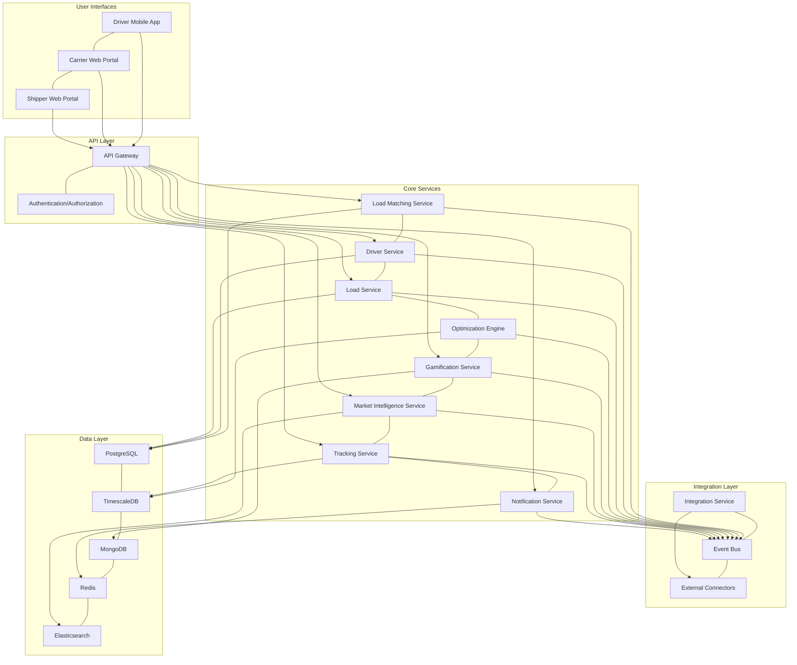
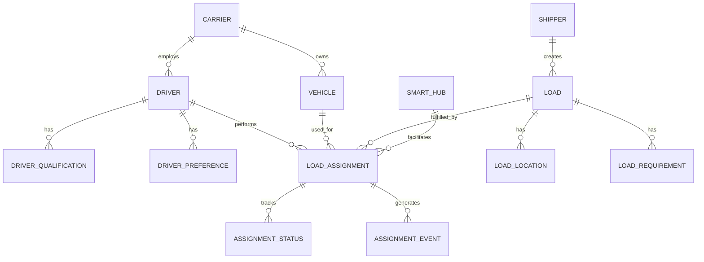
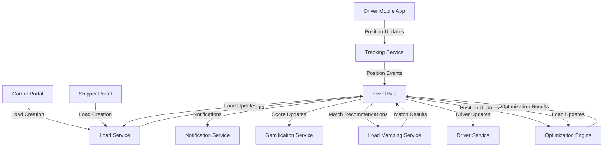
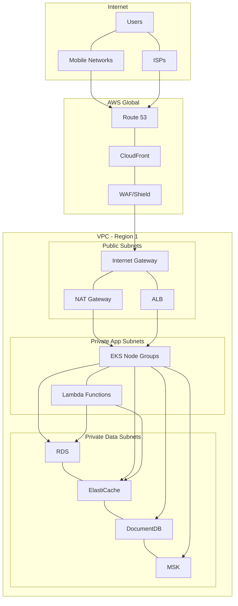
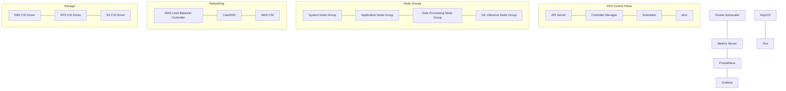
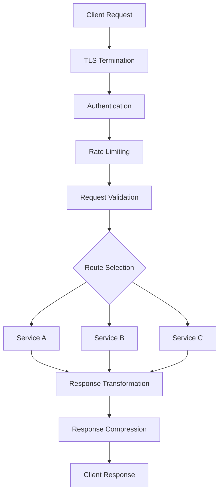
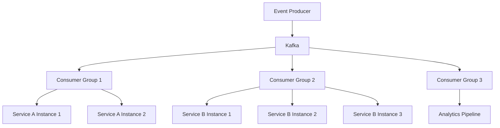
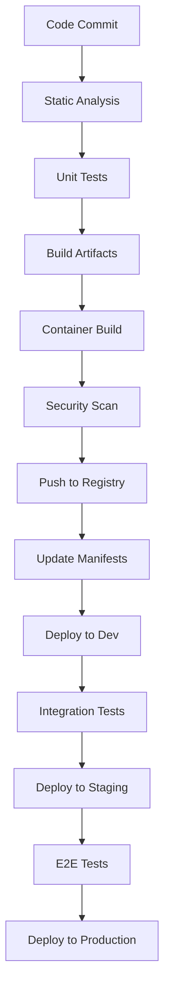
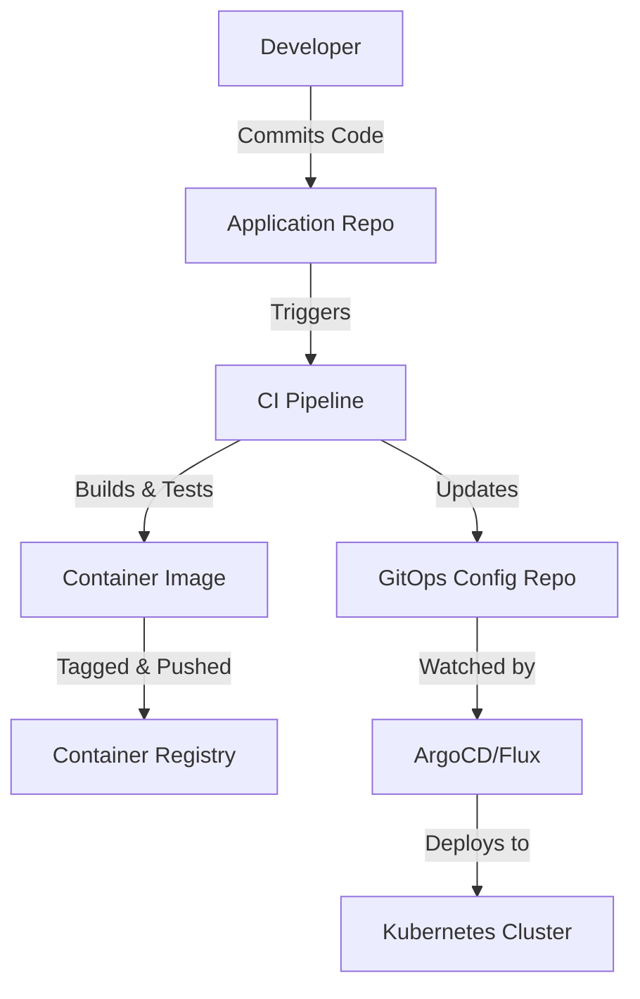

## AI-driven Freight Optimization Platform - Architecture Guide

This document provides comprehensive documentation of the system architecture for the AI-driven Freight Optimization Platform. It covers the overall design approach, component interactions, infrastructure layout, and technical decisions that support the platform's requirements for scalability, resilience, and performance.

## 1. Architecture Overview

The AI-driven Freight Optimization Platform employs a microservices architecture with event-driven communication patterns to enable real-time optimization and coordination across the freight network.

### 1.1 Architectural Style

The platform uses a microservices architecture with the following characteristics:

- **Service Boundaries**: Clear separation of concerns with domain-driven design principles
- **Independent Deployment**: Services can be deployed and scaled independently
- **Polyglot Implementation**: Services use appropriate technologies for their specific requirements
- **Event-Driven Communication**: Asynchronous messaging for loose coupling between services
- **API-First Design**: Well-defined APIs for service interaction and external integration

### 1.2 Key Architectural Principles

- **Scalability**: Horizontal scaling of services to handle varying loads
- **Resilience**: Fault tolerance through redundancy and graceful degradation
- **Observability**: Comprehensive monitoring, logging, and tracing
- **Security**: Defense-in-depth approach with multiple security layers
- **DevOps**: Automated CI/CD pipelines for reliable deployments
- **Cloud-Native**: Leveraging managed services and containerization

### 1.3 High-Level Architecture Diagram



### 1.4 System Context

The platform interacts with various external systems and stakeholders:

- **Drivers**: Access the system through the mobile application
- **Carriers**: Manage fleets through the web portal
- **Shippers**: Submit loads and track shipments through the web portal
- **ELD Providers**: Provide Hours of Service data through integrations
- **TMS Systems**: Exchange load and carrier data through integrations
- **Payment Processors**: Handle financial transactions
- **Mapping Services**: Provide geocoding, routing, and visualization
- **Weather Services**: Provide weather data for route planning

## 2. Core Services Architecture

The platform consists of several core services that work together to provide the freight optimization functionality.

### 2.1 Load Matching Service

- **Purpose**: Matches drivers with loads based on AI predictions, driver preferences, and real-time conditions
- **Technologies**: Python, FastAPI, Redis, Kafka
- **Key Interfaces**:
  - `/api/v1/matches` - Get recommended loads for a driver
  - `/api/v1/matches/accept` - Accept a recommended load
  - `/api/v1/matches/decline` - Decline a recommended load with reason
- **Data Persistence**: Redis for caching recommendations, PostgreSQL for match history
- **Scaling Considerations**: Horizontal scaling with stateless design; partitioning by geographic region

### 2.2 Optimization Engine

- **Purpose**: Executes AI algorithms to optimize the entire freight network, identifying efficient load matches and Smart Hubs
- **Technologies**: Python, TensorFlow, PyTorch, OR-Tools, Celery
- **Key Interfaces**:
  - Internal API for prediction and optimization requests
  - Kafka consumers for network state changes
  - Kafka producers for optimization results
- **Data Persistence**: TimescaleDB for time-series data, MongoDB for model parameters
- **Scaling Considerations**: Vertical scaling for ML workloads; distributed training for model updates

### 2.3 Driver Service

- **Purpose**: Manages driver profiles, preferences, availability, and HOS compliance
- **Technologies**: Node.js, Express, PostgreSQL
- **Key Interfaces**:
  - `/api/v1/drivers` - CRUD operations for driver profiles
  - `/api/v1/drivers/availability` - Update driver availability
  - `/api/v1/drivers/preferences` - Manage driver preferences
  - `/api/v1/drivers/hos` - Hours of service management
- **Data Persistence**: PostgreSQL for profiles, Redis for current status
- **Scaling Considerations**: Horizontal scaling with database sharding by driver ID ranges

### 2.4 Load Service

- **Purpose**: Manages the complete lifecycle of loads from creation to delivery
- **Technologies**: Java, Spring Boot, PostgreSQL
- **Key Interfaces**:
  - `/api/v1/loads` - CRUD operations for loads
  - `/api/v1/loads/status` - Update load status
  - `/api/v1/loads/tracking` - Load tracking information
- **Data Persistence**: PostgreSQL with PostGIS extension for geospatial data
- **Scaling Considerations**: Horizontal scaling with database sharding by geographic region

### 2.5 Gamification Service

- **Purpose**: Implements scoring, rewards, leaderboards, and incentives to encourage network-efficient behavior
- **Technologies**: Node.js, Express, MongoDB, Redis
- **Key Interfaces**:
  - `/api/v1/gamification/scores` - Driver efficiency scores
  - `/api/v1/gamification/rewards` - Available and earned rewards
  - `/api/v1/gamification/leaderboards` - Driver rankings
  - `/api/v1/gamification/bonuses` - Dynamic bonus zones
- **Data Persistence**: MongoDB for flexible reward structures, Redis for leaderboards
- **Scaling Considerations**: Horizontal scaling with eventual consistency model

### 2.6 Tracking Service

- **Purpose**: Monitors and manages real-time position data for trucks and loads
- **Technologies**: Go, MQTT, Redis, TimescaleDB
- **Key Interfaces**:
  - WebSocket API for real-time position updates
  - `/api/v1/tracking/positions` - Current positions
  - `/api/v1/tracking/history` - Historical position data
- **Data Persistence**: Redis for current positions, TimescaleDB for historical data
- **Scaling Considerations**: Horizontal scaling with geospatial partitioning

### 2.7 Market Intelligence Service

- **Purpose**: Analyzes market conditions and adjusts pricing based on supply/demand dynamics
- **Technologies**: Python, FastAPI, Apache Spark, Elasticsearch
- **Key Interfaces**:
  - `/api/v1/market/rates` - Current market rates
  - `/api/v1/market/forecasts` - Demand forecasts
  - `/api/v1/market/hotspots` - High-demand areas
- **Data Persistence**: Elasticsearch for analytics, PostgreSQL for rate history
- **Scaling Considerations**: Vertical scaling for analytics workloads, horizontal scaling for API layer

### 2.8 Notification Service

- **Purpose**: Delivers timely alerts and updates to all system users across multiple channels
- **Technologies**: Node.js, Express, Redis, Kafka
- **Key Interfaces**:
  - Internal API for sending notifications
  - WebSocket API for real-time notifications
  - Integration with push notification services
- **Data Persistence**: Redis for notification queue, MongoDB for notification history
- **Scaling Considerations**: Horizontal scaling with message deduplication

## 3. Data Architecture

The platform uses a polyglot persistence approach with different database technologies for specific use cases.

### 3.1 Database Selection Rationale

| Database | Use Cases | Justification |
|----------|-----------|---------------|
| PostgreSQL | Relational data (loads, drivers, carriers) | ACID compliance, PostGIS for geospatial data |
| TimescaleDB | Time-series data (positions, telemetry) | Optimized for time-series queries, PostgreSQL compatibility |
| MongoDB | Document data (preferences, settings) | Schema flexibility, rich query capabilities |
| Redis | Caching, real-time data, leaderboards | In-memory performance, data structures |
| Elasticsearch | Search, analytics, log aggregation | Full-text search, analytics capabilities |

### 3.2 Data Models

#### 3.2.1 Core Entities



#### 3.2.2 Time-Series Data

- **Driver Positions**: Location, timestamp, speed, heading
- **Telemetry Data**: Vehicle performance metrics over time
- **Market Rates**: Historical rate data by lane and equipment type

#### 3.2.3 Document Data

- **Driver Preferences**: Flexible preference structures
- **Load Requirements**: Varied requirements based on load type
- **User Settings**: Application settings and preferences

### 3.3 Data Flow



### 3.4 Data Storage Patterns

| Pattern | Implementation | Use Cases |
|---------|----------------|----------|
| CQRS | Separate read and write models | Load matching, optimization |
| Event Sourcing | Event streams as source of truth | Load status changes, driver activities |
| Materialized Views | Pre-computed aggregations | Analytics, dashboards |
| Time Partitioning | Data partitioned by time periods | Position history, telemetry data |
| Geospatial Partitioning | Data partitioned by geographic regions | Load data, driver positions |

### 3.5 Data Retention and Archiving

| Data Type | Active Retention | Archive Retention | Storage Tier |
|-----------|------------------|-------------------|-------------|
| Transaction Data | 90 days | 7 years | S3 Standard -> Glacier |
| Position Data | 30 days full, 90 days downsampled | 1 year | S3 Standard |
| Logs and Events | 7 days | 90 days | S3 Standard -> Glacier |
| Analytics Data | 30 days | 1 year | S3 Standard |

## 4. Infrastructure Architecture

The platform is deployed on AWS using a cloud-native approach with containerization and managed services.

### 4.1 AWS Services

| Service | Purpose | Configuration |
|---------|---------|---------------|
| EKS | Container orchestration | 1.28+, managed node groups |
| RDS | Relational databases | PostgreSQL 15+, Multi-AZ |
| DocumentDB | Document database | 5.0+, replica sets |
| ElastiCache | Redis caching | 7.0+, cluster mode |
| MSK | Kafka event streaming | 3.4.0+, multi-AZ |
| S3 | Object storage | Versioning, lifecycle policies |
| CloudFront | Content delivery | Global distribution |
| Route 53 | DNS management | Health checks, failover routing |
| IAM | Access management | Least privilege principle |
| CloudWatch | Monitoring and logging | Custom metrics, log groups |
| ECR | Container registry | Image scanning, versioning |

### 4.2 Network Architecture



### 4.3 Kubernetes Architecture



### 4.4 Container Architecture

| Service | Base Image | Resource Requests | Resource Limits |
|---------|------------|-------------------|----------------|
| API Gateway | nginx:alpine | 500m CPU, 1Gi memory | 1000m CPU, 2Gi memory |
| Load Matching | python:3.11-slim | 500m CPU, 1Gi memory | 1000m CPU, 2Gi memory |
| Optimization Engine | python:3.11-slim | 2000m CPU, 8Gi memory | 4000m CPU, 16Gi memory |
| Driver Service | node:18-alpine | 500m CPU, 1Gi memory | 1000m CPU, 2Gi memory |
| Load Service | eclipse-temurin:17-jre | 1000m CPU, 2Gi memory | 2000m CPU, 4Gi memory |
| Tracking Service | golang:1.21-alpine | 500m CPU, 1Gi memory | 1000m CPU, 2Gi memory |

### 4.5 Multi-Region Strategy

| Component | Primary Region | Secondary Region | Failover Strategy |
|-----------|----------------|------------------|-------------------|
| Frontend | Active | Active | Route 53 health checks |
| API Gateway | Active | Active | Route 53 health checks |
| Microservices | Active | Standby | Manual promotion |
| Databases | Active | Read replicas | Manual promotion |
| Object Storage | Active | Replicated | Automatic |

### 4.6 Disaster Recovery

| Component | Recovery Time Objective | Recovery Point Objective | Recovery Strategy |
|-----------|--------------------------|--------------------------|-------------------|
| Critical Services | 1 hour | 5 minutes | Multi-region deployment |
| Non-critical Services | 4 hours | 15 minutes | Backup restoration |
| Databases | 1 hour | 5 minutes | Read replica promotion |
| Object Storage | Near zero | Near zero | Cross-region replication |

## 5. Communication Patterns

The platform uses various communication patterns for different interaction requirements.

### 5.1 Synchronous Communication

| Pattern | Implementation | Use Cases |
|---------|----------------|----------|
| REST API | HTTP/JSON with OpenAPI | User-initiated actions, CRUD operations |
| GraphQL | Apollo Server/Client | Complex data queries, dashboards |
| gRPC | Protocol Buffers | High-performance internal service communication |

### 5.2 Asynchronous Communication

| Pattern | Implementation | Use Cases |
|---------|----------------|----------|
| Event Streaming | Kafka | State changes, event sourcing |
| Message Queue | RabbitMQ | Task processing, job scheduling |
| Webhooks | HTTP callbacks | External system notifications |

### 5.3 Real-time Communication

| Pattern | Implementation | Use Cases |
|---------|----------------|----------|
| WebSockets | Socket.IO | Real-time updates, position tracking |
| Server-Sent Events | EventSource API | One-way real-time notifications |
| MQTT | HiveMQ/Mosquitto | IoT device communication |

### 5.4 API Gateway



### 5.5 Event Bus



### 5.6 Service Mesh

The platform uses Istio service mesh for advanced traffic management and service-to-service communication:

- **Traffic Management**: Routing, load balancing, circuit breaking
- **Security**: mTLS, authorization policies
- **Observability**: Distributed tracing, metrics collection
- **Resilience**: Retries, timeouts, circuit breakers

## 6. Security Architecture

The platform implements a defense-in-depth security approach to protect data and services.

### 6.1 Authentication and Authorization

| Component | Implementation | Purpose |
|-----------|----------------|---------|
| Identity Management | OAuth 2.0 with OpenID Connect | User authentication and identity verification |
| API Security | JWT tokens with short expiration | Secure API access |
| Role-Based Access Control | Custom RBAC implementation | Permission management based on user roles |
| Service-to-Service Auth | mTLS with service accounts | Secure service-to-service communication |

### 6.2 Network Security

| Layer | Security Controls | Purpose |
|-------|-------------------|---------|
| Edge | WAF, DDoS protection | Protect against common web attacks and DDoS |
| VPC | Security groups, NACLs | Network-level access control |
| Service Mesh | mTLS, authorization policies | Service-to-service communication security |
| Container | Pod security policies | Container-level security controls |

### 6.3 Data Security

| Data State | Protection Mechanism | Implementation |
|------------|----------------------|----------------|
| Data at Rest | Encryption | AWS KMS, EBS encryption, S3 encryption |
| Data in Transit | TLS 1.3 | HTTPS, mTLS |
| Sensitive Data | Field-level encryption | Application-level encryption |

### 6.4 Security Monitoring

| Component | Implementation | Purpose |
|-----------|----------------|---------|
| Audit Logging | CloudTrail, service logs | Record security-relevant events |
| Threat Detection | GuardDuty, Security Hub | Identify potential security threats |
| Vulnerability Management | ECR image scanning, dependency scanning | Identify and remediate vulnerabilities |
| Compliance Monitoring | AWS Config, custom rules | Ensure compliance with security policies |

## 7. DevOps Architecture

The platform uses DevOps practices and tools to automate the software delivery lifecycle.

### 7.1 CI/CD Pipeline



### 7.2 Infrastructure as Code

| Component | Tool | Purpose |
|-----------|------|---------|
| Cloud Infrastructure | Terraform | Provision and manage AWS resources |
| Kubernetes Resources | Kustomize, Helm | Manage Kubernetes configurations |
| CI/CD Pipelines | GitHub Actions | Automate build and deployment workflows |
| Configuration Management | AWS Systems Manager | Manage application configurations |

### 7.3 Monitoring and Observability

| Component | Implementation | Purpose |
|-----------|----------------|---------|
| Metrics Collection | Prometheus, CloudWatch | Collect and store system and application metrics |
| Log Aggregation | Fluent Bit, Elasticsearch | Collect and analyze logs |
| Distributed Tracing | OpenTelemetry, Jaeger | Track requests across services |
| Dashboards | Grafana | Visualize metrics and logs |
| Alerting | Alertmanager, PagerDuty | Notify teams of issues |

### 7.4 GitOps Workflow



## 8. Scalability Architecture

The platform is designed for elastic scalability to handle varying workloads and growth.

### 8.1 Horizontal Scaling

| Component | Scaling Mechanism | Scaling Triggers |
|-----------|------------------|------------------|
| API Gateway | Kubernetes HPA | CPU utilization, request rate |
| Microservices | Kubernetes HPA | CPU utilization, custom metrics |
| Databases | Read replicas | Manual based on monitoring |
| Caching | Redis Cluster | Manual based on monitoring |

### 8.2 Vertical Scaling

| Component | Scaling Mechanism | Scaling Triggers |
|-----------|------------------|------------------|
| Databases | Instance class upgrade | CPU utilization, memory usage, IOPS |
| Optimization Engine | Resource limits adjustment | Job queue length, processing time |
| ML Training | GPU instance allocation | Training workload |

### 8.3 Auto-scaling Configuration

```yaml
apiVersion: autoscaling/v2
kind: HorizontalPodAutoscaler
metadata:
  name: api-gateway
  namespace: freight-platform
spec:
  scaleTargetRef:
    apiVersion: apps/v1
    kind: Deployment
    name: api-gateway
  minReplicas: 3
  maxReplicas: 20
  metrics:
  - type: Resource
    resource:
      name: cpu
      target:
        type: Utilization
        averageUtilization: 70
  - type: Resource
    resource:
      name: memory
      target:
        type: Utilization
        averageUtilization: 80
  behavior:
    scaleUp:
      stabilizationWindowSeconds: 60
      policies:
      - type: Percent
        value: 100
        periodSeconds: 60
    scaleDown:
      stabilizationWindowSeconds: 300
      policies:
      - type: Percent
        value: 25
        periodSeconds: 60