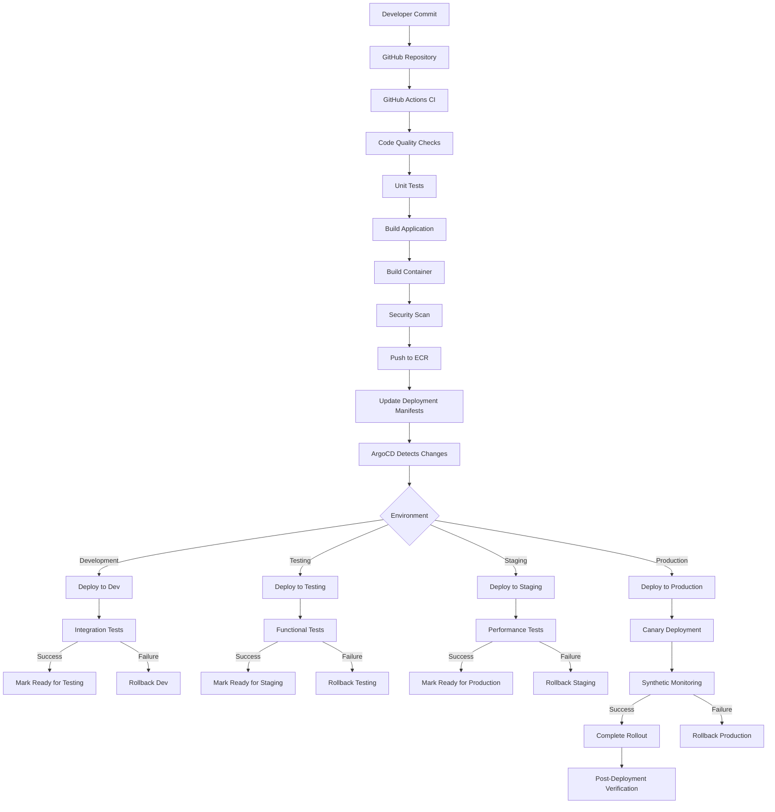
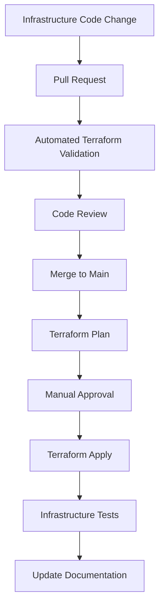
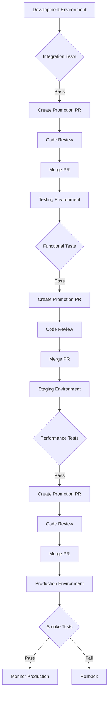
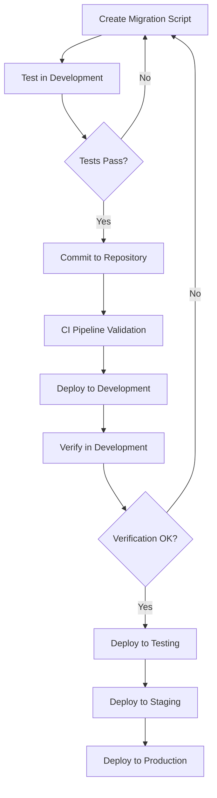

# AI-driven Freight Optimization Platform - Deployment Guide

This document provides comprehensive guidance on deploying the AI-driven Freight Optimization Platform. It covers infrastructure provisioning, CI/CD pipelines, environment management, and operational procedures for reliable and consistent deployments across all environments.

# 1. Deployment Architecture Overview

The deployment architecture for the AI-driven Freight Optimization Platform follows a GitOps approach with infrastructure as code and automated CI/CD pipelines. This section covers the core architectural concepts necessary for deployment.

### 1.1 System Architecture Summary

The platform uses a microservices architecture deployed on Kubernetes with the following key components:

- **API Gateway**: Entry point for all client applications
- **Core Services**: Load Matching, Driver, Load, Optimization Engine, etc.
- **Data Stores**: PostgreSQL, Redis, DocumentDB, TimescaleDB, Kafka
- **Supporting Services**: Authentication, Notification, Tracking, etc.

All services are containerized and deployed to AWS EKS clusters with appropriate auto-scaling configurations.

### 1.2 Deployment Principles

- **Infrastructure as Code**: All infrastructure defined and managed through code
- **GitOps Workflow**: Git as the single source of truth for deployments
- **Continuous Integration**: Automated testing and validation of code changes
- **Continuous Delivery**: Automated deployment to environments with approval gates
- **Immutable Infrastructure**: Immutable deployments with no in-place updates
- **Progressive Delivery**: Controlled rollout with canary deployments

### 1.3 Environment Strategy

| Environment | Purpose | Access Control | Data | Deployment Frequency |
|-------------|---------|----------------|------|---------------------|
| Development | Feature development, integration | Development team | Synthetic | Continuous |
| Testing | QA, integration testing | QA team, Development team | Anonymized | On demand |
| Staging | Pre-production validation | QA team, Operations team | Production clone | After testing approval |
| Production | Live service delivery | Operations team | Real production data | Scheduled releases |

### 1.4 Deployment Workflow



### 1.5 Deployment Technologies

| Component | Technology | Purpose |
|-----------|------------|---------|
| Infrastructure Provisioning | Terraform | Define and provision AWS infrastructure |
| Container Registry | Amazon ECR | Store container images |
| Kubernetes Management | EKS, kubectl, Helm, Kustomize | Manage Kubernetes resources |
| CI/CD Pipeline | GitHub Actions | Automate build and test processes |
| Continuous Delivery | ArgoCD | GitOps-based deployment to Kubernetes |
| Secrets Management | AWS Secrets Manager, Kubernetes Secrets | Secure storage of credentials |
| Configuration Management | ConfigMaps, AWS Parameter Store | Manage application configuration |

# 2. Infrastructure Provisioning

The platform's infrastructure is provisioned using Terraform to ensure consistency and repeatability.

### 2.1 Terraform Structure

```
infrastructure/terraform/
├── modules/                # Reusable Terraform modules
│   ├── eks/                # EKS cluster module
│   ├── rds/                # RDS database module
│   ├── elasticache/        # ElastiCache module
│   ├── documentdb/         # DocumentDB module
│   ├── msk/                # MSK (Kafka) module
│   ├── s3/                 # S3 bucket module
│   ├── vpc/                # VPC network module
│   ├── security/           # Security groups, IAM module
│   └── monitoring/         # Monitoring infrastructure module
├── environments/           # Environment-specific configurations
│   ├── dev/                # Development environment
│   ├── staging/            # Staging environment
│   ├── prod/               # Production environment
│   └── dr/                 # Disaster recovery environment
└── global/                 # Global resources (DNS, etc.)
```

### 2.2 Infrastructure Deployment Process



### 2.3 Core Infrastructure Components

| Component | Terraform Module | Purpose |
|-----------|------------------|---------|
| VPC | vpc | Network isolation and security |
| EKS Cluster | eks | Kubernetes orchestration |
| RDS Databases | rds | Relational data storage |
| ElastiCache | elasticache | Redis caching and pub/sub |
| DocumentDB | documentdb | Document data storage |
| MSK | msk | Kafka event streaming |
| S3 Buckets | s3 | Object storage |
| IAM Roles | security | Access control |
| CloudWatch | monitoring | Logging and monitoring |

### 2.4 Example Terraform Configuration

```hcl
# Example VPC module configuration
module "vpc" {
  source = "../../modules/vpc"

  name = "freight-platform-${var.environment}"
  cidr = "10.0.0.0/16"

  azs             = ["us-west-2a", "us-west-2b", "us-west-2c"]
  private_subnets = ["10.0.1.0/24", "10.0.2.0/24", "10.0.3.0/24"]
  public_subnets  = ["10.0.101.0/24", "10.0.102.0/24", "10.0.103.0/24"]

  enable_nat_gateway = true
  single_nat_gateway = var.environment != "prod"

  tags = {
    Environment = var.environment
    Project     = "freight-platform"
    Terraform   = "true"
  }
}

# Example EKS module configuration
module "eks" {
  source = "../../modules/eks"

  cluster_name    = "freight-platform-${var.environment}"
  cluster_version = "1.28"

  vpc_id     = module.vpc.vpc_id
  subnet_ids = module.vpc.private_subnets

  node_groups = {
    application = {
      desired_capacity = 3
      max_capacity     = 10
      min_capacity     = 3
      instance_types   = ["c6i.2xlarge"]
      disk_size        = 100
    }
    data_processing = {
      desired_capacity = 2
      max_capacity     = 10
      min_capacity     = 2
      instance_types   = ["r6i.2xlarge"]
      disk_size        = 100
    }
  }

  tags = {
    Environment = var.environment
    Project     = "freight-platform"
    Terraform   = "true"
  }
}
```

### 2.5 Infrastructure Deployment Commands

```bash
# Initialize Terraform
cd infrastructure/terraform/environments/dev
terraform init

# Plan changes
terraform plan -out=tfplan

# Apply changes
terraform apply tfplan

# Destroy infrastructure (use with caution)
terraform destroy
```

### 2.6 Infrastructure Scaling Strategies

| Resource | Scaling Approach | Implementation |
|----------|------------------|----------------|
| EKS Nodes | Auto Scaling Groups | Terraform configures node groups with min/max/desired capacities based on environment needs |
| RDS Databases | Vertical Scaling with Read Replicas | Terraform provisions appropriate instance sizes with the ability to modify without downtime |
| ElastiCache | Cluster Mode with Sharding | Automatically distributes data across multiple nodes with the ability to add/remove shards |
| Application Load Balancer | Auto Scaling | Automatically adjusts capacity based on request volume |
| EBS Volumes | Dynamic Provisioning | Auto-expanding volumes configured with appropriate growth thresholds |

The infrastructure is designed to scale both horizontally (adding more instances) and vertically (increasing resources per instance) depending on the component. For production environments, we implement multi-AZ deployments to ensure high availability while development environments may use more cost-effective single-AZ configurations.

# 3. Kubernetes Deployment

The application services are deployed to Kubernetes using a combination of Helm charts and Kustomize manifests.

### 3.1 Kubernetes Resource Structure

```
infrastructure/kubernetes/
├── base/                   # Base Kubernetes manifests
│   ├── api-gateway/        # API Gateway service
│   ├── auth-service/       # Authentication service
│   ├── driver-service/     # Driver service
│   ├── load-service/       # Load service
│   ├── optimization-engine/ # Optimization engine
│   ├── tracking-service/   # Tracking service
│   ├── ingress/            # Ingress configuration
│   ├── monitoring/         # Monitoring stack
│   ├── networking/         # Network policies
│   └── security/           # Security policies
├── overlays/               # Environment-specific overlays
│   ├── dev/                # Development environment
│   ├── staging/            # Staging environment
│   └── prod/               # Production environment
└── charts/                 # Helm charts
    └── freight-platform/   # Umbrella chart for the platform
```

### 3.2 Deployment with Kustomize

Kustomize is used to customize base manifests for different environments:

```yaml
# Base deployment for API Gateway
# infrastructure/kubernetes/base/api-gateway/deployment.yaml
apiVersion: apps/v1
kind: Deployment
metadata:
  name: api-gateway
  namespace: freight-platform
spec:
  replicas: 3
  selector:
    matchLabels:
      app: api-gateway
  template:
    metadata:
      labels:
        app: api-gateway
    spec:
      containers:
      - name: api-gateway
        image: ${ECR_REPOSITORY}/api-gateway:latest
        ports:
        - containerPort: 8080
        resources:
          requests:
            cpu: "500m"
            memory: "1Gi"
          limits:
            cpu: "1000m"
            memory: "2Gi"
        readinessProbe:
          httpGet:
            path: /health
            port: 8080
          initialDelaySeconds: 10
          periodSeconds: 5
```

```yaml
# Production overlay for API Gateway
# infrastructure/kubernetes/overlays/prod/kustomization.yaml
apiVersion: kustomize.config.k8s.io/v1beta1
kind: Kustomization

resources:
- ../../base/api-gateway

namespace: freight-platform

patchesStrategicMerge:
- api-gateway-deployment-patch.yaml

images:
- name: ${ECR_REPOSITORY}/api-gateway
  newTag: ${IMAGE_TAG}
```

```yaml
# Production patch for API Gateway
# infrastructure/kubernetes/overlays/prod/api-gateway-deployment-patch.yaml
apiVersion: apps/v1
kind: Deployment
metadata:
  name: api-gateway
  namespace: freight-platform
spec:
  replicas: 5
  template:
    spec:
      containers:
      - name: api-gateway
        resources:
          requests:
            cpu: "1000m"
            memory: "2Gi"
          limits:
            cpu: "2000m"
            memory: "4Gi"
```

### 3.3 Deployment with Helm

Helm is used for more complex deployments and third-party components:

```yaml
# Umbrella chart values for production
# infrastructure/kubernetes/charts/freight-platform/values-prod.yaml
global:
  environment: production
  domain: api.freight-platform.com

api-gateway:
  replicas: 5
  resources:
    requests:
      cpu: 1000m
      memory: 2Gi
    limits:
      cpu: 2000m
      memory: 4Gi
  autoscaling:
    enabled: true
    minReplicas: 5
    maxReplicas: 20
    targetCPUUtilizationPercentage: 70

load-service:
  replicas: 3
  resources:
    requests:
      cpu: 1000m
      memory: 2Gi
    limits:
      cpu: 2000m
      memory: 4Gi
  autoscaling:
    enabled: true
    minReplicas: 3
    maxReplicas: 10
    targetCPUUtilizationPercentage: 70
```

### 3.4 GitOps with ArgoCD

ArgoCD is used for continuous delivery following the GitOps model:

```yaml
# ArgoCD Application for API Gateway
apiVersion: argoproj.io/v1alpha1
kind: Application
metadata:
  name: api-gateway
  namespace: argocd
spec:
  project: default
  source:
    repoURL: https://github.com/organization/freight-platform-gitops.git
    targetRevision: HEAD
    path: infrastructure/kubernetes/overlays/prod/api-gateway
  destination:
    server: https://kubernetes.default.svc
    namespace: freight-platform
  syncPolicy:
    automated:
      prune: true
      selfHeal: true
    syncOptions:
    - CreateNamespace=true
```

### 3.5 Kubernetes Deployment Commands

```bash
# Apply Kustomize overlay
kubectl apply -k infrastructure/kubernetes/overlays/dev

# Install Helm chart
helm upgrade --install freight-platform ./infrastructure/kubernetes/charts/freight-platform \
  --namespace freight-platform \
  --create-namespace \
  -f ./infrastructure/kubernetes/charts/freight-platform/values-dev.yaml

# Sync ArgoCD application
argocd app sync api-gateway
```

### 3.6 Kubernetes Scaling Strategies

#### Horizontal Pod Autoscaling (HPA)

Services are configured with HPA to automatically scale based on metrics:

```yaml
apiVersion: autoscaling/v2
kind: HorizontalPodAutoscaler
metadata:
  name: api-gateway
  namespace: freight-platform
spec:
  scaleTargetRef:
    apiVersion: apps/v1
    kind: Deployment
    name: api-gateway
  minReplicas: 3
  maxReplicas: 20
  metrics:
  - type: Resource
    resource:
      name: cpu
      target:
        type: Utilization
        averageUtilization: 70
  - type: Resource
    resource:
      name: memory
      target:
        type: Utilization
        averageUtilization: 80
  behavior:
    scaleUp:
      stabilizationWindowSeconds: 60
      policies:
      - type: Percent
        value: 100
        periodSeconds: 60
    scaleDown:
      stabilizationWindowSeconds: 300
      policies:
      - type: Percent
        value: 25
        periodSeconds: 60
```

#### Vertical Pod Autoscaling (VPA)

For services with less predictable resource usage, VPA is implemented to adjust resource requests:

```yaml
apiVersion: autoscaling.k8s.io/v1
kind: VerticalPodAutoscaler
metadata:
  name: optimization-engine
  namespace: freight-platform
spec:
  targetRef:
    apiVersion: apps/v1
    kind: Deployment
    name: optimization-engine
  updatePolicy:
    updateMode: Auto
  resourcePolicy:
    containerPolicies:
    - containerName: "*"
      minAllowed:
        cpu: 500m
        memory: 1Gi
      maxAllowed:
        cpu: 4
        memory: 8Gi
      controlledResources: ["cpu", "memory"]
```

#### Cluster Autoscaling

The EKS cluster is configured with Cluster Autoscaler to automatically adjust the number of nodes based on pod scheduling requirements:

```yaml
apiVersion: apps/v1
kind: Deployment
metadata:
  name: cluster-autoscaler
  namespace: kube-system
spec:
  replicas: 1
  selector:
    matchLabels:
      app: cluster-autoscaler
  template:
    metadata:
      labels:
        app: cluster-autoscaler
    spec:
      containers:
      - image: k8s.gcr.io/autoscaling/cluster-autoscaler:v1.22.2
        name: cluster-autoscaler
        command:
        - ./cluster-autoscaler
        - --v=4
        - --stderrthreshold=info
        - --cloud-provider=aws
        - --skip-nodes-with-local-storage=false
        - --expander=least-waste
        - --node-group-auto-discovery=asg:tag=k8s.io/cluster-autoscaler/enabled,k8s.io/cluster-autoscaler/freight-platform-prod
```

This multi-layered scaling approach ensures that the platform can efficiently handle varying workloads while maintaining performance and controlling costs.

# 4. CI/CD Pipeline

The platform uses GitHub Actions for continuous integration and ArgoCD for continuous delivery.

### 4.1 CI Pipeline with GitHub Actions

```yaml
# Backend CI workflow
# .github/workflows/backend-ci.yml
name: Backend CI

on:
  push:
    branches: [ main, develop ]
    paths:
      - 'src/backend/**'
  pull_request:
    branches: [ main, develop ]
    paths:
      - 'src/backend/**'

jobs:
  build:
    runs-on: ubuntu-latest
    strategy:
      matrix:
        service: [api-gateway, auth-service, driver-service, load-service, optimization-engine, tracking-service]
    
    steps:
    - uses: actions/checkout@v3
    
    - name: Set up Python
      uses: actions/setup-python@v4
      with:
        python-version: '3.11'
    
    - name: Install dependencies
      run: |
        cd src/backend/${{ matrix.service }}
        python -m pip install --upgrade pip
        pip install -r requirements.txt
        pip install pytest pytest-cov flake8
    
    - name: Lint with flake8
      run: |
        cd src/backend/${{ matrix.service }}
        flake8 . --count --select=E9,F63,F7,F82 --show-source --statistics
    
    - name: Test with pytest
      run: |
        cd src/backend/${{ matrix.service }}
        pytest --cov=. --cov-report=xml
    
    - name: Upload coverage to Codecov
      uses: codecov/codecov-action@v3
      with:
        file: ./src/backend/${{ matrix.service }}/coverage.xml
        flags: backend,${{ matrix.service }}
    
    - name: Build Docker image
      run: |
        cd src/backend/${{ matrix.service }}
        docker build -t ${{ matrix.service }}:${{ github.sha }} .
    
    - name: Run Trivy vulnerability scanner
      uses: aquasecurity/trivy-action@master
      with:
        image-ref: ${{ matrix.service }}:${{ github.sha }}
        format: 'sarif'
        output: 'trivy-results.sarif'
    
    - name: Upload Trivy scan results
      uses: github/codeql-action/upload-sarif@v2
      with:
        sarif_file: 'trivy-results.sarif'
```

### 4.2 CD Pipeline with GitHub Actions and ArgoCD

```yaml
# Backend CD workflow
# .github/workflows/backend-cd.yml
name: Backend CD

on:
  workflow_run:
    workflows: ["Backend CI"]
    branches: [main]
    types: [completed]

jobs:
  deploy-dev:
    if: ${{ github.event.workflow_run.conclusion == 'success' }}
    runs-on: ubuntu-latest
    strategy:
      matrix:
        service: [api-gateway, auth-service, driver-service, load-service, optimization-engine, tracking-service]
    
    steps:
    - uses: actions/checkout@v3
    
    - name: Configure AWS credentials
      uses: aws-actions/configure-aws-credentials@v2
      with:
        aws-access-key-id: ${{ secrets.AWS_ACCESS_KEY_ID }}
        aws-secret-access-key: ${{ secrets.AWS_SECRET_ACCESS_KEY }}
        aws-region: us-west-2
    
    - name: Login to Amazon ECR
      id: login-ecr
      uses: aws-actions/amazon-ecr-login@v1
    
    - name: Build and push Docker image
      env:
        ECR_REGISTRY: ${{ steps.login-ecr.outputs.registry }}
        ECR_REPOSITORY: freight-platform/${{ matrix.service }}
        IMAGE_TAG: ${{ github.sha }}
      run: |
        cd src/backend/${{ matrix.service }}
        docker build -t $ECR_REGISTRY/$ECR_REPOSITORY:$IMAGE_TAG .
        docker push $ECR_REGISTRY/$ECR_REPOSITORY:$IMAGE_TAG
    
    - name: Update Kubernetes manifests
      run: |
        cd infrastructure/kubernetes/overlays/dev
        kustomize edit set image $ECR_REGISTRY/freight-platform/${{ matrix.service }}:${{ github.sha }}
    
    - name: Commit and push updated manifests
      run: |
        git config --global user.name 'GitHub Actions'
        git config --global user.email 'actions@github.com'
        git add infrastructure/kubernetes/overlays/dev
        git commit -m "Update ${{ matrix.service }} image to ${{ github.sha }}"
        git push
```

### 4.3 Environment Promotion Workflow



### 4.4 Promotion Process

```bash
# Promote from dev to testing
cd infrastructure/kubernetes/overlays/testing

# Update image tags to match dev
kustomize edit set image ${ECR_REGISTRY}/freight-platform/api-gateway:${DEV_IMAGE_TAG}
kustomize edit set image ${ECR_REGISTRY}/freight-platform/auth-service:${DEV_IMAGE_TAG}
# ... repeat for other services

# Commit and push changes
git add .
git commit -m "Promote services from dev to testing"
git push

# ArgoCD will automatically sync the changes
```

### 4.5 Rollback Process

```bash
# Rollback to previous version
cd infrastructure/kubernetes/overlays/prod

# Update image tags to previous version
kustomize edit set image ${ECR_REGISTRY}/freight-platform/api-gateway:${PREVIOUS_IMAGE_TAG}

# Commit and push changes
git add .
git commit -m "Rollback api-gateway to ${PREVIOUS_IMAGE_TAG}"
git push

# ArgoCD will automatically sync the rollback
```

# 5. Configuration Management

The platform uses a combination of Kubernetes ConfigMaps, Secrets, and AWS Parameter Store for configuration management.

### 5.1 Configuration Strategy

| Configuration Type | Storage Method | Access Pattern | Update Process |
|-------------------|---------------|----------------|----------------|
| Application Config | ConfigMaps | Environment variables | GitOps workflow |
| Sensitive Data | Kubernetes Secrets | Environment variables | Sealed Secrets in Git |
| Shared Secrets | AWS Secrets Manager | SDK retrieval | AWS console or API |
| Feature Flags | AWS AppConfig | SDK retrieval | AWS console or API |

### 5.2 ConfigMap Example

```yaml
apiVersion: v1
kind: ConfigMap
metadata:
  name: api-gateway-config
  namespace: freight-platform
data:
  API_TIMEOUT: "30"
  LOG_LEVEL: "info"
  CACHE_TTL: "300"
  RATE_LIMIT_REQUESTS: "100"
  RATE_LIMIT_PERIOD: "60"
```

### 5.3 Secret Management

```yaml
# Sealed Secret (encrypted version stored in Git)
apiVersion: bitnami.com/v1alpha1
kind: SealedSecret
metadata:
  name: api-gateway-secrets
  namespace: freight-platform
spec:
  encryptedData:
    DB_PASSWORD: AgBy8hCM8CDyQxNtwP...truncated
    API_KEY: AgCTaCoS0ygj5VAkNP...truncated
```

### 5.4 Environment-specific Configuration

```yaml
# Development environment ConfigMap patch
apiVersion: v1
kind: ConfigMap
metadata:
  name: api-gateway-config
  namespace: freight-platform
data:
  LOG_LEVEL: "debug"
  CACHE_TTL: "60"
```

### 5.5 Configuration Injection

```yaml
apiVersion: apps/v1
kind: Deployment
metadata:
  name: api-gateway
  namespace: freight-platform
spec:
  template:
    spec:
      containers:
      - name: api-gateway
        envFrom:
        - configMapRef:
            name: api-gateway-config
        - secretRef:
            name: api-gateway-secrets
        env:
        - name: AWS_REGION
          value: us-west-2
        - name: POD_NAME
          valueFrom:
            fieldRef:
              fieldPath: metadata.name
```

### 5.6 Feature Flag Management

```yaml
# AWS AppConfig setup with Terraform
resource "aws_appconfig_application" "freight_platform" {
  name        = "freight-platform"
  description = "Feature flags for Freight Platform"
}

resource "aws_appconfig_environment" "production" {
  name           = "production"
  application_id = aws_appconfig_application.freight_platform.id
  description    = "Production environment"
}

resource "aws_appconfig_configuration_profile" "feature_flags" {
  application_id = aws_appconfig_application.freight_platform.id
  name           = "feature-flags"
  location_uri   = "hosted"
  type           = "AWS.AppConfig.FeatureFlags"
}
```

# 6. Database Migrations

Database migrations are managed using a combination of schema migration tools and deployment procedures.

### 6.1 Migration Strategy

| Database | Migration Tool | Versioning | Rollback Support |
|----------|---------------|------------|------------------|
| PostgreSQL | Flyway | Sequential versioning | Yes, with undo scripts |
| MongoDB | Custom scripts | Semantic versioning | Limited |
| Redis | N/A (schema-less) | N/A | N/A |

### 6.2 PostgreSQL Migrations with Flyway

```sql
-- V1__initial_schema.sql
CREATE TABLE carriers (
  carrier_id UUID PRIMARY KEY,
  name VARCHAR(255) NOT NULL,
  dot_number VARCHAR(50) UNIQUE,
  mc_number VARCHAR(50) UNIQUE,
  tax_id VARCHAR(50),
  address JSONB,
  contact_info JSONB,
  created_at TIMESTAMP WITH TIME ZONE DEFAULT NOW(),
  updated_at TIMESTAMP WITH TIME ZONE DEFAULT NOW(),
  active BOOLEAN DEFAULT TRUE
);

CREATE TABLE drivers (
  driver_id UUID PRIMARY KEY,
  carrier_id UUID REFERENCES carriers(carrier_id),
  first_name VARCHAR(100) NOT NULL,
  last_name VARCHAR(100) NOT NULL,
  email VARCHAR(255) UNIQUE,
  phone VARCHAR(50) UNIQUE,
  license_number VARCHAR(50),
  license_state VARCHAR(2),
  license_expiration DATE,
  status VARCHAR(50),
  preferences JSONB,
  created_at TIMESTAMP WITH TIME ZONE DEFAULT NOW(),
  updated_at TIMESTAMP WITH TIME ZONE DEFAULT NOW(),
  active BOOLEAN DEFAULT TRUE
);
```

### 6.3 Migration Job

```yaml
apiVersion: batch/v1
kind: Job
metadata:
  name: db-migration-v1
  namespace: freight-platform
spec:
  template:
    spec:
      containers:
      - name: flyway
        image: flyway/flyway:9.20
        args:
        - migrate
        env:
        - name: FLYWAY_URL
          valueFrom:
            secretKeyRef:
              name: db-credentials
              key: jdbc_url
        - name: FLYWAY_USER
          valueFrom:
            secretKeyRef:
              name: db-credentials
              key: username
        - name: FLYWAY_PASSWORD
          valueFrom:
            secretKeyRef:
              name: db-credentials
              key: password
        volumeMounts:
        - name: migrations
          mountPath: /flyway/sql
      volumes:
      - name: migrations
        configMap:
          name: db-migrations
      restartPolicy: Never
  backoffLimit: 3
```

### 6.4 Migration Workflow



### 6.5 Rollback Procedure

```sql
-- U1__undo_initial_schema.sql
DROP TABLE IF EXISTS drivers;
DROP TABLE IF EXISTS carriers;
```

```bash
# Rollback to specific version
flyway undo -target=1
```

# 7. Deployment Procedures

Detailed procedures for common deployment scenarios.

### 7.1 Initial Deployment

1. **Provision Infrastructure**
   ```bash
   cd infrastructure/terraform/environments/dev
   terraform init
   terraform apply
   ```

2. **Configure Kubernetes**
   ```bash
   aws eks update-kubeconfig --name freight-platform-dev --region us-west-2
   ```

3. **Install ArgoCD**
   ```bash
   kubectl create namespace argocd
   kubectl apply -n argocd -f https://raw.githubusercontent.com/argoproj/argo-cd/stable/manifests/install.yaml
   ```

4. **Deploy Core Services**
   ```bash
   kubectl apply -k infrastructure/kubernetes/overlays/dev
   ```

5. **Run Database Migrations**
   ```bash
   kubectl apply -f infrastructure/kubernetes/jobs/db-migration-v1.yaml
   ```

6. **Verify Deployment**
   ```bash
   kubectl get pods -n freight-platform
   kubectl get svc -n freight-platform
   ```

### 7.2 Service Update Deployment

1. **Build and Push New Image**
   ```bash
   cd src/backend/api-gateway
   docker build -t ${ECR_REGISTRY}/freight-platform/api-gateway:${VERSION} .
   docker push ${ECR_REGISTRY}/freight-platform/api-gateway:${VERSION}
   ```

2. **Update Kubernetes Manifests**
   ```bash
   cd infrastructure/kubernetes/overlays/dev
   kustomize edit set image ${ECR_REGISTRY}/freight-platform/api-gateway:${VERSION}
   git add .
   git commit -m "Update api-gateway to ${VERSION}"
   git push
   ```

3. **Verify Deployment**
   ```bash
   kubectl get pods -n freight-platform -l app=api-gateway
   kubectl rollout status deployment/api-gateway -n freight-platform
   ```

### 7.3 Configuration Update Deployment

1. **Update ConfigMap**
   ```bash
   cd infrastructure/kubernetes/overlays/dev
   # Edit the ConfigMap file
   vi api-gateway/configmap.yaml
   
   # Commit and push changes
   git add .
   git commit -m "Update api-gateway configuration"
   git push
   ```

2. **Verify Configuration Update**
   ```bash
   kubectl get configmap api-gateway-config -n freight-platform -o yaml
   ```

3. **Restart Deployment to Apply Changes**
   ```bash
   kubectl rollout restart deployment/api-gateway -n freight-platform
   ```

### 7.4 Rollback Procedure

1. **Identify Previous Version**
   ```bash
   kubectl describe deployment api-gateway -n freight-platform
   # Note the previous image tag
   ```

2. **Update Kubernetes Manifests to Previous Version**
   ```bash
   cd infrastructure/kubernetes/overlays/dev
   kustomize edit set image ${ECR_REGISTRY}/freight-platform/api-gateway:${PREVIOUS_VERSION}
   git add .
   git commit -m "Rollback api-gateway to ${PREVIOUS_VERSION}"
   git push
   ```

3. **Verify Rollback**
   ```bash
   kubectl rollout status deployment/api-gateway -n freight-platform
   ```

### 7.5 Blue-Green Deployment

1. **Deploy Green Version**