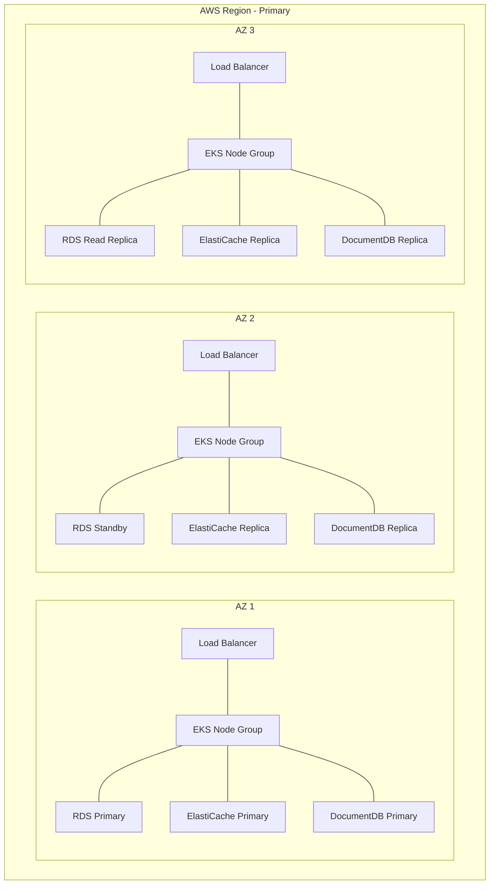
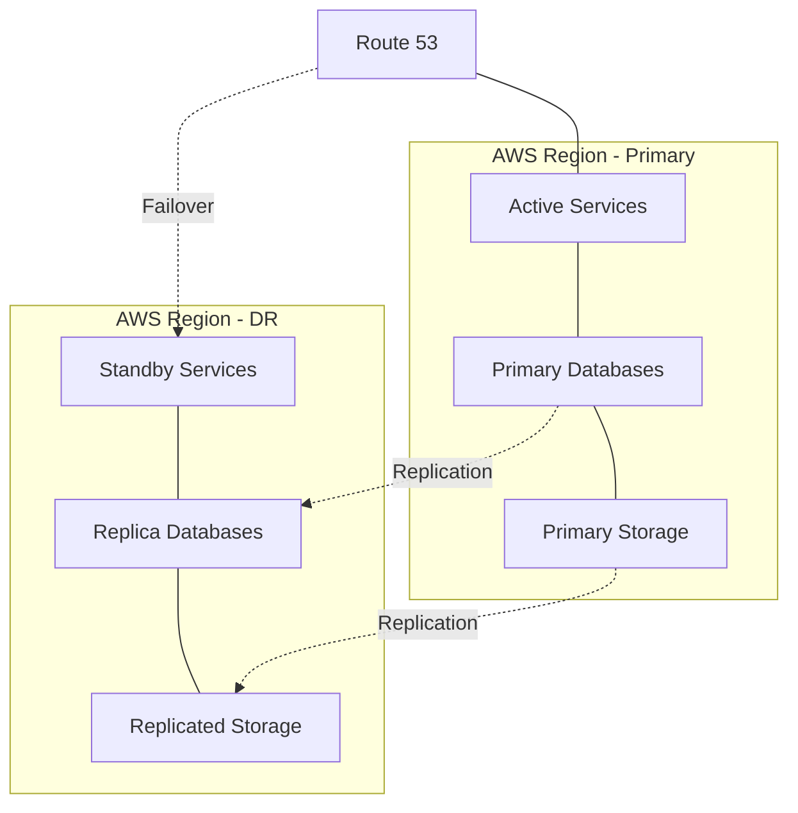
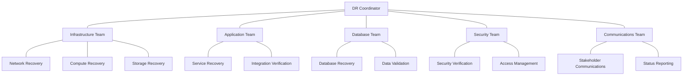

This document outlines the disaster recovery strategy, procedures, and implementation for the AI-driven Freight Optimization Platform. It provides comprehensive guidance for ensuring business continuity and data protection in case of system failures or disasters.

## 1. Disaster Recovery Strategy

The disaster recovery strategy for the AI-driven Freight Optimization Platform is designed to ensure business continuity and minimize data loss in the event of system failures or disasters.

### 1.1 Recovery Objectives

| Component | Recovery Time Objective (RTO) | Recovery Point Objective (RPO) | Criticality |
|-----------|-------------------------------|-------------------------------|------------|
| Critical Services | 1 hour | 5 minutes | High |
| Non-critical Services | 4 hours | 15 minutes | Medium |
| Databases | 1 hour | 5 minutes | High |
| Object Storage | Near zero | Near zero | High |
| ML Models | 2 hours | Last training cycle | Medium |

### 1.2 Disaster Recovery Approach

The platform employs a multi-layered disaster recovery approach:

- **High Availability**: Multi-AZ deployment for resilience against single-AZ failures
- **Warm Standby**: Secondary region with replicated data and standby services
- **Backup and Restore**: Regular backups with tested restoration procedures
- **Automated Recovery**: Automated procedures for common failure scenarios
- **Manual Procedures**: Documented procedures for complex recovery scenarios

### 1.3 Disaster Scenarios

The disaster recovery plan addresses the following scenarios:

| Scenario | Description | Recovery Approach |
|----------|-------------|-------------------|
| Single AZ Failure | Failure of a single availability zone | Automatic failover to other AZs |
| Region Failure | Complete failure of the primary AWS region | Manual failover to secondary region |
| Database Corruption | Corruption of database data | Point-in-time recovery from backups |
| Application Failure | Critical application component failure | Automated rollback or failover |
| Infrastructure Failure | Failure of underlying infrastructure | Automated recreation from IaC |
| Security Incident | Security breach requiring isolation | Containment and clean recovery |
| Data Loss | Accidental or malicious data deletion | Restoration from backups |

### 1.4 Recovery Priorities

In the event of a major disaster requiring prioritized recovery, the following order will be followed:

1. **Core Infrastructure**: VPC, networking, security components
2. **Data Tier**: Databases and data storage systems
3. **Critical Services**: Load matching, driver service, load service
4. **Supporting Services**: Optimization engine, tracking service
5. **Auxiliary Services**: Analytics, reporting, non-critical features

## 2. High Availability Architecture

The platform is designed with high availability as the first line of defense against failures.

### 2.1 Multi-AZ Architecture

The primary region deployment spans multiple availability zones for resilience:



### 2.2 Component-level High Availability

| Component | High Availability Approach | Failover Mechanism |
|-----------|----------------------------|-------------------|
| Load Balancers | Multiple ALBs across AZs | Automatic DNS failover |
| EKS Control Plane | AWS-managed multi-AZ | Automatic failover |
| EKS Worker Nodes | Node groups across AZs | Kubernetes rescheduling |
| RDS Databases | Multi-AZ deployment | Automatic failover |
| ElastiCache | Multi-AZ with automatic failover | Automatic promotion |
| DocumentDB | Replica sets across AZs | Automatic election |
| S3 | AWS-managed redundancy | Built-in redundancy |
| EFS | Multi-AZ deployment | Transparent failover |

### 2.3 Kubernetes High Availability

Kubernetes workloads are configured for high availability:

```yaml
apiVersion: apps/v1
kind: Deployment
metadata:
  name: example-service
spec:
  replicas: 3
  strategy:
    type: RollingUpdate
    rollingUpdate:
      maxSurge: 1
      maxUnavailable: 0
  selector:
    matchLabels:
      app: example-service
  template:
    metadata:
      labels:
        app: example-service
    spec:
      affinity:
        podAntiAffinity:
          preferredDuringSchedulingIgnoredDuringExecution:
          - weight: 100
            podAffinityTerm:
              labelSelector:
                matchExpressions:
                - key: app
                  operator: In
                  values:
                  - example-service
              topologyKey: "topology.kubernetes.io/zone"
      containers:
      - name: example-service
        image: example-service:latest
        resources:
          requests:
            memory: "256Mi"
            cpu: "100m"
          limits:
            memory: "512Mi"
            cpu: "200m"
        readinessProbe:
          httpGet:
            path: /health
            port: 8080
          initialDelaySeconds: 5
          periodSeconds: 10
        livenessProbe:
          httpGet:
            path: /health
            port: 8080
          initialDelaySeconds: 15
          periodSeconds: 20
```

### 2.4 Database High Availability

Database systems are configured for high availability and automatic failover:

- **RDS PostgreSQL**: Multi-AZ deployment with synchronous replication
- **ElastiCache Redis**: Multi-AZ with automatic failover
- **DocumentDB**: Replica sets with automatic failover
- **Amazon MSK**: Multi-AZ Kafka deployment

### 2.5 Network High Availability

Network components are designed for high availability:

- **VPC**: Spans multiple AZs
- **Subnets**: Redundant subnets in each AZ
- **NAT Gateways**: One per AZ
- **Route Tables**: Configured for failover
- **Internet Gateways**: Highly available by design

## 3. Multi-Region Disaster Recovery

For resilience against region-wide failures, the platform implements a multi-region disaster recovery strategy.

### 3.1 Secondary Region Architecture

The secondary (DR) region maintains a warm standby environment:



### 3.2 Data Replication

| Data Type | Replication Method | Frequency | Consistency Model |
|-----------|-------------------|-----------|-------------------|
| RDS PostgreSQL | Logical Replication | Continuous | Eventually Consistent |
| ElastiCache | Cross-Region Replication | Continuous | Eventually Consistent |
| DocumentDB | Manual Snapshots | Daily | Point-in-Time |
| S3 | Cross-Region Replication | Continuous | Eventually Consistent |
| EFS | AWS Backup | Daily | Point-in-Time |
| Kubernetes State | Velero Backups | Hourly | Point-in-Time |

### 3.3 Regional Failover Process

The process for failing over to the secondary region involves the following steps:

1. **Decision to Failover**:
   - Confirm primary region failure or issue
   - Assess impact and necessity of failover
   - Obtain authorization from designated approvers

2. **Pre-Failover Checks**:
   - Verify DR region readiness
   - Confirm data replication status
   - Validate latest backup integrity

3. **Database Failover**:
   - Promote read replicas to primary in DR region
   - Verify database integrity and accessibility
   - Update connection strings if necessary

4. **Application Failover**:
   - Scale up standby services in DR region
   - Verify application health and functionality
   - Update service discovery if necessary

5. **DNS Failover**:
   - Update Route 53 health checks
   - Initiate DNS failover to DR region endpoints
   - Verify DNS propagation

6. **Post-Failover Verification**:
   - Verify end-to-end functionality
   - Confirm data integrity
   - Validate external integrations

7. **Communication**:
   - Notify stakeholders of failover completion
   - Provide status updates and expected impact
   - Establish communication plan for updates

### 3.4 Regional Failback Process

Once the primary region is restored, the following process is used to fail back:

1. **Primary Region Restoration**:
   - Verify primary region availability
   - Restore infrastructure if necessary
   - Validate environment readiness

2. **Data Synchronization**:
   - Establish reverse replication from DR to primary
   - Synchronize data changes made during failover
   - Validate data consistency

3. **Application Preparation**:
   - Deploy and scale application services in primary region
   - Verify application health and functionality
   - Prepare for traffic transition

4. **Gradual Transition**:
   - Implement canary routing to primary region
   - Gradually increase traffic to primary region
   - Monitor for issues during transition

5. **Complete Failback**:
   - Complete DNS failback to primary region
   - Verify all traffic is routed to primary region
   - Confirm system stability

6. **DR Region Reset**:
   - Scale down active services in DR region
   - Reset to standby configuration
   - Re-establish normal replication patterns

### 3.5 Regional Failover Testing

Regular testing of the regional failover process is conducted to ensure readiness:

- **Scheduled Tests**: Quarterly planned failover exercises
- **Scenario-Based Tests**: Simulated disaster scenarios
- **Component Tests**: Individual component failover testing
- **Full DR Tests**: Annual full DR failover exercise

## 4. Backup and Restore Strategy

Comprehensive backup and restore procedures ensure data can be recovered in case of data loss or corruption.

### 4.1 Backup Strategy

| Component | Backup Method | Frequency | Retention | Storage |
|-----------|--------------|-----------|-----------|---------|
| RDS PostgreSQL | Automated Snapshots | Daily | 30 days | AWS Managed |
| RDS PostgreSQL | Transaction Logs | Continuous | 7 days | AWS Managed |
| ElastiCache | Manual Snapshots | Daily | 7 days | AWS Managed |
| DocumentDB | Automated Snapshots | Daily | 30 days | AWS Managed |
| DocumentDB | Transaction Logs | Continuous | 7 days | AWS Managed |
| S3 Data | Versioning | Continuous | 90 days | S3 |
| S3 Data | Cross-Region Replication | Continuous | Same as source | S3 |
| EFS | AWS Backup | Daily | 30 days | AWS Backup |
| Kubernetes State | Velero | Daily | 30 days | S3 |
| Application Configs | Git Repository | Every change | Indefinite | Git + S3 |
| Infrastructure Code | Git Repository | Every change | Indefinite | Git + S3 |
| ML Models | S3 Versioning | Every training | 90 days | S3 |

### 4.2 Backup Implementation

Backups are implemented using a combination of AWS native services and custom scripts:

- **RDS and DocumentDB**: AWS automated backups with point-in-time recovery
- **ElastiCache**: Scheduled snapshots via AWS Backup
- **S3**: Bucket versioning and replication
- **Kubernetes**: Velero scheduled backups
- **Custom Data**: Application-specific export jobs

Example backup script for custom data:

```bash
#!/bin/bash
# Example backup script for custom data

DATE=$(date +%Y-%m-%d-%H%M)
BACKUP_DIR="s3://freight-platform-backups/custom-data/$DATE"

# Export data from application
kubectl exec -n freight-platform deployment/data-service -- /app/scripts/export-data.sh > /tmp/data-export.json

# Upload to S3 with encryption
aws s3 cp /tmp/data-export.json $BACKUP_DIR/data-export.json --sse AES256

# Cleanup
rm /tmp/data-export.json

# Log backup completion
echo "Custom data backup completed at $DATE" | aws sns publish --topic-arn arn:aws:sns:us-west-2:123456789012:backup-notifications --message file://-
```

### 4.3 Restore Procedures

#### 4.3.1 RDS Database Restore

1. **Point-in-Time Recovery**:
   ```bash
   aws rds restore-db-instance-to-point-in-time \
     --source-db-instance-identifier freight-production-db \
     --target-db-instance-identifier freight-recovery-db \
     --restore-time "2023-09-25T04:00:00Z" \
     --db-instance-class db.r6g.2xlarge \
     --multi-az
   ```

2. **Snapshot Restore**:
   ```bash
   aws rds restore-db-instance-from-db-snapshot \
     --db-instance-identifier freight-recovery-db \
     --db-snapshot-identifier rds:freight-production-db-2023-09-25-00-00 \
     --db-instance-class db.r6g.2xlarge \
     --multi-az
   ```

#### 4.3.2 DocumentDB Restore

1. **Point-in-Time Recovery**:
   ```bash
   aws docdb restore-db-cluster-to-point-in-time \
     --db-cluster-identifier freight-recovery-docdb \
     --source-db-cluster-identifier freight-production-docdb \
     --restore-to-time "2023-09-25T04:00:00Z"
   ```

2. **Create Instances for Restored Cluster**:
   ```bash
   aws docdb create-db-instance \
     --db-instance-identifier freight-recovery-docdb-instance \
     --db-instance-class db.r5.large \
     --engine docdb \
     --db-cluster-identifier freight-recovery-docdb
   ```

#### 4.3.3 Kubernetes State Restore

1. **Velero Restore**:
   ```bash
   velero restore create --from-backup freight-daily-20230925 \
     --include-namespaces freight-platform \
     --exclude-resources secrets,configmaps \
     --wait
   ```

2. **Selective Resource Restore**:
   ```bash
   velero restore create --from-backup freight-daily-20230925 \
     --include-namespaces freight-platform \
     --include-resources deployments,statefulsets \
     --selector app=load-service \
     --wait
   ```

#### 4.3.4 S3 Data Restore

1. **Version Restore**:
   ```bash
   aws s3api list-object-versions \
     --bucket freight-platform-data \
     --prefix data/customer-records.json \
     --query 'Versions[?LastModified>=`2023-09-24` && LastModified<=`2023-09-25`]'
   
   aws s3api get-object \
     --bucket freight-platform-data \
     --key data/customer-records.json \
     --version-id "v1234567890abcdef0" \
     customer-records-restored.json
   ```

2. **Cross-Region Recovery**:
   ```bash
   aws s3 sync \
     s3://freight-platform-data-dr/data/ \
     s3://freight-platform-data/data/ \
     --source-region us-east-1 \
     --region us-west-2
   ```

### 4.4 Backup Monitoring and Validation

Backups are monitored and validated to ensure recoverability:

- **Backup Success Monitoring**: CloudWatch alarms for failed backups
- **Backup Completion Notifications**: SNS notifications for backup jobs
- **Automated Restore Testing**: Weekly automated restore tests
- **Backup Size Monitoring**: Tracking of backup size trends
- **Retention Compliance**: Verification of retention policy compliance

## 5. Disaster Recovery for Specific Components

This section details disaster recovery procedures for specific platform components.

### 5.1 Database Disaster Recovery

#### 5.1.1 PostgreSQL (RDS)

| Failure Scenario | Recovery Procedure | RTO | RPO |
|------------------|-------------------|-----|-----|
| Primary Instance Failure | Automatic failover to standby | 1-2 minutes | 0 (synchronous replication) |
| AZ Failure | Automatic failover to standby in different AZ | 1-2 minutes | 0 (synchronous replication) |
| Region Failure | Promote cross-region read replica | 15-30 minutes | 5-15 minutes (asynchronous replication) |
| Data Corruption | Point-in-time recovery | 30-60 minutes | Depends on detection time |
| Accidental Deletion | Point-in-time recovery | 30-60 minutes | Depends on detection time |

#### 5.1.2 MongoDB (DocumentDB)

| Failure Scenario | Recovery Procedure | RTO | RPO |
|------------------|-------------------|-----|-----|
| Primary Instance Failure | Automatic failover to secondary | 1-2 minutes | 0-10 seconds (semi-synchronous) |
| AZ Failure | Automatic failover to secondary in different AZ | 1-2 minutes | 0-10 seconds (semi-synchronous) |
| Region Failure | Restore from snapshot to DR region | 30-60 minutes | Up to 24 hours (daily snapshots) |
| Data Corruption | Restore from snapshot | 30-60 minutes | Depends on detection time |
| Accidental Deletion | Restore from snapshot | 30-60 minutes | Depends on detection time |

#### 5.1.3 Redis (ElastiCache)

| Failure Scenario | Recovery Procedure | RTO | RPO |
|------------------|-------------------|-----|-----|
| Primary Node Failure | Automatic failover to replica | <1 minute | 0-10 seconds (asynchronous) |
| AZ Failure | Automatic failover to replica in different AZ | <1 minute | 0-10 seconds (asynchronous) |
| Region Failure | Recreate from snapshot in DR region | 15-30 minutes | Up to 24 hours (daily snapshots) |
| Data Corruption | Restore from snapshot | 15-30 minutes | Depends on detection time |
| Cache Flush | Automatic rebuild from source data | 5-15 minutes | N/A (cache data) |

### 5.2 Kubernetes Disaster Recovery

#### 5.2.1 EKS Control Plane

| Failure Scenario | Recovery Procedure | RTO | RPO |
|------------------|-------------------|-----|-----|
| Control Plane Failure | AWS-managed automatic recovery | 5-10 minutes | 0 (stateless) |
| AZ Failure | AWS-managed automatic recovery | 5-10 minutes | 0 (stateless) |
| Region Failure | Create new cluster in DR region | 30-60 minutes | 0 (configuration in Git) |
| API Server Unavailability | AWS-managed automatic recovery | 5-10 minutes | 0 (stateless) |
| etcd Data Corruption | AWS-managed automatic recovery | 5-10 minutes | Minimal (AWS managed) |

#### 5.2.2 EKS Worker Nodes

| Failure Scenario | Recovery Procedure | RTO | RPO |
|------------------|-------------------|-----|-----|
| Node Failure | Auto Scaling Group replacement | 2-5 minutes | 0 (stateless) |
| AZ Failure | Pods reschedule to other AZs | 2-5 minutes | 0 (stateless) |
| Region Failure | Create new node groups in DR region | 15-30 minutes | 0 (configuration in Git) |
| Capacity Issues | Auto Scaling Group expansion | 2-5 minutes | 0 (stateless) |
| OS/Runtime Issues | Replace affected nodes | 5-10 minutes | 0 (stateless) |

#### 5.2.3 Kubernetes Workloads

| Failure Scenario | Recovery Procedure | RTO | RPO |
|------------------|-------------------|-----|-----|
| Pod Failure | Automatic rescheduling | <1 minute | 0 (stateless) |
| Deployment Failure | Automatic rollback | 1-2 minutes | 0 (previous version) |
| StatefulSet Failure | Pod replacement with persistent storage | 2-5 minutes | 0 (persistent storage) |
| Configuration Error | Rollback via GitOps | 5-10 minutes | 0 (previous version) |
| Resource Exhaustion | Scale out or limit enforcement | 2-5 minutes | 0 (stateless) |

### 5.3 Application Disaster Recovery

#### 5.3.1 Microservices

| Failure Scenario | Recovery Procedure | RTO | RPO |
|------------------|-------------------|-----|-----|
| Service Failure | Automatic restart and health check | <1 minute | 0 (stateless) |
| Deployment Failure | Automatic rollback | 1-2 minutes | 0 (previous version) |
| Configuration Error | Rollback via GitOps | 5-10 minutes | 0 (previous version) |
| Dependency Failure | Circuit breaking and degraded mode | <1 minute | 0 (graceful degradation) |
| Region Failure | Deploy to DR region | 15-30 minutes | 0 (configuration in Git) |

#### 5.3.2 API Gateway

| Failure Scenario | Recovery Procedure | RTO | RPO |
|------------------|-------------------|-----|-----|
| Gateway Failure | Automatic failover to standby | <1 minute | 0 (stateless) |
| Configuration Error | Rollback to previous version | 5-10 minutes | 0 (previous version) |
| Rate Limiting Issues | Dynamic adjustment of limits | 2-5 minutes | 0 (configuration) |
| Region Failure | DNS failover to DR region | 5-10 minutes | 0 (stateless) |

#### 5.3.3 Machine Learning Models

| Failure Scenario | Recovery Procedure | RTO | RPO |
|------------------|-------------------|-----|-----|
| Model Server Failure | Automatic restart and health check | 1-2 minutes | 0 (stateless) |
| Model Performance Degradation | Rollback to previous version | 5-10 minutes | 0 (previous version) |
| Training Pipeline Failure | Restart from checkpoint | 15-30 minutes | Last checkpoint |
| Region Failure | Deploy models to DR region | 30-60 minutes | Last synchronized model |

### 5.4 Storage Disaster Recovery

#### 5.4.1 S3 Storage

| Failure Scenario | Recovery Procedure | RTO | RPO |
|------------------|-------------------|-----|-----|
| Object Corruption | Restore from versioning | 5-10 minutes | 0 (versioning) |
| Accidental Deletion | Restore from versioning | 5-10 minutes | 0 (versioning) |
| Bucket Policy Error | Rollback policy change | 5-10 minutes | 0 (immediate) |
| Region Failure | Access cross-region replica | 5-10 minutes | 0-15 minutes (replication delay) |

#### 5.4.2 EFS Storage

| Failure Scenario | Recovery Procedure | RTO | RPO |
|------------------|-------------------|-----|-----|
| File System Failure | AWS-managed recovery | 5-10 minutes | 0 (highly available) |
| AZ Failure | Automatic failover to other AZs | <1 minute | 0 (synchronous) |
| Region Failure | Restore from backup in DR region | 30-60 minutes | 24 hours (daily backup) |
| Data Corruption | Restore from backup | 30-60 minutes | Depends on detection time |

### 5.5 Networking Disaster Recovery

#### 5.5.1 VPC and Subnets

| Failure Scenario | Recovery Procedure | RTO | RPO |
|------------------|-------------------|-----|-----|
| AZ Failure | Automatic routing to other AZs | <1 minute | 0 (multi-AZ) |
| Region Failure | Deploy to DR region VPC | 30-60 minutes | 0 (configuration in Git) |
| Route Table Issues | Rollback to known good configuration | 5-10 minutes | 0 (configuration in Git) |
| NACL/SG Issues | Rollback to known good configuration | 5-10 minutes | 0 (configuration in Git) |

#### 5.5.2 Load Balancers

| Failure Scenario | Recovery Procedure | RTO | RPO |
|------------------|-------------------|-----|-----|
| Load Balancer Failure | AWS-managed recovery | 5-10 minutes | 0 (stateless) |
| AZ Failure | Automatic routing to other AZs | <1 minute | 0 (multi-AZ) |
| Region Failure | DNS failover to DR region | 5-10 minutes | 0 (stateless) |
| Configuration Error | Rollback to known good configuration | 5-10 minutes | 0 (configuration in Git) |

## 6. Disaster Recovery Testing

Regular testing of disaster recovery procedures is essential to ensure their effectiveness.

### 6.1 Testing Strategy

The disaster recovery testing strategy includes multiple types of tests:

| Test Type | Frequency | Scope | Impact |
|-----------|-----------|-------|--------|
| Component Recovery Tests | Monthly | Individual components | No production impact |
| Scenario-Based Tests | Quarterly | Specific failure scenarios | Minimal production impact |
| DR Drill | Semi-annually | Regional failover | Scheduled maintenance window |
| Full DR Test | Annually | Complete failover to DR | Scheduled maintenance window |

### 6.2 Component Recovery Testing

Regular testing of individual component recovery procedures:

- **Database Recovery**: Restore database to test environment
- **Kubernetes Recovery**: Restore workloads to test cluster
- **Application Recovery**: Deploy and verify application in isolation
- **Network Recovery**: Validate network configuration changes

### 6.3 Scenario-Based Testing

Simulated disaster scenarios to test specific recovery procedures:

- **AZ Failure Simulation**: Disable components in one AZ
- **Database Failure Simulation**: Force failover of database
- **Application Failure Simulation**: Introduce faults in applications
- **Network Failure Simulation**: Simulate network partition

### 6.4 DR Drill Process

The process for conducting a DR drill:

1. **Planning**:
   - Define scope and objectives
   - Identify participants and roles
   - Schedule maintenance window
   - Prepare test plan and success criteria

2. **Preparation**:
   - Verify DR environment readiness
   - Confirm backup integrity
   - Establish communication channels
   - Review recovery procedures

3. **Execution**:
   - Simulate disaster scenario
   - Execute recovery procedures
   - Document actions and timing
   - Validate recovery success

4. **Evaluation**:
   - Measure actual RTO and RPO
   - Identify issues and gaps
   - Document lessons learned
   - Update recovery procedures

### 6.5 Test Documentation

Comprehensive documentation of DR tests:

- **Test Plans**: Detailed procedures and expectations
- **Test Results**: Actual outcomes and metrics
- **Issue Logs**: Problems encountered during testing
- **Improvement Plans**: Actions to address identified issues

### 6.6 Continuous Improvement

Process for improving DR capabilities based on test results:

- **Gap Analysis**: Identify shortcomings in current procedures
- **Procedure Updates**: Revise recovery procedures
- **Automation Improvements**: Enhance recovery automation
- **Training Updates**: Improve staff preparedness
- **Infrastructure Enhancements**: Address infrastructure limitations

## 7. Disaster Recovery Roles and Responsibilities

Clear definition of roles and responsibilities is essential for effective disaster recovery.

### 7.1 DR Team Structure



### 7.2 Role Definitions

| Role | Responsibilities | Required Skills |
|------|------------------|----------------|
| DR Coordinator | Overall coordination, decision-making, status reporting | Leadership, crisis management, technical breadth |
| Infrastructure Lead | Network, compute, and storage recovery | AWS, Terraform, networking |
| Application Lead | Service recovery and verification | Kubernetes, microservices, CI/CD |
| Database Lead | Database recovery and data validation | RDS, DocumentDB, ElastiCache |
| Security Lead | Security verification and access management | IAM, security controls, compliance |
| Communications Lead | Stakeholder communications and status reporting | Communication, documentation |

### 7.3 Escalation Procedures

Clear escalation paths for disaster recovery:

| Severity | Initial Response | Escalation Path | Time to Escalate |
|----------|------------------|-----------------|------------------|
| Critical | DR Coordinator | CTO, CEO | 15 minutes |
| High | Team Leads | DR Coordinator | 30 minutes |
| Medium | Team Members | Team Leads | 1 hour |
| Low | Team Members | Team Leads | 4 hours |

### 7.4 Communication Plan

Communication procedures during disaster recovery:

| Audience | Communication Method | Frequency | Content |
|----------|----------------------|-----------|--------|
| Executive Team | Conference call, email | Hourly during critical events | Status, impact, ETA |
| Technical Teams | Slack channel, video call | Continuous during recovery | Technical details, tasks |
| Employees | Email, intranet | At key milestones | General status, work impact |
| Customers | Email, status page | At key milestones | Service status, ETA |
| Partners | Email, direct contact | At key milestones | Integration status, ETA |

### 7.5 Training Requirements

Training to ensure DR readiness:

| Role | Training Requirements | Frequency |
|------|------------------------|----------|
| DR Coordinator | Crisis management, DR procedures, communication | Quarterly |
| Infrastructure Team | AWS DR, Terraform, networking recovery | Quarterly |
| Application Team | Kubernetes DR, service recovery | Quarterly |
| Database Team | Database recovery, data validation | Quarterly |
| Security Team | Security in DR, access management | Quarterly |
| All Team Members | Basic DR procedures, communication protocols | Semi-annually |

## 8. Disaster Recovery Documentation

Comprehensive documentation is critical for effective disaster recovery.

### 8.1 Documentation Types

| Document Type | Purpose | Audience | Location |
|--------------|---------|----------|----------|
| DR Plan | Overall DR strategy and procedures | DR Team | Git Repository, Wiki |
| Runbooks | Step-by-step recovery procedures | Technical Teams | Git Repository, Wiki |
| Contact List | Key personnel and vendors | DR Team | Git Repository, Wiki, Printed Copy |
| Asset Inventory | Critical systems and dependencies | DR Team | CMDB, Wiki |
| Recovery Checklists | Quick reference for recovery steps | Technical Teams | Git Repository, Wiki, Printed Copy |

### 8.2 Documentation Management

Procedures for maintaining DR documentation:

- **Regular Reviews**: Quarterly review of all DR documentation
- **Change Management**: Update documentation with system changes
- **Version Control**: All documentation in version control
- **Accessibility**: Documentation available offline and online
- **Testing Validation**: Validate documentation during DR tests

### 8.3 Runbook Example: RDS Database Recovery

```markdown
# RDS Database Recovery Runbook

## Overview
This runbook provides step-by-step procedures for recovering RDS PostgreSQL databases in various failure scenarios.

## Prerequisites
- AWS CLI configured with appropriate permissions
- Access to AWS Management Console
- Database connection credentials
- Backup information (snapshot IDs or timestamp for point-in-time recovery)

## Recovery Scenarios

### Scenario 1: Primary Instance Failure

1. **Verify Failure**
   - Check RDS console for instance status
   - Verify if automatic failover has occurred
   - Check CloudWatch alarms and events

2. **If Automatic Failover Occurred**
   - Verify new primary is healthy
   - Update connection strings if necessary
   - Verify application connectivity

3. **If Automatic Failover Failed**
   - Initiate manual failover:
     ```bash
     aws rds failover-db-cluster --db-cluster-identifier freight-production-db
     ```
   - Monitor failover progress
   - Verify new primary is healthy

4. **Post-Recovery Actions**
   - Verify data integrity
   - Check for replication lag
   - Restore original redundancy if needed

### Scenario 2: Point-in-Time Recovery

1. **Identify Recovery Point**
   - Determine the timestamp for recovery
   - Identify the source database

2. **Initiate Recovery**
   ```bash
   aws rds restore-db-instance-to-point-in-time \
     --source-db-instance-identifier freight-production-db \
     --target-db-instance-identifier freight-recovery-db \
     --restore-time "2023-09-25T04:00:00Z" \
     --db-instance-class db.r6g.2xlarge \
     --multi-az
   ```

3. **Monitor Recovery Progress**
   - Check status in RDS console
   - Wait for instance to become available

4. **Validate Recovered Database**
   - Connect to recovered instance
   - Verify data integrity
   - Run validation queries

5. **Switch to Recovered Database**
   - Update connection strings
   - Verify application connectivity
   - Monitor performance

## Troubleshooting

### Common Issues

1. **Insufficient Capacity**
   - Try different instance class
   - Try different availability zone
   - Contact AWS support if persistent

2. **Permission Errors**
   - Verify IAM permissions
   - Check for service-linked role issues
   - Verify KMS key permissions if encrypted

3. **Connectivity Issues**
   - Check security group rules
   - Verify subnet configuration
   - Check route tables and NACLs

## Contact Information

- **Database Team Lead**: Jane Smith, jane.smith@example.com, +1-555-123-4567
- **AWS Support**: https://console.aws.amazon.com/support/home
- **DR Coordinator**: John Doe, john.doe@example.com, +1-555-987-6543
```

### 8.4 Recovery Checklist Example: Region Failover