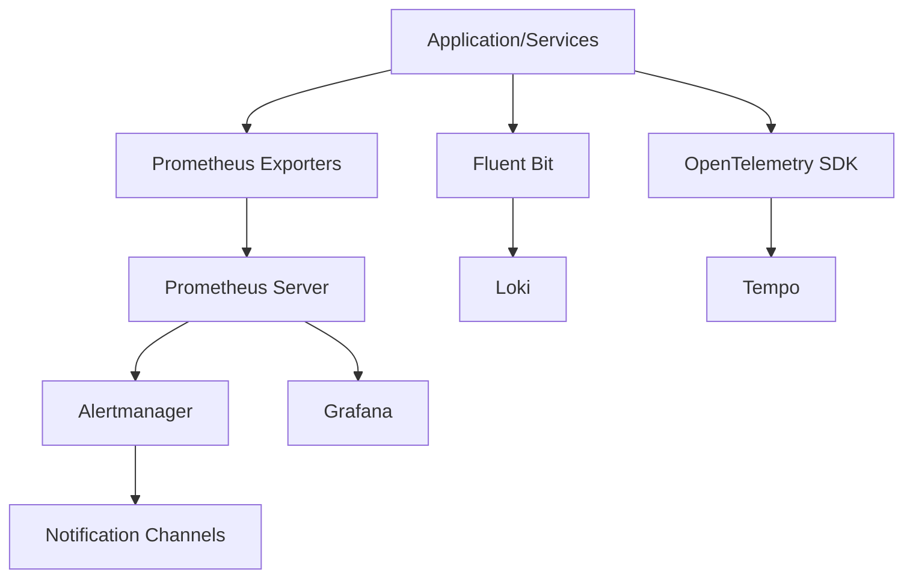

## Introduction

Overview of the monitoring and observability approach for the AI-driven Freight Optimization Platform, explaining the importance of comprehensive monitoring for ensuring system reliability, performance, and business success.

## Monitoring Architecture

Description of the overall monitoring architecture, including the components (Prometheus, Grafana, Alertmanager, Loki, Tempo), their relationships, and deployment model within the Kubernetes cluster.

### Components

Detailed description of each monitoring component, its role, and configuration approach.

- **Prometheus** (2.40.0): Open-source monitoring and alerting toolkit used for collecting and storing metrics as time-series data. Configuration is defined in `prometheus.yml` and includes scrape configurations for various services and exporters.
- **Grafana** (9.3.0): Open-source platform for monitoring and observability. It provides tools for visualizing time-series data, creating dashboards, and exploring metrics.
- **Alertmanager** (0.25.0): Handles alerts sent by the Prometheus server. It manages silencing, aggregation, and routing of alerts to appropriate notification channels.
- **Loki** (2.7.0): Log aggregation system designed to be cost-effective and easy to operate. It indexes only metadata about log data, rather than the logs themselves.
- **Tempo** (2.0.0): Distributed tracing backend used to store and query traces generated by the platform's microservices.

### Deployment Model

Explanation of how monitoring components are deployed in the Kubernetes cluster, including resource requirements and high availability considerations.

- Prometheus, Grafana, Alertmanager, Loki, and Tempo are deployed as stateful sets within the Kubernetes cluster.
- Each component is configured with appropriate resource requests and limits to ensure stable performance.
- Persistent volumes are used for data storage to ensure data durability.
- High availability is achieved through replication and automated failover mechanisms.

### Data Flow

Diagram and description of how monitoring data flows through the system, from collection to visualization and alerting.

- Metrics are collected by Prometheus exporters running alongside each service.
- Logs are collected by Fluent Bit agents and sent to Loki.
- Traces are collected by OpenTelemetry SDKs and sent to Tempo.
- Prometheus stores metrics and evaluates alerting rules.
- Alertmanager handles alerts and sends notifications.
- Grafana visualizes metrics, logs, and traces in dashboards.

## Metrics Collection

Comprehensive documentation of the metrics collection approach, including infrastructure, application, and business metrics.

### Infrastructure Metrics

Details on collecting metrics from Kubernetes, nodes, containers, and network components.

- **Kubernetes Metrics:** Collected using `kube-state-metrics` and `kubelet`.
- **Node Metrics:** Collected using `node-exporter`.
- **Container Metrics:** Collected using `cAdvisor`.
- **Network Metrics:** Collected using `VPC Flow Logs` and `AWS Network Load Balancer metrics`.

### Application Metrics

Approach for instrumenting and collecting metrics from microservices, including custom metrics for business processes.

- **HTTP Request Metrics:** Request rate, response time, error rate, and request size.
- **Custom Business Metrics:** Load match rate, driver availability, and optimization quality.
- **Service Dependency Metrics:** Availability and latency of dependent services.
- **Code Instrumentation:** Micrometer library is used to instrument the code and expose metrics in Prometheus format.

### Database Metrics

Metrics collection from PostgreSQL, Redis, MongoDB, and other data stores.

- **PostgreSQL Metrics:** Connections, query performance, replication lag, and disk usage.
- **Redis Metrics:** Memory usage, cache hit rate, and command latency.
- **MongoDB Metrics:** Connections, replication lag, and operation latency.

### Message Queue Metrics

Monitoring approach for Kafka and other messaging components.

- **Kafka Broker Metrics:** Active controller count, offline partitions, and under-replicated partitions.
- **Kafka Topic Metrics:** Message rate, consumer lag, and disk usage.
- **Consumer Group Metrics:** Lag, offset, and processing rate.

### Business Metrics

Collection and tracking of key business metrics like load fulfillment rate, empty mile reduction, and driver earnings.

- **Load Fulfillment Rate:** Percentage of loads matched within the optimal time window.
- **Empty Mile Reduction:** Percentage decrease in empty miles driven by participating drivers.
- **Driver Earnings Increase:** Percentage increase in driver earnings due to platform optimization.
- **Network Efficiency Score:** Overall score representing the efficiency of the freight network.

### Retention Policies

Data retention policies for different types of metrics, balancing storage costs with analytical needs.

| Metric Type | Retention Period |
|-------------|-----------------|
| Raw Metrics | 30 days |
| Aggregated Metrics | 1 year |
| Logs | 30 days full, 1 year sampled |
| Traces | 15 days |

## Logging Strategy

Documentation of the centralized logging approach using Loki, including log collection, processing, and analysis.

### Log Collection

Methods for collecting logs from containers, applications, and system components.

- **Fluent Bit:** Lightweight log forwarder used to collect logs from containers and forward them to Loki.
- **Sidecar Containers:** Fluent Bit deployed as a sidecar container in each pod to collect application logs.
- **System Logs:** Collected from system components and forwarded to Loki.

### Log Structure and Format

Standardized log format and structure to ensure consistent parsing and analysis.

- **JSON Format:** Logs are structured in JSON format for easy parsing and querying.
- **Standard Fields:** Each log entry includes timestamp, log level, service name, pod name, and message.

### Log Levels and Filtering

Guidelines for log levels and filtering to manage log volume while capturing important information.

- **Log Levels:** Use standard log levels (DEBUG, INFO, WARNING, ERROR, CRITICAL) to categorize log messages.
- **Filtering:** Configure Fluent Bit to filter out unnecessary log messages based on log level.

### Log Retention and Archiving

Policies for log retention and archiving to balance storage costs with compliance requirements.

- **Retention Period:** Logs are retained in Loki for 30 days.
- **Archiving:** Logs are archived to S3 for long-term storage and compliance purposes.

### Log Analysis

Tools and techniques for analyzing logs to identify issues and trends.

- **Loki Query Language (LogQL):** Used to query and analyze logs in Loki.
- **Grafana Dashboards:** Used to visualize log data and identify trends.
- **Anomaly Detection:** Machine learning techniques used to detect unusual log patterns.

## Distributed Tracing

Documentation of the distributed tracing implementation using OpenTelemetry and Tempo, enabling end-to-end request tracking across microservices.

### Instrumentation

Guidelines for instrumenting services with OpenTelemetry for distributed tracing.

- **OpenTelemetry SDKs:** Used to instrument services and generate traces.
- **Context Propagation:** Ensure that trace context is propagated across service boundaries.
- **Span Attributes:** Add relevant attributes to spans to provide additional context.

### Sampling Strategy

Approach for trace sampling to balance observability with performance impact.

- **Adaptive Sampling:** Sample traces based on request rate and error rate.
- **Always Sample Errors:** Always sample traces that contain errors.
- **Head-Based Sampling:** Sample traces at the beginning of the request.

### Trace Analysis

Methods for analyzing traces to identify performance bottlenecks and service dependencies.

- **Tempo UI:** Used to visualize and analyze traces.
- **Service Dependency Graphs:** Used to identify dependencies between services.
- **Span Duration Analysis:** Used to identify performance bottlenecks in specific services.

### Integration with Logs and Metrics

Correlation between traces, logs, and metrics for comprehensive observability.

- **Trace IDs in Logs:** Include trace IDs in log messages to correlate logs with traces.
- **Metrics from Traces:** Generate metrics from trace data to provide additional insights.
- **Links between Logs and Traces:** Provide links between logs and traces in Grafana dashboards.

## Dashboards and Visualization

Overview of the Grafana dashboards for monitoring different aspects of the platform.

### System Overview Dashboard

Description of the main system dashboard showing overall platform health and performance.

- **Service Status:** Displays the status of all core services.
- **Platform Availability:** Displays the overall availability of the platform.
- **Request Rate by Service:** Displays the request rate for each service.
- **Error Rate by Service:** Displays the error rate for each service.

### Service-specific Dashboards

Dashboards for monitoring individual microservices and components.

- **API Gateway Dashboard:** Monitors API traffic, response times, and error rates.
- **Load Matching Service Dashboard:** Monitors load matching performance and recommendation quality.
- **Optimization Engine Dashboard:** Monitors optimization job duration and resource utilization.
- **Database Dashboards:** Monitors database performance and health.

### Business Metrics Dashboard

Visualization of key business metrics and KPIs.

- **Load Fulfillment Rate:** Displays the percentage of loads matched within the optimal time window.
- **Empty Mile Reduction:** Displays the percentage decrease in empty miles driven by participating drivers.
- **Driver Earnings Increase:** Displays the percentage increase in driver earnings due to platform optimization.

### Database Dashboards

Monitoring dashboards for database performance and health.

- **PostgreSQL Dashboard:** Monitors connections, query performance, and replication lag.
- **Redis Dashboard:** Monitors memory usage, cache hit rate, and command latency.
- **MongoDB Dashboard:** Monitors connections, replication lag, and operation latency.

### Custom Dashboard Creation

Guidelines for creating custom dashboards for specific monitoring needs.

- **Grafana UI:** Use the Grafana UI to create custom dashboards.
- **PromQL:** Use PromQL to query metrics from Prometheus.
- **Templates:** Use Grafana templates to create reusable dashboards.

## Alerting System

Documentation of the alerting system using Prometheus Alertmanager, including alert definitions, routing, and notification channels.

### Alert Definitions

Overview of alert rules and their organization into logical groups.

- **Alert Rules:** Defined in YAML files and loaded by Prometheus.
- **Alert Groups:** Organize alerts into logical groups based on service or category.
- **Alert Labels:** Add labels to alerts to provide additional context and routing information.

### Alert Severity Levels

Definition of alert severity levels and their meaning.

- **Critical:** Requires immediate attention and indicates a severe service disruption.
- **Warning:** Indicates a potential issue that requires investigation.
- **Info:** Provides informational alerts for monitoring trends and patterns.

### Alert Routing

Configuration of alert routing to appropriate teams and individuals.

- **Alertmanager Configuration:** Configured to route alerts based on labels.
- **Routing Rules:** Define routing rules based on severity, service, and other labels.
- **Team-specific Routing:** Route alerts to specific teams based on their area of responsibility.

### Notification Channels

Available notification channels (email, Slack, PagerDuty) and their configuration.

- **Email:** Used for low-priority alerts and reports.
- **Slack:** Used for team communication and collaboration.
- **PagerDuty:** Used for high-priority alerts requiring immediate attention.

### Alert Silencing and Inhibition

Procedures for silencing and inhibiting alerts during maintenance or known issues.

- **Silencing:** Temporarily suppress alerts for a specific period.
- **Inhibition:** Prevent alerts from firing based on the presence of other alerts.

## Incident Response

Procedures for responding to monitoring alerts and incidents.

### Incident Classification

Framework for classifying incidents by severity and impact.

- **Severity Levels:** Critical, High, Medium, Low.
- **Impact Assessment:** Determine the impact of the incident on users and business operations.

### Escalation Procedures

Defined escalation paths for different types of incidents.

- **On-call Engineers:** First responders for incidents.
- **Team Leads:** Escalation point for complex or high-severity incidents.
- **Management:** Notified for critical incidents with significant business impact.

### Incident Response Runbooks

Standard procedures for responding to common types of incidents.

- **Service Outage:** Restart service, check logs, and investigate dependencies.
- **High Latency:** Check service performance, database queries, and resource utilization.
- **Security Breach:** Isolate affected systems, investigate logs, and notify security team.

### Post-incident Review

Process for conducting post-incident reviews and implementing improvements.

- **Timeline Creation:** Document the timeline of events during the incident.
- **Root Cause Analysis:** Identify the underlying cause of the incident.
- **Action Items:** Create action items to prevent similar incidents from occurring in the future.

## SLA Monitoring

Approach for monitoring service level agreements and performance requirements.

### SLA Definitions

Definition of service level objectives and indicators for different components.

- **Availability:** Percentage of time the service is available and functioning correctly.
- **Performance:** Response time, throughput, and error rate.
- **Reliability:** Mean time between failures (MTBF) and mean time to recovery (MTTR).

### SLA Measurement

Methods for measuring and calculating SLA compliance.

- **Synthetic Probes:** Simulate user requests to measure availability and performance.
- **Real Traffic Analysis:** Analyze real traffic data to measure performance and error rates.
- **Automated Calculations:** Use Prometheus queries to calculate SLA compliance metrics.

### SLA Reporting

Regular reporting of SLA compliance to stakeholders.

- **Monthly Reports:** Generate monthly reports summarizing SLA compliance metrics.
- **Dashboards:** Provide real-time visibility into SLA compliance.
- **Alerts:** Generate alerts when SLA targets are breached.

### SLA Violation Handling

Procedures for addressing SLA violations and implementing improvements.

- **Root Cause Analysis:** Investigate the cause of the SLA violation.
- **Corrective Actions:** Implement corrective actions to prevent future violations.
- **Service Improvements:** Identify opportunities to improve service performance and reliability.

## Security Monitoring

Documentation of security monitoring capabilities and procedures.

### Security Metrics

Key security metrics collected and monitored.

- **Authentication Failures:** Number of failed login attempts.
- **Unauthorized Access Attempts:** Number of unauthorized requests.
- **Security Policy Violations:** Number of violations of security policies.
- **Vulnerability Detections:** Number of vulnerabilities detected by security scans.

### Security Alerts

Security-specific alert definitions and their handling.

- **Unauthorized Access:** Alert when unauthorized access attempts exceed a threshold.
- **Suspicious Activity:** Alert when suspicious activity is detected in logs.
- **Vulnerability Detections:** Alert when new vulnerabilities are detected.

### Compliance Monitoring

Monitoring for compliance with security policies and regulations.

- **Compliance Checks:** Automated checks to verify compliance with security policies.
- **Compliance Reports:** Regular reports summarizing compliance status.
- **Audit Logging:** Comprehensive audit logging to track security-related events.

### Security Incident Response

Procedures for responding to security incidents detected through monitoring.

- **Incident Classification:** Classify incidents based on severity and impact.
- **Containment:** Isolate affected systems to prevent further damage.
- **Eradication:** Remove the cause of the incident.
- **Recovery:** Restore systems to normal operation.

## Capacity Planning

Using monitoring data for capacity planning and resource optimization.

### Resource Utilization Tracking

Monitoring resource utilization trends for capacity planning.

- **CPU Utilization:** Track CPU utilization trends for each service.
- **Memory Utilization:** Track memory utilization trends for each service.
- **Disk Utilization:** Track disk utilization trends for each service.
- **Network Traffic:** Track network traffic trends for each service.

### Growth Forecasting

Using historical data to forecast future resource needs.

- **Trend Analysis:** Analyze historical resource utilization data to identify trends.
- **Forecasting Models:** Use forecasting models to predict future resource needs.
- **Capacity Planning Reports:** Generate reports summarizing capacity planning recommendations.

### Scaling Recommendations

Process for making scaling recommendations based on monitoring data.

- **Scaling Thresholds:** Define thresholds for scaling resources based on utilization.
- **Automated Scaling:** Implement automated scaling policies to adjust resources based on demand.
- **Manual Scaling:** Manually scale resources based on monitoring data and capacity planning reports.

## Monitoring System Maintenance

Procedures for maintaining and updating the monitoring system itself.

### Monitoring System Updates

Process for updating monitoring components.

- **Rolling Updates:** Perform rolling updates to minimize disruption.
- **Testing:** Test updates in a staging environment before deploying to production.
- **Rollback Plan:** Have a rollback plan in case of issues.

### Alert Tuning

Regular review and tuning of alert thresholds to reduce noise.

- **Alert Fatigue:** Identify and address alert fatigue by tuning alert thresholds.
- **False Positives:** Reduce false positives by refining alert rules.
- **Alert Prioritization:** Prioritize alerts based on severity and impact.

### Dashboard Maintenance

Keeping dashboards up-to-date with evolving monitoring needs.

- **Regular Review:** Review dashboards regularly to ensure they are still relevant and accurate.
- **New Metrics:** Add new metrics to dashboards as needed.
- **Dashboard Optimization:** Optimize dashboards for performance and usability.

### Monitoring System Scaling

Scaling the monitoring infrastructure as the platform grows.

- **Horizontal Scaling:** Scale monitoring components horizontally to handle increased load.
- **Data Retention:** Adjust data retention policies to balance storage costs with analytical needs.
- **Resource Optimization:** Optimize resource allocation for monitoring components.

## References

Links to related documentation and resources.

### Internal Documentation

Links to related internal documentation.

- [Deployment Guide](link-to-deployment-guide)
- [Service Architecture](link-to-service-architecture)
- [Security Policies](link-to-security-policies)

### External Resources

Links to external documentation for monitoring tools.

- [Prometheus Documentation](https://prometheus.io/docs/)
- [Grafana Documentation](https://grafana.com/docs/)
- [Loki Documentation](https://grafana.com/docs/loki/)
- [Tempo Documentation](https://grafana.com/docs/tempo/)

### Configuration Files

References to key configuration files for the monitoring system.

- [Prometheus Configuration](link-to-prometheus-config)
- [Alertmanager Configuration](link-to-alertmanager-config)
- [Grafana Dashboards](link-to-grafana-dashboards)