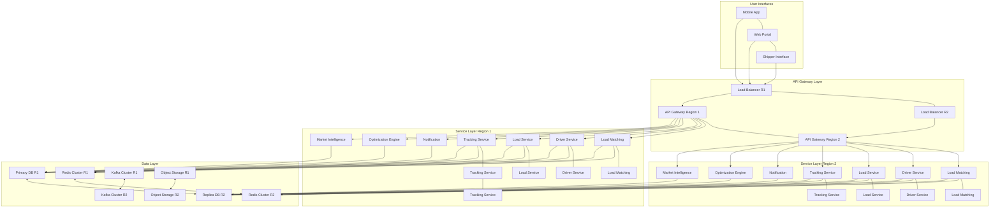

# AI-driven Freight Optimization Platform - Scaling Guide

This document provides comprehensive documentation of the scaling architecture and strategies for the AI-driven Freight Optimization Platform. It covers horizontal and vertical scaling approaches, auto-scaling configurations, database scaling strategies, and best practices for ensuring the platform can handle varying workloads efficiently while maintaining performance SLAs.

# 1. Scaling Architecture Overview

The AI-driven Freight Optimization Platform is designed for elastic scalability to handle varying workloads and growth. The platform employs different scaling strategies for different components based on their specific requirements and characteristics.

### 1.1 Scaling Principles

- **Elastic Scalability**: The platform scales resources up and down automatically based on demand
- **Service-Appropriate Scaling**: Different services use different scaling approaches based on their workload characteristics
- **Resource Efficiency**: Scaling policies are designed to optimize resource usage and cost
- **Performance Preservation**: Scaling ensures that performance SLAs are maintained under varying loads
- **Geographic Distribution**: The platform supports scaling across multiple regions for global coverage

### 1.2 Scaling Approaches

| Approach | Description | Applicable Components |
|----------|-------------|----------------------|
| Horizontal Scaling | Adding more instances of a service | Stateless services, API gateways, web servers |
| Vertical Scaling | Increasing resources for existing instances | Databases, ML training, optimization engine |
| Geographic Scaling | Distributing services across regions | Content delivery, API access, data storage |
| Database Scaling | Read replicas, sharding, connection pooling | All database systems |
| Caching Scaling | Distributed caching, cluster expansion | Redis, in-memory data stores |

### 1.3 Scaling Architecture Diagram



# 2. Horizontal Scaling

Horizontal scaling involves adding more instances of a service to distribute load. This approach is primarily used for stateless services that can easily scale out to handle increased traffic.

### 2.1 Kubernetes Horizontal Pod Autoscaler (HPA)

The platform uses Kubernetes Horizontal Pod Autoscaler (HPA) to automatically scale the number of pods in a deployment based on observed metrics.

#### 2.1.1 HPA Configuration Example

```yaml
apiVersion: autoscaling/v2
kind: HorizontalPodAutoscaler
metadata:
  name: api-gateway
  namespace: default
  labels:
    app: api-gateway
    component: api-gateway
    part-of: freight-optimization
spec:
  scaleTargetRef:
    apiVersion: apps/v1
    kind: Deployment
    name: api-gateway
  minReplicas: 3
  maxReplicas: 20
  metrics:
  - type: Resource
    resource:
      name: cpu
      target:
        type: Utilization
        averageUtilization: 70
  - type: Pods
    pods:
      metric:
        name: http_requests_per_second
      target:
        type: AverageValue
        averageValue: "1000"
  behavior:
    scaleUp:
      stabilizationWindowSeconds: 60
      policies:
      - type: Pods
        value: 2
        periodSeconds: 60
      - type: Percent
        value: 50
        periodSeconds: 60
      selectPolicy: Max
    scaleDown:
      stabilizationWindowSeconds: 300
      policies:
      - type: Pods
        value: 1
        periodSeconds: 120
      - type: Percent
        value: 10
        periodSeconds: 120
      selectPolicy: Min
```

### 2.2 Service-Specific Scaling Configurations

| Service | Min Replicas | Max Replicas | Primary Scaling Metric | Secondary Metric | Scale-Up Policy | Scale-Down Policy |
|---------|--------------|--------------|------------------------|------------------|-----------------|-------------------|
| API Gateway | 3 | 20 | CPU (70%) | Requests per second (1000) | 2 pods or 50% every 60s | 1 pod or 10% every 120s |
| Load Matching | 2 | 15 | CPU (70%) | Queue depth (100) | 2 pods or 50% every 60s | 1 pod or 10% every 120s |
| Driver Service | 3 | 12 | CPU (70%) | Active sessions | 2 pods or 50% every 60s | 1 pod or 10% every 120s |
| Load Service | 3 | 8 | CPU (70%) | Transaction rate | 2 pods or 50% every 60s | 1 pod or 10% every 120s |
| Tracking Service | 3 | 20 | CPU (70%) | Position updates per second (5000) | 2 pods or 50% every 60s | 1 pod or 10% every 120s |
| Optimization Engine | 2 | 10 | CPU (75%) | Job queue length (5) | 1 pod or 30% every 60s | 1 pod or 10% every 180s |
| Notification Service | 2 | 8 | CPU (70%) | Queue length | 2 pods or 50% every 60s | 1 pod or 10% every 120s |

### 2.3 Scaling Behavior Configuration

The platform uses the `behavior` field in HPA configurations to fine-tune scaling behavior:

- **Scale-Up Behavior**: Configured to respond quickly to increased load
  - Short stabilization window (60 seconds) to react promptly to traffic spikes
  - Aggressive scaling policies (2 pods or 50% every 60 seconds)
  - Max policy selection to scale up faster when needed

- **Scale-Down Behavior**: Configured to scale down conservatively
  - Longer stabilization window (300 seconds) to prevent premature scale-down
  - Conservative scaling policies (1 pod or 10% every 120 seconds)
  - Min policy selection to scale down gradually

### 2.4 Custom Metrics for Scaling

In addition to CPU and memory metrics, the platform uses custom metrics for more precise scaling:

| Service | Custom Metric | Collection Method | Purpose |
|---------|---------------|-------------------|---------|
| API Gateway | http_requests_per_second | Prometheus metrics | Scale based on actual request load |
| Load Matching | queue_depth | Prometheus metrics | Scale based on pending match requests |
| Tracking Service | position_updates_per_second | Prometheus metrics | Scale based on position update volume |
| Optimization Engine | job_queue_length | Prometheus metrics | Scale based on pending optimization jobs |
| Notification Service | pending_notifications | Prometheus metrics | Scale based on notification backlog |

# 3. Vertical Scaling

Vertical scaling involves increasing resources (CPU, memory) for existing instances. This approach is primarily used for stateful services and components that benefit more from increased resources than from additional instances.

### 3.1 Vertical Scaling Approach

| Component | Scaling Mechanism | Scaling Triggers | Implementation |
|-----------|------------------|------------------|----------------|
| Databases | Instance class upgrade | CPU utilization, memory usage, IOPS | AWS RDS instance modification |
| Optimization Engine | Resource limits adjustment | Job queue length, processing time | Kubernetes resource requests/limits |
| ML Training | GPU instance allocation | Training workload | SageMaker instance type selection |
| Elasticsearch | JVM heap size, instance type | Search latency, indexing throughput | Elasticsearch node configuration |

### 3.2 Resource Allocation Strategy

The platform follows these principles for resource allocation:

- **Request-based with headroom**: Set requests at 60% of typical load, limits at 150%
- **Memory-based with safety margin**: Set requests based on application profiling, limits 30% higher
- **Storage with thresholds**: Auto-expand volumes at 80% capacity, review at 90%
- **Network with prioritization**: Prioritize critical traffic, limit non-essential transfers during peaks

### 3.3 Resource Guidelines by Service Type

| Service Type | CPU Request | Memory Request | CPU Limit | Memory Limit | Justification |
|--------------|-------------|----------------|-----------|--------------|---------------|
| API Services | 0.5 cores | 1 GB | 1 core | 2 GB | Stateless services with moderate resource needs |
| Data Processing | 1 core | 4 GB | 2 cores | 8 GB | Memory-intensive data processing operations |
| ML Inference | 2 cores | 8 GB | 4 cores | 16 GB | Compute-intensive prediction workloads |
| Background Workers | 0.25 cores | 512 MB | 0.5 cores | 1 GB | Lightweight background processing |

### 3.4 Vertical Scaling Process

The process for vertical scaling varies by component:

#### 3.4.1 Database Vertical Scaling

1. **Monitoring**: Continuously monitor database performance metrics
2. **Threshold Detection**: Identify when performance metrics approach thresholds
3. **Capacity Planning**: Determine appropriate instance size based on workload
4. **Scaling Operation**: Schedule maintenance window for instance modification
5. **Execution**: Perform instance modification (may require downtime for some databases)
6. **Verification**: Validate performance after scaling operation

#### 3.4.2 Kubernetes Resource Adjustment

1. **Performance Analysis**: Analyze resource usage patterns
2. **Resource Planning**: Determine appropriate resource requests and limits
3. **Configuration Update**: Update deployment manifests with new resource specifications
4. **Rolling Deployment**: Apply changes with rolling update strategy
5. **Monitoring**: Verify performance with new resource allocation

# 4. Database Scaling

Database scaling is critical for handling increased data volume and query load. The platform employs different scaling strategies for different database technologies.

### 4.1 PostgreSQL Scaling

#### 4.1.1 Read Replicas

The platform uses read replicas to scale read operations:

- **Configuration**: Multi-AZ RDS deployment with read replicas
- **Read/Write Splitting**: Write to primary, read from replicas
- **Load Distribution**: Round-robin with health checks
- **Consistency Approach**: Session consistency with sticky primary

#### 4.1.2 Connection Pooling

- **Implementation**: PgBouncer
- **Pool Configuration**: 10-100 connections per service
- **Idle Timeout**: 5 minutes

#### 4.1.3 Query Optimization

- **Indexing Strategy**: Covering indexes for frequent queries
- **Partitioning**: Table partitioning for large tables (by date or region)
- **Materialized Views**: Pre-computed aggregations for reporting queries

### 4.2 TimescaleDB Scaling

#### 4.2.1 Hypertable Partitioning

- **Time Partitioning**: Automatic chunking by time intervals
- **Chunk Interval**: 1 day for high-volume data (positions, telemetry)
- **Retention Policy**: 90 days raw data, 1 year downsampled

#### 4.2.2 Continuous Aggregates

- **Implementation**: Materialized time-based aggregations
- **Refresh Schedule**: Hourly updates for recent data
- **Query Optimization**: Time bucket functions for efficient time-based grouping

### 4.3 MongoDB Scaling

#### 4.3.1 Replica Sets

- **Configuration**: 3-node replica sets for high availability
- **Read Preference**: Secondary preferred for read scaling
- **Write Concern**: Majority for critical operations

#### 4.3.2 Sharding Strategy

- **Shard Key Selection**: Based on access patterns (e.g., driver_id for driver data)
- **Chunk Distribution**: Balanced distribution across shards
- **Shard Awareness**: Application-level routing to appropriate shards

### 4.4 Redis Scaling

#### 4.4.1 Redis Cluster

- **Configuration**: Redis Cluster with multiple nodes
- **Sharding**: Automatic sharding across nodes
- **Replication**: Each master with replica for high availability

#### 4.4.2 Caching Strategies

- **Cache Types**: Data cache, query cache, session cache, geospatial cache
- **TTL Policies**: Varying TTLs based on data volatility
- **Eviction Policies**: Least recently used (LRU) eviction

### 4.5 Elasticsearch Scaling

#### 4.5.1 Index Sharding

- **Primary Shards**: Distributed across nodes for parallel processing
- **Replica Shards**: For redundancy and read scaling
- **Shard Allocation**: Based on node capabilities and load

#### 4.5.2 Node Types

- **Master Nodes**: 3 dedicated master nodes for cluster management
- **Data Nodes**: Scalable data nodes for storage and search
- **Coordinating Nodes**: For query distribution and result aggregation
- **Ingest Nodes**: For document preprocessing and transformation

# 5. Geographic Scaling

Geographic scaling involves distributing services across multiple regions to improve latency, resilience, and compliance with data residency requirements.

### 5.1 Multi-Region Strategy

| Component | Primary Region | Secondary Region | Failover Strategy |
|-----------|----------------|------------------|-------------------|
| Frontend | Active | Active | Route 53 health checks |
| API Gateway | Active | Active | Route 53 health checks |
| Microservices | Active | Standby | Manual promotion |
| Databases | Active | Read replicas | Manual promotion |
| Object Storage | Active | Replicated | Automatic |

### 5.2 Content Delivery Network

- **Implementation**: CloudFront with edge locations
- **Caching Strategy**: Cache static assets and API responses at edge
- **Origin Failover**: Automatic failover to backup origins
- **Geographic Restrictions**: Optional restrictions for compliance

### 5.3 Regional Endpoints

- **Implementation**: Route 53 with health checks
- **Routing Policy**: Latency-based routing to nearest healthy endpoint
- **Failover Configuration**: Automatic failover to secondary region
- **Health Checks**: Regular checks to verify endpoint availability

### 5.4 Data Replication

- **Database Replication**: Cross-region replication for disaster recovery
- **Object Storage**: S3 cross-region replication for global access
- **Consistency Model**: Eventually consistent for cross-region data
- **Conflict Resolution**: Last-writer-wins or application-specific resolution

# 6. Auto-scaling Implementation

This section provides detailed information on the implementation of auto-scaling for the platform.

### 6.1 Kubernetes Cluster Autoscaler

The platform uses Kubernetes Cluster Autoscaler to automatically adjust the size of the Kubernetes cluster based on resource demands.

```yaml
# Cluster Autoscaler Configuration
clusterAutoscaler:
  enabled: true
  autoDiscovery:
    clusterName: freight-platform-eks
  extraArgs:
    scale-down-delay-after-add: 10m
    scale-down-unneeded-time: 10m
    max-node-provision-time: 15m
    scan-interval: 10s
    max-nodes-total: 100
    cores-total: 1000:4000
    memory-total: 1000:16000
    aws-use-static-instance-list: true
```

### 6.2 Node Group Auto-scaling

The platform uses EKS managed node groups with auto-scaling capabilities:

```terraform
node_groups = {
  system = {
    instance_types = ["m6i.large"]
    desired_size   = 3
    min_size       = 3
    max_size       = 6
    labels = {
      role = "system"
    }
    tags = {
      "k8s.io/cluster-autoscaler/enabled" = "true"
    }
  },
  application = {
    instance_types = ["c6i.2xlarge"]
    desired_size   = 4
    min_size       = 4
    max_size       = 20
    labels = {
      role = "application"
    }
    tags = {
      "k8s.io/cluster-autoscaler/enabled" = "true"
    }
  },
  data_processing = {
    instance_types = ["r6i.2xlarge"]
    desired_size   = 2
    min_size       = 2
    max_size       = 10
    labels = {
      role = "data-processing"
    }
    tags = {
      "k8s.io/cluster-autoscaler/enabled" = "true"
    }
  },
  ml_inference = {
    instance_types = ["g5.xlarge"]
    desired_size   = 1
    min_size       = 1
    max_size       = 5
    labels = {
      role = "ml-inference"
    }
    tags = {
      "k8s.io/cluster-autoscaler/enabled" = "true"
    }
  }
}
```

### 6.3 Service-Specific Auto-scaling

#### 6.3.1 Load Matching Service

```yaml
apiVersion: autoscaling/v2
kind: HorizontalPodAutoscaler
metadata:
  name: load-matching-service
  namespace: default
spec:
  scaleTargetRef:
    apiVersion: apps/v1
    kind: Deployment
    name: load-matching-service
  minReplicas: 2
  maxReplicas: 15
  metrics:
  - type: Resource
    resource:
      name: cpu
      target:
        type: Utilization
        averageUtilization: 70
  - type: Pods
    pods:
      metric:
        name: queue_depth
      target:
        type: AverageValue
        averageValue: "100"
  behavior:
    scaleUp:
      stabilizationWindowSeconds: 60
      policies:
      - type: Pods
        value: 2
        periodSeconds: 60
      - type: Percent
        value: 50
        periodSeconds: 60
      selectPolicy: Max
    scaleDown:
      stabilizationWindowSeconds: 300
      policies:
      - type: Pods
        value: 1
        periodSeconds: 120
      - type: Percent
        value: 10
        periodSeconds: 120
      selectPolicy: Min
```

#### 6.3.2 Optimization Engine

```yaml
apiVersion: autoscaling/v2
kind: HorizontalPodAutoscaler
metadata:
  name: optimization-engine
  namespace: default
spec:
  scaleTargetRef:
    apiVersion: apps/v1
    kind: Deployment
    name: optimization-engine
  minReplicas: 2
  maxReplicas: 10
  metrics:
  - type: Resource
    resource:
      name: cpu
      target:
        type: Utilization
        averageUtilization: 75
  - type: Pods
    pods:
      metric:
        name: job_queue_length
      target:
        type: AverageValue
        averageValue: "5"
  behavior:
    scaleUp:
      stabilizationWindowSeconds: 120
      policies:
      - type: Pods
        value: 1
        periodSeconds: 60
      - type: Percent
        value: 30
        periodSeconds: 60
      selectPolicy: Max
    scaleDown:
      stabilizationWindowSeconds: 300
      policies:
      - type: Pods
        value: 1
        periodSeconds: 180
      - type: Percent
        value: 10
        periodSeconds: 180
      selectPolicy: Min
```

#### 6.3.3 Tracking Service

```yaml
apiVersion: autoscaling/v2
kind: HorizontalPodAutoscaler
metadata:
  name: tracking-service
  namespace: default
spec:
  scaleTargetRef:
    apiVersion: apps/v1
    kind: Deployment
    name: tracking-service
  minReplicas: 3
  maxReplicas: 20
  metrics:
  - type: Resource
    resource:
      name: cpu
      target:
        type: Utilization
        averageUtilization: 70
  - type: Pods
    pods:
      metric:
        name: position_updates_per_second
      target:
        type: AverageValue
        averageValue: "5000"
  behavior:
    scaleUp:
      stabilizationWindowSeconds: 60
      policies:
      - type: Pods
        value: 2
        periodSeconds: 60
      - type: Percent
        value: 50
        periodSeconds: 60
      selectPolicy: Max
    scaleDown:
      stabilizationWindowSeconds: 300
      policies:
      - type: Pods
        value: 1
        periodSeconds: 120
      - type: Percent
        value: 10
        periodSeconds: 120
      selectPolicy: Min
```

### 6.4 Custom Metrics Configuration

The platform uses Prometheus Adapter to expose custom metrics to the Kubernetes API for use in HPAs:

```yaml
prometheusAdapter:
  enabled: true
  rules:
    default: false
    custom:
    - seriesQuery: 'http_requests_total{kubernetes_namespace!="",kubernetes_pod_name!=""}'
      resources:
        overrides:
          kubernetes_namespace: {resource: "namespace"}
          kubernetes_pod_name: {resource: "pod"}
      name:
        matches: "^(.*)_total$"
        as: "${1}_per_second"
      metricsQuery: 'sum(rate(<<.Series>>{<<.LabelMatchers>>}[2m])) by (<<.GroupBy>>)'
    - seriesQuery: 'queue_depth{kubernetes_namespace!="",kubernetes_pod_name!=""}'
      resources:
        overrides:
          kubernetes_namespace: {resource: "namespace"}
          kubernetes_pod_name: {resource: "pod"}
      name:
        matches: "queue_depth"
        as: "queue_depth"
      metricsQuery: 'avg(<<.Series>>{<<.LabelMatchers>>}) by (<<.GroupBy>>)'
    - seriesQuery: 'job_queue_length{kubernetes_namespace!="",kubernetes_pod_name!=""}'
      resources:
        overrides:
          kubernetes_namespace: {resource: "namespace"}
          kubernetes_pod_name: {resource: "pod"}
      name:
        matches: "job_queue_length"
        as: "job_queue_length"
      metricsQuery: 'avg(<<.Series>>{<<.LabelMatchers>>}) by (<<.GroupBy>>)'
    - seriesQuery: 'position_updates_count{kubernetes_namespace!="",kubernetes_pod_name!=""}'
      resources:
        overrides:
          kubernetes_namespace: {resource: "namespace"}
          kubernetes_pod_name: {resource: "pod"}
      name:
        matches: "^(.*)_count$"
        as: "${1}_per_second"
      metricsQuery: 'sum(rate(<<.Series>>{<<.LabelMatchers>>}[2m])) by (<<.GroupBy>>)'
```

# 7. Scaling Best Practices

This section outlines best practices for scaling the AI-driven Freight Optimization Platform effectively.

### 7.1 Monitoring for Scaling

- **Proactive Monitoring**: Monitor key metrics to anticipate scaling needs before performance degradation
- **Scaling Metrics**: Track CPU, memory, request rate, queue depth, and custom application metrics
- **Scaling History**: Analyze historical scaling patterns to optimize scaling policies
- **Alerting**: Set up alerts for scaling events and capacity thresholds

### 7.2 Performance Testing

- **Load Testing**: Regularly perform load tests to validate scaling behavior
- **Stress Testing**: Test system behavior under extreme load conditions
- **Scaling Validation**: Verify that auto-scaling responds appropriately to simulated load
- **Bottleneck Identification**: Identify and address bottlenecks that may impede scaling

### 7.3 Cost Optimization

- **Right-sizing**: Ensure instance types and resource allocations match workload requirements
- **Scaling Thresholds**: Set appropriate scaling thresholds to avoid unnecessary scaling
- **Spot Instances**: Use spot instances for non-critical, interruptible workloads
- **Scheduled Scaling**: Implement scheduled scaling for predictable workload patterns

### 7.4 Stateful Services

- **State Management**: Design services to handle state properly during scaling events
- **Session Persistence**: Use distributed session storage for web applications
- **Database Connections**: Implement connection pooling and proper connection management
- **Caching Strategy**: Design caching to work effectively with horizontal scaling

### 7.5 Scaling Limitations

- **Service Dependencies**: Be aware of dependencies that may limit effective scaling
- **Database Bottlenecks**: Monitor database performance as a potential scaling constraint
- **External Service Limits**: Consider rate limits of external APIs and services
- **Resource Quotas**: Be mindful of cloud provider quotas and limits

### 7.6 Scaling Checklist

#### 7.6.1 Pre-scaling Checklist

- [ ] Verify current resource utilization and performance metrics
- [ ] Identify potential bottlenecks or constraints
- [ ] Review historical scaling patterns and effectiveness
- [ ] Ensure monitoring and alerting are properly configured
- [ ] Validate that services can handle scaling events gracefully

#### 7.6.2 Post-scaling Checklist

- [ ] Verify that scaling achieved the desired performance improvement
- [ ] Check for any unexpected issues or side effects
- [ ] Update documentation with new capacity and scaling parameters
- [ ] Review cost impact of scaling changes
- [ ] Adjust scaling policies based on observed behavior

# 8. Scaling Scenarios

This section describes common scaling scenarios and recommended responses for the platform.

### 8.1 Daily Traffic Patterns

**Scenario**: The platform experiences predictable daily traffic patterns with peaks during business hours and lower traffic overnight.

**Scaling Approach**:
- Implement HPA for automatic scaling based on real-time metrics
- Consider scheduled scaling to proactively scale up before known peak periods
- Allow conservative scale-down during off-peak hours
- Monitor and adjust scaling parameters based on observed patterns

### 8.2 Sudden Traffic Spike

**Scenario**: A sudden increase in traffic due to a marketing campaign, news event, or other external factor.

**Scaling Approach**:
- Ensure HPA is configured with appropriate metrics and thresholds
- Configure aggressive scale-up policies to respond quickly to traffic spikes
- Monitor for potential bottlenecks in the scaling process
- Have manual intervention procedures ready for extreme cases

### 8.3 Geographic Expansion

**Scenario**: Expanding the platform to new geographic regions to support global users.

**Scaling Approach**:
- Deploy services to new AWS regions
- Configure Route 53 for latency-based routing
- Set up cross-region data replication as needed
- Implement region-specific monitoring and alerting

### 8.4 Database Growth

**Scenario**: Increasing data volume and query load on databases as the platform grows.

**Scaling Approach**:
- Monitor database performance metrics closely
- Add read replicas to scale read operations
- Implement data partitioning and archiving strategies
- Consider vertical scaling for primary database instances
- Evaluate sharding for extreme scale requirements

### 8.5 Batch Processing Load

**Scenario**: Periodic batch processing jobs (e.g., optimization runs, report generation) creating temporary load spikes.

**Scaling Approach**:
- Schedule batch jobs during off-peak hours when possible
- Configure separate node groups for batch processing workloads
- Use Kubernetes Jobs with appropriate resource requests
- Implement job queuing with prioritization

### 8.6 Seasonal Demand

**Scenario**: Seasonal variations in demand (e.g., holiday shipping season, agricultural harvest periods).

**Scaling Approach**:
- Analyze historical seasonal patterns
- Proactively adjust minimum replica counts before seasonal peaks
- Consider reserved instances for predictable baseline capacity
- Supplement with on-demand or spot instances for peak capacity

# 9. Scaling Roadmap

This section outlines planned enhancements to the platform's scaling capabilities.

### 9.1 Short-term Improvements (0-6 months)

- **Custom Metrics Refinement**: Enhance custom metrics for more precise auto-scaling
- **Vertical Pod Autoscaler**: Implement VPA for services that benefit from vertical scaling
- **Scaling Analytics**: Develop better analytics for scaling behavior and effectiveness
- **Cost Optimization**: Implement tools for analyzing and optimizing scaling costs

### 9.2 Medium-term Improvements (6-12 months)

- **Predictive Scaling**: Implement ML-based predictive scaling for anticipated load patterns
- **Multi-cluster Federation**: Explore Kubernetes federation for cross-cluster scaling
- **Database Sharding**: Implement comprehensive database sharding strategy
- **Automated Performance Testing**: Develop automated performance testing pipeline for scaling validation

### 9.3 Long-term Vision (12+ months)

- **Global Multi-region**: Expand to additional AWS regions for global coverage
- **Hybrid Scaling**: Explore hybrid cloud scaling for specific workloads
- **Serverless Components**: Migrate appropriate components to serverless architecture
- **Edge Computing**: Implement edge computing for latency-sensitive operations

# 10. References

- [Deployment Documentation](deployment.md)
- [Monitoring Documentation](monitoring.md)
- [Kubernetes HPA Documentation](https://kubernetes.io/docs/tasks/run-application/horizontal-pod-autoscale/)
- [AWS Auto Scaling Documentation](https://docs.aws.amazon.com/autoscaling/)
- [EKS Best Practices](https://aws.github.io/aws-eks-best-practices/)
- [Database Scaling Patterns](https://docs.aws.amazon.com/prescriptive-guidance/latest/patterns/database-scaling-patterns/)
- [Prometheus Adapter Documentation](https://github.com/kubernetes-sigs/prometheus-adapter)
- See also the system architecture documentation for additional context on the overall system design