## AI-driven Freight Optimization Platform - Security Guide

This document provides comprehensive documentation of the security architecture, practices, and controls implemented in the AI-driven Freight Optimization Platform. It covers authentication, authorization, data protection, network security, compliance, and operational security measures to ensure the platform's resilience against threats and protection of sensitive logistics data.

## 1. Security Architecture Overview

The AI-driven Freight Optimization Platform implements a defense-in-depth security approach with multiple layers of protection.

### 1.1 Security Principles

- **Defense in Depth**: Multiple security layers to protect against various threats
- **Least Privilege**: Access limited to only what is necessary for each role and service
- **Secure by Design**: Security integrated throughout the development lifecycle
- **Zero Trust**: Verification required for all access regardless of location
- **Continuous Monitoring**: Real-time detection of security events and anomalies
- **Automated Response**: Predefined procedures for common security events

### 1.2 Security Layers

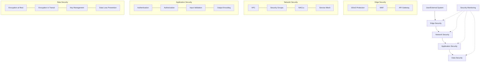

### 1.3 Security Responsibilities

| Role | Responsibilities |
|------|------------------|
| Security Team | Security architecture, policy development, vulnerability management, incident response |
| DevOps Team | Infrastructure security, configuration management, patch management |
| Development Team | Secure coding practices, security testing, dependency management |
| Operations Team | Security monitoring, alert response, access management |
| Compliance Team | Regulatory compliance, security assessments, audit support |

## 2. Authentication and Identity Management

The platform implements a comprehensive authentication and identity management system to verify the identity of users and services.

### 2.1 User Authentication

| Authentication Method | Use Cases | Implementation |
|----------------------|-----------|----------------|
| Username/Password | Web portal login | Secure password hashing with bcrypt |
| Multi-factor Authentication | High-security operations | Time-based OTP, SMS codes |
| Social Login | Consumer-facing interfaces | OAuth integration with major providers |
| Single Sign-On | Enterprise integration | SAML, OpenID Connect |
| API Keys | Service-to-service, developer access | Secure key management |
| Mobile Biometrics | Mobile app authentication | Fingerprint, Face ID |

### 2.2 JWT Token Management

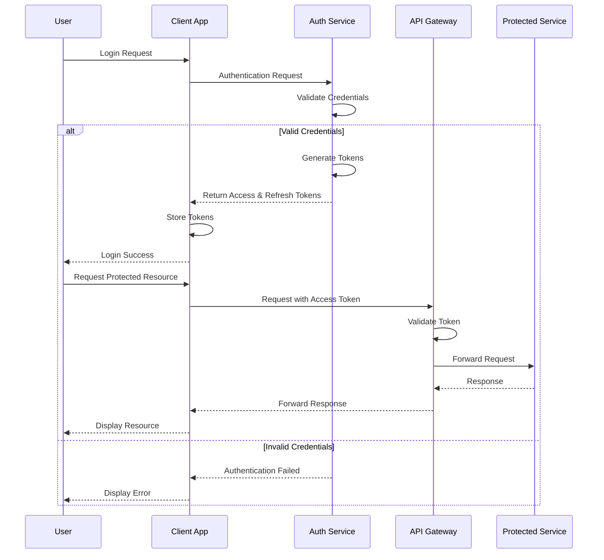

### 2.3 Token Security Controls

| Control | Implementation | Purpose |
|---------|----------------|----------|
| Short Expiration | 15-60 minute access tokens | Limit exposure window |
| Token Rotation | 7-30 day refresh tokens with rotation | Prevent token reuse |
| Signature Verification | RS256 algorithm | Prevent token tampering |
| Audience Validation | Specific audience claims | Prevent token misuse |
| Issuer Validation | Trusted issuer verification | Ensure token authenticity |

### 2.4 Service-to-Service Authentication

| Method | Implementation | Use Cases |
|--------|----------------|----------|
| Mutual TLS | Service mesh (Istio) | Secure service-to-service communication |
| Service Accounts | Kubernetes service accounts | Kubernetes resource access |
| IAM Roles | AWS IAM roles for service accounts | AWS resource access |
| API Keys | Secure key management | External service integration |

## 3. Authorization and Access Control

The platform implements a comprehensive authorization system to control access to resources based on user roles, permissions, and contextual attributes.

### 3.1 Role-Based Access Control (RBAC)

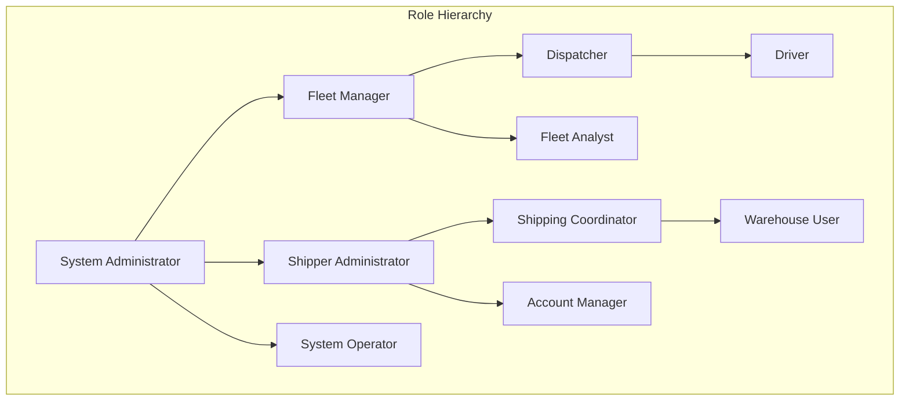

| Role | Description | Access Level |
|------|-------------|-------------|
| System Administrator | Platform administration | Full system access |
| Fleet Manager | Carrier fleet management | Full carrier data access |
| Dispatcher | Load assignment and tracking | Read/write for assigned fleet |
| Driver | Mobile app user | Personal data and assigned loads |
| Shipper Administrator | Shipper account management | Full shipper data access |
| Shipping Coordinator | Load creation and tracking | Read/write for shipper loads |

### 3.2 Permission Management

| Permission Type | Granularity | Example |
|-----------------|-------------|----------|
| Resource-based | Entity-level | View/edit specific load |
| Operation-based | Action-level | Create/read/update/delete |
| Field-level | Attribute-level | View but not edit rate information |
| Temporal | Time-restricted | Access during business hours only |

### 3.3 Kubernetes RBAC

The platform uses Kubernetes RBAC to control access to Kubernetes resources:

```yaml
apiVersion: rbac.authorization.k8s.io/v1
kind: Role
metadata:
  name: api-gateway-role
  namespace: default
rules:
- apiGroups: [""] # "" indicates the core API group
  resources: ["services", "endpoints"]
  verbs: ["get", "list", "watch"]
- apiGroups: [""] 
  resources: ["configmaps"]
  verbs: ["get", "list", "watch"]
  resourceNames: ["api-gateway-config"]
- apiGroups: [""]
  resources: ["secrets"]
  verbs: ["get"]
  resourceNames: ["api-gateway-secrets"]
```

### 3.4 AWS IAM Policies

The platform uses AWS IAM policies to control access to AWS resources:

```json
{
    "Version": "2012-10-17",
    "Statement": [
        {
            "Effect": "Allow",
            "Action": [
                "s3:GetObject",
                "s3:ListBucket"
            ],
            "Resource": [
                "arn:aws:s3:::freight-platform-documents",
                "arn:aws:s3:::freight-platform-documents/*"
            ]
        }
    ]
}
```

### 3.5 API Authorization

| API Authorization Method | Implementation | Use Cases |
|--------------------------|----------------|----------|
| JWT Claims | Role and permission claims in JWT | User API access |
| API Keys | Scoped API keys with permissions | Service-to-service, developer access |
| OAuth 2.0 Scopes | Granular permission scopes | Third-party integrations |

## 4. Data Protection

The platform implements comprehensive data protection measures to secure sensitive information throughout its lifecycle.

### 4.1 Data Classification

| Data Category | Sensitivity | Examples | Protection Requirements |
|--------------|------------|----------|------------------------|
| Public | Low | Marketing materials, public rates | Integrity protection |
| Internal | Medium | Operational data, aggregated statistics | Access control, encryption in transit |
| Confidential | High | Customer information, load details | Encryption at rest and in transit, access logging |
| Restricted | Very High | Financial data, personal information | Field-level encryption, strict access control, audit logging |

### 4.2 Encryption Strategy

| Data State | Encryption Standard | Implementation |
|------------|---------------------|----------------|
| Data at Rest | AES-256 | AWS KMS, EBS encryption, S3 encryption |
| Data in Transit | TLS 1.3 | HTTPS, mTLS |
| Sensitive Data | AES-256 GCM | Field-level encryption |

### 4.3 Key Management

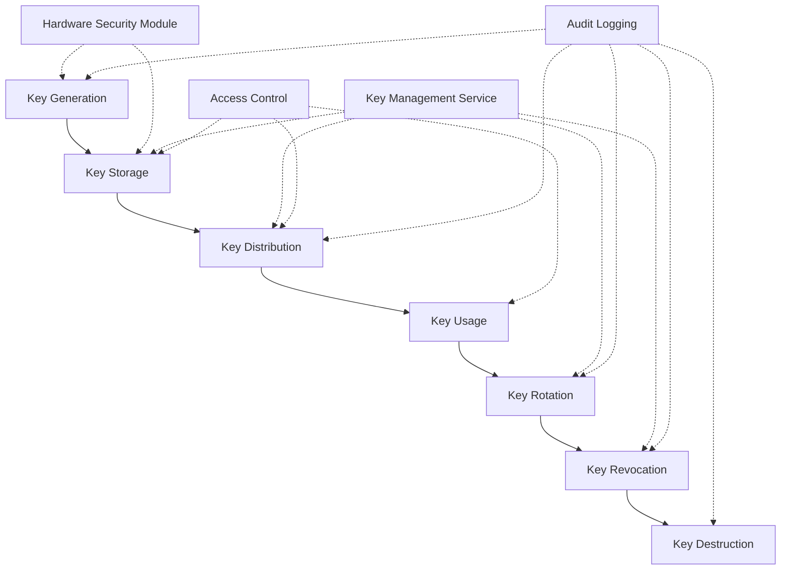

| Key Type | Rotation Policy | Storage |
|----------|-----------------|----------|
| Data Encryption Keys | 90 days | AWS KMS |
| TLS Certificates | 1 year | AWS Certificate Manager |
| API Keys | 90 days | AWS Secrets Manager |
| Master Keys | 1 year | AWS KMS (CMK) |

### 4.4 Data Loss Prevention

| DLP Control | Implementation | Purpose |
|-------------|----------------|----------|
| Data Discovery | Automated scanning | Identify sensitive data |
| Access Monitoring | CloudTrail, custom logging | Detect unusual access patterns |
| Egress Filtering | VPC endpoints, WAF | Control data outflow |
| Data Masking | Field-level masking | Protect sensitive data in UI/reports |

## 5. Network Security

The platform implements multiple layers of network security to protect against unauthorized access and network-based attacks.

### 5.1 Network Architecture

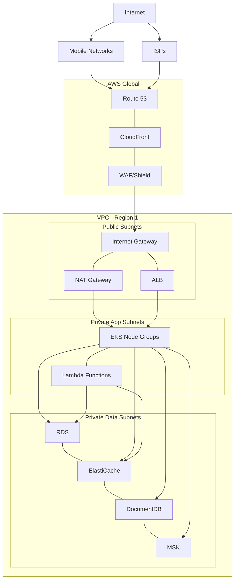

### 5.2 Network Security Controls

| Security Layer | Controls | Purpose |
|----------------|----------|----------|
| Edge Security | AWS Shield, WAF | DDoS protection, common attack prevention |
| VPC | Security Groups, NACLs | Network-level access control |
| Subnet Isolation | Public/private subnets | Limit direct internet access |
| Service Mesh | Istio with mTLS | Secure service-to-service communication |

### 5.3 Security Group Configuration

| Security Group | Purpose | Access Rules |
|----------------|---------|-------------|
| ALB Security Group | Control access to load balancers | Allow HTTPS (443) from internet |
| API Gateway Security Group | Control access to API Gateway | Allow traffic from ALB SG |
| Application Security Group | Control access to application services | Allow traffic from API Gateway SG |
| Database Security Group | Control access to databases | Allow traffic from Application SG |

### 5.4 WAF Configuration

The platform uses AWS WAF with the following rule sets:

| Rule Set | Purpose | Action |
|----------|---------|--------|
| AWS Core Rule Set | Protect against OWASP Top 10 | Block |
| IP Reputation List | Block known malicious IPs | Block |
| Rate-Based Rules | Prevent brute force and DDoS | Block when threshold exceeded |
| Geo-Blocking | Block traffic from unauthorized countries | Block |
| Custom Rules | Application-specific protections | Block or Count based on rule |

## 6. Container Security

The platform implements container security best practices to secure the containerized workloads running in Kubernetes.

### 6.1 Container Image Security

| Security Control | Implementation | Purpose |
|------------------|----------------|----------|
| Base Image Selection | Minimal, official images | Reduce attack surface |
| Image Scanning | Trivy, ECR scanning | Detect vulnerabilities |
| Image Signing | Cosign | Verify image authenticity |
| Image Registry | Amazon ECR with access controls | Secure image storage |
| Build Pipeline Security | GitHub Actions with security checks | Secure CI/CD process |

### 6.2 Runtime Security

| Security Control | Implementation | Purpose |
|------------------|----------------|----------|
| Pod Security Policies | Kubernetes PSPs | Enforce security context |
| Container Security Context | Non-root users, read-only filesystem | Reduce privilege |
| Resource Limits | CPU and memory limits | Prevent resource exhaustion |
| Network Policies | Kubernetes NetworkPolicies | Control pod-to-pod communication |
| Runtime Scanning | Falco | Detect suspicious activities |

### 6.3 Pod Security Policies

The platform uses the following Pod Security Policies:

```yaml
apiVersion: policy/v1beta1
kind: PodSecurityPolicy
metadata:
  name: restricted
spec:
  privileged: false
  allowPrivilegeEscalation: false
  requiredDropCapabilities:
  - ALL
  volumes:
  - configMap
  - emptyDir
  - projected
  - secret
  - downwardAPI
  - persistentVolumeClaim
  hostNetwork: false
  hostIPC: false
  hostPID: false
  runAsUser:
    rule: MustRunAsNonRoot
  seLinux:
    rule: RunAsAny
  supplementalGroups:
    rule: MustRunAs
    ranges:
    - min: 1000
      max: 65535
  fsGroup:
    rule: MustRunAs
    ranges:
    - min: 1000
      max: 65535
  readOnlyRootFilesystem: true
```

### 6.4 Container Security Best Practices

| Best Practice | Implementation | Benefit |
|---------------|----------------|----------|
| Minimal Container Images | Alpine/slim base images | Reduced attack surface |
| Dependency Management | Automated dependency updates | Timely security patches |
| Secrets Management | Kubernetes Secrets, AWS Secrets Manager | Secure credential handling |
| Least Privilege | Non-root users, minimal capabilities | Reduced impact of compromise |
| Immutable Infrastructure | Read-only filesystems | Prevent runtime modifications |

## 7. Application Security

The platform implements application security best practices to protect against common vulnerabilities and attacks.

### 7.1 Secure Development Lifecycle

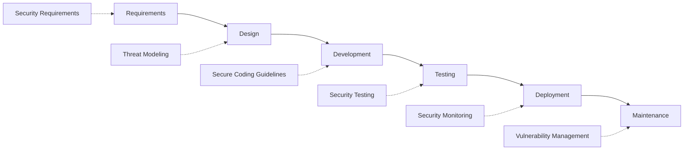

### 7.2 Input Validation

| Validation Type | Implementation | Protection Against |
|-----------------|----------------|-------------------|
| Schema Validation | JSON Schema, Pydantic | Malformed data, type confusion |
| Parameter Validation | Request validation middleware | Parameter tampering |
| Content Validation | Content-Type validation | MIME type attacks |
| File Validation | File type checking, virus scanning | Malicious uploads |

### 7.3 Output Encoding

| Encoding Type | Implementation | Protection Against |
|---------------|----------------|-------------------|
| HTML Encoding | React, template auto-escaping | XSS attacks |
| JSON Encoding | Proper serialization | JSON injection |
| SQL Parameterization | ORM, prepared statements | SQL injection |
| Command Encoding | Parameter validation | Command injection |

### 7.4 API Security

| Security Control | Implementation | Purpose |
|------------------|----------------|----------|
| Rate Limiting | API Gateway, application middleware | Prevent abuse |
| Request Validation | OpenAPI validation | Ensure valid requests |
| Response Validation | Schema validation | Ensure valid responses |
| Error Handling | Standardized error responses | Prevent information leakage |

### 7.5 Dependency Management

| Control | Implementation | Purpose |
|---------|----------------|----------|
| Dependency Scanning | Dependabot, Snyk | Detect vulnerable dependencies |
| Version Pinning | Exact version specifications | Prevent unexpected updates |
| Dependency Auditing | npm audit, pip audit | Regular vulnerability checks |
| Software Bill of Materials | SBOM generation | Track all dependencies |

## 8. Security Monitoring and Incident Response

The platform implements comprehensive security monitoring and incident response capabilities to detect and respond to security events.

### 8.1 Security Monitoring Architecture

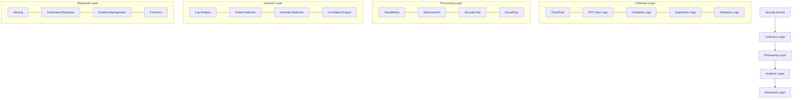

### 8.2 Security Monitoring Controls

| Monitoring Type | Implementation | Purpose |
|-----------------|----------------|----------|
| Infrastructure Monitoring | CloudTrail, VPC Flow Logs | Detect unauthorized access and activities |
| Application Monitoring | Custom logging, WAF logs | Detect application attacks |
| User Activity Monitoring | Authentication logs, API access logs | Detect suspicious user behavior |
| Threat Intelligence | GuardDuty, Security Hub | Detect known threats and vulnerabilities |

### 8.3 Incident Response Process

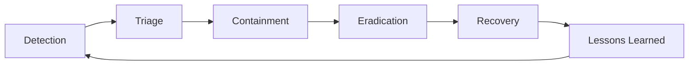

| Phase | Activities | Tools |
|-------|------------|-------|
| Detection | Alert monitoring, log analysis | CloudWatch, Security Hub, GuardDuty |
| Triage | Severity assessment, initial investigation | Incident response playbooks |
| Containment | Isolate affected systems, block attack vectors | Security groups, WAF rules |
| Eradication | Remove malicious code, fix vulnerabilities | Patching, configuration updates |
| Recovery | Restore systems, verify security | Backups, security validation |
| Lessons Learned | Post-incident analysis, process improvement | Incident reports, action items |

### 8.4 Security Incident Classification

| Severity | Description | Response Time | Notification |
|----------|-------------|---------------|-------------|
| Critical | System breach, data exfiltration | Immediate | Executive team, security team |
| High | Active attack, potential breach | < 1 hour | Security team, affected team |
| Medium | Suspicious activity, policy violation | < 4 hours | Security team |
| Low | Minor policy violation, potential vulnerability | < 24 hours | Security team |

## 9. Compliance and Risk Management

The platform implements compliance controls and risk management processes to meet regulatory requirements and industry standards.

### 9.1 Regulatory Compliance

| Regulation | Compliance Approach | Key Controls |
|------------|---------------------|-------------|
| GDPR | Privacy by design, data protection | Consent management, data minimization, right to access/delete |
| CCPA | Consumer privacy rights | Data inventory, access requests, opt-out mechanisms |
| SOC 2 | Security, availability, confidentiality | Access controls, encryption, monitoring |
| HIPAA | Protected health information security | Encryption, access controls, audit logging |

### 9.2 Industry Standards

| Standard | Implementation | Validation |
|----------|----------------|------------|
| NIST Cybersecurity Framework | Comprehensive security controls | Self-assessment, third-party validation |
| ISO 27001 | Information security management system | Gap analysis, control implementation |
| CIS Benchmarks | Secure configuration baselines | Automated compliance checking |
| OWASP Top 10 | Web application security controls | Security testing, code reviews |

### 9.3 Risk Assessment Process

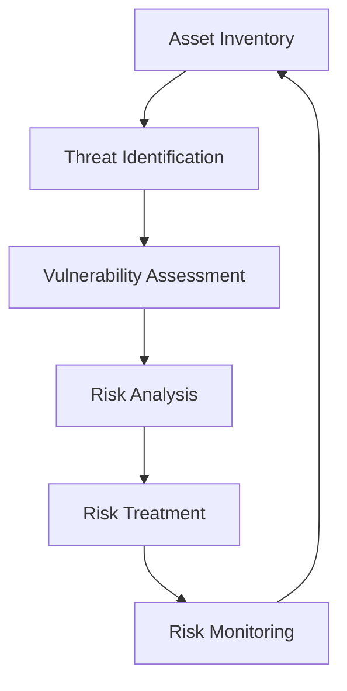

| Risk Management Activity | Frequency | Responsibility |
|--------------------------|-----------|----------------|
| Risk Assessment | Annual | Security Team, Compliance Team |
| Vulnerability Assessment | Quarterly | Security Team |
| Penetration Testing | Annual | External Security Firm |
| Compliance Audit | Annual | Compliance Team, External Auditors |
| Security Review | Continuous | Security Team |

### 9.4 Security Controls Matrix

| Control Category | Control Examples | Implementation |
|------------------|------------------|----------------|
| Administrative | Policies, procedures, training | Security policies, annual training |
| Technical | Access controls, encryption | IAM, KMS, WAF |
| Physical | Facility security, hardware protection | AWS physical security, device management |
| Compensating | Alternative controls when primary not feasible | Monitoring, manual reviews |

## 10. Security Operations

The platform implements security operations processes to maintain the security posture of the system over time.

### 10.1 Vulnerability Management

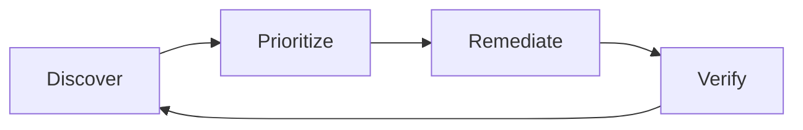

| Activity | Frequency | Tools |
|----------|-----------|-------|
| Vulnerability Scanning | Weekly | Nessus, OWASP ZAP, Trivy |
| Dependency Scanning | Daily (CI/CD) | Dependabot, Snyk |
| Configuration Scanning | Daily | AWS Config, CIS Scanner |
| Penetration Testing | Annual | External security firm |

### 10.2 Patch Management

| Component | Patching Strategy | Timeline |
|-----------|-------------------|----------|
| Operating System | Automated patching | Within 30 days, critical within 7 days |
| Container Images | Rebuild and redeploy | Within 14 days, critical within 3 days |
| Application Dependencies | Dependency updates | Within 14 days, critical within 3 days |
| Database Systems | Managed service updates | During maintenance windows |

### 10.3 Access Management

| Process | Implementation | Frequency |
|---------|----------------|----------|
| Access Provisioning | Automated via IAM | As needed |
| Access Review | Manual review of access rights | Quarterly |
| Privileged Access Management | Just-in-time access, approval workflow | As needed with logging |
| Access Termination | Automated revocation | Immediate upon termination |

### 10.4 Security Awareness

| Activity | Audience | Frequency | Content |
|----------|----------|----------|----------|
| Security Training | All employees | Annual, new hire onboarding | General security practices |
| Phishing Simulations | All employees | Quarterly |  |
| Security Updates | Technical staff | Monthly |  |
| Security Champions | Development teams | Ongoing |  |

## 11. Secure DevOps

The platform implements secure DevOps practices to integrate security into the development and deployment processes.

### 11.1 Secure CI/CD Pipeline

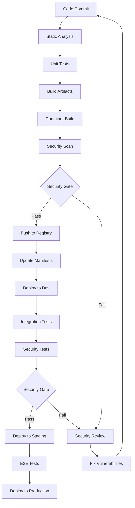

### 11.2 Security Testing in CI/CD

| Test Type | Tools | Stage | Action on Failure |
|-----------|-------|-------|-------------------|
| Static Application Security Testing | SonarQube, ESLint, Bandit | Pre-commit, CI | Block merge |
| Software Composition Analysis | Dependabot, Snyk | CI | Block merge for critical issues |
| Container Scanning | Trivy, ECR scanning | CI | Block deployment for critical issues |
| Dynamic Application Security Testing | OWASP ZAP | Post-deployment to dev/staging | Alert, fix before production |
| Infrastructure as Code Scanning | Checkov, tfsec | CI | Block merge for critical issues |

### 11.3 Infrastructure as Code Security

| IaC Type | Security Controls | Validation |
|----------|-------------------|------------|
| Terraform | Secure defaults, least privilege | Automated policy checks |
| Kubernetes Manifests | Security contexts, network policies | Admission controllers |
| CloudFormation | IAM restrictions, encryption | CFN-Nag, custom rules |

### 11.4 Secret Management in CI/CD

| Secret Type | Storage | Access Method |
|-------------|---------|---------------|
| API Keys | AWS Secrets Manager | CI/CD service integration |
| Certificates | AWS Certificate Manager | Service integration |
| Database Credentials | AWS Secrets Manager | Injected as environment variables |
| OAuth Tokens | AWS Secrets Manager | Short-lived, JIT access |

## 12. Disaster Recovery and Business Continuity

The platform implements disaster recovery and business continuity measures to ensure resilience against security incidents and other disruptions.

### 12.1 Backup Strategy

| Data Type | Backup Method | Frequency | Retention |
|-----------|--------------|-----------|----------|
| Databases | Automated snapshots | Daily + Transaction logs | 30 days |
| Object Storage | Cross-region replication | Continuous | Indefinite |
| Configuration | Git repository | Every change | Indefinite |
| Container Images | ECR replication | Every push | 90 days |

### 12.2 Disaster Recovery

| Scenario | Recovery Strategy | RTO | RPO |
|----------|-------------------|-----|-----|
| Single AZ Failure | Automatic failover to other AZs | Minutes | Near zero |
| Region Failure | Manual promotion of DR region | 1 hour | 5-15 minutes |
| Data Corruption | Point-in-time recovery | 1-4 hours | Depends on issue |
| Security Breach | Isolation, clean deployment | 4-8 hours | Depends on issue |

### 12.3 Business Continuity

| Component | Continuity Strategy | Implementation |
|-----------|---------------------|----------------|
| Critical Services | Multi-region deployment | Active-active or active-passive |
| Data | Replication, backups | Cross-region replication, regular backups |
| Operations | Runbooks, training | Documented procedures, regular drills |
| Communications | Multiple channels | Email, phone, messaging platforms |

### 12.4 Incident Recovery Playbooks

| Incident Type | Recovery Steps | Verification |
|---------------|----------------|-------------|
| Data Breach | Isolation, investigation, remediation, restoration | Security validation, monitoring |
| Service Disruption | Failover, scaling, alternative routing | Service health checks, monitoring |
| Infrastructure Failure | Automated recovery, manual intervention if needed | System health checks, monitoring |
| Natural Disaster | Region failover, communication plan | Service availability, data integrity |

## 13. Security Documentation and Training

The platform maintains comprehensive security documentation and provides security training to all relevant personnel.

### 13.1 Security Documentation

| Document Type | Purpose | Audience | Update Frequency |
|--------------|---------|----------|------------------|
| Security Policies | Define security requirements | All staff | Annual |
| Security Procedures | Detailed implementation steps | Technical staff | Quarterly |
| Security Architecture | Technical security design | Technical staff | As needed |
| Incident Response Plan | Guide incident handling | Security team | Annual |
| User Security Guide | End-user security guidance | All users | Annual |

### 13.2 Security Training

| Training Type | Audience | Frequency | Content |
|--------------|----------|-----------|----------|
| Security Awareness | All staff | Annual, new hire onboarding | General security practices |
| Developer Security | Development team | Quarterly | Secure coding, OWASP Top 10 |
| DevOps Security | Operations team | Quarterly | Secure infrastructure, monitoring |
| Incident Response | Security team | Bi-annual | Incident handling procedures |
| Compliance Training | All staff | Annual | Regulatory requirements |

### 13.3 Security Knowledge Base

| Resource Type | Content | Access |
|---------------|---------|--------|
| Security Wiki | Best practices, guides | All technical staff |
| Code Examples | Secure implementation patterns | Development team |
| Security Checklists | Verification procedures | All technical staff |
| Incident Playbooks | Response procedures | Security team |

### 13.4 Security Communication

| Communication Type | Frequency | Audience | Content |
|--------------------|-----------|----------|----------|
| Security Newsletter | Monthly | All staff | Updates, tips, awareness |
| Security Advisories | As needed | Technical staff | Vulnerabilities, patches |
| Security Reviews | Sprint-based | Development team | Code review findings |
| Security Metrics | Monthly | Management | Security posture, incidents |

## 14. References

- [Architecture Documentation](architecture.md)
- [Deployment Documentation](deployment.md)
- [AWS Security Best Practices](https://aws.amazon.com/architecture/security-identity-compliance/) // latest
- [Kubernetes Security Best Practices](https://kubernetes.io/docs/concepts/security/)
- [OWASP Top 10](https://owasp.org/www-project-top-ten/) // 2021
- [NIST Cybersecurity Framework](https://www.nist.gov/cyberframework) // 1.1
- [CIS Benchmarks](https://www.cisecurity.org/cis-benchmarks/)